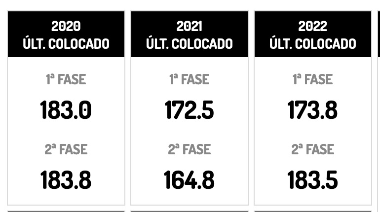
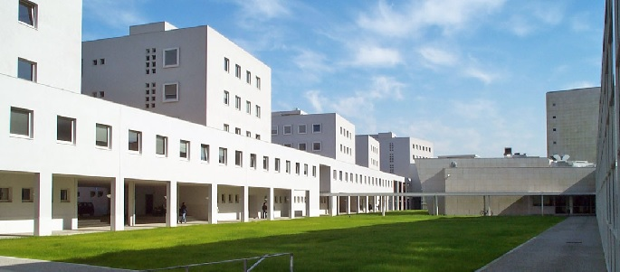
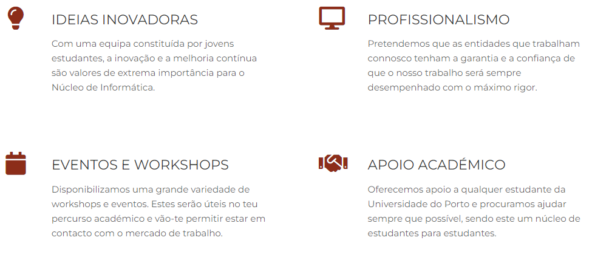
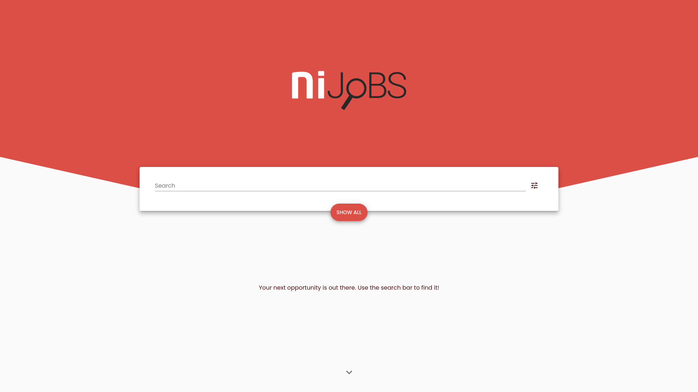
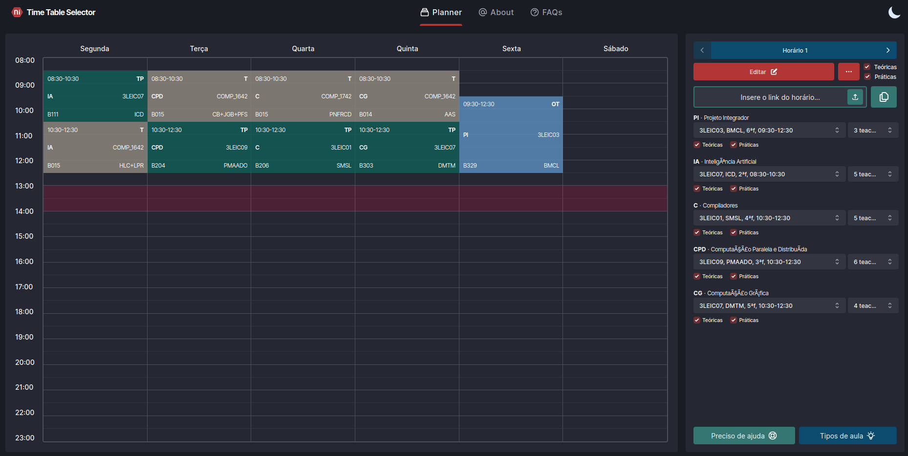
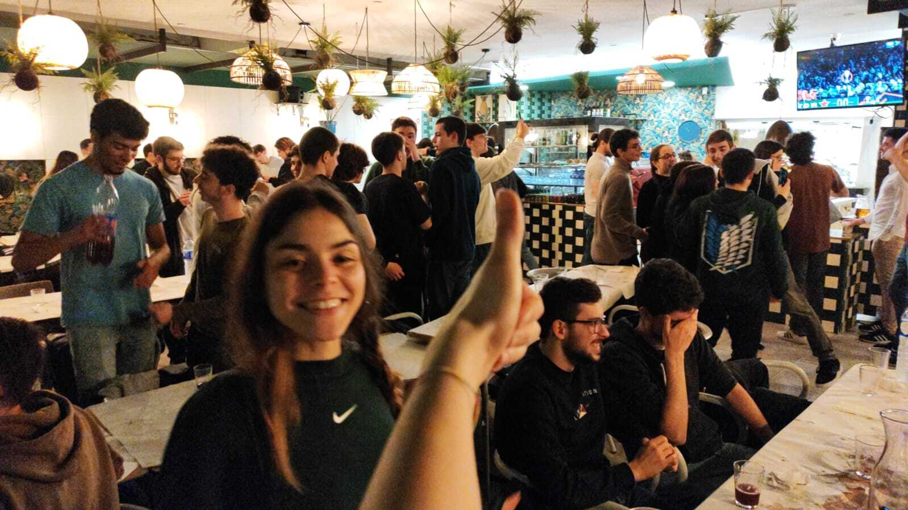
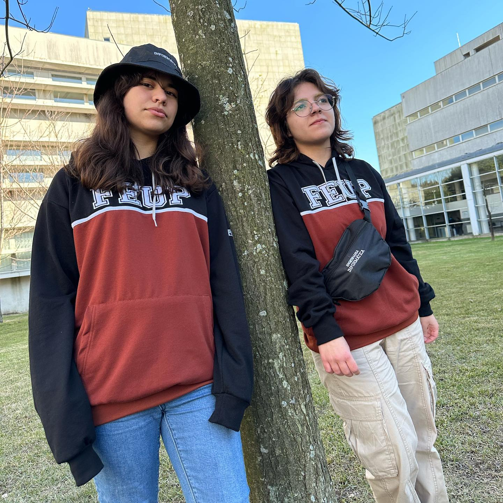

class: center, middle, inverse, small-images

.image-50[]

# NIAEFEUP

### Núcleo de Informática 
### da Associação de Estudantes 
### da Faculdade de Engenharia da Universidade do Porto

---

# L.EIC + M.EIC, antes MIEIC

Antigamente o curso tinha um mestrado integrado, o Mestrado Integrado em Engenharia Informática e Computação. Existia também o mestrado integrado em redes na fcup e extingiu-se/juntou-se com o de infromatica da feup. Isso aumentou as vagas, (que diminui um pouco a média) e possibilitou aos estudantes terem mais opções no mestrado. Isto gerou:

- evolução das vagas e médias de entrada

- novos exames de admissão

- O curso dividiu-se em dois cursos diferentes: L.EIC e M.EIC

- Todos os alunos da L.EIC são agora alunos da FEUP e da FCUP simultaneamente

---

# Médias

---

# Áreas abrangidas

A Licenciatura em Engenharia Informática e Computação oferece uma formação base nas principais áreas de informática:

- Engenharia de Software
- Redes e Sistemas Operativos
- Computação Gráfica
- Inteligência Artificial
- Segurança Informática

Além disto, o ensino de física e matemática aparece no contexto do perfil essencial do engenheiro.

---

# Mestrados disponíveis

- Engenharia Informática
- Engenharia de Software
- Redes e Sistemas Operativos
- Computação Gráfica
- Inteligência Artificial
- Segurança Informática

---

# Saída do curso

As saídas profissionais passam pelo desempenho de funções profissionais indicadas nos European ICT Professional Role Profiles que requerem competências de nível e-4 (mestrado) do European e-Competence Framework (e.g., Devops Expert, Data Scientist, Cyber Security Specialist, Solution Designer), incluindo funções de grande responsabilidade em contextos complexos e com foco na inovação e funções de liderança em projetos multidisciplinares no domínio das TIC.

---

# Quem é o NIAEFEUP?

O NIAEFEUP, frequentemente abreviado como NI, é constituído inteiramente por alunos do curso de Engenharia Informática e Computação (L.EIC+M.EIC).

A nossa principal motivação é ganhar experiência e competências essenciais para o mundo do trabalho, assim como cultivar nos nossos colegas a vontade de aprender novas linguagens e tecnologias.

---

class: image-spaced

# Valores

---

class: center, middle, inverse

# Projetos

---

class: image-spaced

# UNI

Guiar os estudantes com os horários, exames e cadeiras.
Definitamente uma aplicação necessária para qualquer estudante da FEUP.

---

# NIJOBS

Ajudar os estudantes a encontrar oportunidades de emprego e de estágios

---

# TTS

Forma simples dos alunos contruirem os seus horários e de se organizarem antes de cada novo semestre começar  

---

# Novo Website

Reformulação do nosso site atual que se encontra outdated, usando tecnologias recentes para aprendizagem dos membros do núcleo

---

class: center, middle, inverse

# Eventos

---

# SINF: Semana de Informática

Uma semana cheia de atividades temáticamente relacionadas com a área da informática

- Palestras
- Workshops
- Competições

---

# Workshops

Workshop de diversas linguagens e ferramentas úteis na área da informática

---

# Jantares de curso

Os "famosos" jantares de curso

---

# Eventos internos

- Teambuildings
- Convívios
- Workshops internos

---

class: center, middle, inverse

# Imagem

---

class: image-spaced

# Divulgação

    
    

---

class: image-spaced

# Design de Website

    
    

---

# Merch

---

class: center, middle, inverse

# Obrigado!
