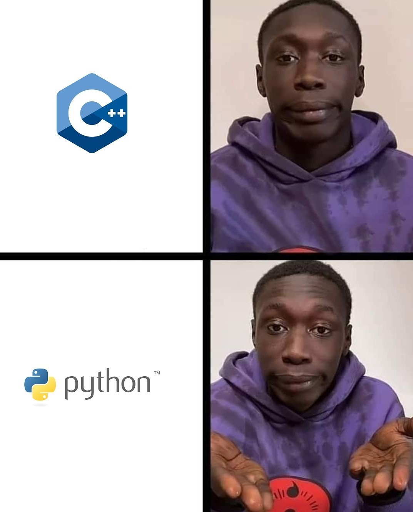
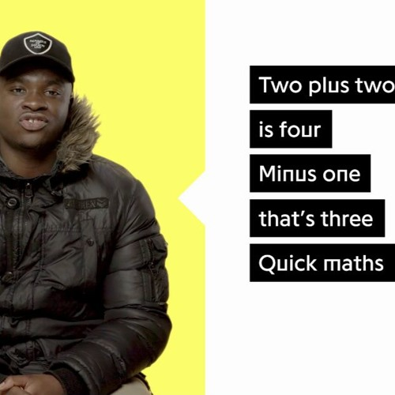

class: center, middle, inverse, small-images

# Python: Primeiros passos


---
class: inverse

# Temas

1. Introdução à programação
2. Referências para programar em python
3. "Olá Mundo!"
4. Variáveis
5. Inputs
6. Operações com listas
7. Operações aritméticas
8. Condições
9. Ciclos
10. Funções
11. Fun part 
---
class: extra-images

# Introdução à programação
De modo a criar qualquer programa em computador, utiliza-se normalmente uma **linguagem de alto nível** à nossa escolha (p.ex: Java, C++, Python), a qual será depois traduzida para algo que o computador consiga executar.


---

class: small-images, image-spaced

# Referências para programar em python
- GDB: https://www.onlinegdb.com/
- Python 3.10 (Shell): https://www.python.org/downloads/release/python-3100/
- **VS Code**: https://code.visualstudio.com/
- **Pycharm**: https://www.jetbrains.com/pycharm/
- **Spyder/Anaconda**: https://www.anaconda.com/

---
class: medium-images, center, middle


---


# "Olá Mundo!"
O programa "Hello World" é o típico primeiro programa que todos os iniciantes fazem numa qualquer nova linguagem de programação; em Python, este programa destaca-se pela sua simplicidade (o mesmo programa em Java abaixo, **apenas** para efeitos de comparação):

```python
# O teu primeiro programa em Python! :D
print("Hello World!")
```
```Java
// O mesmo programa mas em Java :,D
class HelloWorld {
    public static void main(String[] args) {
        System.out.println("Hello World!");
    }
}
```

---
class: center, middle, inverse
# Variáveis

---
# Variáveis

De modo a simplicar a visão de uma variável pode-se equipará-la a uma caixa à qual é atribuída um valor, ou seja, o conteúdo que se encontra dentro da caixa.


---

# Variáveis

Existem diversos tipos de variáveis em Python:
- Números (integers e floats) (ex: **4** e **3.14159**, respetivamente)
- Booleanos (Verdadeiro ou Falso) (ex: **True** e **False**, respetivamente)
- Strings (Cadeias de caracteres) (ex: **"Boas, pessoal!"**)
- Listas (ex: **["a", -3, True]**)
- etc.

```python
undertale_best_game = True
var = 2         # variável com um valor inteiro
var1 = "BEST"   # variável com uma string associada
var = var1
print(var)      # o resultado será "BEST" visto que não há erro (em Python!) em associar
                # novamente uma variável com um tipo de valor diferente do inicial
```
---
# Inputs

Como qualquer outra linguagem de programação, a interação com o utilizador também é uma parte importante dos programas que usam esta linguagem. Para tal, temos de permitir ao utilizador que escreva o seu input, um valor à escolha que será associado a uma variável:

```python
n = input()         # pode ser qualquer tipo de input
n1 = int(input())   # tem de ser um valor inteiro usado no input

print(n)            # dá print do valor que o utilizador escreveu, se não tiver
                    # dado erro nenhum
```

---
class: center, middle, inverse
# Listas

---
# Operações com listas

As listas são constituídas por um número arbitrário de elementos. Cada um destes elementos pode ser acedido através da sua poição na lista (o **índice**). Na grande maioria das linguagens de programação, a contagem do índice começa por **0** e não por **1**. Podemos também mudar os valores de uma lista, sejam eles quais foram. Um exemplo disso seria:

```python
list1 = [1,2,3,4]
list1[2] = 5    # Altera o 3º elemento de list1 de 3 para 5
list1[0] = 2    # Qual é o valor que é mudado?
list1[-1] = 9   # Altera o último valor de list1
list1[98] = 2   # IndexError, pois é um índice maior ao número de elementos
                # da lista
```
---
# Operações com listas

Para além disto, também temos diversos outros métodos que mexem com listas:
- **.append(x)** - adiciona um valor ao final da lista
- **.insert(x, y)** - insere o valor **y** no índice **x**
- **.remove(x)** - remove a primeira ocorrência de **x** na lista
- **.pop(y)** - remove o elemento da lista no índice **y** e retorna esse valor

---
class: center, middle, inverse
# Operações aritméticas

---
class: medium-images
# Operações aritméticas
Em python, existem 7 principais operações numéricas que se podem realizar:

- **+** (soma)
- **-** (subtração)
- **\*** (multiplicação)
- **/** (divisão)
- **\*\*** (expoente)
- **//** (divisão inteira)
- **%** (resto)

```python
print(3*2)      # 6
print(1/2)      # 0.5
print(4%3)      # 1
print(4**2)     # 16
print(5//2)     # 2, pois arredonda para baixo

```
---

class: center, middle, inverse
# Condições

---
# Condições

De modo a estabelecer comportamentos específicos do programa quando o mesmo cumpre certos requisitos, utiliza-se os **if** **else** *statements*.
- **"if"**: se a condição proposta for verdadeira, executa o código deste bloco
- **"elif"**: ("else" + "if") se a(s) condição/condições proposta(s) anteriormente forem falsas e esta verdadeira, executa o código deste bloco
- **"else"**: caso nenhuma das condições anteriores seja verdade, executa este bloco

---
# Condições

Para criar as condições usadas nestes blocos de código, podem-se usar alguns dos seguintes **operadores lógicos:**
- **"and"** e **"or"** (**logic AND** e **logic OR**)
- **"not"** (**logic NOT**)

De modo a estabelecer relações entre diferentes variáveis também temos os chamados **operadores relacionais**:
- **">"** e **">="** (**maior que** e **maior ou igual a**)
- **"<"** e **"<="** (**menor que** e **menor ou igual a**)
- **"!="** e **"=="** (**diferente de** e **igual a**)

---
# Condições

Eis um exemplo:
```python
num = 2

if(num <= 0):                               # verificará se o valor da variável num
    print("It is 0 or negative!")           # é inferior ou igual a 0

elif(num == 1):                             # verificará se o valor da variável num
    print("It has the value of 1")          # é igual a 1

else:                                       # executará este print, pois não conseguiu
    print("Idk what this is my friend :(")  # encontrar nenhuma condição
                                            # que fosse satisfeita


```

---

class: center, middle, inverse
# Ciclos

---

# Ciclos
Sempre que se quer repetir um conjunto de instruções dada uma certa condição, pode-se dar uso aos ciclos **while**. <br>
Nas situações em que seja necessário repetir uma parte de código n vezes ou aplicá-lo em n elementos, usam-se os ciclos **for**.

```python
for num in range(10):
    # Executa algo 10 vezes

for num in range(1, 5):
    # Executa algo 4 (5-1) vezes

for num in range(1, 5, 2):
    # Executa algo 2 vezes (quando num == 1 e num == 1+2)

while num<10:
    # Executa algo enquanto a variável num for inferior a 10
```

---
class: small-images
# Ciclos

Em Python, **break** e **continue** são palavras-chave que permitem controlar a execução de loops.
- **break**: é usado para sair de um loop antes que ele termine naturalmente.
- **continue**: é usado para ignorar a execução de uma determinada etapa do loop e passar para a próxima iteração.


---
class: center, middle, inverse
# Funções
---
# Funções
As funções em Python têm como pincipal papel facilitar uma melhor organização, tornando o código mais "reutilizável".

```python
def pair(x):                 # Verifica se um número x é par
    return x % 2 == 0

for num in range(11):
    if pair(num): print(num) # imprime todos os números pares de 1 a 10
    else: continue

```

Como se pode observar, basta criar a função, chamá-la e o código que se encontra na mesma será executado.

---
class: center, middle


---
class: center, middle, inverse, medium-images
# Fim?


---
class: center, middle, inverse
# Nope! A parte aborrecida acabou... mas vamos agora aplicar o que foi falado >:)
---
class: center, middle, inverse
# Primeiro exercício: Nível fácil

---
class: small-images
# Quantos anos tens?

Às vezes é completamente normal esquecermo-nos da nossa própria idade (not really mas vamos fingir que sim). Para combater este problema, é vos pedido que criem um programa de Python que, dado um ano de nascimento pedido como input do utilizador, calcule a idade que o mesmo tem.
**PS**: e não, não precisam de ir tão a fundo como dados como o mês ou o dia :)


---

# Quantos anos tens? (Solução)

```python
    # Solicita ao usuário o ano de nascimento
    ano_nascimento = int(input("Escreve o teu ano de nascimento: "))

    # Obtém o ano atual
    ano_atual = 2023

    # Calcula a idade
    idade = ano_atual - ano_nascimento

    # Dá print da idade
    print(f"Tens {idade} anos de idade.")
    print(resultado) 
```

---
class: center, middle, inverse
# Segundo exercício: Nível intermédio

---
class: small-images
# Sou amaricano

Imagina que és um americano reformado e que vens passar férias pela europa, nomeadamente por Portugal e pelo Reino Unido. Como tal, tu queres saber quantos dólares precisas de trocar para ter uma boa quantia de dinheiro (tanto em euros como em libras) para usufruires das tuas férias. Cria, então, um programa em Python que converte uma dada quantia de dólares na quantia correspondente em libras e euros. Assume que 1$ equivale a 0.85€ e 0.75£. 



---
# Sou amaricano (solução)

```python
def dolar_para_euro(dolar):
    taxa_euro = 0.85
    euro = dolar * taxa_euro
    return euro

def dolar_para_libra(dolar):
    taxa_libra = 0.75
    libra = dolar * taxa_libra
    return libra

# Pede ao user a quantia em dólares a ser convertida
dolar = float(input("Digita a quantia em dólares: "))

# Realiza as conversões
euro = dolar_para_euro(dolar)
libra = dolar_para_libra(dolar)

# Exibe os resultados
print(f"{dolar} dólares equivalem a {euro} euros.")
print(f"{dolar} dólares equivalem a {libra} libras.")
```

---
class: center, middle, inverse
# Terceiro exercício: Nível difícil
---

# Matemática pouco discreta
Oh não, voltaste ao ensino básico e a tua professora de matemática fez um teste surpresa! Por que razão voltaste a estes tempos? Sei lá, preocupa-te em passares no teste. Vamos ver, a primeira pergunta é: descobrir todos os números primos até o número... 9999... agora é que te lembras de porque é que não gostavas dela... mas calma! Não desesperes! O teste pode ser feito no computador :D <br> Faz um programa em Python que dê print de uma lista de todos os números primos menores ou iguais a um dado número.

---
# Matemática pouco discreta (solução)

```python
# função para verificar se um número é primo
def e_primo(n):
    for i in range(2, n):
        if n % i == 0:
            return False
    return True

# função para encontrar todos os primos até n
def encontrar_primos_ate_n(n):
    primos = []
    for i in range(2, n+1):
        if e_primo(i):
            primos.append(i)
    return primos


n = int(input("Digita um número: "))
primos = encontrar_primos_ate_n(n)
print(primos)
```

---
class: center, middle, inverse
# Agora sim, acabou, see ya around :)