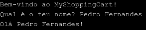
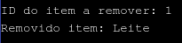

class: center, middle

# Workshop C++
### NIAEFEUP

---

# Links importantes

- Apresentação: https://niaefeup-workshop-cpp.netlify.com/
- [Exercícios](https://github.com/NIAEFEUP/Workshop_CPP/)
- [Visual Studio](https://visualstudio.microsoft.com), [VSCode](https://code.visualstudio.com), [CLion](https://www.jetbrains.com/clion/), [OnlineGDB](https://www.onlinegdb.com/online_c++_compiler) (escolher um)

---

# Overview

1. O que é o C++?
2. Hello world!
3. Tipos de dados
4. Variáveis
5. Constantes
6. Operadores
7. Condições
8. Ciclos
9. Funções
10. Apontadores
11. Vetores
12. Classes

---

# O que é o C++?
- Criado por Bjarne Stroustrup
- Extensão da linguagem C - 99% retrocompatível
- Linguagem compilável
- Disponível em praticamente todos os computadores
- Suporta programação orientada a objetos
- Usada para definir precisamente uma sequência de operações que o computador tem que executar para realizar uma determinada tarefa
- Extremamente eficiente (quando bem utilizada...)
- Versátil e muito poderosa, mas exige responsabilidade (memory leaks, dangling pointers...)


---

# Hello world!
```C++
// helloworld.cpp
#include <iostream>

using namespace std;

int main() {
    cout << "Hello world!" << endl;
    return 0;
}
```

---

# Exercícios

**E1.** A função `main` é o ponto de entrada do programa. Comprova a afirmação, copiando o código [neste ficheiro](https://raw.githubusercontent.com/NIAEFEUP/Workshop_CPP/master/introdutory%20exercises/explainMain.cpp) e correndo-o no IDE.


---

# Tipos de dados primitivos
- **char:** caracteres alfanuméricos (ex: 'c', '8', '$');
- **int:** números inteiros (ex: 10**3, -2)
- **float:** números com vírgula flutuante de precisão simples (ex: 1.902, -5,926563840)
- **double:** números com vírgula flutuante de precisão dupla (ex: 1.2, -4.587)  
- **bool:** verdadeiro ou falso (ex: true, false)
- **void:** significa "sem qualquer valor". É usado quando uma função não retorna nenhum 
valor

---

# Tipos de dados
## Modificadores de tipos de dados
- **signed/unsigned:** para números com/sem sinal
- **short:** valor otimizado para o espaço com comprimento de pelo menos 16 bits
- **long/long long:** valor otimizado para precisão com comprimento de pelo menos 32/64 bits

```C++

int main() {
    unsigned int i = 5;
    int y = 3; // Quando omisso o modificador, é assumido que o valor é signed
    long float z = 9;
    long long double d = 37.2387193;
    char x = 'r';
    int i = 0;
    float y = 1.3;
    double z = 4.586
    bool b = true;

    return 0;
}
```
---
# Variáveis
São contentores capazes de armazenar, em memória, valores de um determinado tipo, para serem reutilizados mais tarde.

## Como as declarar?
```C++
int myNumber = 15;
bool myBoolean = true;
```
## Tipos de variáveis
- Globais - declarar fora de qualquer função
- Locais - declarar dentro de uma função específica (ex. main)

### NOTAS:
- Podem existir variáveis locais com o mesmo nome e diferentes valores ao mesmo tempo, 
desde que sejam locais e estejam em diferentes blocos de código (entre {})
- Não têm que ser inicializadas ao mesmo tempo que são declaradas

---

# Constantes
Semelhantes a variáveis, mas o seu conteúdo não pode ser alterado após a sua inicialização. 
Podem ser locais ou globais.

```C++
#include <iostream>

using namespace std;

int main() {
    int variable;
    const char constant = 'T';

    variable = 5;
    constant = 3; // IMPOSSÍVEL: seria gerado um erro durante a compilação!
    cout << variable << " " << constant << endl;

    return 0;
}
```

---

# Operadores
## Operadores de igualdade
- **==** verdadeiro se ambos os operandos forem iguais
- **!=** verdadeiro se ambos os operandos forem diferentes
- **>** verdadeiro se operando da esquerda for maior que o da direita
- **<** verdadeiro se operando da esquerda for menor que o da direita
- **>=** verdadeiro se operando da esquerda for maior ou igual que o da direita
- **<=** verdadeiro se operando da esquerda for menor ou igual que o da direita

---
# Operadores
## Operadores Aritméticos
- **+** adição
- **-** subtração
- ***** multiplicação
- **/** divisão
- **%** módulo
- **++** incremento de 1 unidade
- **--** decremento de 1 unidade

## Operadores lógicos
- **&&** E lógico
- **||** OU lógico 
- **!** NÃO lógico (negação)

---

# Operadores
## Alguns operadores de atribuição
- **=** operando da esquerda fica com o valor do da direita
- **+=** operando da esquerda fica com o valor do da direita somado com o seu próprio valor
- **-=** operando da esquerda fica com o valor do da direita subtraído com o seu próprio valor
- ***=** operando da esquerda fica com o valor do da direita multiplicado com o seu próprio valor
- **/=** operando da esquerda fica com o valor do da direita dividido com o seu próprio valor

---
# Input/Output
## Requisitos
Para utilizar os operadores I/O de C++, é necessário incluir as seguintes linhas no topo do ficheiro de código:

```C++
#include <iostream>
using namespace std;
```

`iostream` é a biblioteca *standard* que fornece operadores e funções de I/O.

Se o *namespace* `std` não for declarado, é necessário pré-anexar `std::` aos métodos *standard* (e.g. `std::cout`).

---


# Input/Output
## Escrever Informação
De maneira a ser possível enviar informação para o utilizador, é comum imprimir 
mensagens no ecrã do computador. Para isso, e como foi possível ver no slide 
anterior, utiliza-se o objeto **cout** seguido do operador **<<** para 
transmitir informação para o ecrã do utilizador.

```C++
cout << "Bom dia " << nome_do_aluno << "!" << endl;
cout << "Tudo bem contigo?" << endl;
```

--- 

```Bash
// Assuma-se que o conteudo da variável nome_do_aluno é Inês.
Bom dia Inês!
Tudo bem?
```

NOTA: A partícula **endl** permite mover o cursor para a linha seguinte, entre diferentes 
utilizações do objeto **cout**. Caso não estivesse presente, o resultado seria o 
seguinte:
```Bash
Bom dia Inês!Tudo bem?
```

---
# Input/Output
### Ler Informação
De forma semelhante, é possível ler informações do utilizador, usando o objeto **cin** e o operador **>>** seguido da variável onde vai ser guardada a informação.

--- 

O objeto **cin** permite obter informação de qualquer tipo de dados (exceto tipos 
definidos pelo utilizador, a não ser que o operador >> tenha sido *overloaded*).

Para ler *strings*, **cin** utiliza qualquer espaço em branco como delimitador (o que inclui espaços, newlines, tabs, etc.). Para ler strings com o caracter espaço ' ', pode user usada a função *getline()* (a string *acaba* apenas quando o caracter '\n' é encontrado).

---
# Input/Output
```C++
#include <iostream>
  
using namespace std;
    
// Um mau uso da stream cin

int main() {
    string name;
    cout << "Insert your name here: ";
    cin >> name;
    cout << "Your name is " << name << endl;
    
    return 0;
}     
```

--- 

```Bash
Insert your name here: André Moreira
Your name is André
```

--- 

Repare-se que o nome inserido difere do recebido pelo programa!
Mais à frente veremos o porquê de isto acontecer, e perceberemos melhor o 
funcionamento da stream **cin**.

---

# Exercícios


**E2.** Vamos agora tentar perceber como fazer operações aritméticas. Está atento ao quadro e, se quiseres, reproduz no teu IDE!

**E3.** Vamos experimentar com variáveis. Copia o código [neste ficheiro](https://raw.githubusercontent.com/NIAEFEUP/Workshop_CPP/master/introdutory%20exercises/IOops.cpp) e corre o programa. Completa-o, de forma a também perguntar a idade e imprimi-la de seguida.

---

# Solução


```cpp
int main() {
    // ...
    string name;
    cout << "Hey there, what's your name?" << endl;
    cin >> name;

    cout << "Hello " << name << ", what's your age?" << endl;

    int age;
    cin >> age;
    cout << "Your age is " << age << endl;
    // ...
}
```

---

# Condições
## Declarações *If*
```C++
if (price < 0)
    return -1;
else if (price == 0)
    return 0;
else
    return 1;
```

```C++
if (cond_variable == true)    // equivalente a if (cond_variable)
    return 0;
```

```C++
if (smart && !lazy)
    return true;
```

---
# Condições
## Declarações *Switch-Case*
Ideal para substituir declarações *if* muito longas que 
comparam uma variável com vários **valores inteiros** (incluíndo *char*)
```C++
switch (choice) {
    case 1: 
        cout << "First item selected!" << endl;
        break;
    case 2:
        cout << "Second item selected!" << endl;
        break;
    default:
        cout << "Invalid selection :(" << endl;
        break;
}
```
Na ausência do *break*, as condições *case* seguintes seriam executadas 

---

# Exercícios

**E4.** Vamos tentar perceber o funcionamento de programas com `if`. Copia o código [neste ficheiro](https://raw.githubusercontent.com/NIAEFEUP/Workshop_CPP/master/introdutory%20exercises/ControlFlow.cpp) e corre-o no teu IDE.

---

# Ciclos
## While loop 
```C++
while (x < 5)
    cout << x << " is less than 5" << endl;
```

## Do-while loop
```C++
do {
    cout << x << " is less than 5" << endl;
}
while (x < 5);
```
---
# Ciclos
## For loop
```C++
for (int i = 0; i < 10; i++) {
    int y = i*2;
    cout << y << endl;
}
```

É possível encadear ciclos. Útil para percorrer elementos de matrizes, por exemplo

```C++
#include <iostream>
#include <vector>

using namespace std;

int main() {
    for (int i = 0; i < 5; i++) {
        for (int j = 0; j < 5; j++) {
            cout << "Linha " << i << " Coluna " << j << endl;
        }
    }
    return 0;
}
```

---

# Exercícios

**E5.** De forma a perceber melhor como ciclos funcionam, copia o código [neste ficheiro](https://raw.githubusercontent.com/NIAEFEUP/Workshop_CPP/master/introdutory%20exercises/Looping.cpp) e coloca-o no teu IDE.

---

# Vetores
- Estrutura de dados linear com a capacidade de armazenar vários valores de um
determinado tipo. Pode alterar o seu tamanho automaticamente sempre que um elemento 
novo é inserido ou apagado
- São alocados contiguamente na memória, podendo por isso ser vistos como uma extensão de *arrays* de C
- Os dados são geralmente inseridos no final do vetor (por razões de eficiência)

## Notas importantes
- Os índices de um vetor iniciam-se sempre no zero. Ou seja, o primeiro elemento de um vetor 
está na posição 0, o segundo elemento na posição 1, etc.
- é possível consultar o conteúdo de um vetor numa determinada posição utilizando parêntesis 
retos [] ou o método .at();

---

# Vetores
## Métodos Fundamentais

- **[*idx*]/at(*idx*)**: Retorna um elemento no índice dado
- **push_back(*elem*):** Adiciona um elemento ao vetor
- **pop_back()**: Remove o último elemento do vetor
- **size()**: Tamanho do vetor
- **begin()**: Referência para o início do vetor (a ser usado noutros métodos)
- **insert(*pos*, *elem*)**: Inserte um elemento ao vetor na posição dada
- **erase(*pos*):** Remove um elemento do vetor na posição dada


Para mais informação, consultar [***Cpp Reference***](https://www.cplusplus.com/reference/vector/vector/).

---

```C++
#include <iostream>
#include <vector>
    
using namespace std;
    
int main() {
    vector<int> numbers {10, 20, 30}; // inicialização do vetor com 3 elementos
    int size;

    numbers.push_back(40); // adição do valor 40 ao fim do vetor
    numbers.pop_back(); // remove o último valor do vetor (40)

    numbers.erase(numbers.begin() + 1); // elimina o segundo elemento do vetor (20)
    numbers.insert(numbers.begin(), 0); // adição do valor 0 ao início do vetor

    size = numbers.size();
    cout << "Vector size = " << size << endl;

    cout << "Vector elements:";
    for (int i = 0; i < numbers.size(); i++)
        cout << " " << numbers.at(i); // equivalente a numbers[i]
    cout << endl;
    
    return 0;
}                                                                         
```
---

```Bash
Vector size = 3
Vector elements: 0 10 30
```

--- 

Atente-se no uso da função erase() para eliminar um elemento de um vetor:
```C++
numbers.erase(numbers.begin() + 1);
```
A função elimina o elemento que se encontrar na posição que estiver a 1 unidade 
do início do vetor (numbers.begin()). Sendo que o primeiro elemento é o número 
10, e que este se encontra na posição 0, a posição a elminar será a que estiver 
à distância 0 + 1 = 1 do início do vetor, ou seja, o elemento 20.

A função *insert()* funciona de uma forma semelhante:
```C++
numbers.insert(numbers.begin(), 0);
```
Aqui, insere-se o elemento 0 no início do vetor.


---


# Strings

- STL Strings
    - Semelhante a `vector<char>` e strings de python
    - Operações semelhantes às dos vetores
    - Suporta também métodos específicos
        - **str += 'Outra string'**
        - **str.length()**
        - **str = to_string(124)**
        - **str = string('andre').substr(0,2)** // Gera a substring 'an'
        - **pos = str.find(substr)** // Posição da 1ª ocorrência da substring
    - Para outras operações, ver [cppreference](https://www.cplusplus.com/reference/string/string/)

- C Strings
    - Arrays *(raw)* de caracteres
    - Pouco úteis para C++


---

# Exercícios

**E6.** De forma a perceber melhor como as strings funcionam, copia o código [neste ficheiro](https://raw.githubusercontent.com/NIAEFEUP/Workshop_CPP/master/introdutory%20exercises/string.cpp), coloca-o no teu IDE e segue as instruções.


---

# Solução

```cpp

/**
* Escolher dois nomes diferentes atrav�s de substring, para duas vari�veis diferentes
* Concatenar os nomes numa �nica vari�vel
* Mostrar essa vari�vel no ecr�
* Descobrir o tamanho dessa nova string e mostrar tamb�m no ecr�
*/

#include <iostream>

using namespace std;

int main()
{
	char name1[256];
	cout << "Hey there, what's your full name?\n";
	cin.getline(name1, 256);
	string name = string(name1); //Nome de exemplo � Filipe Pinto Reis
	cout << name;

	string a = name.substr(0, 6);
	string b = name.substr(12, 17);

	string c = a + b;
	cout << endl << c << endl;

	cout << c.length() << endl;

	return 0;
}


```


--- 

# Funções
Na função *main* do programa que estão a desenvolver, existe uma chamada a uma função que processa o input de utilizador e altera o ShoppingCart em conformidade.
A divisão do código em funções curtas com objetivos claros é uma boa prática de programação que torna o programa mais fácil de ler e de manter.

- **Organização**: Reduzem um programa complexo em módulos mais pequenos e fáceis de lidar.
- **Reusabilidade**: A função pode ser chamada múltiplas vezes, evitando repetição de código e minimizando a probabilidade de erros.
- **Testabilidade**: Como as funções são isoladas, isto torna mais fácil testar as várias partes do programa e reduz o número de testes necessários. Reduz também a quantidade código, facilitando a correção e prevenção de bugs.
- **Extensibilidade**: Permitem-nos fazer uma modificação num lugar e vê-la ao longo de todo o programa.
- **Abstração**: Não é necessário saber sobre o funcionamento da função, apenas como chamá-la.

---

# Funções
## Como Declarar e Invocar uma Função


(Imagem retirada de [*Programiz*](https://www.programiz.com/cpp-programming/function))

---

# Funções
## Argumentos
Os argumentos nas funções podem ser passados de diferentes formas.
- **Cópia**: O objeto e a sua memória associada são copiados para um novo objeto. Quaisquer alterações à variável passada no argumento não terão efeito no objeto original.
- **Referência**: O objeto passado por argumento poderá ser manipulado e terá efeito no objeto original (tipo do argumento marcado com **&**).
- **Apontador**: Funciona de forma semelhante a ser passado por referência. No entanto, tem uma utilização diferente (tipo do argumento marcado com **\***). Representa o endereço do objeto em memória.


---

```C++
#include <iostream>
using namespace std;

int getAge() {
    int age;
    cout << "Insert your age (years): ";
    cin >> age;

    cin.clear(); // Caso o utilizador insira dados inválidos
    cin.ignore(9999, '\n'); // Ignora tudo até fim de linha

    return age;
}

/*
    Não funciona corretamente
    Com funções, podemos corrigi-la e aplicar a mudança a todo o código
*/
void convertToMonths(int& age) {
    age = age * 12;
}

int main() {
    int age = getAge();
    convertToMonths(age);
    cout << "Hello! You are " << age << " months old." << endl;
    return 0;
}
```


```Bash
Insert your age (years): 18
Hello! You are 216 months old.
```

---
```C++
#include <iostream>
using namespace std;

void clearInput() {
    cin.clear();
    cin.ignore(9999, '\n');
}

int multiply(int first, int second) {
    return first * second;
}

int getOperand(int* order) {
    int operand;
    cout << "Insert operand no. " << *order << ": ";
    cin >> operand;

    *order += 1; // É necessário desreferenciar o apontador
    return operand;
}

int main() {
    int n1, n2;
    int order = 1;

    n1 = getOperand(&order); // passar apontador para order
    clearInput();
    n2 = getOperand(&order);
    clearInput();
    
    cout << n1 << "x" << n2 << "=" << multiply(n1, n2) << endl;
    return 0;
}
```
---

# Funções
Execução do programa:
```Bash
Insert operand no. 1: 4
Insert operand no. 2: 7
4x7=28
```

---

# Exercícios

**E7.** Copia o código [neste ficheiro](https://raw.githubusercontent.com/NIAEFEUP/Workshop_CPP/master/introdutory%20exercises/Functions.cpp) e completa-o no teu IDE. O objetivo é chamar uma função com diferentes tipos de argumentos e testar a sua eficiência!

---

```C++
// ...
int function1(vector<int> values) {
    int total = 0;

    for (int i = 0; i < values.size(); ++i) {
        total += values.at(i);
    }

    return total;
}

int function2(vector<int> &values) {
    int total = 0;

    for (int i = 0; i < values.size(); ++i) {
        total += values.at(i);
    }

    return total;
}

int function3(vector<int> *values) {
    int total = 0;

    for (int i = 0; i < values->size(); ++i) {
        total += values->at(i);
    }

    return total;
}
// ...
```

---

```C++
// ...
int main() {
    vector<int> values(100000000);
    auto f = []() -> int { return rand() % 10000; };

    generate(values.begin(), values.end(), f);


    auto start = chrono::high_resolution_clock::now();
    function1(values);
    auto stop = chrono::high_resolution_clock::now();
    auto duration = chrono::duration_cast<chrono::milliseconds>(stop - start);
    cout << "Time taken by function 1: "
         << duration.count() << " milliseconds" << endl;

    start = chrono::high_resolution_clock::now();
    function2(values);
    stop = chrono::high_resolution_clock::now();
    duration = chrono::duration_cast<chrono::milliseconds>(stop - start);
    cout << "Time taken by function 2: "
         << duration.count() << " milliseconds" << endl;

    start = chrono::high_resolution_clock::now();
    function3(&values);
    stop = chrono::high_resolution_clock::now();
    duration = chrono::duration_cast<chrono::milliseconds>(stop - start);
    cout << "Time taken by function 3: "
         << duration.count() << " milliseconds" << endl;
}
```

---

# Apontadores

A execução de processos tem muito por base a manipulação da memória física do computador. Assim sendo, o C++ permite-nos aceder-lhes com o uso de apontadores.

Os apontadores guardam o endereço da localização de uma variável especifica ou simplesmente uma porção de memória.


---

# Apontadores

Existem situações em que temos de usar estes apontadores:
- Usar apontadores em argumentos de funções é uma prática muito frequente para os seguintes casos:
    - Aumentar eficiência de um programa. Podemos simplesmente passar por argumento o apontador (endereço da variável), evitando assim ter de copiar o objeto. Para alguns casos não é muito relevante, como por exemplo `ints`, mas para, por exemplo, vetores e objetos de classe, poderá ser custoso copiar.
    - Alteração do conteúdo do argumento. Um use case particular é usar objetos passados por apontador como retorno da função. Pode ser útil quando necessitamos de retornar duas coisas diferentes.

Quando se está a trabalhar com apontadores, há que ter um cuidado reforçado, devido à liberdade que estes nos oferecem:
-    Possível leitura de endereços inválidas (não alocados ao programa pelo sistema operativo)
-    Possível alterar endereços de variáveis não desejáveis, ou de espaço dedicado ao controlo de fluxo (ver estrutura da stack e falhas de segurança)
Tudo isto pode introduzir vulnerabilidades no nosso programa e por isso existem algumas proteções embutidas nos compiladores.

---


# Exercícios

**E8.** Copia o código [neste ficheiro](https://raw.githubusercontent.com/NIAEFEUP/Workshop_CPP/master/introdutory%20exercises/Pointers.cpp) e completa-o no teu IDE. O objetivo é retornar valores de uma função das 3 formas diferentes, pedindo ao utilizador um valor.


---

# Soluções

```cpp

int function1() {
    int variable;
    cout << "Hey there, what's your age?" << endl;
    cin >> variable;
    cout << "You are " << variable << " years old" << endl;
    return variable;
}

void function2(int &variable) {
    cout << "Hey there, what's your age?" << endl;
    cin >> variable;
    cout << "You are " << variable << " years old" << endl;

}

void function3(int* variable) {
    int temp;
    cout << "Hey there, what's your age?" << endl;
    cin >> temp;
    *variable = temp;
    cout << "You are " << *variable << " years old" << endl;
}
```

---
# Classes

C++ é uma linguagem orientada a objectos. Neste paradigma, tudo está associado a classes e a objetos, junto com os seus métodos e atributos.

Uma classe é um tipo definido pelo programador que pode ser usado ao longo do programa. Um objeto é uma instância dessa classe.

Atributos e métodos são as variáveis e funções duma dada classe (ambos chamados de membros da classe).

É definido um construtor que dita a forma como um objeto é criado, incluindo dados a serem passados.

Se necessário, pode ser explicitamente definido um destrutor para despoletar uma ação aquando da libertação de um objeto da memória.

## Access Specifiers

- **public**: membros são acessíveis fora da classe
- **private**: membros são acessíveis apenas dentro da classe (*default*)
- **protected**: membros são acessíveis dentro da classe e em classes derivadas (mais à frente)

---
## Criar uma classe
```C++
class Printer {       // Nome da classe
  private:            // Access specifier
    string myString;  // Atributo (variável string)
  public:
    Printer(string myString) { // Construtor
      this->myString = myString; // this é um apontador para o próprio objeto
    }

    void printString() { // Método (função que retorna void)
      cout << "Hi! Your string is " << myString << endl;
    }
};
```
## Criar um objeto
```C++
int main() {
  Printer impressora("very cool!");  // cria um objeto da classe Printer
  impressora.printString(); // Hi! Your string is very cool!
  // Se o construtor não tivesse argumentos,
  // o objeto era criado apenas com Printer impressora;
  return 0;
}
```
---
# Classes
## Modificar Atributos - Usando *public*

```C++
class Printer {
  public:
    string myString;
    Printer(string myString) {
      this->myString = myString;
    }

    void printString() {
      cout << "Hi! Your string is " << myString << endl;
    }
};
```

```C++
int main() {
  Printer impressora("very cool!");
  impressora.myString = "even cooler!";
  impressora.printString(); // Hi! Your string is even cooler!
  return 0;
}
```

---
# Classes
## Modificar Atributos - Usando *public*

Esta abordagem tem alguns problemas:
- Qualquer programador pode aceder e modificar o atributo, sem qualquer controlo
- É impossível adicionar qualquer tipo de validação ao accesso
- É impossível permitir a leitura e não a escrita
- Podemos querer "esconder" a representação interna da classe
- Entre outros (ler mais sobre [encapsulamento](https://www.geeksforgeeks.org/encapsulation-in-c/))

Para corrigir estes problemas, podem ser usados *getters* e *setters*

---
## Modificar Atributos - *Getters* e *Setters*
```C++
class Printer {
  private:
    string myString;
  public:
    Printer(string myString) {
      this->myString = myString;
    }

    void printString() {
      cout << "Hi! Your string is " << myString << endl;
    }
    
    void setMyString(string newString) {
      this->myString = newString;
    }
    
    string getMyString() {
      return this->myString;
    }
};
```

```C++
int main() {
  Printer impressora("very cool!");
  cout << impressora.getMyString() << endl; // very cool!
  impressora.setMyString("even cooler!");
  impressora.printString(); // Hi! Your string is even cooler!
  return 0;
}
```

---
# Classes
## Hierarquia

Por vezes, é útil ter classes que derivam de outras, especificando o seu papel no programa. Por exemplo, as classes *Cat* e *Dog* podem derivar de uma classe comum *Animal*. Estas podem possuir membros próprios mas também conseguem aceder aos membros comuns da classe *Animal* (exceto *private*).


---
# Classes
## Hierarquia - Sintaxe e Access Specifiers
```C++
class A { // classe base
    ..............
};
class B : access_specifier A { // classe derivada de A
    ...........
};
```


(Imagem retirada de [*Geeks for geeks*](https://www.geeksforgeeks.org/inheritance-in-c/))

---
## Hierarquia - Exemplo
```C++
#include <iostream>
using namespace std;

class Animal {
  protected:
    string name;
  public:
    Animal(string name) { this->name = name; }

    string getName() { return this->name; }

    void printInfo() {
      cout << name << " is some kind of animal" << endl;
    }
};

class Cat : public Animal {
  public:
    // Apenas invoca construtor de Animal
    Cat(string name) : Animal(name) {}
  
    void meow() {
      cout << name << " says meooww" << endl;
    }

    void printInfo() { // Isto chama-se overload de funções
      cout << name << " is a cat" << endl;
    }
};
```

---
## Hierarquia - Exemplo

```C++
class Dog : public Animal {
  public:
    Dog(string name) : Animal(name) {}

    void bark() {
      cout << name << " says bark bark" << endl;
    }

    void printInfo() {
      cout << name << " is a dog" << endl;
    }
};

int main() {
    Animal cat("Yuri"); // Hmm
    cat.printInfo(); // Yuri is some kind of animal
    cout << cat.getName() << endl; // Yuri

    Dog max("Max");
    max.bark(); // Max says bark bark
    cout << max.getName() << endl; // Max

    Cat fluffy("Fluffy");
    fluffy.printInfo(); // Fluffy is a cat

    return 0;
}
```

---

# Exercícios - Shopping Cart

**SC0.** Começa o desenvolvimento do programa MyShoppingCart por adicionar uma mensagem de boas-vindas ao utilizador. Para isso, copia o código [neste ficheiro](https://raw.githubusercontent.com/NIAEFEUP/Workshop_CPP/master/shopping-cart/classes/Initial.cpp) e cola-o no teu IDE. Trabalharás com este ficheiro até ao final do workshop!

Exemplo do programa em execução:


---

# Solução


```cpp
int main() {
    // ...

    cout << "Bem-vindo ao MyShoppingCart!" << endl;
    
    // ...
}
```

---

# Exercícios - Shopping Cart

**SC1.** Melhora a mensagem de boas vindas de forma a pedir o nome do utilizador e cumprimentá-lo. Atenção aos nomes que contêm espaços.

Por exemplo, se o utilizador responder com “Pedro Fernandes”, o programa deve responder “Olá Pedro Fernandes!” e não “Olá Pedro!”.


Exemplo do programa em execução:


---

# Solução


```cpp
int main() {
    // ...

    string name;

    cout << "Bem-vindo ao MyShoppingCart!" << endl;
    cout << "Qual é o teu nome? ";
    getline(cin, name);
    cout << "Olá " << name << "!" << endl;
    
    // ...
}
```

---

# Exercícios - Shopping Cart

**SC2.** Completa o método `printAndChooseOption(option)` da classe **ShoppingCart**, usando a variável *option* e a técnica do *switch case*.

Se correres o método, reparas que aparece uma lista das opções disponíveis, sendo que o objetivo é pedir ao utilizador para escolher uma delas.

Constrói o método de forma a que, quando o utilizador coloca uma opção não existente (ex: -1), seja imprimida uma mensagem a assinalar o erro.

Exemplo do programa em execução:



---


```cpp
void printAndChooseOption(int &option) {
    // ...
    cin >> option;
    cin.ignore(10000, '\n');
    cout << endl << endl;

    switch (option)
    {
        case 0:
            // TERMINAR O PROGRAMA
            cout << "Obrigado por escolher a nossa aplicação!" << endl;
            break;
        case 1:
            // VER ITENS
            break;
        case 2:
            // ADICIONAR ITEM
            break;
        case 3:
            // ATUALIZAR ITEMS
            break;
        case 4:
            // REMOVER ITEMS
            break;
        default:
           cout << "Opção não existente!" << endl;
           break;
    }
    // ...
}
```

---

# Exercícios - Shopping Cart

**SC3.** Completa o *main*, criando um objeto **ShoppingCart** e chamando o método *printAndChooseOption*, de forma a que seja possível continuar a fazer operações enquanto o utilizador assim desejar.

Ou seja, como, na lista de opções, opção 0 é a responsável por terminar o programa, este deve continuar enquanto essa opção não for escolhida.
Exemplo do programa em execução:

Primeiro Input             |  Segundo Input
:-------------------------:|:-------------------------:
  |  

---

# Solução


```cpp
int main() {
    // ...

    int option = -1;
    ShoppingCart shoppingCart;

    while (option != 0)
        shoppingCart.printAndChooseOption(option);
    
    // ...
}
```

---

# Exercícios - Shopping Cart

**SC4.** Implementa a funcionalidade de adicionar um item ao carrinho. O programa deve pedir ao utilizador o nome do produto, o seu preço, e adicionar um novo item a um vetor definido previamente na classe **ShoppingCart**.

No código, está indicado com “ADICIONAR ITEM” o local onde deves trabalhar neste exercício. Recorda-te do uso de métodos de classe.

Exemplo do programa em execução:


---

# Exercícios - Shopping Cart

**SC5.** Implementa a funcionalidade de ver os itens no carrinho. Para isso, deves percorrer o vetor de itens e imprimir no ecrã o nome e preço respetivos.
Caso não existam quaisquer produtos, deves imprimir uma mensagem a indicá-lo.

No código, está indicado com “VER ITENS” o local onde deves trabalhar neste exercício. Recorda-te do uso de métodos de classe.

Exemplo do programa em execução:


---

# Exercícios - Shopping Cart

**SC6.** Implementa a funcionalidade de remover um item do carrinho. Para isso, deves pedir ao utilizador o ID do produto (que pode ser usado para calcular o índice do mesmo no vetor) e removê-lo do carrinho. Certifica-te que o utilizador não escolhe um item não existente.

No final, para verificar que a função funciona, corre a opção de ver os itens do carrinho e certifica-te que o item escolhido não aparece.

No código, está indicado com “REMOVER ITEMS” o local onde deves trabalhar neste exercício. Recorda-te do uso de métodos de classe.

Primeiro Input             |  Segundo Input
:-------------------------:|:-------------------------:
  |  


---

# Soluções


```cpp
class ShoppingCart {
private:
    vector <Item> cart;
public:
    void addItem() {
        string newName;
        double price;

        cout << "Novo Item: ";
        getline(cin, newName);

        cout << "Preço (€): ";
        cin >> price;

        Item item(newName, price);

        cart.push_back(item);

        cout << "Adicionado item: " << newName << endl;
    }
    // ...
```

---

# Soluções


```cpp
public:
    // ...
    void printItems() {
        int size = cart.size();

        cout << "ITENS NO CARRINHO DE COMPRAS" << endl;

        if (size == 0) {
            cout << "O carrinho de compras está vazio!" << endl;
        }

        for (int i = 0; i < size; i++) {
            Item item = cart.at(i);
            string name = item.getName();
            double price = item.getPrice();

            cout << i + 1 << " - " << name << " - " << price << "€" << endl;
        }
    }
    // ...
```

---

# Soluções


```cpp
public:
    // ...
    void removeItem() {
        int id;

        cout << "ID do item a remover: ";
        cin >> id;

        if (id < 0 || id > cart.size()) {
            cout << "Esse item não existe!" << endl;
            return;
        }

        Item item = cart.at(id - 1);
        cart.erase(cart.begin() + id - 1);

        cout << "Removido item: " << item.getName() << endl;
    }
    // ...
```

---

# Soluções

```cpp
void printAndChooseOption(int &option) {
    // ...
    switch (option)
    {
        case 0:
            // TERMINAR O PROGRAMA
            cout << "Obrigado por escolher a nossa aplicação!" << endl;
            break;
        case 1:
            printItems();
            break;
        case 2:
            addItem();
            break;
        case 3:
            // ATUALIZAR ITEMS
            break;
        case 4:
            removeItem();
            break;
        default:
           cout << "Opção não existente!" << endl;
           break;
    }
    // ...
}
```

---

# Exercícios - Shopping Cart

**SC7.** Implementa a funcionalidade de atualizar um item do carrinho. Para isso, deves pedir ao utilizador o ID do produto, pedir o novo nome do produto e preço do produto, e atualizar o respetivo item no carrinho. Certifica-te que o utilizador não escolhe um item não existente.

No código, está indicado com “ATUALIZAR ITEMS” o local onde deves trabalhar neste exercício. Recorda-te do uso de métodos de classe.

Exemplo do programa em execução:


---

# Exercícios - Shopping Cart

**SC8.** Melhora a funcionalidade de mostrar os itens do carrinho de forma a ser possível ver o preço total dos produtos. Para isso, deves escrever uma função que calcule a soma dos preços, chamá-la no local apropriado, e imprimir o valor retornado pela mesma após mostrares os itens presentes no carrinho.

Exemplo do programa em execução:


---

```cpp
public:
    // ...
    void updateItem() {
        int id;

        cout << "ID do item a atualizar: ";
        cin >> id;
        cin.ignore(10000, '\n');

        if (id < 0 || id > cart.size()) {
            cout << "Esse item não existe!" << endl;
            return;
        }

        string oldName = cart.at(id - 1).getName();

        string newName;
        cout << "Novo item: ";
        getline(cin, newName);

        double newPrice;
        cout << "Novo preço (€): ";
        cin >> newPrice;

        Item newItem(newName, newPrice);

        cart.at(id - 1) = newItem;

        cout << "Atualizado item " << oldName << " para " << newName << endl;
    }
    // ...
```

---

```cpp
public:
    // ...
    double sumPrices() {
        double sum = 0;

        for (int i = 0; i < cart.size(); i++) {
            Item item = cart.at(i);
            sum += item.getPrice();
        }

        return sum;
    }
    
    void printItems() {
        int size = cart.size();
        double total = sumPrices();

        cout << "ITENS NO CARRINHO DE COMPRAS" << endl;

        if (size == 0) {
            cout << "O carrinho de compras está vazio!" << endl;
        }

        for (int i = 0; i < size; i++) {
            Item item = cart.at(i);
            string name = item.getName();
            double price = item.getPrice();

            cout << i + 1 << " - " << name << " - " << price << "€" << endl;
        }
        cout << "Total: " << total << "€" << endl;
    }
    // ...
```

---
# Tópicos avançados

- Macros
  - Substituição de texto em compile time
- Casts
  - Conversão de tipos
- Alocação dinâmica de memória
  - Tamanhos variáveis e permanência em memória
- Lambda functions, unions, enums, operator overloading
  - *Syntatic sugar*
- Bitwise operations
  - Low level fun
- Leitura e escrita de ficheiros
  - Persistência de informação
- Computação paralela
  - Threads e concorrência
- Organização em ficheiros
  - Escalabilidade e modularidade
---

# Recursos Recomendados

## Ferramenta de Desenvolvimento

- [Visual Studio Code](https://code.visualstudio.com/) & Extensão C/C++ & g++ (Linux/Mac)
- [Visual Studio](https://visualstudio.microsoft.com/) (Windows)
- [CLion](https://www.jetbrains.com/clion/) (Windows/Linux/Mac)

## Referência

- [cppreference](https://en.cppreference.com/w/)

## Livros

- The C++ Programming Language, 4ª Edição, de Bjarne Stroustrup
- Effective C++, 3ª Edição, de Scott Meyers
class: center, middle
