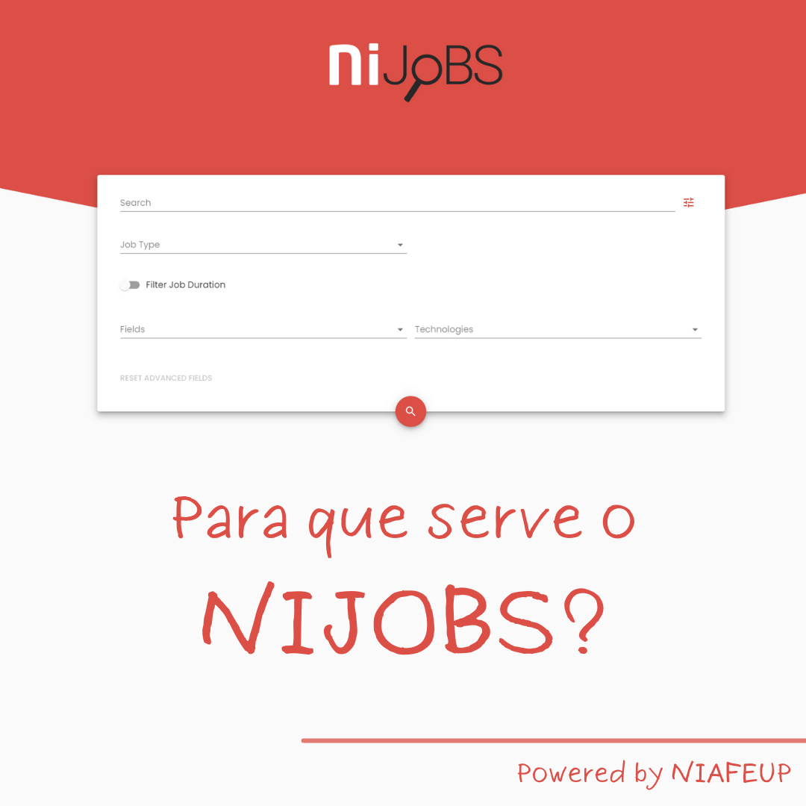
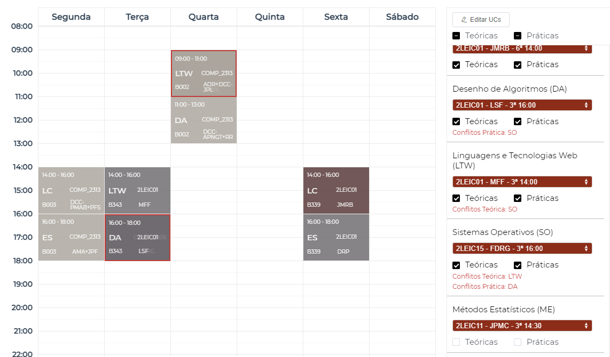
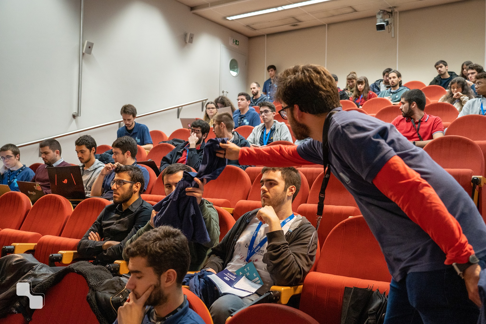
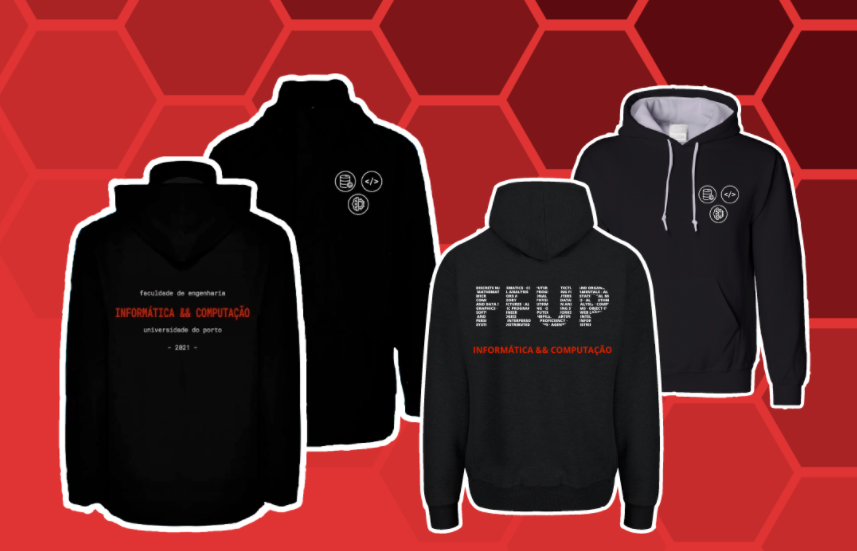

class: center, middle, inverse, small-images

.image-50[]

# NIAEFEUP

### Núcleo de Informática 
### da Associação de Estudantes 
### da Faculdade de Engenharia da Universidade do Porto

---

# L.EIC, antes M.IEIC

Antigamente o curso tinha um mestrado integrado.
Em 2021, o M.IEIC e outro curso da fcup....

A Licenciatura em Engenharia Informática e Computação oferece uma formação base nas principais áreas de informática:

- evolução das vagas e médias de entrada

- exames de entrada

Além disto, o ensino de física e matemática aparece no contexto do perfil essencial do engenheiro.

---

# Mestrados disponíveis

- Engenharia de Software
- Redes e Sistemas Operativos
- Computação Gráfica
- Inteligência Artificial
- Segurança Informática

---

# Quem é o NIAEFEUP?

O NIAEFEUP, frequentemente abreviado como NI, é constituído inteiramente por alunos do curso de Engenharia Informática e Computação (L.EIC+M.EIC). 
A principal motivação é ganhar experiência e competências essenciais para o mundo do trabalho assim como cultivar nos nossos colegas a vontade de aprender linguagens e novas tecnologias.

---

class: center, middle, inverse

# Projetos

---

class: image-spaced

# UNI

Guiar os estudantes com os horários, exames e cadeiras.
Definitamente uma aplicação necessária para qualquer estudante da FEUP.

---

# NIJOBS

- Encontrar empresas

---

# TTS

- 

---

# FEUP EXCHANGE

- Otimizar troca de turmas
- Processo atual permite trocar apenas duas turmas
- Inteligência Artificial
- Criar combinação com mais alunos satisfeitos
- Permite escolher colegas de grupo

## 

---

class: center, middle, inverse

# Eventos

---

# SINF: Semana de Informática

Uma semana cheia de atividades temáticamente relacionadas com a área da informática

- Palestras
- Workshops
- Competições

---

# Workshops

Workshop de diversas linguagens e ferramentas úteis na área da informática.

---

# Jantares de curso

Apenas comida e bebida

---

# Eventos internos

- Teambuildings
- Convívios
- Workshops internos

---

class: center, middle, inverse

# Imagem

---

# Imagem

## 

---

class: center, middle, inverse

# Obrigado!
