class: center, middle

# Workshop C++
### NIAEFEUP

---

# Links importantes

- Apresentação: https://slides.niaefeup.pt/cpp-workshop/
- [Exercícios](https://github.com/rubuy-74/cpp-workshop/)

---

# Overview

1. TODO - UPDATE THIS PAGE

---

# Hello World - Setup do ambiente

#### 1. Instalar um Editor de Código

Podes usar o **[VSCode](https://code.visualstudio.com)**, [CLion](https://www.jetbrains.com/clion/), [OnlineGDB](https://www.onlinegdb.com/online_c++_compiler), etc.


#### 2. Instalar o Compilador g++

No **Windows** (através do [WSL](https://learn.microsoft.com/en-us/windows/wsl/install)) ou **Ubuntu**, basta correr o seguinte comando no terminal:

```bash
$ sudo apt install g++
```

Em **Mac**, basta correr o seguinte comando no terminal:

```bash
$ brew install gcc
```

---

# Hello World - Setup do ambiente

#### 3. Compilar o Código

Descarrega o [seguinte código](https://raw.githubusercontent.com/rubuy-74/cpp-workshop/refs/heads/main/00-hello-world/main.cpp) para o teu computador e vamos testar compila-lo.


```C++
// helloworld.cpp
#include <iostream>

using namespace std;

int main() {
    cout << "Hello world!" << endl;
    return 0;
}
```

E finalmente, compila o código e corre o programa:

```bash
$ g++ helloworld.cpp -o helloworld
$ ./helloworld
```

Qualquer problema, não hesites em perguntar-nos!

---

# Variáveis

## Declaração e Sintaxe

Ao contrário do Python, o C++ é uma linguagem **estaticamente tipada**. Isto significa que tens *sempre* de declarar o tipo de dados de uma variável no momento em que a crias!

### Sintaxe
```cpp
tipo nome_da_variavel = valor;

```

### Exemplos

```cpp
int age = 18;
bool isStudent = true;
int uninitializedVar; // Declarada mas não inicializada. Pode conter "lixo" da memória!

```

---

# Variáveis

## Tipos de Dados Primitivos

Sendo estaticamente tipado, o C++ obriga-nos a escolher exatamente o que queremos guardar na memória:

* **int:** números inteiros (ex: 10, -2, 42)
* **float:** vírgula flutuante de precisão simples (ex: 1.902f)
* **double:** vírgula flutuante de precisão dupla, guarda números maiores e com mais casas decimais (ex: 3.14159265)
* **char:** um único caracter, delimitado por plicas (ex: 'c', '8', '$')
* **bool:** *true* ou *false*
* **void:** significa "sem valor" ou "vazio" (será muito útil mais à frente, em funções que não retornam nada)

---

# Variáveis

## Modificadores de Tipos

Podemos alterar o comportamento e o espaço na memória alocado para os tipos inteiros e de vírgula flutuante utilizando modificadores:

* **unsigned:** retira a capacidade de guardar números negativos, duplicando o limite máximo positivo. (O `signed` é o default).
* **short:** otimiza o espaço alocado na memória (pelo menos 16 bits).
* **long / long long:** aumenta a capacidade e precisão da variável (pelo menos 32 ou 64 bits).

```cpp
unsigned int studentsCount = 45; // Nunca será negativo
long long universeAge = 13787000000;
long double precisePi = 3.141592653589793238;

```

---

# Variáveis

## Constantes

Uma constante atua como uma variável, mas o seu valor **não pode ser alterado** após a sua inicialização. Para a criares, basta usar a *keyword* `const` antes do tipo de dados.

São muito úteis para valores fixos e ajudam a prevenir bugs acidentais ao longo do código.

```cpp
int main() {
    int lives = 3;
    const float PI = 3.14159;

    lives = 2; // OK
    PI = 3;    // ERRO DE COMPILAÇÃO! Uma constante é inalterável.

    return 0;
}

```

---

# Operadores
## Operadores de igualdade
- **==** verdadeiro se ambos os operandos forem iguais
- **!=** verdadeiro se ambos os operandos forem diferentes
- **>** verdadeiro se operando da esquerda for maior que o da direita
- **<** verdadeiro se operando da esquerda for menor que o da direita
- **>=** verdadeiro se operando da esquerda for maior ou igual que o da direita
- **<=** verdadeiro se operando da esquerda for menor ou igual que o da direita

---
# Operadores
## Operadores Aritméticos
- **+** adição
- **-** subtração
- ***** multiplicação
- **/** divisão
- **%** módulo
- **++** incremento de 1 unidade
- **--** decremento de 1 unidade

## Operadores lógicos
- **&&** E lógico
- **||** OU lógico 
- **!** NÃO lógico (negação)

---

# Operadores
## Alguns operadores de atribuição
- **=** operando da esquerda fica com o valor do da direita
- **+=** operando da esquerda fica com o valor do da direita somado com o seu próprio valor
- **-=** operando da esquerda fica com o valor do da direita subtraído com o seu próprio valor
- ***=** operando da esquerda fica com o valor do da direita multiplicado com o seu próprio valor
- **/=** operando da esquerda fica com o valor do da direita dividido com o seu próprio valor

---

# Input e Output
## Bibliotecas e Namespaces

Para lermos e escrevermos dados no terminal, precisamos de importar a biblioteca `<iostream>`. Em C++, fazemos isso com:

```C++
#include <iostream> // O equivalente ao "import" do Python
```

Para além disso é útil declarar o uso do *namespace* `std` para não termos de escrever `std::cout` ou `std::cin` sempre que quisermos usar estas funções. Para isso, declaramos o uso do *namespace* no topo do ficheiro:

```C++
using namespace std;
```

---

# Input e Output
## Output (Escrever no terminal)

Para imprimir algo no ecrã, enviamos a nossa informação para o objeto **`cout`** (character output) utilizando o operador **`<<`**.

A palavra **`endl`** serve para dar uma quebra de linha (um enter) no fim da linha.

```C++
#include <iostream>
using namespace std;

int main() {
    string nome = "Inês";
    
    // Podemos encadear vários << na mesma linha!
    cout << "Bom dia " << nome << "!" << endl;
    cout << "Tudo bem contigo?" << endl;
    
    return 0;
}
```

---

# Input e Output
## Input (Ler do terminal)

Para receber informação do utilizador, usamos o objeto **`cin`** (character input) e o operador **`>>`**.

```C++
int idade;
cout << "Qual é a tua idade? ";
cin >> idade; // O utilizador escreve e o valor vai para a variável 'idade'
```

**⚠️ CUIDADO: Espaços no input!**
O `cin` normal usa espaços em branco (espaços, *tabs*, *enters*) como separadores. Se o utilizador escrever "André Moreira", o `cin` só vai guardar "André". 

Para ler uma linha inteira com espaços (como num input de texto), usamos a função `getline`, que lê uma linha completa até encontrar um `\n` (um *enter*).
```C++
string nome_completo;
getline(cin, nome_completo); 
```

---

# Condições
## Declarações *If*

As condições em C++ têm uma sintaxe semelhante à do Python, mas com a grande diferença de as condições serem sempre delimitadas por parêntesis.

```C++
if (price < 0)
    return -1;
else if (price == 0)
    return 0;
else {
    // Code with more than one line    
    return 1;
}
```

```C++
if (cond_variable == true)    // equivalente a if (cond_variable)
    return 0;
```

```C++
if (smart && !lazy)
    return true;
```

---
# Condições
## Declarações *Switch-Case*
Ideal para substituir declarações *if* muito longas que 
comparam uma variável com vários valores (do tipo inteiros ou caracteres).
```C++
switch (choice) {
    case 'a': 
        cout << "First item selected!" << endl;
        break;
    case 'b':
        cout << "Second item selected!" << endl;
        break;
    default:
        cout << "Invalid selection :(" << endl;
        break;
}
```
Na ausência do *break*, as condições *case* seguintes seriam executadas.

---

# Exercício 1/5 - Analisar preços

// Categorias: *Input, if-else*

Source-code: [Link](https://raw.githubusercontent.com/rubuy-74/cpp-workshop/refs/heads/main/01-input/main.cpp)

Vais criar um programa que recebe:
- **O nome de um produto**
- **O preço do produto**

De acordo com o preço, o programa vai "printar" mensagens diferentes:
- 0€ - 10€: Barato
- 11€ - 50€: Médio
- 51€ - 100€: Caro
- 101€ - : Muito Caro

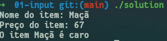

---

# Ciclos

## While loop 

O mesmo se aplica ao `while loop` quanto aos parêntesis que são sempre obrigatórios.

```C++
while (x < 5)
    cout << x << " is less than 5" << endl;
```

## Do-while loop

Existe no entanto uma variante que permite executar o código pelo menos uma vez, mesmo que a condição seja falsa, e só depois verificar a condição e se o código deve ser executado novamente:

```C++
do {
    cout << x << " is less than 5" << endl;
}
while (x < 5);
```
---

# Ciclos
## For loop

A sintaxe do `for loop` é composta por 3 partes:

- **Inicialização**: onde se define a variável de controlo do ciclo (ex: `int i = 0`)
- **Condição**: onde se define a condição para o ciclo continuar a ser executado (ex: `i < 10`)
- **Incremento**: onde se define a atualização da variável de controlo (ex: `i++`)

```C++
for (int i = 0; i < 10; i++) {
    int y = i * 2;
    cout << y << endl;
}
```

---

# Funções
## Como Declarar e Invocar uma Função

Em C++ as funções são definidas através do tipo de retorno, nome da função e parâmetros (se existirem).

- **Tipo de retorno**: o tipo de dado que a função irá retornar
- **Nome da função**: o nome que irá identificar a função
- **Parâmetros**: os dados que a função irá receber para processar (se existirem)

```C++
int add(int a, int b) { // Declaração da função
    return a + b;
}

void main() {
    int sum;
    sum = add(5, 3); // Invocação da função
}

```

---

# Funções
## Passagem por Cópia

Por defeito, o C++ passa os argumentos por **cópia**. Isto significa que a função recebe um "clone" da variável original. 

**O problema:** Mexer no clone não afeta o original!

```C++
void fazerAnos(int idade) {
    idade = idade + 1; // Estamos a alterar apenas a cópia!
}

int main() {
    int minhaIdade = 18;
    fazerAnos(minhaIdade);
    
    cout << minhaIdade; // Output: 18 (Não mudou!)
    return 0;
}
```

---

# Funções
## Passagem por Referência (`&`)

E se quisermos que a função altere a variável original? Adicionamos um **`&`** a seguir ao tipo de dados! 

Isto diz ao C++ para passar uma **referência** à variável original, sem fazer cópias. É útil para passar listas/vetores gigantes sem gastar memória a duplicá-los! É atualmente a forma mais moderna de passar argumentos em C++.

```C++
void fazerAnos(int& idade) { // <-- Repara no &
    idade = idade + 1; // Agora altera a variável verdadeira!
}

int main() {
    int minhaIdade = 18;
    fazerAnos(minhaIdade);
    
    cout << minhaIdade; // Output: 19 (Sucesso!)
    return 0;
}
```

---

# Funções
## Passagem por Apontador (`*`)

Outra forma de alterar o valor original é passar o **endereço de memória** da variável, usando um apontador (**`*`**).

São encontrados frequentemente em código mais antigo ou quando trabalhares com memória dinâmica. Mas o que é um **apontador**?

```C++
void fazerAnos(int* idade) { // Recebe um endereço de memória
    *idade = *idade + 1;     // Vai a esse endereço e altera o valor
}

int main() {
    int minhaIdade = 18;
    
    // O & aqui serve para enviar o "endereço" da variável
    fazerAnos(&minhaIdade); 
    
    cout << minhaIdade; // Output: 19
    return 0;
}
```

---

# Exercício 2/5 - Calcular razão preço/custo

// Categorias: *Input, functions*

Source-code: [Link](https://raw.githubusercontent.com/rubuy-74/cpp-workshop/refs/heads/main/02-functions/main.cpp)

Vais criar um programa que recebe:
- **O nome de um produto**
- **O preço do produto**
- **O custo do produto para o vendedor**

O objetivo é calcular a proporção do preço do produto comparado ao custo para o vendedor

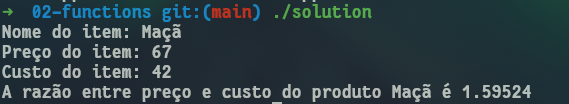

---

# Exercício Guiado

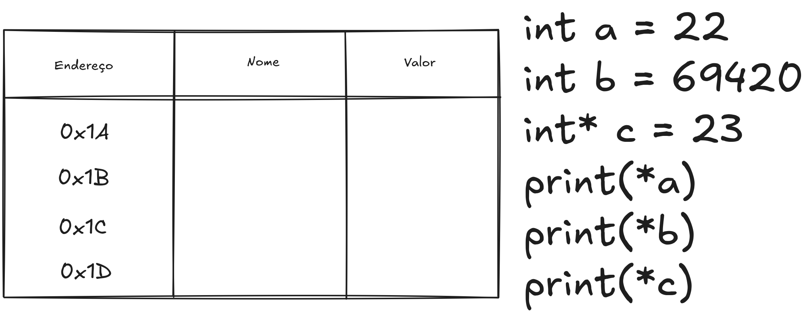

---

# Exercício Guiado

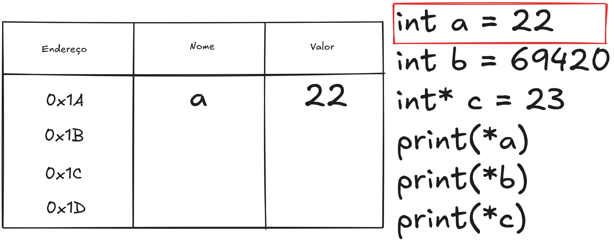

---

# Exercício Guiado

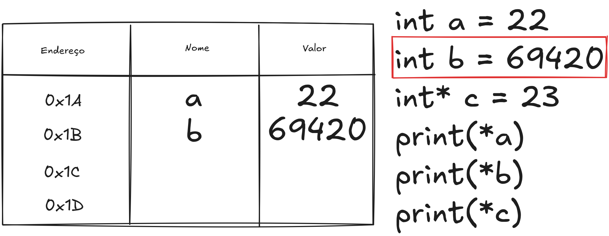

---

# Exercício Guiado

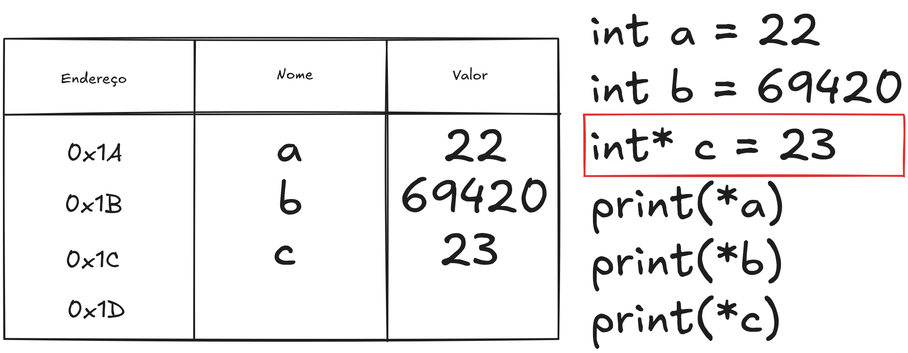

---

# Exercício Guiado

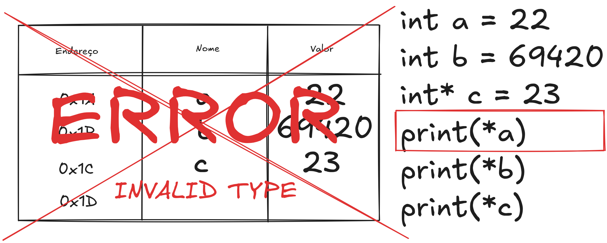

---

# Exercício Guiado

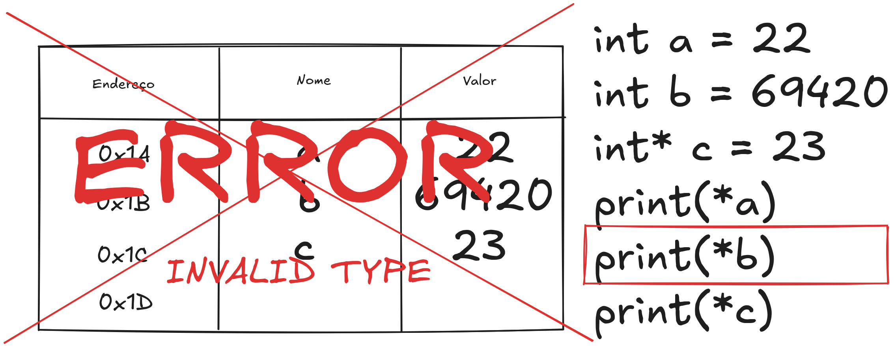

---

# Exercício Guiado

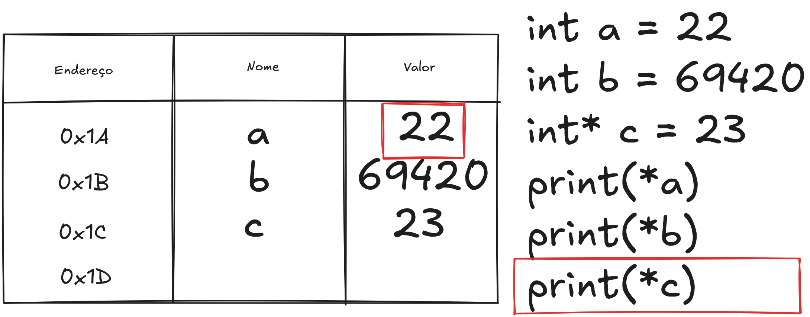

---

# Apontadores

A execução de processos tem muito por base a manipulação da memória física do computador. Assim sendo, o C++ permite-nos aceder-lhes com o uso de apontadores.

Os apontadores guardam o endereço da localização de uma variável especifica ou simplesmente uma porção de memória.

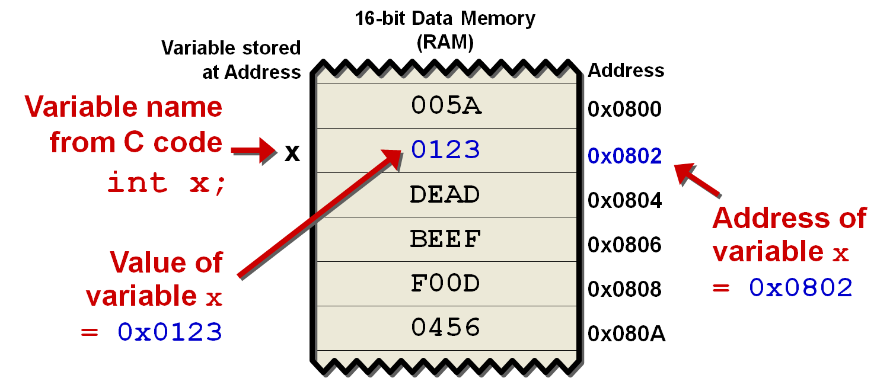

---

# Apontadores

Existem situações em que temos de usar estes apontadores:
- Usar apontadores em argumentos de funções é uma prática muito frequente para os seguintes casos:
    - Aumentar eficiência de um programa. Podemos simplesmente passar o argumento como apontador (endereço da variável), evitando assim ter de copiar o objeto. Para alguns casos não é muito relevante, como por exemplo `ints`, mas para, por exemplo, vetores e objetos de classe, poderá ser custoso copiar.
    - Alteração do conteúdo do argumento. Um use case particular é usar objetos passados por apontador como retorno da função. Pode ser útil quando necessitamos de retornar duas coisas diferentes.

Quando se está a trabalhar com apontadores, há que ter um cuidado reforçado, devido à liberdade que estes nos oferecem:
-    Possível leitura de endereços inválidas (não alocados ao programa pelo sistema operativo)
-    Possível alterar endereços de variáveis não desejáveis, ou de espaço dedicado ao controlo de fluxo (ver estrutura da stack e falhas de segurança)

**Buffer Overflow -** Essencialmente, um buffer overflow ocorre quando um programa tenta utilizar mais memória do que a que foi alocada (i.e. para um array ou uma string).

---

# Exercício 3/5 - Aplicar imposto

// Categorias: *Input, Functions, Pointers*

Source-code: [Link](https://raw.githubusercontent.com/rubuy-74/cpp-workshop/refs/heads/main/03-pointers/main.cpp)

Vais criar um programa que recebe:
- **O nome de um produto**
- **O preço do produto**
- **O custo do produto para o vendedor**

O objetivo é calcular a taxa a ser aplicada e aplica-la. **Se a razão preço/custo for maior do que 2 a taxa é 10% do valor do produto, senão é zero.**

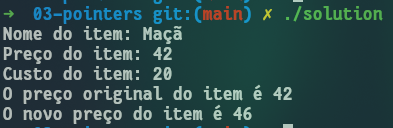

---


# Exercício Guiado Pt.2 - 0

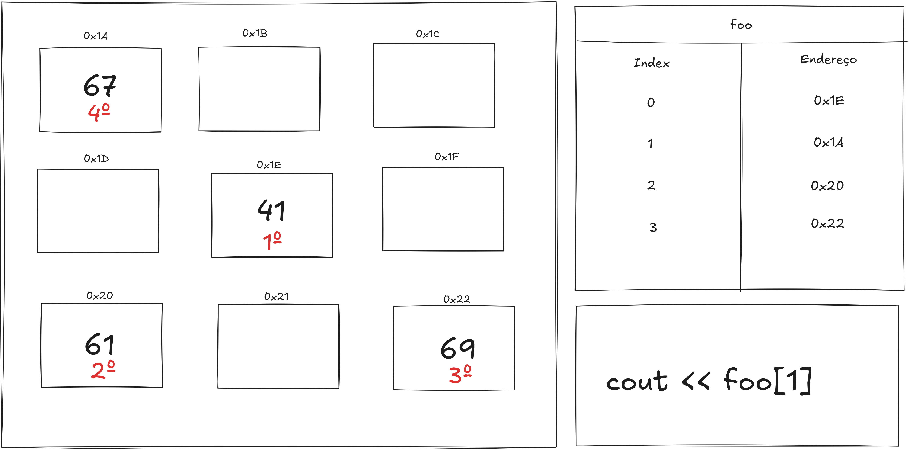

---

# Exercício Guiado Pt.2 - 1

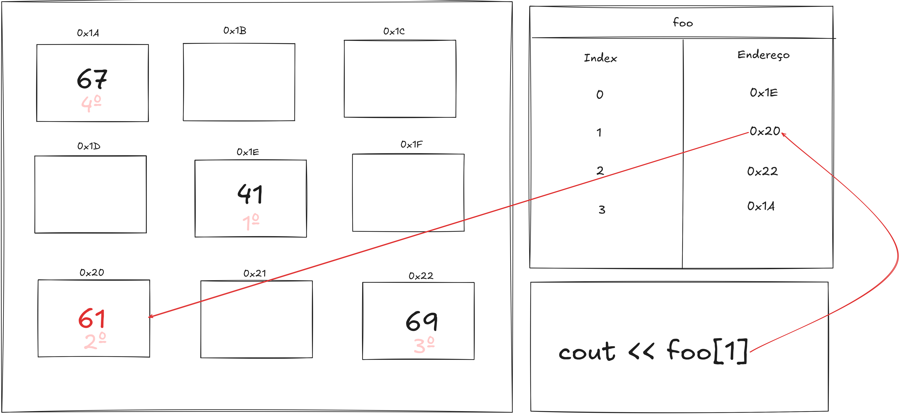

---

# Exercício Guiado Pt.2 - 2

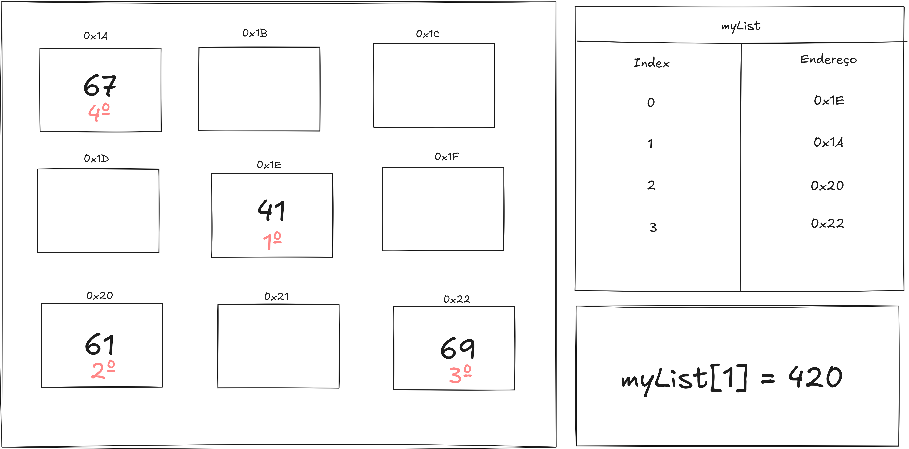

---

# Exercício Guiado Pt.2 - 3

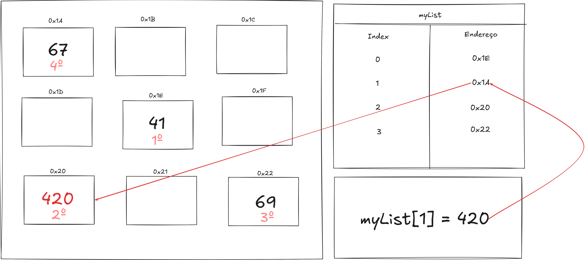

---

# Exercício Guiado Pt.2 - 4

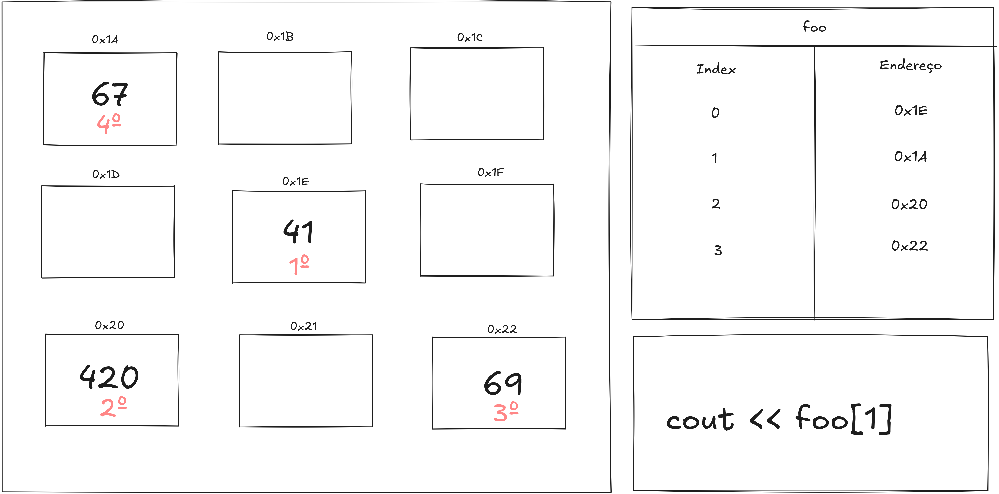

---

# Exercício Guiado Pt.2 - 5

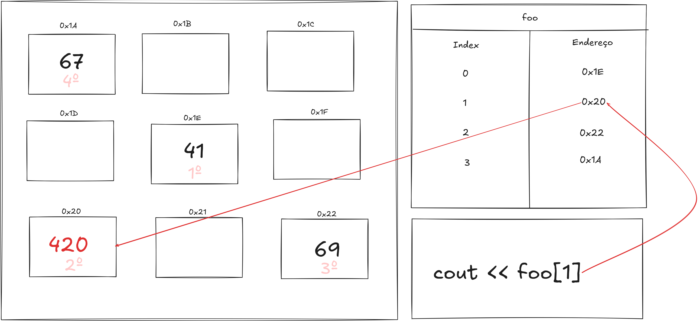


---

# Arrays

Um array é uma estrutura de dados linear com a capacidade de armazenar valores do mesmo tipo. Enquanto que os vetores (que iremos ver posteriormente) são uma classe com vários métodos pre-definidos que facilitam vários aspetos da sua utilização, os arrays lidam diretamente com os valores guardados em memória, pelo que no dia-a-dia a sua utilização não é muito comum.

Arrays têm comprimento fixo; a necessidade de guardar um número de elementos que pode ser dinâmico implica interagir com a memória do computador e gerir a quantidade de espaço alocado.

Os elementos de um array também podem ser acedidos com o operador []. Este é o equivalente a um apontador que aponta para um determinado elemento do array.

Por exemplo, se definirmos um array de 5 inteiros, `int numbers[5]`:
- numbers é o apontador que aponta para o início do array
- numbers[3] é o apontador que aponta para 3 posições após o início do array (4º elemento)

---

```C++
#include <iostream>
    
using namespace std;
    
int main() {
    const int SIZE = 5;
    int numbers[SIZE];

    for (int i = 0; i < SIZE; i++)
        numbers[i] = i * 10;

    cout << "Array elements: ";
    for (int i = 0; i < SIZE; i++)
        cout << numbers[i] << " ";
    cout << endl;

    cout << "Last element: " << *(numbers + SIZE - 1) << endl;
    
    return 0;
}         
```

```bash
Array elements: 0 10 20 30 40
Last element: 40
```
---

# Exercício 4/5 - Detetar Duplicados

// Categorias: *Functions, Arrays*

Source-code: [Link](https://raw.githubusercontent.com/rubuy-74/cpp-workshop/refs/heads/main/04-lists/main.cpp)

Vais criar um programa que recebe:
- **Lista de nomes de produtos com tamanho constante de 5**

O objetivo é detetar quais dos elementos na lista se repetem.

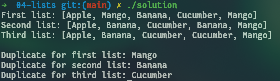

---

# E se quissesemos listas com tamanho dinâmico?

Por exemplo, uma lista de clientes que crescesse com o tempo?


---

# Vetores
- Tal como os arrays, são estruturas de dados lineares com a capacidade de armazenar vários valores de um
determinado tipo. Pode alterar o seu tamanho automaticamente sempre que um elemento 
novo é inserido ou apagado
- São alocados contiguamente na memória, podendo por isso ser vistos como uma extensão de *arrays* de C
- Os dados são geralmente inseridos no final do vetor (por razões de eficiência)

## Notas Importantes
- Os índices de um vetor iniciam-se sempre no zero. Ou seja, o primeiro elemento de um vetor 
está na posição 0, o segundo elemento na posição 1, etc.
- é possível consultar o conteúdo de um vetor numa determinada posição utilizando, tal como nos arrays, parêntesis 
retos [] ou o método .at()

--- 
---

# Vetores

## Métodos Fundamentais

Os vetores são uma classe da STL (*Standard Template Library*, que contém templates de estruturas de dados e funções úteis que já estão definidas no C++).

Para utilizar esta biblioteca é necessário incluir a instrução `#include <vector>`.

A biblioteca inclui muitos métodos úteis, alguns deles listados a baixo. Para mais informação, consultar [***Cpp Reference***](https://www.cplusplus.com/reference/vector/vector/).

- **[*idx*]/at(*idx*)**: Retorna um elemento no índice dado
- **push_back(*elem*):** Adiciona um elemento ao vetor
- **size()**: Tamanho do vetor
- **begin()**: Referência para o início do vetor
- **end()**: Referência para a posição após o último elemento do vetor
- **erase(*pos*):** Remove um elemento do vetor na posição dada
- **erase(*first*, *last*):** Remove todos os elementos entre as posições dadas

---

```C++
#include <iostream>
#include <vector> 
    
using namespace std;
    
int main() {
    vector<int> numbers {10, 20, 30}; // inicialização do vetor com 3 elementos
      
    cout << "Vector elements:";
    for (int i = 0; i < numbers.size(); i++)
        cout << " " << numbers.at(i); // equivalente a numbers[i]
    cout << endl;
    
    numbers.push_back(40); // adição do valor 40 ao fim do vetor

    cout << "Vector elements:";
    for (int i = 0; i < numbers.size(); i++)
        cout << " " << numbers.at(i); // equivalente a numbers[i]
    cout << endl;
    
    return 0;
}                                                                           
```
```Bash
Vector elements: 10 20 30
Vector elements: 10 20 30 40
```

---

Atente-se no uso da função erase() para eliminar um elemento de um vetor:
```C++
numbers.erase(numbers.begin() + 1);
```
A função elimina o elemento que se encontrar na posição que estiver a 1 unidade 
do início do vetor (numbers.begin()). Sendo que o primeiro elemento é o número 
10, e que este se encontra na posição 0, a posição a elminar será a que estiver 
à distância 0 + 1 = 1 do início do vetor, ou seja, o elemento 20.

---

# Exercício 5/5 - Calcular total (com imposto)

// Categorias: *Functions, Vectors, Pointers*

Source-code: [Link](https://raw.githubusercontent.com/rubuy-74/cpp-workshop/refs/heads/main/05-vectors/main.cpp)

Vais criar um programa que recebe:
- **Vector com nomes de produtos**
- **Vector com preços de produtos**
- **Vector com custos de produtos**

O objetivo é calcular o total a se pagar (incluindo o imposto que foi determinado no exercício 3).

---

# Exercício 5/5 - Calcular total (com imposto)

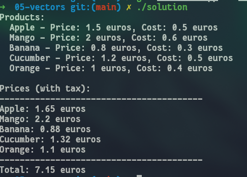

---


# Strings

- STL Strings
    - Semelhante a `vector<char>` e strings de Python
    - Operações semelhantes às dos vetores
    - Suporta também métodos específicos
        - **str += 'Outra string'**
        - **str.length()**
        - **str = to_string(124)**
        - **str = string('andre').substr(0,2)** // Gera a substring 'an'
        - **pos = str.find(substr)** // Posição da 1ª ocorrência da substring
    - Para outras operações, ver [cppreference](https://www.cplusplus.com/reference/string/string/)

- C Strings
    - Arrays *(raw)* de caracteres
    - Pouco úteis para C++


---

# Strings - Exemplo

```cpp

#include <iostream>
using namespace std;

int main() {
	char name1[256];
	cout << "Hey there, what's your full name?\n";
	cin.getline(name1, 256);
	string name = string(name1); //Nome de exemplo -> Filipe Pinto Reis
	cout << name;

	string a = name.substr(0, 6);
	string b = name.substr(12, 17);

	string c = a + b;
	cout << endl << c << endl;

	cout << c.length() << endl;

	return 0;
}
```

---

# Structs

Uma struct é uma estrutura de dados que permite agrupar várias variáveis relacionadas entre si; ao contrário dos arrays, as structs podem conter vários tipos de dados diferentes (int, bool, string...).

Para criar uma struct, utilizamos a keyword `struct` e declaramos os seus membros e o nome da variável.

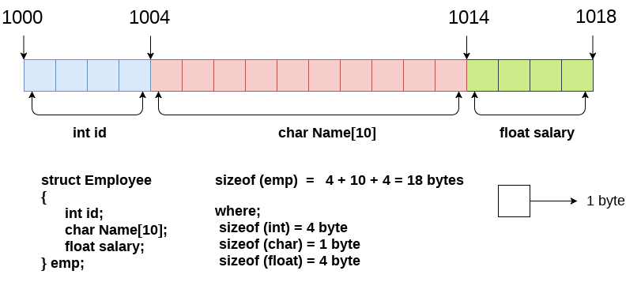

---

# Structs

```cpp
#include <iostream>
#include <string>

using namespace std;

int main()
{
    /* Cria uma struct */
    struct {
      string name;
      bool released;
      int year;
    } myStructure;

    /* Atribui valores aos membros da struct */
    myStructure.name = "Elden Ring";
    myStructure.released = true;
    myStructure.year = 2022;
    
    /* Dá print aos membros da struct */
    cout << myStructure.name << "\n";
    cout << myStructure.released << "\n";
    cout << myStructure.year << "\n";
}
```
---

# Structs

Também é possível atribuir um nome a uma struct e utilizá-la como um tipo de dados.

```cpp
#include <iostream>
#include <string>

using namespace std;

int main()
{
    struct myGame {
      string name;
      bool released;
      int year;
    };

    myGame st;

    st.name = "Palworld";
    cout << st.name << "\n";
}
```

---

# Exercício 6/5 - Refactor com structs

// Categorias: *Functions, Vectors, Pointers*

Source-code: [Link](https://raw.githubusercontent.com/rubuy-74/cpp-workshop/refs/heads/main/05-vectors/main.cpp)

Vais criar um programa que recebe:
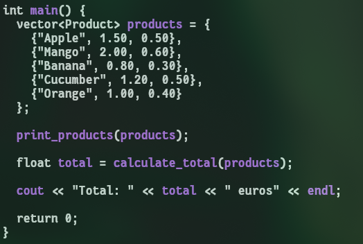

---
# Exercício 6/5 - Refactor com structs

// Categorias: *Functions, Vectors, Pointers*

O objetivo é calcular o total a se pagar (incluindo o imposto que foi determinado no exercício 3).

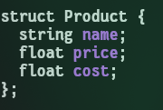

---

class: center, middle

# Tópicos Avançados

Se te tivermos conseguido cativar podes continuar a explorar os slides seguintes!

---

# Classes

C++ é uma linguagem orientada a objectos. Neste paradigma, tudo está associado a classes e a objetos, junto com os seus métodos e atributos.

Uma classe é um tipo definido pelo programador que pode ser usado ao longo do programa. Um objeto é uma instância dessa classe.

Atributos e métodos são as variáveis e funções duma dada classe (ambos chamados de membros da classe).

É definido um construtor que dita a forma como um objeto é criado, incluindo dados a serem passados.

Se necessário, pode ser explicitamente definido um destrutor para despoletar uma ação aquando da libertação de um objeto da memória.

## Access Specifiers

- **public**: membros são acessíveis fora da classe
- **private**: membros são acessíveis apenas dentro da classe (*default*)
- **protected**: membros são acessíveis dentro da classe e em classes derivadas (mais à frente)

---
## Criar uma classe
```C++
class Printer {       // Nome da classe
  private:            // Access specifier
    string myString;  // Atributo (variável string)
  public:
    Printer(string myString) { // Construtor
      this->myString = myString; // this é um apontador para o próprio objeto
    }

    void printString() { // Método (função que retorna void)
      cout << "Hi! Your string is " << myString << endl;
    }
};
```
## Criar um objeto
```C++
int main() {
  Printer impressora("very cool!");  // cria um objeto da classe Printer
  impressora.printString(); // Hi! Your string is very cool!
  // Se o construtor não tivesse argumentos,
  // o objeto era criado apenas com Printer impressora;
  return 0;
}
```
---
# Classes
## Modificar Atributos - Usando *public*

```C++
class Printer {
  public:
    string myString;
    Printer(string myString) {
      this->myString = myString;
    }

    void printString() {
      cout << "Hi! Your string is " << myString << endl;
    }
};
```

```C++
int main() {
  Printer impressora("very cool!");
  impressora.myString = "even cooler!";
  impressora.printString(); // Hi! Your string is even cooler!
  return 0;
}
```

---
# Classes
## Modificar Atributos - Usando *public*

Esta abordagem tem alguns problemas:
- Qualquer programador pode aceder e modificar o atributo, sem qualquer controlo
- É impossível adicionar qualquer tipo de validação ao accesso
- É impossível permitir a leitura e não a escrita
- Podemos querer "esconder" a representação interna da classe
- Entre outros (ler mais sobre [encapsulamento](https://www.geeksforgeeks.org/encapsulation-in-c/))

Para corrigir estes problemas, podem ser usados *getters* e *setters*

---
## Modificar Atributos - *Getters* e *Setters*
```C++
class Printer {
  private:
    string myString;
  public:
    Printer(string myString) {
      this->myString = myString;
    }

    void printString() {
      cout << "Hi! Your string is " << myString << endl;
    }
    
    void setMyString(string newString) {
      this->myString = newString;
    }
    
    string getMyString() {
      return this->myString;
    }
};
```

```C++
int main() {
  Printer impressora("very cool!");
  cout << impressora.getMyString() << endl; // very cool!
  impressora.setMyString("even cooler!");
  impressora.printString(); // Hi! Your string is even cooler!
  return 0;
}
```

---
# Classes
## Hierarquia

Por vezes, é útil ter classes que derivam de outras, especificando o seu papel no programa. Por exemplo, as classes *Cat* e *Dog* podem derivar de uma classe comum *Animal*. Estas podem possuir membros próprios mas também conseguem aceder aos membros comuns da classe *Animal* (exceto *private*).

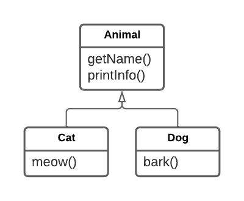

---
# Classes
## Hierarquia - Sintaxe e Access Specifiers
```C++
class A { // classe base
    ..............
};
class B : access_specifier A { // classe derivada de A
    ...........
};
```


(Imagem retirada de [*GeeksforGeeks*](https://www.geeksforgeeks.org/inheritance-in-c/))

---
## Hierarquia - Exemplo
```C++
#include <iostream>
using namespace std;

class Animal {
  protected:
    string name;
  public:
    Animal(string name) { this->name = name; }

    string getName() { return this->name; }

    void printInfo() {
      cout << name << " is some kind of animal" << endl;
    }
};

class Cat : public Animal {
  public:
    // Apenas invoca construtor de Animal
    Cat(string name) : Animal(name) {}
  
    void meow() {
      cout << name << " says meooww" << endl;
    }

    void printInfo() { // Isto chama-se overload de funções
      cout << name << " is a cat" << endl;
    }
};
```

---
## Hierarquia - Exemplo

```C++
class Dog : public Animal {
  public:
    Dog(string name) : Animal(name) {}

    void bark() {
      cout << name << " says bark bark" << endl;
    }

    void printInfo() {
      cout << name << " is a dog" << endl;
    }
};

int main() {
    Animal cat("Yuri"); // Hmm
    cat.printInfo(); // Yuri is some kind of animal
    cout << cat.getName() << endl; // Yuri

    Dog max("Max");
    max.bark(); // Max says bark bark
    cout << max.getName() << endl; // Max

    Cat fluffy("Fluffy");
    fluffy.printInfo(); // Fluffy is a cat

    return 0;
}
```

---

## Operator Overloading

C++ permite-nos atribuir um significado especial a operadores para tipos de dados específicos - conhecido como **operator overloading**. Operator overloading permite-nos realizar operações que não seriam possíveis de outra forma.

O exemplo abaixo demonstra como podemos utilizar *f* e *g* como funções (apesar de serem objetos) utilizando operator overloading.

```cpp
#include <iostream>

using namespace std;

struct Linear
{
    double a, b;
    
    /* Operator Overloading */
    double operator()(double x) const
    {
        return a * x + b;
    }
};
 
int main()
{
    Linear f{2, 1};  // f = 2x + 1
    Linear g{-1, 0}; // g = -x
 
    double f_0 = f(0);
    double f_1 = f(1);
    double g_0 = g(0);

    cout << f_0 << endl;
    cout << f_1 << endl;
    cout << g_0 << endl;
}
```

---

# Exercícios - Shopping Cart

**SC0.** Começa o desenvolvimento do programa MyShoppingCart por adicionar uma mensagem de boas-vindas ao utilizador. Para isso, copia o código [neste ficheiro](https://raw.githubusercontent.com/NIAEFEUP/Workshop_CPP/master/shopping-cart/classes/Initial.cpp) e cola-o no teu IDE. Trabalharás com este ficheiro até ao final do workshop!

Exemplo do programa em execução:
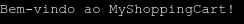

---

# Solução


```cpp
int main() {
    // ...

    cout << "Bem-vindo ao MyShoppingCart!" << endl;
    
    // ...
}
```

---

# Exercícios - Shopping Cart

**SC1.** Melhora a mensagem de boas vindas de forma a pedir o nome do utilizador e cumprimentá-lo. Atenção aos nomes que contêm espaços.

Por exemplo, se o utilizador responder com “Pedro Fernandes”, o programa deve responder “Olá Pedro Fernandes!” e não “Olá Pedro!”.


Exemplo do programa em execução:
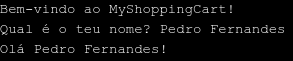

---

# Solução


```cpp
int main() {
    // ...

    string name;

    cout << "Bem-vindo ao MyShoppingCart!" << endl;
    cout << "Qual é o teu nome? ";
    getline(cin, name);
    cout << "Olá " << name << "!" << endl;
    
    // ...
}
```

---

# Exercícios - Shopping Cart

**SC2.** Completa o método `printAndChooseOption(option)` da classe **ShoppingCart**, usando a variável *option* e a técnica do *switch case*.

Se correres o método, reparas que aparece uma lista das opções disponíveis, sendo que o objetivo é pedir ao utilizador para escolher uma delas.

Constrói o método de forma a que, quando o utilizador coloca uma opção não existente (ex: -1), seja imprimida uma mensagem a assinalar o erro.

Exemplo do programa em execução:

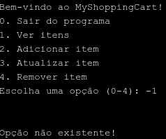

---


```cpp
void printAndChooseOption(int &option) {
    // ...
    cin >> option;
    cin.ignore(10000, '\n');
    cout << endl << endl;

    switch (option)
    {
        case 0:
            // TERMINAR O PROGRAMA
            cout << "Obrigado por escolher a nossa aplicação!" << endl;
            break;
        case 1:
            // VER ITENS
            break;
        case 2:
            // ADICIONAR ITEM
            break;
        case 3:
            // ATUALIZAR ITEMS
            break;
        case 4:
            // REMOVER ITEMS
            break;
        default:
           cout << "Opção não existente!" << endl;
           break;
    }
    // ...
}
```

---

# Exercícios - Shopping Cart

**SC3.** Completa o *main*, criando um objeto **ShoppingCart** e chamando o método *printAndChooseOption*, de forma a que seja possível continuar a fazer operações enquanto o utilizador assim desejar.

Ou seja, como, na lista de opções, opção 0 é a responsável por terminar o programa, este deve continuar enquanto essa opção não for escolhida.
Exemplo do programa em execução:

Primeiro Input             |  Segundo Input
:-------------------------:|:-------------------------:
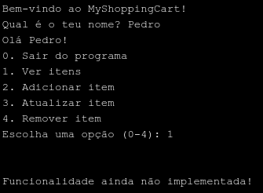  |  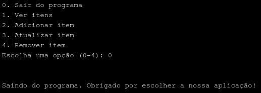

---

# Solução


```cpp
int main() {
    // ...

    int option = -1;
    ShoppingCart shoppingCart;

    while (option != 0)
        shoppingCart.printAndChooseOption(option);
    
    // ...
}
```

---

# Exercícios - Shopping Cart

**SC4.** Implementa a funcionalidade de adicionar um item ao carrinho. O programa deve pedir ao utilizador o nome do produto, o seu preço, e adicionar um novo item a um vetor definido previamente na classe **ShoppingCart**.

No código, está indicado com “ADICIONAR ITEM” o local onde deves trabalhar neste exercício. Recorda-te do uso de métodos de classe.

Exemplo do programa em execução:
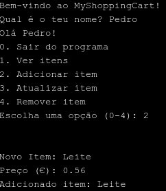

---

# Exercícios - Shopping Cart

**SC5.** Implementa a funcionalidade de ver os itens no carrinho. Para isso, deves percorrer o vetor de itens e imprimir no ecrã o nome e preço respetivos.
Caso não existam quaisquer produtos, deves imprimir uma mensagem a indicá-lo.

No código, está indicado com “VER ITENS” o local onde deves trabalhar neste exercício. Recorda-te do uso de métodos de classe.

Exemplo do programa em execução:
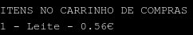

---

# Exercícios - Shopping Cart

**SC6.** Implementa a funcionalidade de remover um item do carrinho. Para isso, deves pedir ao utilizador o ID do produto (que pode ser usado para calcular o índice do mesmo no vetor) e removê-lo do carrinho. Certifica-te que o utilizador não escolhe um item não existente.

No final, para verificar que a função funciona, corre a opção de ver os itens do carrinho e certifica-te que o item escolhido não aparece.

No código, está indicado com “REMOVER ITEMS” o local onde deves trabalhar neste exercício. Recorda-te do uso de métodos de classe.

Primeiro Input             |  Segundo Input
:-------------------------:|:-------------------------:
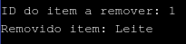  |  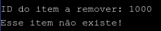


---

# Soluções


```cpp
class ShoppingCart {
private:
    vector <Item> cart;
public:
    void addItem() {
        string newName;
        double price;

        cout << "Novo Item: ";
        getline(cin, newName);

        cout << "Preço (€): ";
        cin >> price;

        Item item(newName, price);

        cart.push_back(item);

        cout << "Adicionado item: " << newName << endl;
    }
    // ...
```

---

# Soluções


```cpp
public:
    // ...
    void printItems() {
        int size = cart.size();

        cout << "ITENS NO CARRINHO DE COMPRAS" << endl;

        if (size == 0) {
            cout << "O carrinho de compras está vazio!" << endl;
        }

        for (int i = 0; i < size; i++) {
            Item item = cart.at(i);
            string name = item.getName();
            double price = item.getPrice();

            cout << i + 1 << " - " << name << " - " << price << "€" << endl;
        }
    }
    // ...
```

---

# Soluções


```cpp
public:
    // ...
    void removeItem() {
        int id;

        cout << "ID do item a remover: ";
        cin >> id;

        if (id < 0 || id > cart.size()) {
            cout << "Esse item não existe!" << endl;
            return;
        }

        Item item = cart.at(id - 1);
        cart.erase(cart.begin() + id - 1);

        cout << "Removido item: " << item.getName() << endl;
    }
    // ...
```

---

# Soluções

```cpp
void printAndChooseOption(int &option) {
    // ...
    switch (option)
    {
        case 0:
            // TERMINAR O PROGRAMA
            cout << "Obrigado por escolher a nossa aplicação!" << endl;
            break;
        case 1:
            printItems();
            break;
        case 2:
            addItem();
            break;
        case 3:
            // ATUALIZAR ITEMS
            break;
        case 4:
            removeItem();
            break;
        default:
           cout << "Opção não existente!" << endl;
           break;
    }
    // ...
}
```

---

# Exercícios - Shopping Cart

**SC7.** Implementa a funcionalidade de atualizar um item do carrinho. Para isso, deves pedir ao utilizador o ID do produto, pedir o novo nome do produto e preço do produto, e atualizar o respetivo item no carrinho. Certifica-te que o utilizador não escolhe um item não existente.

No código, está indicado com “ATUALIZAR ITEMS” o local onde deves trabalhar neste exercício. Recorda-te do uso de métodos de classe.

Exemplo do programa em execução:
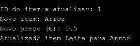

---

# Exercícios - Shopping Cart

**SC8.** Melhora a funcionalidade de mostrar os itens do carrinho de forma a ser possível ver o preço total dos produtos. Para isso, deves escrever uma função que calcule a soma dos preços, chamá-la no local apropriado, e imprimir o valor retornado pela mesma após mostrares os itens presentes no carrinho.

Exemplo do programa em execução:
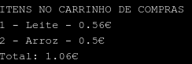

---

```cpp
public:
    // ...
    void updateItem() {
        int id;

        cout << "ID do item a atualizar: ";
        cin >> id;
        cin.ignore(10000, '\n');

        if (id < 0 || id > cart.size()) {
            cout << "Esse item não existe!" << endl;
            return;
        }

        string oldName = cart.at(id - 1).getName();

        string newName;
        cout << "Novo item: ";
        getline(cin, newName);

        double newPrice;
        cout << "Novo preço (€): ";
        cin >> newPrice;

        Item newItem(newName, newPrice);

        cart.at(id - 1) = newItem;

        cout << "Atualizado item " << oldName << " para " << newName << endl;
    }
    // ...
```

---

```cpp
public:
    // ...
    double sumPrices() {
        double sum = 0;

        for (int i = 0; i < cart.size(); i++) {
            Item item = cart.at(i);
            sum += item.getPrice();
        }

        return sum;
    }
    
    void printItems() {
        int size = cart.size();
        double total = sumPrices();

        cout << "ITENS NO CARRINHO DE COMPRAS" << endl;

        if (size == 0) {
            cout << "O carrinho de compras está vazio!" << endl;
        }

        for (int i = 0; i < size; i++) {
            Item item = cart.at(i);
            string name = item.getName();
            double price = item.getPrice();

            cout << i + 1 << " - " << name << " - " << price << "€" << endl;
        }
        cout << "Total: " << total << "€" << endl;
    }
    // ...
```

---
# Outros Tópicos Avançados

- Alguns conceitos de classes
  - Funções virtuais, classes abstratas...
- Macros
  - Substituição de texto em compile time
- Casts
  - Conversão de tipos
- Alocação dinâmica de memória
  - Tamanhos variáveis e permanência em memória
- Lambda functions, unions, enums, operator overloading
  - *Syntatic sugar*
- Bitwise operations
  - Low level fun
- Leitura e escrita de ficheiros
  - Persistência de informação
- Computação paralela
  - Threads e concorrência
- Organização em ficheiros
  - Escalabilidade e modularidade

---

# Recursos Recomendados

## Ferramenta de Desenvolvimento

- [Visual Studio Code](https://code.visualstudio.com/) & Extensão C/C++ & g++ (WSL/Linux/Mac)
- [Visual Studio](https://visualstudio.microsoft.com/) (Windows)
- [CLion](https://www.jetbrains.com/clion/) (Windows/Linux/Mac)

## Referência

- [cppreference](https://en.cppreference.com/w/)

## Livros

- The C++ Programming Language, 4ª Edição, de Bjarne Stroustrup
- Effective C++, 3ª Edição, de Scott Meyers
class: center, middle

---

# Questionário


