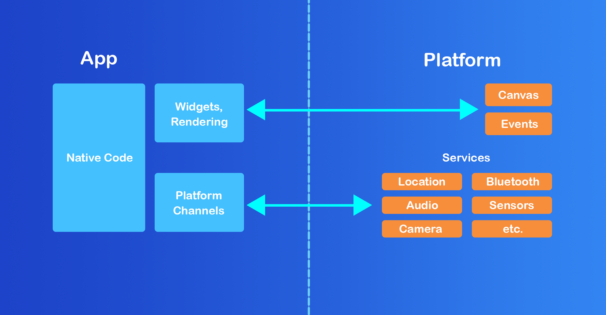
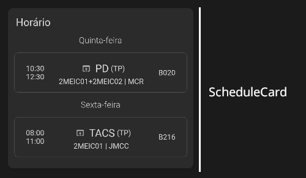
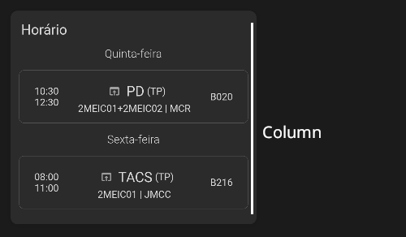
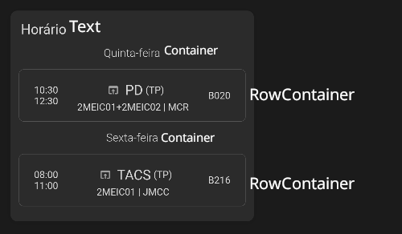
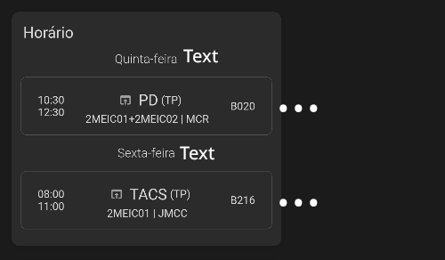
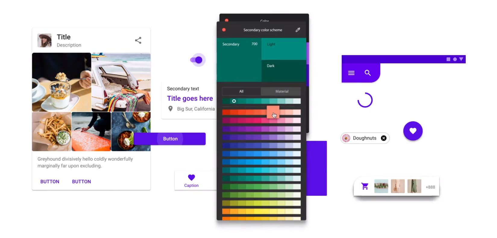
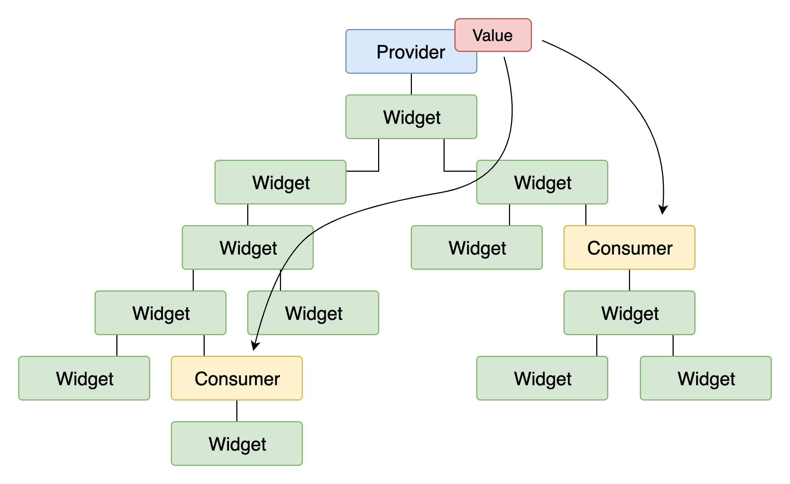
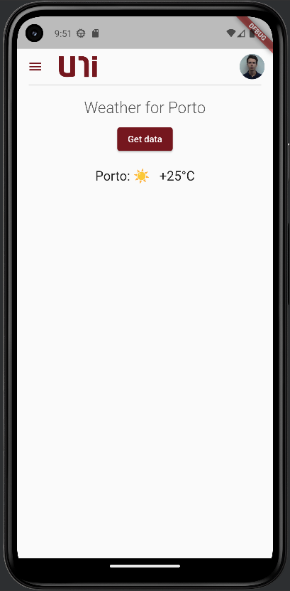

class: center, middle, inverse, small-images

# Flutter

### Or how to develop once, run everywhere

<div style="display: flex; justify-content: center; margin-top: 3em; align-items: center; gap: 1em;">

<div style="font-size: 3em;"><3</div>

</div>

---

class: center, middle, inverse, small-images

# Flutter

### Or how to develop once, run everywhere

#### ~~(This is not a Java workshop)~~

<div style="display: flex; justify-content: center; margin-top: 3em; align-items: center; gap: 1em;">

<div style="font-size: 3em;"><3</div>

</div>

---

class: center, middle, inverse

### Your host


**Bruno Mendes**

M.EIC Finalist

---

class: inverse

### Our plan

- A brief introduction to Flutter
- The Dart programming language
  - Basic syntax
  - Advanced features: null-safety, asynchronous programming, etc.
- Flutter concepts
  - Widgets, Layout, Material Design
  - Advanced topics: state management, platform channels, offline storage, architecture
  - Best practices
- A hands-on session on _uni_

---

class: center, middle, inverse

## Don't let this be a monologue

#### Ask questions whenever you want

---

### What is Flutter?

- A framework developed by Google for building near-native **cross-platform** apps
- Uses **Dart**, a statically-typed, compiled, null-safe programming-language built with UI development in mind
- Provides facilities such as **hot-reload** and **hot-restart** for fast development



---

class: center, middle, inverse

## But I only know Python/JS/...!

#### No worries, Dart is easy to learn

---

### Dart 101

Dart is an imperative, object-oriented language with some functional features.

```dart
class NumbersProcessor {
    NumbersProcessor(this.numbers); // Class constructor

    List<int> _numbers; // Class private field (notice the underscore)

    // Class method
    int sum() {
        // Notice the arrow function syntax, enabling a functional style
        final sum = _numbers.reduce((value, element) => value + element);
        return sum;
    }
}

void main() {
    // Variable declaration
    List<int> someNumbers = [1, 2, 3, 4, 5];
    NumbersProcessor processor = NumbersProcessor(someNumbers);

    // Function call
    print(processor.sum());
}
```

---

### Dart specials: null-safety

In most languages that support objects, you can assign `null` to a variable of the type of that object. That pattern is useful for portraying the absence of a value, but it can lead to bugs.

```dart
void main() {
    String errorDescription = null;
    printError(errorDescription);
}

void printError(String description) {
    // Here we check if the description is null
    // But what if we forget to check? Boom!
    if (errorDescription != null) {
        print("Error: " + errorDescription);
    } else {
        print("Generic error");
    }
}
```

> "I call it [the null reference] my billion-dollar mistake." - Tony Hoare

---

### Dart specials: null-safety

Since Dart 2.12, the language supports null-safety, which means that you can't assign `null` to a variable unless you explicitly declare it as nullable.

This is a pattern that is also used in Kotlin and Swift. Some other languages, such as Rust, don't even have the concept of `null` and force the developer to use semantic types such as `Option` or `Result`.

```dart
void main() {
    // Nullable types are suffixed with a question mark
    // If not declared as nullable, the compiler will not let you assign null
    String? errorDescription = null;
    printError(errorDescription);
}

void printError(String? description) {
    // The compiler will force you to check if the description is null
    if (errorDescription != null) {
        print("Error: " + errorDescription);
    } else {
        print("Generic error");
    }

    // Notice the null-aware operator
    // You can alternatively use the "bang" operator (!)
    // to force the compiler to ignore null-safety
    print("Error length: " + errorDescription?.length);
}
```

---

### Dart specials: asynchronous programming

Some things in life take time. How awkward would it be if UI interaction in _uni_ was suspended while the app was waiting for a response from _Sigarra_, the fastest information system in the world?

Older languages such as Java or C/C++ force you to use explicit threads to perform asynchronous operations. Modern languages have built-in support for asynchronous programming. In Dart, one relies on the `Future` class.

```dart
import 'package:http/http.dart' as http;

Future<http.Response> fetchLectures() {
    final uri = Uri.parse('sigarra.up.pt/feup/pt/mob_hor_geral.estudante');
    return http.get(uri);
}

// If a function is marked as async, it can use the await keyword
void main() async {
    // Wait for the execution of the fetchLectures function before continuing
    // Alternatively, you can use the "then" method of the Future class
    final response = await fetchLectures();
    final json = jsonDecode(response.body);
    print(json);
}
```

---

### Dart specials: miscellaneous

- **Generics** are supported, but they are not as powerful as templates in C++
- **Extension methods** allow you to add methods to existing classes, e.g. the built-in `String` class
- **Mixins** allow you to add functionality to classes without using inheritance, equivalent to traits in Rust
- **Inheritance** is supported, but only single inheritance (thank god)
- **Exceptions** are supported, but methods need not declare them in their signature (unlike Java)
- **Pattern matching** is supported, e.g. in `switch` statements since Dart 3.0

> "Programming languages should be designed not by piling feature on top of feature, but by removing the weaknesses and restrictions that make additional features appear necessary." - Richard Holt (University of Waterloo)

---

class: center, middle, inverse

## So now I know Dart (kinda)

#### How do I build a Flutter app?

---

### Flutter: Getting started

For developing Flutter apps, you need:

- The Flutter SDK (which includes the Dart SDK)
- Platform-specific SDKs and/or IDEs
  - Android: Android Studio + Android SDK
  - iOS: Xcode + iOS SDK
  - Linux: C/C++ toolchain
  - Web: Chrome
  - ...
- A lot of patience for the first build

> In Flutter's defense, the first build is the only one that takes a long time, since you can use hot-reload and hot-restart to quickly iterate on your code later on. Also, transpilation to native code is not an easy task and also takes time in other frameworks, such as React Native.

---

### Flutter essentials: Widgets

- In Flutter, everything is a widget expressed in code
- Widgets are arranged in a tree structure and are rendered on a canvas provided by the platform
- Widgets (and its children) are rebuilt everytime their state changes, e.g. when a button is pressed
- The Flutter framework provides a set of built-in widgets, but you can also create your own


---

### Flutter essentials: Stateless widgets

**Stateless widgets** are immutable and are suitable for static UI elements (such as images) or UI actions (triggering a change on a parent stateful widget).

```dart
class LikeButton extends StatelessWidget {
    // onPressed is a required named parameter
    LikeButton({required this.onPressed});

    Function() onPressed;

    @override
    Widget build(BuildContext context) {
        return TextButton(
            // onPressed is a callback that will be invoked
            // by the UI thread as a response to a tap event.
            // It will run on a separate thread.
            onPressed: onPressed,
            child: Text("Like"),
        );
    }
}
```

---

### Flutter essentials: Stateful widgets

**Stateful widgets** are mutable and are suitable for UI elements that change over time (such as a counter or a list of items fetched from an API).

You can use the `setState` method to trigger a rebuild of the widget and its children, by passing a callback that updates the widget's state.

```dart
class PostLike extends StatefulWidget {
    @override
    PostLikeState createState() => PostLikeState();
}

class PostLikeState extends State<PostLike> {
    int _likes = 0;

    @override
    Widget build(BuildContext context) {
        return Row(
            children: [
                Text("Likes: $_likes"),
                const SizedBox(width: 8),
                LikeButton(
                    onPressed: () => setState(() => _likes = likes + 1),
                ),
            ],
        );
    }
}
```

---

### Flutter essentials: Context

The `context` is a reference to the widget's location in the widget tree. It can be used to obtain access to global services such as the `Theme` or the `Navigator`.

```dart
class LikeButton extends StatelessWidget {
    @override
    Widget build(BuildContext context) {
        // The context can be used to obtain access to global services
        final theme = Theme.of(context);
        return TextButton(
            onPressed: () {
                // The Navigator can be used to navigate to other screens,
                // enabling patterns that the user expects
                // such as the back button on Android.
                // You can define your own routes in the MaterialApp widget.
                Navigator.of(context).pushNamed("/likes");
            },
            child: Text("Like"),
            style: TextButton.styleFrom(
                primary: theme.primaryColor,
            ),
        );
    }
}
```

---

### Flutter essentials: Layout

To be able to build complex UIs, you need to be able to arrange widgets in a layout, much like you would use CSS's Flexbox or Grid:

- `Row` and `Column` widgets allow you to arrange widgets horizontally and vertically, respectively.
- Others such as `Center` and `Expanded` signal their parent that their children should be displayed in a way that exceeds their natural size.
- `Container` is a widget that allows you to add padding, margin, borders, etc. to its child.



---

### Flutter essentials: Layout

To be able to build complex UIs, you need to be able to arrange widgets in a layout, much like you would use CSS's Flexbox or Grid:

- `Row` and `Column` widgets allow you to arrange widgets horizontally and vertically, respectively.
- Others such as `Center` and `Expanded` signal their parent that their children should be displayed in a way that exceeds their natural size.
- `Container` is a widget that allows you to add padding, margin, borders, etc. to its child.



---

### Flutter essentials: Layout

To be able to build complex UIs, you need to be able to arrange widgets in a layout, much like you would use CSS's Flexbox or Grid:

- `Row` and `Column` widgets allow you to arrange widgets horizontally and vertically, respectively.
- Others such as `Center` and `Expanded` signal their parent that their children should be displayed in a way that exceeds their natural size.
- `Container` is a widget that allows you to add padding, margin, borders, etc. to its child.



---

### Flutter essentials: Layout

To be able to build complex UIs, you need to be able to arrange widgets in a layout, much like you would use CSS's Flexbox or Grid:

- `Row` and `Column` widgets allow you to arrange widgets horizontally and vertically, respectively.
- Others such as `Center` and `Expanded` signal their parent that their children should be displayed in a way that exceeds their natural size.
- `Container` is a widget that allows you to add padding, margin, borders, etc. to its child.



---

### Flutter essentials: Material Design

Material Design is a design language developed by Google that is used in many of its products, such as Android and Chrome OS. Flutter provides a set of widgets that implement the Material Design guidelines, and are customizable to fit your needs, e.g. through the `Theme` widget.



---

class: center, middle, inverse

## Is this enough?

#### Maybe, but you might be missing some important concepts

---

### Flutter advanced: State management

In applications, it is common to have global state that is useful to sibling or distant widgets in the widget tree. For example, a user's authentication state is useful to many widgets in the app.

A solution known so far would be to pass the user authentication state as a parameter to every widget that needs it. This is not only cumbersome, but also error-prone. Some call it _prop drilling_ or _callback hell_.

Fortunately, packages such as `redux` and `provider` (or its successor `riverpod`) provide solutions to this problem. `BLoC` is also popular.



---

### Flutter advanced: Platform channels

Sometimes you need to access platform-specific APIs, such as the camera or the GPS. For that, Flutter provides a mechanism called **platform channels**.

```dart
final batteryLevel = await platform.invokeMethod<int>('getBatteryLevel');
setState(() {
    // Notice we only update the state after the platform call returns,
    // since setState is synchronous
    _batteryLevel = result;
});
```

```kotlin
override fun onMethodCall(call: MethodCall, result: Result) {
  if (call.method == "getBatteryLevel") {
    val batteryLevel = getBatteryLevel()
    if (batteryLevel != -1) {
      result.success(batteryLevel)
    } else {
      result.error("UNAVAILABLE", "Battery level not available.", null)
    }
  } else {
    result.notImplemented()
  }
}

private fun getBatteryLevel(): Int {
  val batteryManager = getSystemService(Context.BATTERY_SERVICE) as BatteryManager
  return batteryManager.getIntProperty(BatteryManager.BATTERY_PROPERTY_CAPACITY)
}
```

---

### Flutter advanced: Offline storage

Flutter provides a set of packages that allow you to store data locally on the device, such as `shared_preferences` (key-value storage) and `sqflite` (SQLite database).

```dart
final sharedPreferences = await SharedPreferences.getInstance();
final savedUsername = await sharedPreferences.getString("username");
```

```dart
final db = await openDatabase('my_db.db');
final savedUsername = await
    db
    .query("users", where: "id = ?", whereArgs: [1])
    .then((rows) => rows.first["username"]);
```

The choice of storage depends on the complexity of the data you want to store. For simple data, `shared_preferences` is enough. For more complex data, you should use `sqflite`, or even a NoSQL database such as `hive`.

---

### Flutter advanced: Architecture

Real-world applications are large and complex and thus require a well-defined architecture to be maintainable. Flutter is no exception.

A common architecture for reactive applications is **MVC** (Model-View-Controller):

- **Model**: the data layer, i.e. the classes that represent entities in the application (e.g. a `User` class). May also contain state management logic.
- **View**: the UI layer, i.e. the widgets that are rendered on the screen
- **Controller**: the business logic layer, i.e. the classes that handle the application's logic (e.g. a `UserService` class that handles API calls and writes to the database)


---

### Flutter advanced: Best practices

- Use `const` whenever possible
- Keep the state local to the widget that needs it if possible, i.e. do not overuse global state management
- Extract widgets to separate files to keep your code clean and avoid heavy rebuilds
- Use a static code analyzer ("linter") to keep your code formatted, clean and consistent
- Do not put complex business logic in the UI layer
- Do not reinvent the wheel: use packages from the community whenever possible
- Test your code, especially the business logic layer

---

class: center, middle, inverse

# Questions?

---

class: center, middle, inverse

### So you are now a Flutter expert

#### Let's get our hands dirty

---

### Flutter: Hands-on

- Make sure you have Flutter well configured on your machine:

```sh
flutter doctor
```

- Clone the _uni_ repository:

```sh
git clone git@github.com:NIAEFEUP/uni.git
```

- Run the application on your emulator/device
- Follow the steps:
  - Create a `weather.dart` file in `lib/view/weather`
    - It should contain a widget that fetches data from the [wttr.in](https://github.com/chubin/wttr.in) API upon the press of a button and displays it on the screen. The widget state should extend `GeneralPageViewState`
  - Create a new `DrawerItem` in `lib/utils/drawer_items.dart` for the weather screen
  - Create the route for the weather screen in `lib/main.dart`

---

### Flutter: Hands-on

The final result should look like this:


