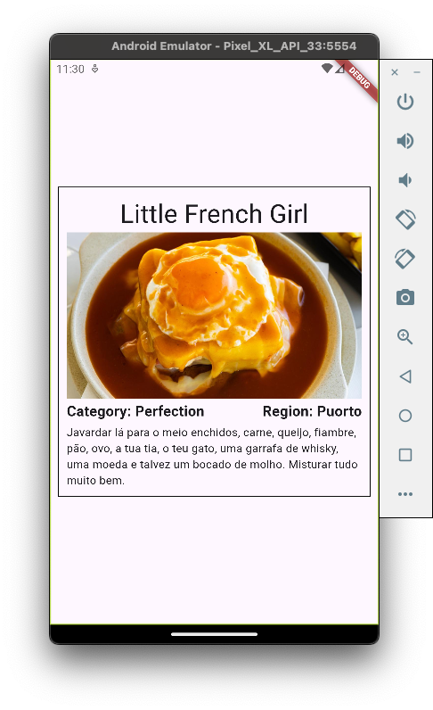

class: center, middle, inverse, small-images

# Flutter

### Or how to develop once, run everywhere

<div style="display: flex; justify-content: center; margin-top: 3em; align-items: center; gap: 1em;">

<div style="font-size: 2.5em; padding-inline: 0.5em;">❤️</div>

</div>

---

class: center, middle, inverse

## Don't let this be a monologue

#### Ask questions whenever you want

---

### What is Flutter?

- A framework developed by Google for building near-native **cross-platform** apps
- Uses **Dart**, a statically-typed, compiled, null-safe programming-language built with UI development in mind
- Provides facilities such as **hot-reload** and **hot-restart** for fast development
- Easy to learn


---

### Dart 101

- Dart is an **imperative programming language**
- It is **object-oriented** as well
- It supports **null-safety**

```dart
class Person {
  Person(this.age, this.name, this.height, this.surname);

  int age;
  String name;
  String? surname;
  double height;

  String getName() => this.name;

  String? getSurname() => this.surname
}

void main() {
  Person recruta = Person(18, "Recruta", 1.8);

  print(recruta.getName());
}
```

---

### More on null-safety

You can't assign `null` to a variable unless you explicitly declare it as nullable.
If you do so, you have to be careful in how you handle it.

```dart
class Person {
  Person(this.age, this.name, this.height, this.surname);

  int age;
  String name;
  String? surname;
  double height;

  String getName() => this.name;
  String? getSurname() => this.surname;
}

void main() {
  Person recruta = Person(18, "Recruta", 1.8, null);

  if (recruta.getSurname() != null) {
    print(recruta.getSurname()!.length); // ignores null-safety, prints nothing
  }

  print(recruta.getSurname()?.length); // prints null
}

```

---

### Asynchronous programming

Some things in life take time. How awkward would it be if UI interaction in _uni_ was suspended while the app was waiting for a response from _Sigarra_, the fastest information system in the world?

```dart
import 'package:http/http.dart' as http;

Future<http.Response> fetchLectures() {
    final uri = Uri.parse('sigarra.up.pt/feup/pt/mob_hor_geral.estudante');
    return http.get(uri);
}

// If a function is marked as async, it can use the await keyword
void main() async {
    // Wait for the execution of the fetchLectures function before continuing
    final response = await fetchLectures();
    final json = jsonDecode(response.body);
    print(json);
}
```

---

class: center, middle, inverse

## So now I know the basics (kinda)

#### How do I build a Flutter app?

---

### Flutter: Getting started

For developing Flutter apps, you need:

- The Flutter SDK (which includes the Dart SDK)
- Platform-specific SDKs and/or IDEs
  - Android: Android Studio + Android SDK
  - iOS: Xcode + iOS SDK
  - Linux: C/C++ toolchain
  - Web: Chrome
  - ...
- A lot of patience for the first build

> In Flutter's defense, the first build is the only one that takes a long time, since you can use hot-reload and hot-restart to quickly iterate on your code later on. Also, transpilation to native code is not an easy task and also takes time in other frameworks, such as React Native.

---

### Flutter essentials: Widgets

- In Flutter, everything is a widget expressed in code
- Widgets are arranged in a tree structure and are rendered on a canvas provided by the platform
- Widgets (and its children) are rebuilt everytime their state changes, e.g. when a button is pressed
- The Flutter framework provides a set of built-in widgets, but you can also create your own


---

### Flutter essentials: Stateless Widgets

- As the name say, widgets without a state
- These are immutable (cannot be changed)
- Suitable for static UI elements

```dart
class PersonInfo extends StatelessWidget {
    PersonInfo(this.age, this.name, this.height);

    int age;
    String name;
    double height;

    @override
    Widget build(BuildContext context) {
        return Column(
            children: [
              Text(name),
              Text(age),
              Text(height)
            ]
        );
    }
}
```

---

### Flutter essentials: Stateful Widgets

- As the name say, widgets with a state
- These are mutable
- Suitable for UI elements that change overtime

```dart
class PostLike extends StatefulWidget {
    @override
    PostLikeState createState() => PostLikeState();
}

class PostLikeState extends State<PostLike> {
    int _likes = 0;

    @override
    Widget build(BuildContext context) {
        return Row(
            children: [
                Text("Likes: $_likes"),
                LikeButton(
                    onPressed: () => setState(() => _likes = likes + 1),
                ),
            ],
        );
    }
}
```

---

### Flutter essentials: Layout

Understanding how things are position in the screen and how they will be displayed is a key step in order to master Flutter.

- `Row` and `Column` are two built-in widgets that arrange other widgets horizontally or vertically.
- `Container` is another built-in widget that acts like a box where you can fit other widgets.


---

### Flutter essentials: Layout

Understanding how things are position in the screen and how they will be displayed is a key step in order to master Flutter.

- `Row` and `Column` are two built-in widgets that arrange other widgets horizontally or vertically.
- `Container` is another built-in widget that acts like a box where you can fit other widgets.


---

### Flutter essentials: Layout

Understanding how things are position in the screen and how they will be displayed is a key step in order to master Flutter.

- `Row` and `Column` are two built-in widgets that arrange other widgets horizontally or vertically.
- `Container` is another built-in widget that acts like a box where you can fit other widgets.


---

### Flutter essentials: Layout

Understanding how things are position in the screen and how they will be displayed is a key step in order to master Flutter.

- `Row` and `Column` are two built-in widgets that arrange other widgets horizontally or vertically.
- `Container` is another built-in widget that acts like a box where you can fit other widgets.


---

class: center, middle, inverse

## Tired of my bla bla?

#### Let's build a widget

## 

---

class: inverse

### Part 1

- Clone the workshop's repo

```sh
git clone git@github.com:DGoiana/flutter-ws.git

```

- Checkout to part1 branch

```sh
git checkout part1

```

- Implement Meal class (meal.dart)
- Implement Meal card (meal_card.dart)

---

### Meal Class

```dart
class Meal{
  Meal({
    required this.name,
    required this.category,
    required this.region,
    this.imageURL
  });

  // name
  // category
  // region
  // optional URL
}

```

---

### Meal Card

```dart

import 'package:flutter/material.dart';

class MealCard extends StatelessWidget {
  const MealCard({super.key, required this.meal});

  final Meal meal;

  @override
  Widget build(BuildContext context) {
    return Container(
      margin: const EdgeInsets.all(10),
      padding: const EdgeInsets.all(10),
      decoration: BoxDecoration(
        border: Border.all(color: Colors.black),
      ),
      child: _;
  }
}

```

---

### Flutter advanced: State management

In applications, it is common to have global state that is useful to sibling or distant widgets in the widget tree. For example, a user's authentication state is useful to many widgets in the app.

A solution known so far would be to pass the user authentication state as a parameter to every widget that needs it, which is error-prone.

To avoid that, fortunately, packages such as `provider` provide solutions to this problem.


---

### Flutter advanced: Offline storage

Flutter provides a set of packages that allow you to store data locally on the device, such as `shared_preferences` (key-value storage) and `sqflite` (SQLite database).

```dart
final sharedPreferences = await SharedPreferences.getInstance();
final savedUsername = await sharedPreferences.getString("username");
```

```dart
final db = await openDatabase('my_db.db');
final savedUsername = await
    db
    .query("users", where: "id = ?", whereArgs: [1])
    .then((rows) => rows.first["username"]);
```

The choice of storage depends on the complexity of the data you want to store. For simple data, `shared_preferences` is enough. For more complex data, you should use `sqflite`.

---

### Flutter advanced: Architecture

Real-world applications are large and complex and thus require a well-defined architecture to be maintainable. Flutter is no exception.

A common architecture for reactive applications is **MVC** (Model-View-Controller):

- **Model**: the data layer, i.e. the classes that represent entities in the application (e.g. a `User` class). May also contain state management logic.
- **View**: the UI layer, i.e. the widgets that are rendered on the screen.
- **Controller**: the business logic layer, i.e. the classes that handle the application's logic.


---

### Flutter advanced: Best practices

- Use `const` whenever possible
- Keep the state local to the widget that needs it if possible, i.e. do not overuse global state management
- Extract widgets to separate files to keep your code clean and avoid heavy rebuilds
- Use a static code analyzer ("linter") to keep your code formatted, clean and consistent
- Do not put complex business logic in the UI layer
- Do not reinvent the wheel: use packages from the community whenever possible
- Test your code, especially the business logic layer

---

class: center, middle, inverse

# Questions?

---

class: center, middle, inverse

### So you are now a Flutter expert

#### Let's get our hands dirty. Can you build this (or better)?

<div style="display: flex; justify-content: center; align-items: center; gap: 2em">

</div>

---

class: inverse

### Part 2

- Checkout to part2 branch

```sh
git checkout part2
```

- Implement RecipesProvider (will memorize all reciped generated)
- Implement RandomMealPage (page to randomize meals)
- Implement FetchRandomMeal (function to call API)

---

### Fetch Random Meal

```dart
import 'dart:convert';
import 'package:http/http.dart' as http;
import 'meal.dart';

Future<Meal> fetchRandomMeal() async {
  final response = await http
      .get(Uri.parse('https://www.themealdb.com/api/json/v1/1/random.php'));

  if (response.statusCode == 200) {
    final data = jsonDecode(response.body);
    final mealData = data['meals'][0];

    // retornar um objeto meal novo

  } else {
    throw Exception('Failed to load meal');
  }
}

```

---

### Recipes Provider

```dart
import 'package:flutter/material.dart';

class RecipesProvider extends ChangeNotifier {
  final List<String> _recipes = [];

  // cria uma função que retorna o nome das receitas

  // cria uma função que adiciona as receitas à lista
}

```

---

### Random Meal Page

```dart

class RandomMealPage extends StatefulWidget {
  const RandomMealPage({super.key});

  @override
  State<RandomMealPage> createState() => RandomMealPageState();
}

class RandomMealPageState extends State<RandomMealPage> {
  late Meal randomMeal;

  @override
  void initState() {
    super.initState();
    setRandomMeal();
  }

  Future<void> setRandomMeal() async {
    Meal meal = await fetchRandomMeal();

    // modificar estado
  }

```

---

### Random Meal Page II

```dart

@override
  Widget build(BuildContext context) {
    final recipeProvider = Provider.of<RecipesProvider>(context);

    return Column(
      children: [
        // adicionar botão
        MealCard(meal: randomMeal),
        Expanded(
          child: // adicionar lista
        ),
      ],
    );
  }
}

```

---

class: center, middle, inverse

### Thank you for your attention :)
