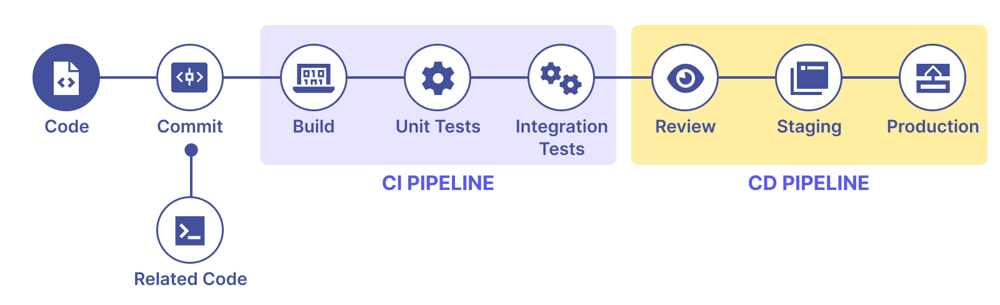

class: center, middle, inverse, small-images

# CI/CD Workshop
### Using GitHub Actions


---

class: inverse

# Important links

You can follow this presentation on your computer from the link below:

<div style="display: flex; justify-content: center; align-items: center; margin: 10rem 0rem;">
<a href="https://niaefeup.github.io/slides/" style="color: white; font-weight:bold; font-size: 2rem;">https://niaefeup.github.io/slides/</a>
</div>


---
class: inverse, center

# Your Host


**Luís Duarte**

L.EIC Finalist

---

class: center, inverse, middle

## Please don't let this be a monologue

#### Feel free to ask any questions anytime

---

### What is CI/CD - an introduction

To put it simply, CI/CD falls under the umbrella of _DevOps_ and combines the practices of 
**continuous integration** and **continuous delivery**. It tries to **automate** much 
of the process of getting new code into production: by **testing**, **building**, **deploying**, and sometimes, provisioning the infrastructure needed.

By automating this boring process that happens every development cycle developers can be more **productive** and also reduce possible **downtime**.

<div style="display: flex; justify-content:center;">

</div>

---

### Difference between CI and CD

- **Continuous integration** automates the process of trying to integrate new code into a main branch of a repository early and automatically to detect possible errors before actually merging the new code into production;

- **Continuous delivery** automates the release process once new changes are merged into the main branch by building the final binary of an application or even by moving to **continuous deployment** that also automates de deployment process (eg.: releasing a new version to Google Play).

**NOTE:** you don't need to do both processes, it depends on the requirements of your project.

<div style="display: flex; justify-content:center;">

</div>

---

### Why should you include a CI/CD system in your project?

- **Improved productivity**: With proper testing, the review time of each change is significantly reduced and also frees up your time from testing your project manually;
- **Fix bugs faster**: When using _CD_ there are smaller software updates so when bugs appear, it's easier to rollback or to pin them down;
- **Reduced Risk**: By having a proper testing suite and by using CI, you can be confident that your changes will work when your code is deployed;
- And many other advantages that are not relevant in this context :) 

Implementing a CI/CD pipeline takes some time, but sometimes you have to lose time now to **gain** time in the future.

---

### "Requirements" when using CI/CD

Having a proper _Git_ process that allows for parallel work and has small meaningful commits is very important for a CI/CD pipeline to be effective, for example:
 - [Gitflow](https://www.atlassian.com/git/tutorials/comparing-workflows/gitflow-workflow)
 - [Trunk based development](https://trunkbaseddevelopment.com/)

It is also essential to have a way to properly **test** your project, by having:
  - Static testing (_linting_, _formatting_, _code analysis_)
  - Unit testing
  - Integration testing

---

### CI/CD pipeline tools

Now that you roughly know what CI/CD is, you can try to implement it. However, trying to do it from scratch is not practical so there are many tools available on the market that try to streamline this process:

- **GitHub Actions** (free for open repositories, "paid" for closed repos when you surpass the limit);
- **GitLab Pipelines** (400 compute minutes for free, paid if you wish to use their runners);
- **Jenkins** (open source, need to bring your infrastructure, harder to learn);
- **CircleCI** (6000 minutes for free, need to upgrade for more)

---

class: inverse, center, middle


## GitHub Actions
### Now we're getting to the fun part ;)

---

### GitHub Actions - Syntax

Every _workflow_ (equivalent to a pipeline) file is based on the YAML configuration syntax (indentation is required, just like Python). _Workflow_ files need to be in the `.github/workflows` folder to work. 

```yaml
name: 'Link Checker: All English'

on:
  workflow_dispatch:
  push:
    branches:
      - main
  pull_request:

jobs:
  check-links:
    runs-on: ${{ fromJSON('["ubuntu-latest", "self-hosted"]')[github.repository == 'github/docs-internal'] }}
    steps:
      - name: Checkout
        uses: actions/checkout@v4

      - name: Setup node
        uses: actions/setup-node@v4
        with:
          node-version: 16.13.x
          cache: npm
...
```

---

```yaml
...
      - name: Install
        run: npm ci

      - name: Gather files changed
        uses: trilom/file-changes-action@a6ca26c14274c33b15e6499323aac178af06ad4b
        with:
          fileOutput: 'json'

      - name: Show files changed
        run: cat $HOME/files.json

      - name: Link check (warnings, changed files)
        run: |
          ./script/rendered-content-link-checker.mjs \
            --language en \
            --max 100 \
            --check-anchors \
            --check-images \
            --verbose \
            --list $HOME/files.json

      - name: Link check (critical, all files)
        run: |
          ./script/rendered-content-link-checker.mjs \
            --language en \
            --exit \
            --verbose \
            --check-images \
            --level critical

```

---

### GitHub Actions - Events

A _workflow_ can be triggered by a plentitude of events:
 - `push` or `pull_request` are the most common (listens for branch pushes or to PR events);
 - `create` or `delete` listen for branch creation/deletion events;
 - `workflow_call`, `workflow_dispatch`, and `workflow_run` can chain together _workflows_ via API or by specifying dependencies;
 - the `schedule` can make a _workflow_ work on a recurrent basis using _cron job_ syntax. 
 - There's a [huge number of events](https://docs.github.com/en/actions/using-workflows/events-that-trigger-workflows) that can automate almost everything ranging from issues, comments or even automating GitHub Projects.

You can automate almost everything in GitHub, the sky is the limit 🚀

---

### GitHub Actions - Events example

```yaml
on:
  push:
    branches: [master, develop]
  workflow_dispatch:
  pull_request:
```

---

### GitHub Actions - Jobs

A _workflow_ run is defined as one or multiple _jobs_, that run in parallel by default unless you define dependencies between them. A _job_ is then defined by one or multiple _steps_ that can be either shell commands or an action from the _GitHub Marketplace_. 

You should also define what type of machine the job will run on, there's multiple types that GitHub can offer:
 - **GitHub-hosted runner** (`macos-latest`, `ubuntu-latest`, `windows-latest`)
 - **Large-runners** (they have fewer limitations compared to the hosted runners for example, they can run Android emulators, etc...)
 - **Self-hosted runners** (you can add your servers into your repository/organization, and have freedom on what you can run)


---

### GitHub Actions - Jobs Example

```yaml
jobs:
  job1:
    name: First job
    runs-on: ubuntu-latest
    steps:
     - run: echo "Hello World!"
  job2: 
    name: Second job
    run-on: macos-latest
    needs: job1
    steps:
     - run: echo "A UNI é a melhor APP"
  job3: 
    name: Third job
    run-on: macos-latest
    if: ${{2 > 1}} #you can call jobs conditionally
    needs:
      - job1
      - job2
    steps:
     - run: echo "Bye!"
```

---

### GitHub Actions - Steps

As said previously _steps_ can be just a **shell command** or you can use community actions from the _GitHub Marketplace_. You can make your Actions by programming them in **Javascript** or by using **Docker containers**. We will not get very in-depth on Action creation but you can consult the [documentation](https://docs.github.com/en/actions/creating-actions) later.

```yaml
jobs:
  job1:
    name: First job
    runs-on: ubuntu-latest
    steps:
     # community action to automatically download the 
     # workflow repo in the correct branch 
     - uses: actions/checkout@v4 
     - run: echo "Hello World!"
    - uses: LuisDuarte1/semver-bump-environment@v1.0.0
      # you can also define IDs to access the 
      # action outputs later
      id: bump-beta-version 
      with:
        current_environment: staging
        production_version: '1.2.0'
        staging_version: '1.2.0-beta.1'
        bump_type: prerelease
```

---

### GitHub Actions - Contexts

Certain types of events define a default _context_ information for that type of event. The most common _context_ is the `github` context, where you can access related metadata about the action itself, or even more importantly the **commit SHA** (`github.sha`) or the **branch** that triggered the _workflow__ (`github.ref`).

There are other contexts you can access:
 - **env** (contains variables set in a workflow, job, or step)
 - **secrets** (contains the values of secrets that are available on that workflow)
 - **matrix** (contains properties defined in a _matrix_)
 - [and many other contexts...](https://docs.github.com/en/actions/learn-github-actions/contexts#about-contexts)

---

### GitHub Actions - Contexts Example

You can access contexts using the expression syntax `${{ <context> }}`:

```yaml
jobs:
  job1:
    runs-on: ubuntu-latest
    steps:
      - run: echo "${{ github.sha }}"
      - run: echo "${{ github.ref }}"
```

You can also use [expression syntax](https://docs.github.com/en/actions/learn-github-actions/expressions) to do comparisons, or to manipulate a given context/variable:

```yaml
jobs:
  job1:
    runs-on: ubuntu-latest
    steps:
      - run: echo "${{ format('GitHub SHA: {0}', github.sha) }}"
      # Example: it will output 'GitHub SHA: 80910396b2df0f055442575dc109f856edfbc24b'
```

---

### GitHub Actions - Variables

You can set variables either at runtime or at the start of the workflow, that might be useful to conditionally branch the _workflow_ or to get information from APIs:

```yaml
# defining variables in a static way
env:
  DAY_OF_WEEK: Wednesday
jobs:
  job1:
    runs-on: ubuntu-latest
    env:
      JOB_ENV: Hello world!
    steps:
      - run: echo "$JOB_ENV It's $DAY_OF_WEEK"
      # It will output  'Hello world! It's Wednesday'
      - run: echo "${{ env.JOB_ENV }} It's ${{ env.DAY_OF_WEEK }}"
      # You can also use contexts to access them. I personally prefer contexts to distinguish between
      #  my variables and shell environment variables
```

---

### GitHub Actions - Setting dynamic variables

As said previously, it might be useful to set variables at runtime (for example, getting certain data from an API), by appending to `$GITHUB_ENV`:

```yaml
jobs:
  job1:
    run-on: ubuntu-latest
    steps:
      - run: echo "JOB_ENV='Hello world!'" >> $GITHUB_ENV
      - run: echo "$JOB_ENV"
      # it will output 'Hello world!"
```

**NOTE:** `JOB_ENV` will only be accessible inside the job `job1`

---

### GitHub Actions - Matrix Strategy

Imagine you need to run tests on all your supported platforms (e.g.: `windows`, `linux`, and `macos`). It's not very productive to duplicate the _workflow_ file 3 times therefore you can use matrices to create _workflow runs_ on a combination of variables:

```yaml
jobs:
  example_matrix:
    strategy:
      matrix:
        version: [10, 12, 14]
        os: [ubuntu-latest, windows-latest]
    runs-on: ${{ matrix.os }}
    steps:
      - uses: actions/setup-node@v4
        with:
          node-version: ${{ matrix.version }}
```

The matrix strategy will create **all combinations** of the variables (in this case this run will have 6 different configurations). This has a maximum of 256 combinations.

---

### GitHub Actions - Secrets

_Secrets_ allow you to have _workflows_ that can handle **sensitive** information (e.g.: API keys, private keys, etc...). You can only read secrets that you **explicitly** include. You should avoid passing _secrets_ between processes and jobs in your _workflow_ because you might be vulnerable to a **supply-chain attack** (like the xz incident). 

You should pass secrets using the **with** keyword in Actions or printing them on **STDIN** of a process. If you wish to pass it as an argument you must do it indirectly:

```yaml

jobs:
  job1:
    env:
      SUPER_DUPER_SECRET_KEY: "${{ secrets.SUPER_DUPER_SECRET_KEY }}"
    steps:
      - run: |
        echo "$SUPER_DUPER_SECRET_KEY" | some-process
  job2:
    steps:
      run: echo "$SUPER_DUPER_SECRET_KEY" 
    # will return nothing because it's scoped to the first job
```

---

### GitHub Actions - Caching

It might be useful to speed up the _workflow_ by caching dependencies between workflow jobs. This improves developer experience but also can reduce costs (if running on paid runners):

  - `setup-python`, `setup-node`, `setup-java`, `setup-ruby`, etc... These are community actions that set the right environment for your desired language but also can cache dependencies automatically;
  - `cache` action is a generalized caching action that takes a list of paths and caches them with an explicit `key` for a cache entry. [Documentation](https://github.com/actions/cache).

```yaml
jobs:
  job1:
    steps:
      - name: Cache Files
        uses: actions/cache@v4
        id: cache-files
        with:
          path:
            - foo/
            - bar
          # caches by OS but also caches by current git ref
          key: ${{ runner.os }}-${{ github.ref }}
      - if: steps.cache-primes.outputs.cache-hit != 'true'
        run: ./create-files.sh
```

---

### GitHub Actions - Artifacts

You sometimes wish to store files after a _job_/_workflow_ has been completed (e.g.: you have a workflow that builds an application but, you need the output to another workflow that deploys the new version).

This is different from caching because caching is used when something is not changed often. However, artifacts are used when you want to save files like binaries or build logs. These are persisted, by default, for 90 days.

```yaml
jobs:
  job1:
    steps:
      - name: Upload final apk
        uses: actions/upload-artifact@v4
        with:
          name: final-apk-build
          path: output/output.apk
  job2:
    needs: job1
    steps:
      - name: Download a .apk
        uses: actions/download-artifact@v4
        with:
          name: final-apk-build
```

---

### Examples from NIAEFEUP

Sometimes the best way to learn is by looking at how the community implements CI/CD, these are some of our examples:

- [UNI workflows](https://github.com/NIAEFEUP/uni/tree/develop/.github/workflows)
- [New Website frontend workflows](https://github.com/NIAEFEUP/website-niaefeup-frontend/tree/develop/.github/workflows)
- [New Website backend workflows](https://github.com/NIAEFEUP/website-niaefeup-backend/tree/develop/.github/workflows)

---

class: inverse, center, middle

# Hands-on
### I hope that wasn't too overwhelming 😅

---

### The objective

Let's imagine you've recently entered a company that develops a Flutter application, CineScope (completely not my ESOF project) however they have no CI/CD processes and they would like you to implement it.

You should have:
 - A CI pipeline that runs the linter, the formatter, and finally, the unit tests. It should run on every PR but also every push to the main branch;
 - A CD pipeline that builds the final application as an APK and creates a GitHub Release for it.

---

### How to

You should create a new repository that is a template of this repo:

<div style="display:flex; flex-direction: column; justify-content: space-between; height:15rem">
  <div style="display:flex; justify-content: center">
    <a href="https://github.com/NIAEFEUP/workshop-ci-24-template">https://github.com/NIAEFEUP/workshop-ci-24-template</a>
  </div>


  <div style="display:flex; justify-content: center">
    
  </div>
</div>

**NOTE:** you should create it as a public repository because this way you don't waste your precious free minutes.

---

### Developing locally

You can use [act](https://github.com/nektos/act), which is a tool that allows you to run GitHub Action _workflows_ locally using _docker_. However, this is not 100% accurate and some things might not work on the GitHub runners.

I recommend creating a new branch for testing and committing and pushing every change. However, you might not want to have too many commits on your PR so you can amend the last commit and force push it:

```sh
git commit -a --amend && git push --force
```

---

### Tips
You might not know Flutter, so here are the important commands to do the 3 tasks with them:

```sh
# format command
dart format . --set-exit-if-changed
```

```sh
# lint command
flutter analyze
```

```sh
# release build apk
flutter build apk
```

---

class: inverse, middle, center

# Thank you!
## Any questions?