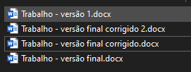
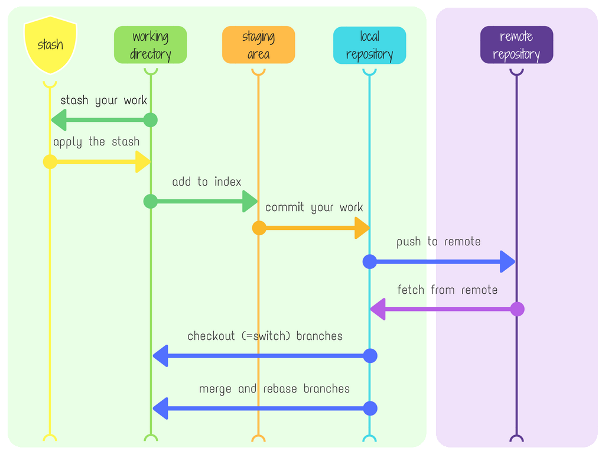
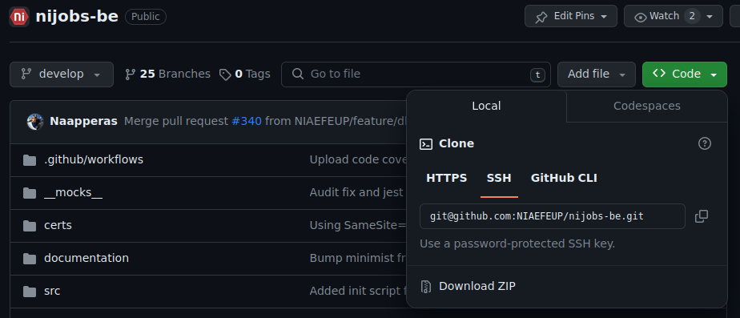
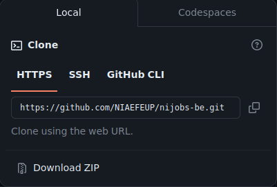
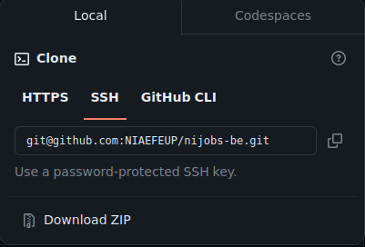
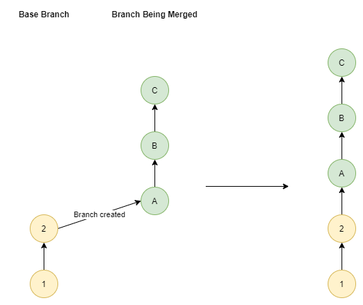
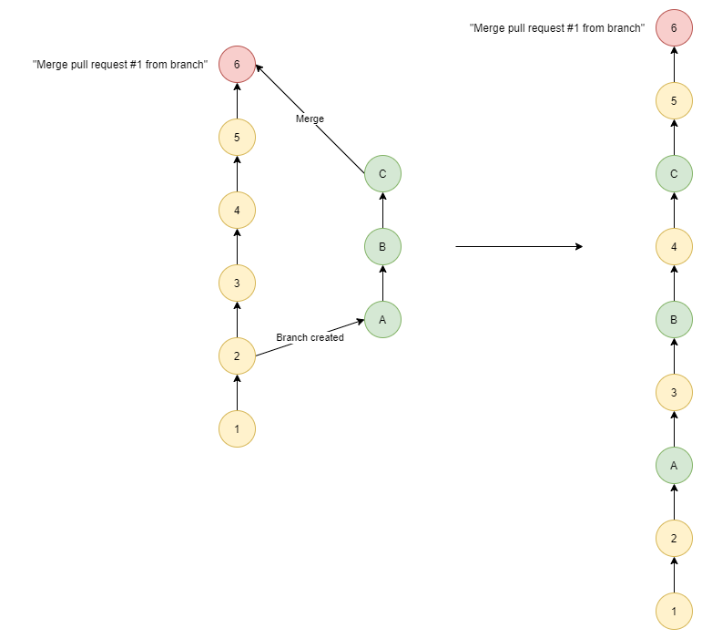
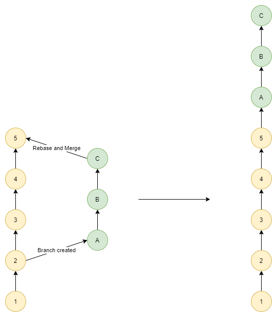
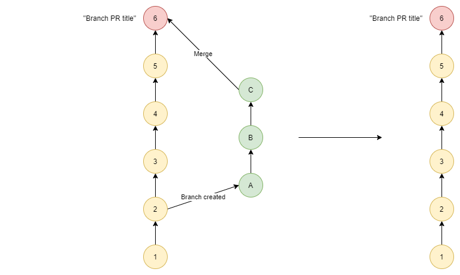

class: center, middle, inverse, small-images

# Git - Workshop Interno

---


class: inverse

# Num projeto...

Vocês escrevem código e querem partilhar esse código com os restantes membros do vosso grupo em que estão. Ou então querem escrever código mas manter um registo de todas as alterações que foram fazendo ao longo do tempo.

Podem _zippar_ o vosso código e mandar para os vossos colegas, ou então criam várias pastas no vosso computador, cada uma delas com uma versão diferente do vosso código.



---


class: center, middle, inverse

# O problema

---


class: inverse

# O problema é...

Que isto é demasido trabalho para um projeto em que o foco é escrever código, e não é prático andar a trocar ficheiros _zip_ com código dos vossos colegas ou guardar todas as alterações que fazem em separado (rapidamente ficavam sem espaço no disco). A quantidade de ficheiros que iam trocar vai aumentar exponencialmente com o número de pessoas no vosso projeto.

A solução é...

---


class: center, middle, inverse

# _Version Control_

---


class: inverse

# O que é _Version Control_?

Um _Version Control System_ (VCS) é um sistema que permite registar mudanças no código ou em ficheiros de um projeto de maneira organizada e o mais automatizada possível.

Existem vários programas que tentam resolver este problema: 
- Git (o que vamos explorar)
- Subversion (ou SVN)
- Mercurial

Apesar de não ser estritamente necessário, normalmente existe um servidor central que guarda o código de todos os membros do projeto, e que serve como ponto de sincronização entre todos os membros do projeto.

---


class: inverse

# O que é Git?

Git é um _Version Control System_, feito por Linus Torvalds originalmente para auxiliar no desenvolvimento do kernel do Linux, e foi lançado no dia 7 de abril de 2005. É o sistema de _version control_ mais usado no mundo, e é o que vamos usar neste workshop.

---


class: inverse

# Como instalar Git?

Se estiverem a usar Linux, muito provavelmente vai estar diretamente no vosso package manager: 
```bash
sudo apt install git
sudo pacman -S git
sudo dnf install git
```
Se estiverem no Windows (😢), podem fazer download de um instalador em [https://git-scm.com/download/win](https://git-scm.com/download/win)

---


class: inverse, center, middle

# Como é que o Git funciona? 

---


class: inverse

### Repositórios

A base de trabalho do Git é o **repositório**. Um repositório é uma pasta que contêm todos os ficheiros do vosso projeto, e o histórico de todas as alterações que foram feitas a esses ficheiros desde que o repositório foi iniciado.

Para o fazer, devem executar o comando
```bash
git init
```

Se quiserem criar o vosso respositório numa pasta que não aquela onde estão, podem executar o comando
```bash
git init <nome da pasta>
```
e o resultado vai ser semelhante.

---

class: inverse

### Repositórios - Hands-on

Numa pasta à vossa escolha, executem o comando
```bash
git init
```

Este comando cria uma sub-pasta `.git` dentro da pasta onde o comando foi executado. Esta sub-pasta contém todos os ficheiros necessários para o Git funcionar.

---


class: inverse

### *Stages*

No Git existe uma noção de **stages**. Um stage é uma "área" em que as alterações que fazem ficam para serem utilizadas depois.



???

Começar com a **working directory**, depois passar para o **staging** area, e depois para o **repository**.

Por fim mencionar a **stash**.

---


class: inverse

### *Stages* - Working Directory

A primeira ***stage*** da qual se deve falar é a **working directory**.

É aqui que todas as mudanças que vocês efetuam ao vosso código existem. Basicamente contém todas as alterações **novas** que vocês fizeram no repositório, sejam estas mudanças num ficheiro, a criação de um ficheiro novo ou até mesmo a remoção de um ficheiro.

Quaisquer alterações que vocês façam ao vosso código, vão aparecer aqui. Contudo, estas ainda não vão ser guardadas no repositório.

---


class: inverse

### *Stages* - Working Directory (Hands-on)

Depois de termos o repositório criado com `git init` (relembrar slides anteriores), criamos um ficheiro `hello_world.txt`.
Ao fazermos `git status` devemos obter o seguinte resultado:

```bash
On branch main

No commits yet

Untracked files:
  (use "git add <file>..." to include in what will be committed)
        hello_world.txt

nothing added to commit but untracked files present (use "git add" to track)
```

Aqui temos indicação do branch em que estamos atualmente (a ser falado mais à frente) e que existe um ficheiro que é considerado "desconhecido" para o `git` - normal visto que acabámos de o criar.

Como referido anteriormente, uma vez que o `git` desconhece o ficheiro `hello_world.txt`, este existe na **working directory**. Para o podermos incluir no repositorio, temos de o adicionar à **staging area**.

---


class: inverse

### *Stages* - Staging Area

A **staging area** é uma área onde o Git guarda todas as alterações que vocês fizeram ao vosso código, e que vocês querem que sejam guardadas no repositório.

Podem pensar nisto como uma "área de preparação" para o repositório: aqui vocês escolhem quais as alterações que querem que sejam guardadas no repositório, e quais as alterações que não querem que sejam guardadas.

---


class: inverse

### *Stages* - Staging Area (Hands-on 1/2)

Para adicionar ficheiros à **staging area** deve-se usar o comando:
```bash
git add <path para o ficheiro> [<path para o ficheiro> ...]
```

Se quisermos adicionar todos os ficheiros modificados ou *untracked* na pasta atual e nos seus filhos podemos fazer:
```bash
git add .
```

Se quisermos adicionar todos os ficheiros modificados ou *untracked* no repositorio podemos fazer:
```bash
git add -A
```

---

class: inverse

### *Stages* - Staging Area (Hands-on 2/2)

Vamos então adicionar o ficheiro `hello_world.txt` à **staging area**:
```bash
git add hello_world.txt
```

Ao fazer `git status` obtemos:
```bash
On branch main

No commits yet

Changes to be committed:
  (use "git rm --cached <file>..." to unstage)
        new file:   hello_world.txt
```
Ou seja podemos concluir que o `hello_world.txt` está na **staging area** e pronto para ser adicionado ao repositório num *commit*.

---


class: inverse

### *Stages* - *Repository*

Podem pensar no repositório em si como uma coleção de _commits_.

Um _commit_ é essencialmente um _snapshot_, uma versão do vosso repositório num dado instante. Cada _commit_ contém todas as alterações que foram feitas ao vosso repositório desde o _commit_ que o precede.

Depois do repositório, este é o conceito mais importante a ter em conta. 

Cada commit contém informação sobre:
- o seu autor;
- a data em que foi criado;
- uma mensagem descritiva das alterações presentes no commit;
- outros metadados;
  
Por fim, o commit inclui as alterações que vocês fizeram.

---


class: inverse

### *Stages* - *Repository* (Hands-on)

Para adicionar as alterações que estão na **staging area** ao repositório, devem executar o comando:
```bash
git commit -m "<mensagem>"
```

A mensagem deve ser uma descrição curta do que foi feito neste _commit_. Todos os commits **têm** que ter uma mensagem. Se não passarem uma mensagem ao comando, este abre o vosso editor de texto preferido para escreverem a mensagem.

Se voltarem a executar o comando `git status` vão ver que a **working directory** está limpa, e que não existem alterações na **staging area**:
```bash
On branch main
...

nothing to commit, working tree clean
```

---


class: inverse

### *Stages* - *Repository* (Hands-on - Extra 1/2)

#### Menos um comando

Se todos as alterações que vocês quiserem adicionar num *commit* fizerem parte de ficheiros que o `git` já conhece, podem criar um _commit_ a partir da **working directory** com o comando:
```bash
git commit -a -m "<mensagem>"
```
Assim, têm que escrever menos um comando. Uma vez mais, isto só funciona com ficheiros que o `git` já conhece.

#### Assinar commits

Se tiverem configurado uma par de chaves GPG, podem assinar os vossos _commits_ com o comando:
```bash
git commit -S -m "<mensagem>"
```

Qualquer serviço ou pessoa que tente verificar a autenticidade do vosso _commit_ vai conseguir ver que foram vocês que o fizeram, dado que partilhem a chave pública associada à chave privada usada para assinar o commit.

---


class: inverse

### *Stages* - *Repository* (Hands-on - Extra 2/2)

Se quiserem ver o histórico de _commits_ do vosso repositório, podem executar o comando:
```bash
git log
```

Isto vai mostrar-vos uma lista de todos os _commits_ que foram feitos ao vosso repositório, com a mensagem de o(s) autor(es) de cada _commit_, entre outras informações.

Uma vez que este comando gera muito texto, existe uma opção que permite ver o histórico de _commits_ de uma forma mais compacta:
```bash
git log --oneline
```

---

class: inverse

### *Stages* - *Stash*

Existe ainda outra área especial do *git* chamada a *stash*. A ideia é que vocês podem ter alterações feitas ao vosso repositório às quais ainda não deram *commit* (e por isso encontram-se na *working directory*) mas precisam de as descartar temporariamente: ora porque precisam de mudar de branch ou por outro motivo qualquer.

Normalmente vocês teriam que fazer um *commit* para se assegurarem que as vossas alterações são guardadas antes de fazer outra ação qualquer, mas muitas vezes o próprio *git* pode queixar-se por haver *commits* novos (e por isso gerar conflitos).

Com o *stash*, têm a opção de guardar estas alterações sem as perderem e sem criarem um nvo *commit*. Deste modo, podem trabalhar noutra coisa qualquer e quando terminarem retomam as alterações que tinham antes.

---

class: inverse

### *Stages* - *Stash* (Hands-On 1/2)

Para guardarem alterações que tenham na *stash*, basta executarem o seguinte comando:
```bash
git stash
```

Isto vai guardar **todas** as alterações que tenham atualmente num item da *stash*.

Para retomarem estas alterações, usem o comando:
```bash
git stash pop
```

Por vezes querem só guardar um unico ficheiro na *stash*, para isso:
```bash
git stash push <path para o ficheiro>
```

---

class: inverse

### *Stages* - *Stash* (Hands-On 2/2)

Para esquecerem uma alteração que guardaram na *stash*:
```bash
git stash drop <referencia ao item da stash>
```

Para verem todos os items de stash que têm:
```bash
git stash list
```

---

class: inverse

### *Stages* - _Wrap Up_

Vimos assim como criar repositórios e como criar *commits* nos repositórios a partir das alterações que fazemos neste.

Contudo, o nosso repositório ainda só existe localmente nos nossos computadores.

É para isto que serve um *Git server*: este serviço atua como localização central para armazenarem o vosso código de forma rápida, eficaz e, acima de tudo, **colaborativa**.

Vamos ver como a seguir.

???

se calhar meter branches locais primeiro e depois explicar remotes?

---

class: inverse

### *Remotes*

Um *remote* é apenas um servidor que permite sincronizar as alterações que vocês fazem a um dado repositório.

Cada repositório tem uma lista de *remotes* associados e cada um destes tem que ter um identificador que o distinga dos restantes. O caso mais comum é haver apenas um único *remote* por repositório, geralmente denominado por `origin`.

Por repositório, associa-se um dado *remote* a uma ação que se possa fazer remotamente, nomeadamente ***push*** e ***fetch***. Apesar de se poder fazer estas associações individualmente, o mais comum é associar o *remote origin* tanto ao ***push*** e ao ***fetch***.

Existem duas maneiras de associar um *remote* a um repositório local: manualmente configurar o *remote* ou **clonar** um repositório.

Existem dois métodos de usar um *remote*, **HTTPS** e **SSH**, que serão falados mais à frente.

---

class: inverse

### *Remotes* - Hands On (Configuração Manual)

Se já tiverem um repositório configurado localmente, podem associar um dado remote usando o comando:
```bash
git remote add <nome do remote> <URL do remote>
```

O comportamento *default* deste comando é associar o dado remote tanto à ação de ***push*** como à ação de ***fetch***.

Usando o comando:
```bash
git remote
```
podem ver os identificadores de todos os *remotes* que adicionaram.

Se quiserem obter mais informação, devem usar a flag `-v`:
```bash
git remote -v
```
que vos dará informação sobre cada *remote* e as ações associadas a esse *remote*.

---

class: inverse

### *Remotes* - Hands On (Clonar)

Por outro lado, se virem na internet (por exemplo no Github) um repositório que queiram ter localmente e ao qual queiram contribir, podem **clonar** o repositório para o vosso computador usando o seguinte comando:
```bash
git clone <URL do remote>
```

Se pretenderem clonar o vosso repositório para uma pasta que não a atual, podem fazê-lo da seginte forma:
```bash
git clone <URL do remote> <nome da pasta>
```

Uma vez mais, se exectarem o comando `git remote` vão ver que têm um remote configurado.

---

class: inverse

### *Remotes* - Extra

> Como no NI usamos o Github, este exemplo é sobre um dos nossos repositórios no Github. Deverá ser semelhante noutros serviços, como Gitlab ou Bitbucket, mas convém ter as diferenças em conta

No Github, para terem acesso ao URL de um *remote*, devem aceder à pagina de um repositório, carregar no botão `Code` e escolher o método que preferem para usar o *remote*.



---
class: inverse

### *Remotes* - SSH _vs_ HTTPS

Como referido anteriormente, existem 2 métodos para se usar um servidor de *git* remoto: **SSH** (*Secure Shell*) e **HTTPS**.

Apesar de, atualmente, o método mais recomendado ser **SSH**, cada um tem os seus prós e contras, os quais vão ser explorados de seguida.

<div style="display: inline-flex; gap: 1em; width: 100%; justify-content: center; padding-top: 3em;">
  
  
</div>

---

class: inverse

### *Remotes* - HTTPS

- Não necessita configuração, sendo mais simples para certas ações simples (clonar um repositório público);
- Firewalls restritas não conseguem bloquear o trafego;

> Por motivos de segurança, o Github agora requer um _PAT_ (Personal Access Token) como autenticação ao invés de uma password. Para todos os efeitos é só uma password que vocês usam para ações _dentro_ do Github que vos dá certas permissões para certas ações.

---

class: inverse

### *Remotes* - SSH

- Necessita sempre de configuração (mas é um **one-time** effort);
- Recomendado para interações que necessitam de autenticação (ex: um **push**);
- É mais seguro que HTTPS e não requer que o utilizador se autentique em todas as interações.
- Facilita o processo de assinar commits visto este ser quase idêntico (chaves GPG, usadas para assinar os *commits*, não diferem muito das chaves SSH, usadas para establecer ligações a servidores remotos de *git*).
- Se perderem as chaves que têm na vossa máquina local vão ter que reconfigurar os acessos por SSH.

---

class: inverse

### *Remotes* - SSH _vs_ HTTPS - *Wrap Up*

Para sumariar:

- HTTPS não necessita de configurações adicionais mas é menos seguro que SSH, algo que o GitHub teve em conta e por isso é-vos requerido que apresente um _Personal Access Token_ em todos os acessos por HTTPS.
- SSH necessita da partilha prévia de uma chave pública mas esse processo apenas precisa de ser feito uma única vez, após o qual todos os acessos que fizerem pelo _git_ estarão seguros através de SSH. Tem o bónus de não ser necessário autenticarem-se todas as vezes que acedem ao GitHub.

A nossa recomendação é configurarem o acesso por SSH visto ser um processo que apenas têm que efetuar uma única vez e salva-vos dores de cabeça no futuro.

---

class: inverse, center, middle

## E agora?


---

class: inverse

### E agora

Agora vocês estão não só prontos para usar o *git* nos vossos computadores como também para guardar as vossas alterações num servidor remoto.

Contudo, raramente na vossa vida vão estar sozinhos a trabalhar num projeto. Como é que garantem que o vosso trabalho não interfere com o trabalho dos vossos colegas?

É aqui que entram...

---

class: inverse, middle, center

## *Branches*

---

class: inverse

### *Branches*

Um *branch* é, na sua essência, apenas um nome que vocês dão a um conjunto de *commits* que logicamente fazem sentido estar agrupados e a um apontador para o *commit* mais recente neste conjunto. Este apontador é chamado a "*HEAD* do branch".

Na prática, o uso que se dá a *branches* é a possibilidade de ter um ambiente próprio para se trabalhar numa funcionalidade sem impactar quer outras possíveis linhas de trabalho que vocês possam ter nas vossas máqinas quer o trabalho dos vossos colegas.

Na realidade, o próprio *git* requer que vocês estejam sempre num *branch* para poderem trabalhar. Por *default* vocês começam no *branch* ***master*** ou ***main***.
> Isto nem sempre é verdade, podem estar a ver um commit *detached*, mas estes são *read-only* apenas e não são assim tão frequentes quanto isso. Convém só ter em conta que existe essa possibilidade.

---

class: inverse

### *Branches* - *Hands On* (1/3)

Para verem o branch em que se encontram atualmente, basta executarem o comando:
```bash
git branch
```

cujo *output* deverá ser algo do género:
```bash
git-internal-workshop
master
```

Este output inclui todos os *branches* que vocês visitaram (não necessariamente todos os branches)

> O *branch* em que estiverem no momento da execução do comando vai aparecer com uma cor diferente no terminal se este o suportar.

Se quiserem ver todos os branches que existem no repositório, usem a flag `a`:
```bash
git branch -a
```

---

class: inverse

### *Branches* - *Hands On* (2/3)

Para criar um *branch* novo, usa-se o comando:
```bash
git branch <nome do novo branch>
```

Isto vai criar um *branch* novo com o nome que lhe derem **a partir do *branch* atual em que estão**. Isto significa que os *branches* todos que existem num repositório foram todos criados a partir de outros *branches*, fazendo uma espécie de "árvore".
> Não é bem assim, como veremos mais à frente, apenas se fez a analogia para ajudar a formar uma imagem mental.

Para apagarem um *branch*:
```bash
# para apagar um branch apenas após ter sido merged (a falar depois)
git branch -d <nome do branch> 

# para apagar um branch mesmo que este não tenha sido ainda merged
git branch -D <nome do branch> 
```

---

class: inverse

### *Branches* - *Hands On* (3/3)

Para mudarem de *branch*, existem vários comandos disponíveis.

O comando original era o `git checkout`:
```bash
git checkout <nome do branch>
```

Contudo, este comando incluia demasiadas funcionalidades, pelo que se criou o comando mais especializado `git switch`:
```bash
git switch <nome do branch>
```

Ambos os comandos pressupõem que o *branch* para onde se quer mudar já existe. Contudo, podem criar um branch e mudar para ele num só comando:
```bash
git checkout -b <nome do novo branch>

git switch -c <nome do branch>
```

---

class: inverse

### *Branches* - *Wrap Up*

Vimos como criar, apagar e mover para outros *branches*, mas o que fazer com isto?

Quando estão num *branch*, os *commits* que fizerem ficam nesse *branch*. Isto pode ser verificado se fizerem um *commit* num *branch*, mudarem de *branch* e executarem `git log`: o *commit* que acabaram de fazer não aparece. 😱

Isto é uma das ferramentas mais importantes que têm ao vosso dispor quando trabalham num projeto colaborativo. É desta maneira que garantem que o vosso trabalho está isolado do trabalho dos vossos colegas, contribuindo para a **paralelização do trabalho** de um projeto.

Mas eventualmente vocês querem que o código no qual vocês trabalharam faça parte do código "a sério" do projeto.

Isto é conseguido com um processo chamado...

---

class: inverse, middle, center

## *Merge*

---

class: inverse

### *Merge*

Um *merge* é o processo de juntar dois *branches* diferentes de modo a que os *commits* de um façam também parte do outro.

Anteriormente vimos que criar branches cria uma espécie de "árvore" como forma de ajudar a visualizar a organização de um repositório, deixando no entanto a nota de que havia mais a falar sobre o assunto: é o *merge*.

Se criar um *branch* causa uma "divergência" no repositório, o *merge* é o inverso, isto é, provoca uma "convergência".

Existem vários tipos diferentes de *merges* que se podem efetuar mas os principais são:
- *Fast-forward*
- *Three-way merge* (o *merge* normal)
- *Squash & merge*
- *Rebase & merge*

---

class: inverse

### *Merge* - *Fast-forward*

Um *fast-forward* é o tipo mais simples de *merge* que acontece quando, após criarmos um branch, trabalharmos nele e quisermos dar *merge*, não houve nenhuma alteração efetuada ao *branch* base.

Relembrar que um *branch* é identificado por um apontador para o *commit* mais recente. Se não houver nenhumas alterações no *branch* base diz-se que temos uma "história linear", como demonstrado pela figura abaixo.

<div style="display: inline-flex; width: 100%; justify-content: center;">
  
</div>

---

class: inverse

### *Merge* - "Three-Way Merge"

O *git* executa um *three-way merge* quando houve alterações ao *branch* base desde que um *branch* filho foi criado. É um nome complicado que raramente vão ter que saber mas convém perceber o funcionamente doeste método.

Chama-se *three-way merge* porque o git internamente usa 3 commits diferentes para efetuar o *merge*:
- a *HEAD* do *branch* base
- a *HEAD* do *branch* filho
- o *commit* onde o *branch* filho se separou do *branch* base

No final do processo, é criado um *commit* novo, chamado *merge commit*, que sinaliza na história do *git* que ocorrou um *merge* entre dois branches naquele ponto.

Convém notar que este processo, ao contrário do que acontece com um *fast-forward*, pode levar a conflitos, que vão ser explorados mais à frente.

---

class: inverse

### *Merge* - "Three-Way Merge"

<div style="display: inline-flex; width: 100%; justify-content: center;">
  
</div>

---

class: inverse

### *Merge* - "Rebase and merge"

Um `rebase` serve para alterar a base de um *branch*, efetivamente "modificando" o momento na história do vosso repositório onde o branch foi criado.

Isto leva a uma perda de informação contextual sobre o *branch*. Contudo, ao linearizarmos a história do *branch* permitimos ao *git* efetar um *fast-forward*, pelo que esta opção é bastantes vezes utilizada.

Fica ao vosso encargo perceber e aplicar o que é que a vossa equipa decidiu ser a opção mais adequada ao projeto em que estão inseridos.

---

class: inverse

### *Merge* - "Rebase and merge"

<div style="display: inline-flex; width: 100%; justify-content: center;">
  
</div>

---

class: inverse

### *Merge* - "Rebase"

Para fazerem *rebase* de um *branch* sobre outro, têm que efetuar o comando:
```bash
# têm que garantir que estão no branch "filho"
git rebase <nome do novo branch base>
```

Este processo também pode gerar conflitos, uma vez que o *git*, no processo do *rebase*, tem que tentar juntar histórias **possivelmente** divergentes.

De modo a facilitar o processo de `rebase`, existe uma opção que torna o comando **interativo** e que vos permite fazer o conhecido ***rebase* interativo**:
```bash
# têm que garantir que estão no branch "filho"
git -i rebase <nome do novo branch base>
```

---

class: inverse

### *Merge* - "Squash and merge"

Um *squash* de um *branch* basicamente comprime todos os *commits* efetuados nesse *branch* num só *commit*.

Esta opção deixa a vossa *commit history* bastante limpa mas há perda de informação contextual sobre os diversos *branches*.

Pessoalmente não sei quem use esta opção mas existe.

<div style="display: inline-flex; width: 100%; justify-content: center;">
  
</div>

???

Vale a pena falar disto? 

---

class: inverse

### Outros comandos

*Git* é uma ferramenta extremamente versátil, e os comandos que vos mostrámos são apenas a ponta do *iceberg*.

Outros comandos que possam ser interessantes de saber são:

```bash
# Cria um commit novo que apaga as alterações do commit anterior
git revert 

# Permite apagar commits
git reset <ref do commit> 

# Permite pegar em qualquer commit e
# aplicá-lo na branch em que estamos atualmente
git cherry-pick <ref do commit>... 

# Permite ver as diferenças entre 2 quaisquer commits. 
# Normalmente usado com a HEAD
git diff <ref do commit1> <ref do commit2>

# Permite criar submodulos do git,
# um bocado como criar um monorepo.
git submodule
```

---

class: inverse

# *Git* e GitHub no NI

No NI usamos _git_ para todas as situações do dia-a-dia. Contudo, como vimos e como já falámos, não temos nenuhum servidor de _git_ no NI e por isso usamos o GitHub.

Uma das coisas mais importantes de se saber no GitHub é como utilizar a funcionalidade dos **Pull Requests (PR's)**.

Como o próprio nome indica, um **Pull Request** é simplesmente um "pedido" que fazemos para dar merge de uma _branch_, normalmente controlada por nós, noutra _branch_, normalmente a _branch_ principal do projeto (nem sempre).

Isto pressupõe algumas coisas, a mais importante delas é **vocês terem um _branch_ separado com as vossas alterações**.

---

class: inverse

## *Git* e GitHub no NI

Não complica muito mais para além disto: 
- Há uma funcionalidade tipo "fórum" onde o vosso código pode ser revisto e podem ter que realizar alterações ao mesmo.
- Qualquer *push* que façam para um _branch_ é imediatamente refletido no PR.
- Quando tudo estiver em ordem, o vosso PR é aprovado
- Quando aprovado (e passar os *checks* todos, ver workshop de GitHub Actions e CI), podem escolher como dar merge:
- - Rebase and Merge
- - Squashe and Merge
- - Normal Merge

---

class: inverse, center, middle

# Conclusão

Apesar de ter sido muito conteúdo, esperamos que tenham ficado a entender melhor o que é o *git* enquanto ferramenta de trabalho e como esta pode ser útil no vosso dia a dia enquanto developers.