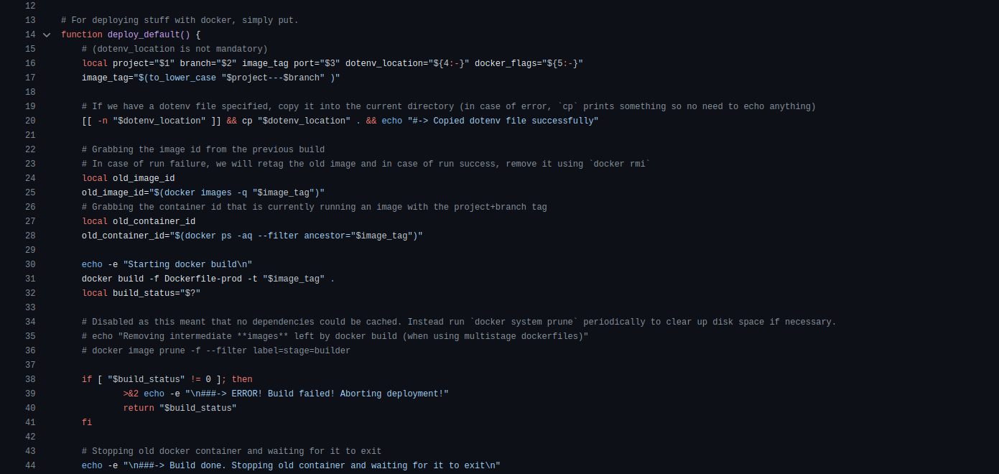
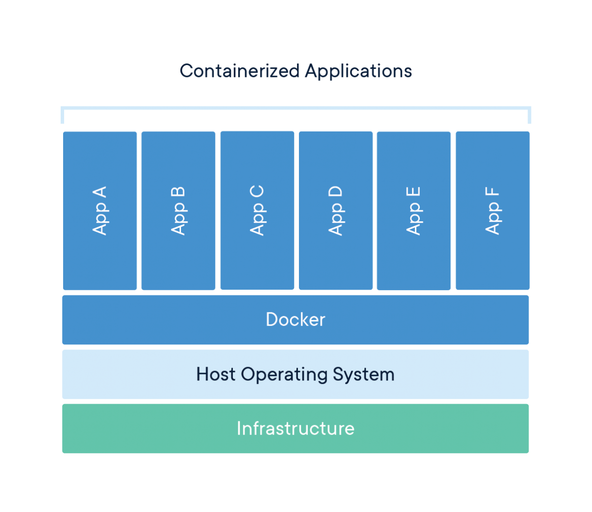
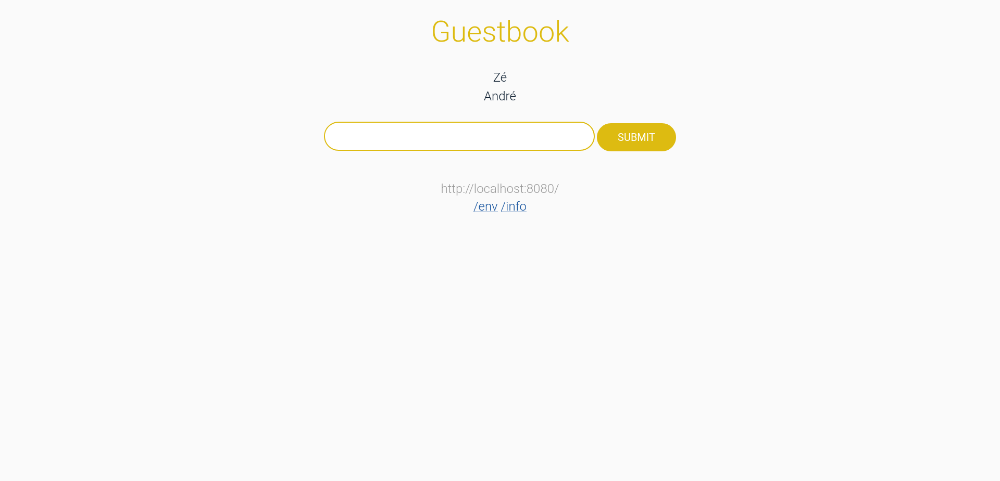
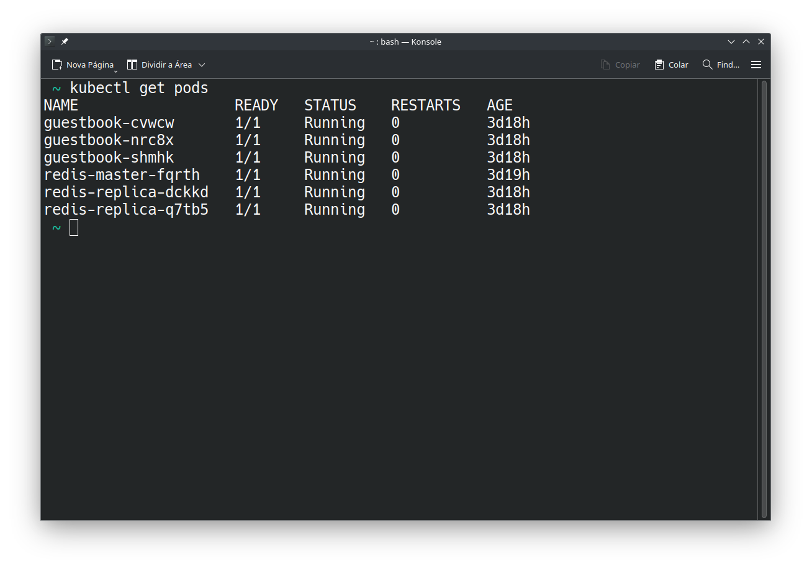
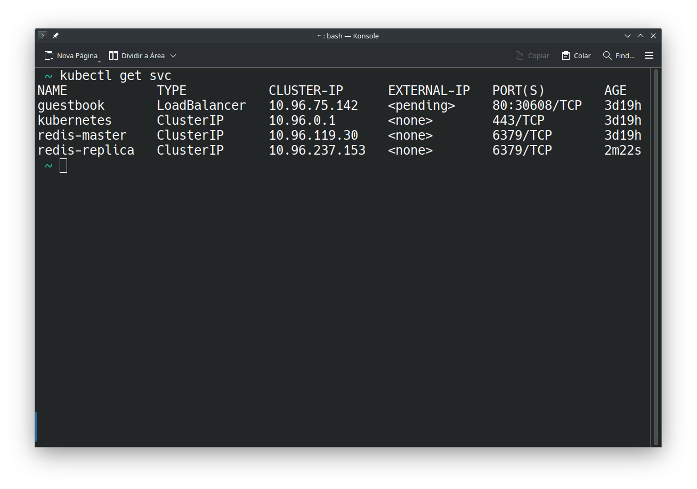
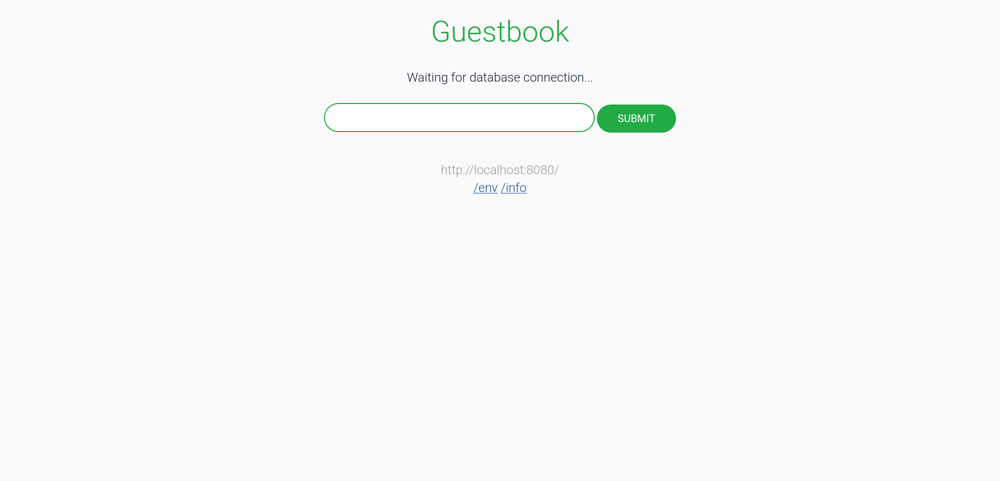
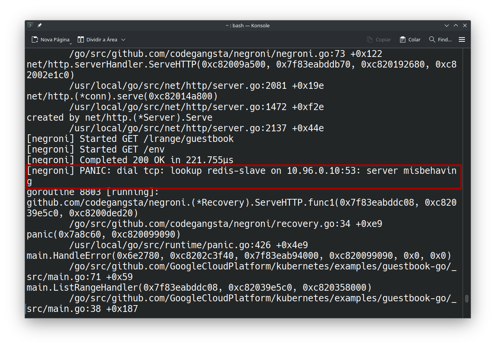
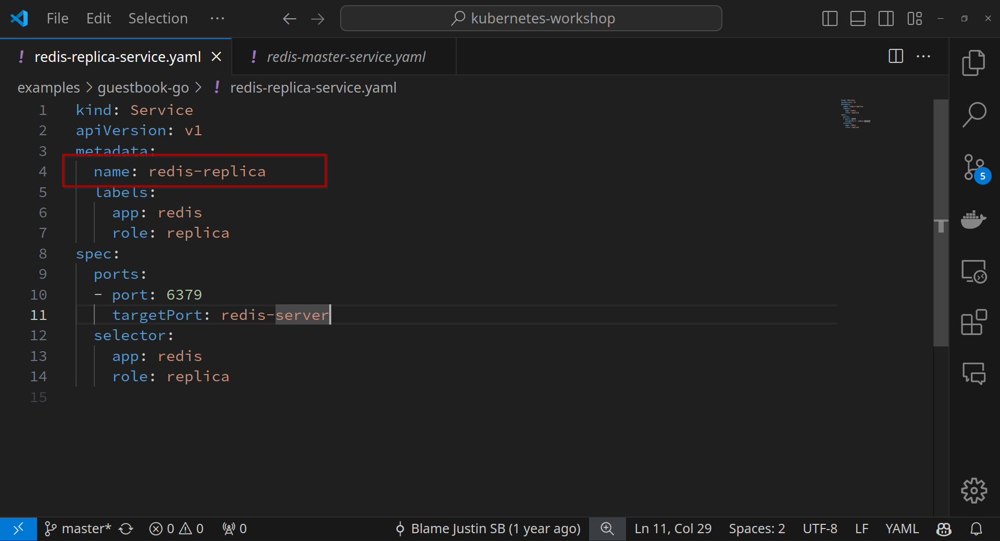
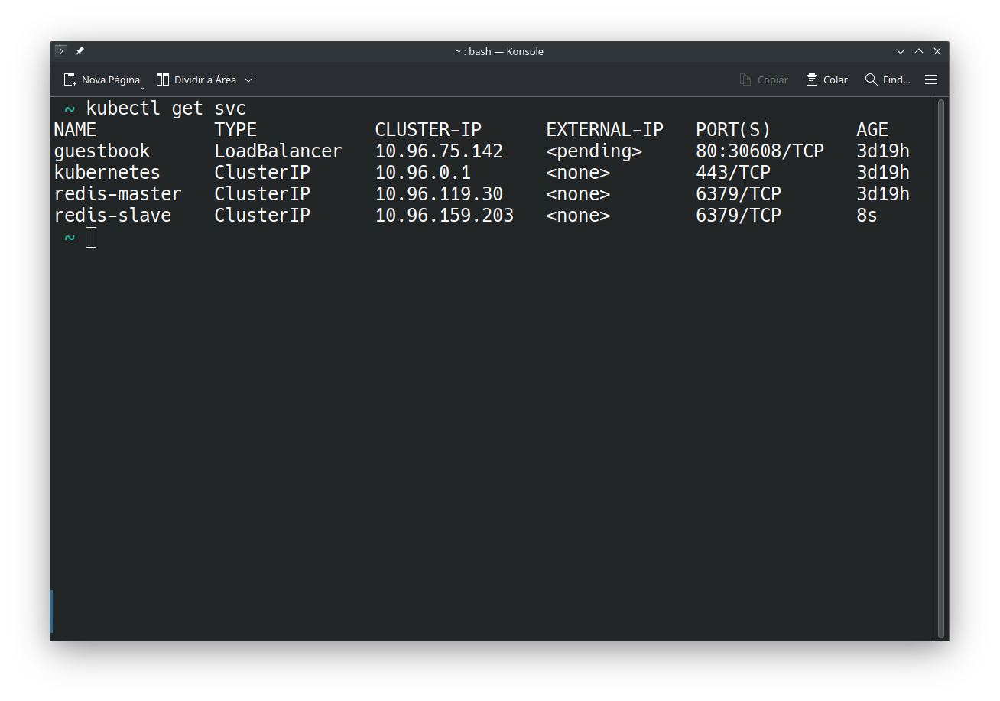

class: center, middle, inverse, small-images

# Kubernetes Workshop

### A gentle introduction to application deployment and orchestration 

<div style="display: flex; justify-content: center; margin-top: 3em; align-items: center; gap: 1em;">

<div style="font-size: 2.5em; padding-inline: 0.5em;">❤️</div>


</div>

---

class: inverse

# Important links

This presentation is available online from the link below:

<div style="display: flex; justify-content: center; align-items: center; margin: 10rem 0rem;">
<a href="https://niaefeup.github.io/slides/kubernetes-workshop" style="color: white; font-weight:bold; font-size: 2rem; text-align:center;">https://niaefeup.github.io/slides/kubernetes-workshop</a>
</div>

---

class: center, middle, inverse

### Your host


**José Costa**

M.EIC Finalist

<div style="display: flex; justify-content: center; align-items: center;">
<a href="https://github.com/Sirze01">

</a>
</div>

---

class: inverse

### Agenda

- Introduction to application deployment
  - A brief history lesson
  - The advent of containers
  - The need for orchestration
  - How does application deployment relate to CI/CD and DevOps?
- Kubernetes basic concepts
  - Architecture and main components
  - Pods, Workloads, Services and Ingresses, etc.
  - Networking overview
  - Kubernetes in the cloud vs bare-metal
- Hands-on: Deploying a guestbook app

---
class: inverse

# Hands-on prequisites
If you want to prepare things beforehand, you will need:

- A container engine such as [Docker](https://www.docker.com/)
- [`kind`](https://kind.sigs.k8s.io/docs/user/quick-start/), a Kubernetes-in-Docker tool
- A clone of the [Kubernetes examples repo](https://github.com/kubernetes/examples)
- [`kubectl`](https://kubernetes.io/docs/tasks/tools/#kubectl), a command to interact with your Kubernetes cluster 

Don't worry if you can't prepare these things beforehand, we will guide you through the process during the hands-on portion.

---
class: center, middle, inverse

## Please don't let this be a monologue

#### Ask questions whenever you want

---

class: center, middle, inverse
# Introduction to application deployment

---

class: center, middle, inverse
## A brief history lesson

---

### A brief history lesson
#### In the beginning
- Applications were deployed on physical servers
- Each application was installed on top of the OS
- Dependencies were hard to manage and conflicts were common
- Little to no isolation between applications
- Scalability was hard to achieve and tighly coupled to the hardware

This represents the **bare metal** era.

---

### A brief history lesson
#### Leveraging virtualization
- The physical hardware runs a hypervisor, capable of creating virtual machines, providing OS-level isolation
- High availability can be achieved by clustering multiple physical servers
- Each VM runs its own OS and applications, with its own set of dependencies
- Scalability is easier to achieve, as VMs can be easily cloned and moved around
- However, VMs are still heavy and slow to boot, resulting in wasted resources

AWS EC2 instances are an example of a service providing this type of hosting.
More info: https://www.ibm.com/topics/iaas

---

### A brief history lesson
#### Preparing environments and launching applications
What deployments looked like:
- Ad-hoc bash scripts to install dependencies and start the application


A excerpt from the old service deployment system at NIAEFEUP, [niployments](https://github.com/NIAEFEUP/niployments)


---

class: center, middle, inverse
# The advent of containers

---

### The advent of containers
#### What are containers?
- Containers are a way to package applications and their dependencies in a single unit. 
- Behave as a lightweight and portable environment for the applications they package.
- Containers are isolated from each other and from the host system. Through the container runtime (e.g. Docker, containerd, cri-o), they can be run on any machine that has the runtime installed. The runtime deals with all the calls to the host OS, abstracting the underlying system.
<div style="display:flex; justify-content:center;">

</div>

---

### The advent of containers
#### What are containers?

<div style="display:flex; justify-content:center;">

</div>

Containers allowed for better application packaging by providing a simple way of ensuring all dependencies are installed and configured correctly, making it easier to move applications between environments and ensring they run the same way everywhere.

More info:
- In the Docker workshop (2022): https://niaefeup.github.io/slides/docker-workshop/Docker%20workshop_juliane_marubayashi.pdf
- Kubernetes docs: https://kubernetes.io/docs/concepts/overview/

---

### The advent of containers
#### What are image registries?

Containers are built from images. These images are built using a Dockerfile, which contains the instructions to build the image. Images can be stored in a registry, which can be public or private.

Registries enable easy sharing of images between developers and teams, and can be used to store images for CI/CD pipelines. Not only that but your computer also has a local registry to keep track of the images you have downloaded and to make it easier to build containers from them.

Some examples of registries are Docker Hub, Google Container Registry, and GitHub Container Registry.

---

class: center, middle, inverse
## The need for orchestration

---

### The need for orchestration
#### The common modern application


---

### The need for orchestration
#### Modern application requirements

- Multiple services, each with its own dependencies (Microservices, providing responsability isolation and team autonomy)

- Multiple programming languages and frameworks with different requirements

- Pre-packaged software (e.g. databases, caches, etc.) that needs to be deployed alongside the application

- Configuration for each service, such as environment variables, secrets, etc.

- Inter-service communication, load balancing, and service discovery

- Scalability, high availability and performance requirements

- Monitoring, logging, and alerting

More info on modern app architectures: https://github.com/nginxinc/kic-reference-architectures (Also a good way for getting a cluster up and running with some common cool services)

---

### The need for orchestration
#### Achieving the impossible

**Orchestration** is the process of coordinating the automated configuration, management, and deployment of systems and software. 

In the context of microservices, orchestration is the process of managing the lifecycle of containers, ensuring they are running, healthy, and available.

Seems a simple concept, but when you have hundreds of services to manage it easily becomes a burden.

Seems like a lot of work, right? That's where **Kubernetes** comes in.

---

class: center, middle, inverse
## How does application deployment relate to CI/CD and DevOps?

---

### How does application deployment relate to DevOps and CI/CD?
#### CI/CD
From the definitions [(taken from the GitHub Actions workshop)](https://niaefeup.github.io/slides/gh-actions-workshop/#6):
- Continuous integration automates the process of trying to integrate new code into a main branch of a repository early and automatically to detect possible errors before actually merging the new code into production;

- Continuous delivery automates the release process once new changes are merged into the main branch by building the final binary of an application or even by moving to continuous deployment that also automates de deployment process (eg.: releasing a new version to Google Play).

We can see that Kubernetes can be used to automate the deployment process, making it easier to deploy new versions of the application and to scale it as needed, which is a key part of the CI/CD pipeline and ensuring applications fullfil their requirements.

Not only that but Kubernetes can also be used to automate the testing process, by providing a flexible environment to run tests in parallel and to ensure the application is working as expected.

---

### How does application deployment relate to DevOps and CI/CD?
#### DevOps
According to the definition provided by (Len Bass, Ingo Weber, and Liming Zhu), according to [Wikipedia](https://en.wikipedia.org/wiki/DevOps):
- DevOps is a set of practices that combines software development (Dev) and IT operations (Ops). It aims to shorten the systems development life cycle and provide continuous delivery with high software quality.

Apart from the CI/CD practices alredy mentioned, the configuration repeatability and centralized control provided by Kubernetes can help ensure that the development and operations teams are aligned and that the applications are deployed in a consistent way, reducing the risk of errors and ensuring that the applications are running as expected.

Not only that but the observability and monitoring tools that can be used with Kubernetes can help the teams to understand how the applications are behaving and to identify possible issues before they become a problem.

---

class: center, middle, inverse
# Kubernetes basic concepts
## (Finally, right?)

---

class: center, middle, inverse
## Architecture and main components

---

### Architecture and main components
#### Architecture overview

<div style="display:flex; justify-content:center;">

</div>

---

### Architecture and main components
#### The control plane
The control plane is where services responsible by managing the Kubernetes system are deployed. Machines running these services are called **master nodes**. By having multiple master nodes, the system can be made more resilient to failures, with the control plane services being distributed among the nodes.

The main components of the control plane are:

- **API Server**: The entry point for all the REST commands used to interact with the cluster.
- **Scheduler**: Responsible for distributing workloads across the nodes.
- **Controller Manager**: Responsible for monitoring the state of the cluster and making changes to ensure the desired state is achieved.
- **etcd**: A distributed key-value store used to store the cluster state.

---

### Architecture and main components
#### The workers
The worker nodes are the machines where the containers are run. They are managed by the control plane and are responsible for running the containers, monitoring their health, and reporting back to the control plane.

The main components of the worker nodes:
- **Kubelet**: The agent that runs on each node and is responsible for ensuring that the containers are running in a pod.
- **Kube-proxy**: A network proxy that runs on each node and is responsible for forwarding traffic to the correct container.
- **Container runtime**: The software that is responsible for running the containers. Docker is the most common runtime, but others like containerd and cri-o are also supported.

---

class: center, middle, inverse
## Pods, Workloads, Services and Ingresses, etc.

---

### Pods, Workloads, Services and Ingresses, etc.
#### Pods
A pod is the smallest deployable unit in Kubernetes. It represents a single instance of a running process in the cluster. Pods can contain one or more containers, which are run together in the same node and network namespace. They can share storage.

#### Workloads
Workloads are higher-level abstractions that represent a set of pods. They can be used to manage the lifecycle of the pods, such as scaling them up or down, rolling out new versions, etc. Some examples of workloads are Deployments, StatefulSets, and DaemonSets.

---

### Pods, Workloads, Services and Ingresses, etc.
#### Services
Services are used to expose pods to the network. They provide a stable internal IP address and DNS name for the pods, and can be used to load balance traffic between them. There are different types of services, such as ClusterIP, NodePort, and LoadBalancer.

#### Ingresses
Ingresses are used to expose services to the outside world. They provide a way to route external traffic to the services inside the cluster. Ingresses can be configured with rules to route traffic based on the host, path, etc.

---

### Pods, Workloads, Services and Ingresses, etc.
#### Etc.

- **ConfigMaps and Secrets**: Used to store configuration data and sensitive information, such as passwords and API keys. They can be mounted as volumes in the pods or used as environment variables. **Note**: Secrets are stored in etcd, but are not encrypted by default.

- **Volumes**: Used to provide persistent storage to the pods. There are different types of volumes, such as emptyDir, hostPath, and persistentVolumeClaim.

Many other Kubernetes (k8s) resources can be used to manage the cluster and the applications running in it. The [official documentation](https://kubernetes.io/docs/concepts/) is a good place to start learning about them.

We migh be using some later :)

---

class: center, middle, inverse
## Networking overview

---

### Networking overview
<div style="display:flex; justify-content:center;">

</div>

In a cloud managed Kubernetes cluster, the networking is usually handled by the cloud provider. In a managed cluster, the provider handles the networking for you by setting upa cloud load balancer which routes traffic to the correct service from an external endpoint.

In a bare-metal cluster, you will need to configure the networking yourself to achieve the same behaviour.

---


class: center, middle, inverse
## Kubernetes in the cloud vs bare-metal

---

### Kubernetes in the cloud vs bare-metal
When using a managed Kubernetes instance, provided by a 3<sup>rd</sup> party, like Google Cloud, AWS, or Azure, the provider takes care of the infrastructure, such as the control plane, worker nodes, and networking. This makes it easier to get started with Kubernetes, as you don't need to worry about setting up the cluster yourself.

Using bare metal deployments can have some performance advantages over some managed clusters.

This happens because some cloud providers use virtual machines to run the worker nodes, which can introduce some overhead.

---

class: center, middle, inverse
# Hands-on: Deploying a guestbook app
---

### Hands-on: Deploying a guestbook app
#### What we will do
> Deploy a guestbook app using Kubernetes

What we will get: 

<div style="display:flex; justify-content:center;">

</div>

**The guestbook app** - People comming to your website can leave their name so you can know who came to visit.

---

### Hands-on: Deploying a guestbook app
#### Getting the example

1. Clone the repository
  ```sh
  git git@github.com:kubernetes/examples.git
  ```

2. Go to the correct commit
  ```sh
  cd examples
  git checkout 171b8cb775c56f27c87361dd46dfa5d94d6282c0
  ```

3. Go the the golang guestbook example
  ```sh
  cd examples/guestbook-go
  ```

---

#### Deploying the guestbook app
##### Deploying redis

Redis is used as a database for the guestbook app.

One redis's features is high availability, which can be achieved by using a master-replica configuration.

To do so we will deploy a redis master and 2 redis replicas.

1. Deploy the redis master controller
  
  Analysing this manifest we can see that it is using a `ReplicationController` to manage the redis master pod. A `ReplicationController` ensures that a specified number of pod replicas are running at any given time. In this case, we are specifying that we want only one replica of the redis master pod. 

  Usually, we would use a `Deployment` to manage the pods, but for this example, we are using a `ReplicationController` to keep things simple, as a `Deployment` is a higer-level abstraction og the `ReplicationController`.

  ```sh
  kubectl apply -f redis-master-deployment.yaml
  ```

---
#### Deploying the guestbook app
##### Deploying redis

1. Deploy the redis master controller

  You can check the status of the pod by running:
  ```sh
  kubectl get pods
  ```

  It can take a few seconds for the pod to be created and started. The image for the redis master container is being pulled from the k8s registry, so it may take some time to download the image.

2. Deploy the redis master service

  The redis master service is used to expose the redis master pod to the guestbook app. It creates a stable internal IP address and DNS name for the redis master pod.

  ```sh
  kubectl apply -f redis-master-service.yaml
  ```

---
#### Deploying the guestbook app
##### Deploying redis


<ol start="3">
  <li>
    <p>Deploying the redis replicas controller</p>
    <p>Analogous to the redis master controller, the redis replicas controller is used to manage the redis replicas pods. In this case, we are specifying that we want 2 replicas of the redis replicas pod.</p>
    <code class="sh hljs bash remark-code">
      <div class="remark-code-line">kubectl apply <span class="hljs-_">-f</span> redis-replica-controller.yaml</div>
    </code>
  </li>
  <li>
    <p>Deploying the redis replicas service</p>
    <p>In the same way the same way we did for the redis master service, we will deploy the redis replicas service to expose the redis replicas pods to the guestbook app.</p>
    <code class="sh hljs bash remark-code">
      <div class="remark-code-line">kubectl apply <span class="hljs-_">-f</span> redis-replica-service.yaml</div>
    </code>
  </li>
</ol>


---
#### Deploying the guestbook app
##### Deploying the guestbook app

<ol start="5">
  <li>
    <p>Deploying the guestbook app controller</p>
    <p>Here we are deploying the guestbook app controller, which is used to manage the guestbook app pods. In this case, we are specifying that we want 3 replicas of the guestbook app pod. This ensures that we have enough replicas of the guestbook application to handle a lot of external client requests</p>
    <code class="sh hljs bash remark-code">
      <div class="remark-code-line">kubectl apply <span class="hljs-_">-f</span> guestbook-controller.yaml</div>
    </code>
  </li>
  <li>
    <p>Deploying the guestbook service</p>
    <p>Similarly to the redis services, we will deploy the guestbook service to expose the guestbook app pods to the network. Unlike the other services that use the <code class="remark-inline-code">ClusterIP</code> service type (the default type, used if unspecified), this service uses the <code class="remark-inline-code">LoadBalancer</code> type which also exposes it to the outside world.</p>
    </p>
    <code class="sh hljs bash remark-code">
      <div class="remark-code-line">kubectl apply <span class="hljs-_">-f</span> guestbook-service.yaml</div>
    </code>
  </li>
</ol>

---
#### Deploying the guestbook app
##### Accessing the guestbook
<ol start="7">
<li>
    <p>Ensuring all pods are running</p>
    <p>Let's make sure the <code class="remark-inline-code">ReplicaController</code>(s) were able to start all the requested pods. Run this:</p>
    <code class="sh hljs bash remark-code">
      <div class="remark-code-line">kubectl get pods</div>
    </code>
    <p>And you should get a redis master, 2 redis replicas and 3 guestbook pods:</p>
    <div style="display:flex; justify-content:center;">
      
    </div>
  </li>
  
</ol>

---
#### Deploying the guestbook app
##### Accessing the guestbook
<ol start="8">
<li>
    <p>Ensuring all services exist</p>
    <p>Now we need to ensure all the <code class="remark-inline-code">Service</code>(s) were were created and are exposing our pods to the cluster network. Run this:</p>
    <code class="sh hljs bash remark-code">
      <div class="remark-code-line">kubectl get svc</div>
    </code>
    <p>And all the 3 services we creates shoud have a <code class="remark-inline-code">ClusterIP</code> bound to them:</p>
    <div style="display:flex; justify-content:center;">
      
    </div>
    <p>As we are using a local cluster, the <code class="remark-inline-code">LoadBalancer</code> service type is not capable of allocating an external IP for our service.  We can confirm this by checking that the <code class="remark-inline-code">EXTERNAL-IP</code> field reports a <code class="remark-inline-code">&lt;pending&gt;</code> state.</p>
</ol>

---
#### Deploying the guestbook app
##### Accessing the guestbook
<ol start="9">
<li>
    <p>Port-forwarding with <code class="remark-inline-code">kubectl</code></p>
    <p>For simplicity sake we will use the <code class="remark-inline-code">kubectl port-forward</code> functionality to access the guestbook app.</p>
    <code class="sh hljs bash remark-code">
      <div class="remark-code-line">kubectl port-forward svc/guestbook 8080:3000</div>
    </code>
    <p>With this command we are binding the port 8080 of our local machine to the port 3000 of the guestbook service. This way we can access the guestbook app by going to <a href="http://localhost:8080">http://localhost:8080</a> in our browser.</p>
    <p>This works by routing traffic from the local machine through the Kubernetes cluster <code class="remark-inline-code">apiserver</code> used by <code class="remark-inline-code">kubectl</code> to the service we want to access.</p>
  </li>
</ol>

---
#### Deploying the guestbook app
##### Accessing the guestbook
<ol start="10">
<li>
    <p><i>Et voilá</i>?? </p>
    <div style="display:flex; justify-content:center;">
      
    </div>
    <p>It seems that our application can't access our redis database</p>
  </li>
</ol>

---
#### Deploying the guestbook app
##### Debugging the guestbook app

<ol start="11">
  <li>
    <p>Checking the logs</p>
    <p>Let's check the logs of the guestbook service to see if we can find any errors. Run this:</p>
    <code class="sh hljs bash remark-code">
      <div class="remark-code-line">kubectl logs svc/guestbook</div>
    </code>
    <p>You might need to scroll a bit, but you should find a log stating something like this:</p>
    <div style="display:flex; justify-content:center;">
      
    </div>
    <p>Our guestbook app is unable to resolve the name <code class="remark-inline-code">"redis-slave"</code>.</p>
  </li>
</ol>

---
#### Deploying the guestbook app
##### Debugging the guestbook app
<ol start="12">
  <li>
    <p>Checking redis replica service</p>
    <p>We can confirm that the redis replica service is configured with <code class="remark-inline-code">"redis-replica"</code> and not <code class="remark-inline-code">"redis-slave"</code>.</p>
    <div style="display:flex; justify-content:center;">
      
    </div>
    <p>This was most likely done to follow the more inclusive and respectful language guidelines that are being adopted by the tech community and by redis itself, that moved away from the master-slave naming convention to master-replica convention.</p>
    <p>The prebuilt guestbook image we are using for the tutorial hasn't however been updated to reflect these changes.</p>
  </li>
</ol>

---
#### Deploying the guestbook app
##### Debugging the guestbook app
<ol start="13">
  <li>
    <p>Switching to the old convention</p>
    <p>Let's fix this by changing the name of the redis replica service to <code class="remark-inline-code">"redis-slave"</code>. Don't forget to save the changes.</p>
  </li>
  <li>
    <p>Deleting the old replica service</p>
    <p>Despite not being required, as you can have multiple services targeting the same pods, let's go ahead and delete the old redis replica service and create a new one with the correct name. Run this:</p>
    <code class="sh hljs bash remark-code">
      <div class="remark-code-line">kubectl delete svc redis-replica</div>
    </code>
  </li>
  <li>
    <p>Creating the new replica service</p>
    <p>Now let's create the new redis replica service with the correct name. Run this:</p>
    <code class="sh hljs bash remark-code">
      <div class="remark-code-line">kubectl apply -f redis-replica-service.yaml</div>
    </code>
  </li>
</ol>

---
#### Deploying the guestbook app
##### Debugging the guestbook app
<ol start="16">
  <li>
    <p>Checking the service names</p>
    <div style="display:flex; justify-content:center;">
      
    </div>
    <p>The new service was created with the correct name</p>
  </li>
</ol>

---
#### Deploying the guestbook app
##### Debugging the guestbook app

<ol start="17">
<li>
    <p><i>Et voilá!!</i> </p>
    <div style="display:flex; justify-content:center;">
      
    </div>
    <p>Now we can use the app!</p>
  </li>
</ol>

---
## Other resources
- [Mara from NGINX](https://github.com/nginxinc/kic-reference-architectures) and the blogpost ["Mara now running on a workstation near you"](https://www.nginx.com/blog/mara-now-running-on-workstation-near-you/)
- My Networks and systems management course project - [Kubernetes pod autoscaling according to the number of HTTP requests per service](https://github.com/Sirze01/feup-grs-autoscale)
- [K9s](https://k9scli.io/), a terminal UI for interacting with your Kubernetes clusters (a better `kubectl`)
- [Kubernetes docs](https://kubernetes.io/docs/home/) - All the resources to grasp all the standard concepts and components of Kubernetes

---
class: center, middle, inverse, small-images

# Kubernetes Workshop

### A gentle introduction to application deployment and orchestration

#### Thank you for attending!
##### Please anwser our satisfaction survey: [https://forms.gle/WXWKgqd5uEFP2C4K6](https://forms.gle/WXWKgqd5uEFP2C4K6)

<div style="display: flex; justify-content: center; margin-top: 3em; align-items: center; gap: 1em;">

<div style="font-size: 2.5em; padding-inline: 0.5em;">❤️</div>


</div>
