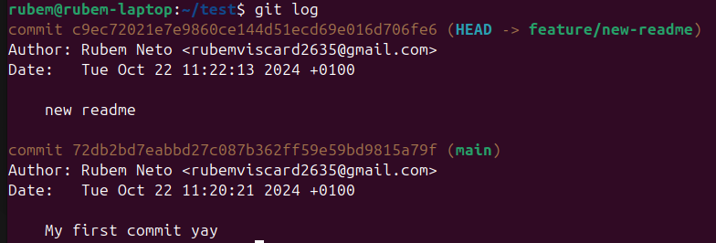

class: center, middle, inverse, small-images

# Workshop de Git

---

class: middle,center,inverse

# Introdução

---

class: middle

# Introdução

Num projeto, vocês escrevem código e querem partilhá-lo com os membros do vosso grupo. Como fariam isso?

Podem usar duas estratégias:
  1. Partilhar os ficheiros diretamente, o que pode causar muitos problemas
  2. Usar algum sistema de controlo de versões (por exemplo o Git)

---

class: center,inverse, middle

# O que é o Git?
---

class: middle

# O que é o Git?

Git é um _Version Control System_ (VCS) que permite registar mudanças em código e outros ficheiros de forma organizada.

É o sistema de _version control_ mais usado no mundo e é o que vamos utilizar nste workshop.

---

class: middle

# Instalar o Git

Se estiverem a usar Linux, muito provavelmente vai estar diretamente no vosso package manager:

```bash
sudo apt install git
sudo pacman -S git
sudo dnf install git
sudo brew install git
```
Se estiverem em Windows, podem utilizar o Git através do WSL (Windows Subsystem for Linux) ou fazer download da bash [diretamente para o Windows](https://git-scm.com/download/win).

---

class: middle

# Configurar o Git

O primeiro passo é configurar o Git de modo a associarem o vosso nome e email aos commits:

```bash
  $ git config --global user.name "Teste" # o vosso nome

  $ git config --global user.email "teste@gmail.com" # o vosso email
```
Posteriormente, podem confirmar que as alterações foram feitas de forma correta:

```bash
  $ git config --global user.name
  > Teste
  $ git config --global user.email 
  > teste@gmail.com
```

---

class: middle

# Git Stages

O Git possui **4 estados** diferentes onde os ficheiros podem estar: *untracked*, *unmodified*, *modified*, e *staged*.
Sendo assim, podemos dividir o projeto de Git em 3 secções: ***Working Directory***, ***Staging Area*** e ***Git Directory***.


---

class: center,inverse, middle

# Criar um repositório

---

class: middle

# Criar um repositório

Um repositório é a base de trabalho do Git, pelo que é necessário iniciar um repositório para começarmos a trabalhar.

```bash
  $ cd <folder-name>

  $ git init # inicializa um repositório do Git

  $ git status # verifica o estado do working directory e da staging area
```
Dentro do diretório que escolheram vai ser criada uma pasta `.git` que vai ser usada para registar todas as alterações realizadas no projeto.

---

class: center,inverse, middle

# Exercício 1 
## (Criar um ficheiro e dar commit nas alterações)

---

class: middle

# Exercício 1 

Este primeiro exercício tem como objetivo familiarizarem-se com os comandos básicos de Git.

Primeiro, criem uma pasta e um repositório:

```bash
$ mkdir git-test
$ cd git-test
$ git init
```

Em seguida, façam alguma alteração dentro do repositório (por exemplo, criem um ficheiro) e verifiquem se as alterações foram registadas pelo Git:

```bash
$ git status
```

---

class: middle

# Exercício 1 

Agora podem adicionar estas alterações à **Staging Area**:

```bash
$ git add <ficheiro> # segue e dá stage a um ficheiro que não esteja a ser seguido (ou apenas stage a um ficheiro modificado)
```

***Nota***: Podem adicionar a flag *--all* ou *-A* para dar *stage* a todos os ficheiros (quer não sejam seguidos, quer tenham apenas sido modificados).

Mais uma vez, vemos que esta operação foi registada pelo git:
```bash
$ git status
```

Com as alterações salvas, podemos dar commit:
```bash
$ git commit -m "My first commit yay"
```

Conseguimos observar o histórico de commits através do comando:
```bash
$ git log
```

---

class: center,inverse, middle

# Branches 

---

class:  middle

# Branches 

Imaginem que estão a escrever um livro e guardam-no numa prateleira. Este livro é o **projeto principal**, no git é conhecido como a **branch "main"**. 

Agora, digamos que vocês têm uma ideia nova ou querem fazer alguns ajustes **sem apagar aquilo que está no livro principal**. 

Para isso, podem fazer uma **cópia** deste livro e começar a trabalhar nesta cópia em paralelo. Esta cópia é uma branch.


---

class:  middle

# Merge Branches 

Depois de termos feito as alterações, temos que substituir o livro principal (branch "main") para a versão com as alterações (branch "cópia"). 

Vamos fazer isso com um **merge**, onde vamos juntar tudo aquilo que está com o **livro principal** e a **nossa cópia**.


---

class: center,inverse, middle

# Rebase

---

class: middle

# Rebase

+ Enquanto estamos a fazer alterações, o repositório remoto pode receber mais commits
+ **Rebase serve para mudar a base dos vossos commits**.
+ O principal objetivo é manter um histórico linear de commits.
+ Para iniciar um rebase, basta executar **git rebase {branch-name}**. Este comando dá rebase da branch atual na branch "branch-name".


---

class: center,inverse, middle

# Git Flow

---

class: middle

# Git Flow 

O git flow é um modelo de trabalho que ajuda muito na organização e desenvolvimento de projetos. Alguns dos principais pontos são:
  + Diferentes categorias de branches **(feature, release, fix, hotfix, refactor)**.
  + Todos os merges são feitos através de **Pull Requests** (a ser falado).
  + Branch principal para o desenvolvimento de features separada da principal **(develop)**.


---
class: center,inverse, middle

# Hands On 2 
## (Criar uma branch e dar merge na branch principal)

---

class: middle

# Hands On 2 

Com o repositório que criámos na tarefa anterior, vamos criar uma nova branch, fazer alterações e dar merge com a branch main.

Começamos por criar uma nova branch:
```bash
git branch feature/new-readme
```

Vamos então mover para esta branch:
```bash
git switch feature/new-readme
```

---

class: middle

# Hands On 2 

Com a nossa nova branch, podemos adicionar aquilo que queremos:
```bash
echo test >> README.md
```

E ver aquilo que fizemos:
```bash
cat README.md
```


---

class: middle

# Hands On 2 

Vamos dar commit ao que fizemos, de forma semelhante ao Hands On anterior:
```bash
git add README.md
git commit -m "new readme"
```

Podemos ver o histórico de commits:
```bash
git log
```



---

class: middle

# Hands On 2 

Finalmente, vamos atualizar a branch principal com aquilo que fizemos através de um merge:
```bash
git switch main
git merge feature/new-readme
```


---

class: center,inverse, middle

# Clone

---

class: middle

# Clone

Como podemos ir atrás de um respositório que está na internet?

Podemos usar o **git clone** para clonar repositórios que estão a ser hosted por serviços como o Github


Existem duas formas de acessar estes repositórios: **SSH ou HTTPS**

---

class: middle

## SSH vs HTTPS

Existem 2 métodos para se usar um servidor de *git* remoto: **SSH** (*Secure Shell*) e **HTTPS**.

Apesar de, atualmente, o método mais recomendado ser **SSH**, cada um tem os seus prós e contras.

<div style="display: inline-flex; gap: 1em; width: 100%; justify-content: center; padding-top: 3em;">
  
  
</div>

---

class: middle

### HTTPS

- Não necessita de configuração, sendo mais simples para certas ações simples (clonar um repositório público).
- Firewalls restritas não conseguem bloquear o tráfego.

> Por motivos de segurança, o Github agora requer um _PAT_ (Personal Access Token) como autenticação ao invés de uma password. Para todos os efeitos é só uma password que vocês usam para ações _dentro_ do Github que vos dá certas permissões para certas ações.

---

class: middle

### SSH

- Necessita sempre de configuração (mas é um **one-time** effort).
- Recomendado para interações que necessitam de autenticação (ex: um **push**)
- É mais seguro que HTTPS e não requer que o utilizador se autentique em todas as interações.
- Se perderem as chaves que têm na vossa máquina local vão ter que reconfigurar os acessos por SSH.


---

class: center,inverse, middle

# Issues

---

class: middle

# Issues

Issues são como uma lista de tarefas ou problemas a serem resolvidos dentro de um projeto. As issues permitem organizar o trabalho, discutir ideias, relatar bugs, etc.

Como funciona o processo de uma issue?
  1. **Abrir uma issue**
  2. **Discussão (Opcional)**
  3. **Atribuir Responsáveis**
  4. **Resolver a issue através de um Pull Request (PR)**
  5. **Fechar a issue**

---

class: center,inverse, middle

# Pull Requests (PR)

---

class: middle

# Pull Requests (PR)

Num projeto, é importante saber se as alterações feitas são válidas ou não. Para isso, mostra-se as alterações para que outras pessoas confiram e, se estiverem de acordo, dão merge na branch principal.

Como funciona um Pull Request?
1. **Fazer alterações (numa branch separada)**
2. **Dar push desta branch para o remote**
3. **Criar o Pull Request**
4. **Outros colaboradores dão review ao código (veremos a seguir)**
5. **Colaboradores aprovam e dão merge**
6. **Fechar o PR**

---

class: middle

# Como criar Pull Rquests

Para criar um pull request e submeter para a branch remota, é preciso seguir os seguintes passos:

```bash
git switch main // ou branch de onde querem basear
git pull
git checkout -b {tipo de branch}/{nome da branch}
git add {ficheiros relevantes mudados}
git commit -m "{nome do commit}"
git push --set-upstream origin {tipo de branch}/{nome da branch}
```

---

class: middle

# Pull Requests != Issues

Pull Requests e issues não são a mesma coisa, mas estão muito relacionados.

Exemplo do **Website da SINF**:

<div class="side-to-side">
    
</div>
---

class: middle

# Pull Requests != Issues

Pull Requests e issues não são a mesma coisa, mas estão muito relacionados.

Exemplo do **Website da SINF**:

<div class="side-to-side">
  
</div>
---

class: center,inverse, middle

# Reviews

---

class: middle

# Reviews

Review são uma parte importante no processo de um pull request. Os colaboradores envolvidos no projeto devem estar atentos a possíveis erros ou sugestões que devem ser feitas.

Reviews contêm comentários, pedidos de mudança e aprovações.
+ **Comentários**: são só comentários, podem ser aplicados a algum pedido de esclarecimento ou alguma sugestão.
+ **Pedidos de mudança (Requested changes)**: algum comentário sobre um erro que precisa de ser resolvido ou qualquer outra coisa que esteja mal.
+ **Aprovações**: Quando todas as alterações parecem estar corretas.

**Para que um PR seja merged, todas as Requested Changes precisam de estar resolvidas.**

---

class: middle

# Como fazer uma Review

Os passos envolvidos numa review são relativamente simples, mas também requerem alguma atenção e conhecimento do que está a ser feito.

Estes processos envolvem:
1. **Olhar o código de forma analítica**
2. **Dar checkout para a branch das mudanças e testar**
3. **Escrever uma review que tenha sugestões claras e que não causem ainda mais confusão**

---

class: center,inverse, middle

# Comandos (e breve explicação)

---


class: middle

# Comandos 

+ **git pull**: atualiza a branch atual com as alterações em remote
+ **git push**: envia alterações locais para o remote
  + **git push force (--force-with-lease)**: Força o envio de mudanças (--force-with-lease não permite alterar commits que não estão em remote)
  + **git push --set-upstream origin {tipo de branch}/{nome do repositório}**: Inicia o stream de commits para uma branch
+ **git commit (-m)**: Captura uma snapshot das alterações atuais (requer uma mensagem)
+ **git log**: Exibe o histórico de commits
  + **git log --oneline**: Exibe o histórico de commits de forma simplificada

---

class: middle

# Comandos 

+ **git status**: informa ficheiros modificados
+ **git clone {url}**: "clona" um repositório de acordo com um link
+ **git switch {mome da branch}**: troca de branches
+ **git reset**: desfaz alterações no repositório
+ **git checkout**: troca de branches e mais
+ **git rebase {nome da branch}**: dá rebase da branch atual noutra
+ **git branch**: criar uma branch
  + **git branch -m**: renomear uma branch
+ **git commit --amend**: permite alterar o nome do último commit ou adicionar/remover ficheiros a esse commit

---

class: center,inverse, middle

# Problemas

---

class: middle

# Desfazer alterações

### Situação 1: Não staged e não committed

Numa situação em que o código foi escrito e ainda não sofreu `git add`, é possível revertê-las com os seguintes comandos:

```bash
$ git checkout -- "file" # undo the changes to a file
```

```bash
$ git reset --hard # discard all changes
```

Obs.: Este comando não funciona para untracked files.

---

class: middle

# Desfazer alterações

### Situação 2: Staged mas não commited 


```bash
$ git reset HEAD "file" # unstage the changes to a file
```

```bash
$ git reset # unstagd all changes
```

Com isso, os ficheiros voltam para a situação 1

---

class: middle

# Desfazer alterações

### Situação 3: Committed mas não pushed

```bash
$ git reset --hard "commit-id"
```

---

class: middle

# Desfazer alterações

## Situação 4: Pushed
Devem evitar o máximo possível estas situações, porque estas alterações vão aparecer no histórico de commits.
```bash
$ git revert "commit-id"
```

---
class: middle

# Git pull pede configuração

Quando fazemos um git pull pela primeira vez dentro de um repositório, é possível que dê o seguinte erro. Isto acontece porque a forma que faze-se pull neste repositório não está configurado. Existem 3 formas diferentes de o configurar:


Podemos também usar ```bash git config --global``` para configurar em todos os repositórios.

---
class: middle

# Git pull resulta em conflitos

Ao tentar dar git pull numa branch, podem aparecer erros ao dar merge na branch local e na branch remota. Estes problemas são chamados conflitos e devem ser resolvidos antes do merge continuar.


---
class: middle

# Git pull resulta em conflitos (como resolver)

1. Precisamos de resolver os conflitos
  + Podemos ver quais são os ficheiros no aviso de erro do merge
2. Abrir o editor de código favorito
3. Eliminar aquilo que não faz sentido
  + Incoming vs. Current Change
+ **git add** em todas as alterações
+ **git commit** (--no-edit)

---

class: middle

# Git pull resulta em conflitos

Exemplo de conflito:


---
class: middle

# Git rebase resulta em conflitos

+ Muito semelhante ao **git pull**
+ Pode acontecer com vários commits, já que estão a percorrer a história commit por commit
+ Fazer as alterações
+ **git add** nas alterações
+ **git rebase continue**
  + git rebase abort para cancelar
+ A resolução dos conflitos é igual a do **git pull**

---
class: middle

# Git push pede git pull

+ Às vezes, quando houver alterações entre o último **git pull** e **git push** é possível que o histórico esteja diferente
+ Para resolver, o git pede para dar pull
+ Deem pull e resolvam os conflitos como fizemos antes

---
class: middle

# Algum reviewer pede rebase numa branch

+ Reviewer pede para dar rebase numa branch
+ Entrem na branch
+ Atualizem a branch principal
  + via "git pull origin main"
  + checkout para a main e depois pull
+ E performem o rebase

---

class: center,inverse, middle

# Final Boss (Hands On 3)

---

class: middle

# Final Boss (Hands On 3) - Instruções

O que vamos fazer?
+ Vamos escrever livros (não livros inteiros)
+ Para isso, temos 5 escolhas diferentes:
  + [1984](https://github.com/rubuy-74/1984-git) 
  + [Diário de um banana](https://github.com/rubuy-74/diario-banana-git)
  + [Pequeno Príncipe (BR >>>>>)](https://github.com/rubuy-74/little-prince-git)
  + [Viagens de Gulliver](https://github.com/rubuy-74/viagens-gulliver-git)
  + [Harry Potter](https://github.com/rubuy-74/harry-potter-git)
+ Cada um destes repositórios tem **10 issues abertas**

---

class: middle

# Final Boss (Hands On 3) - Instruções

+ O processo de implementar a issue funciona da seguinte forma:
  0. **Clonar o projeto** (usar git clone)
  1. **Criar uma branch** (com o nome de acordo com as normas que foram explicadas)
  2. **Dar push nesta branch** (para o respositório remoto)
  3. **Criar um Pull Request**
  4. **Esperar pela Review dos outros participantes**
  5. **Enquanto estiverem à espera, dão review aos PRs abertos nos repositórios**
  6. **Merge no PR, apagar o PR e resolver a Issue** 

---

class: middle

# Final Boss (Hands On 3) - Atenção

+ Podem ver as **tags de cada issue** para determinar o nome da branch (com base no git flow).
+ No PR, atenção ao "Closes #{número da issue}".
+ Se sentirem que não sabem o que fazer, **peçam ajuda**. Não tenham medo.
+ Também há muitos exemplos de Pull Requests nos **nossos projetos**.
+ **Divirtam-se, por favor**.

---

class: middle

# LESGOOOOOOO


