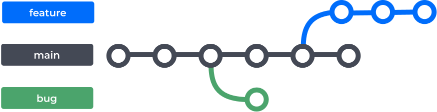
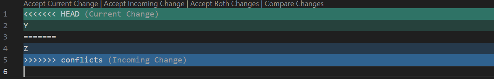
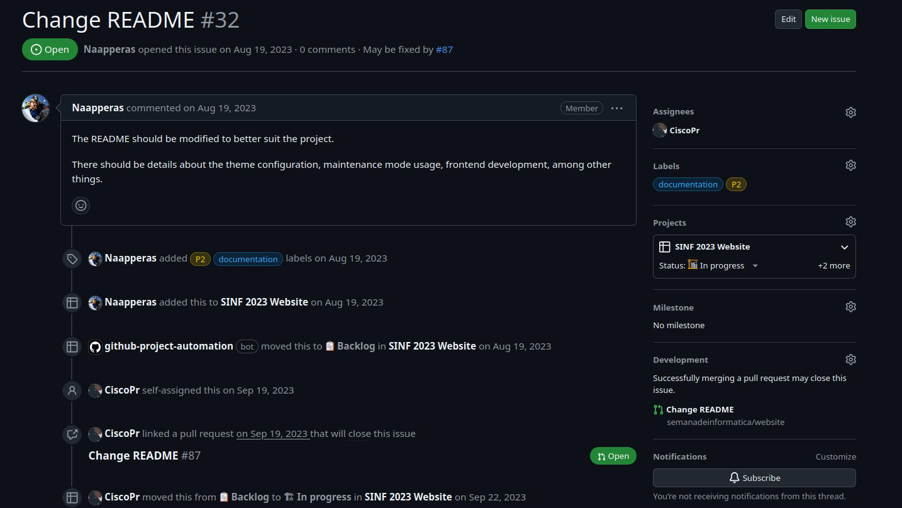
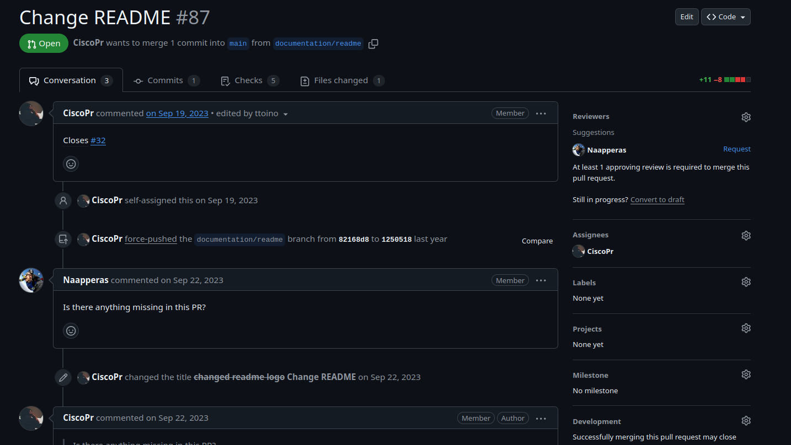

class: center, middle, inverse, small-images

# Workshop de Git

---

class: middle,center,inverse

# Introdução

---

class: middle

# Introdução

Num projeto, vocês escrevem código e querem partilhá-lo com os membros do vosso grupo. Como fariam isso?

Podem usar duas estratégias:
  1. Partilhar os ficheiros diretamente, o que pode causar muitos problemas
  2. Usar algum sistema de controlo de versões (por exemplo o Git)

---

class: center,inverse, middle

# O que é o Git?
---

class: middle

# O que é o Git?

Git é um *Version Control System* (VCS) que permite registar mudanças em código e outros ficheiros de forma organizada.

É o sistema de *version control* mais usado no mundo e é o que iremos utilizar neste workshop.

---

class: middle

# Instalar o Git

Se estiverem a usar Linux, muito provavelmente vai estar diretamente no vosso package manager:

```bash
  sudo apt install git
  sudo pacman -S git
  sudo dnf install git
  sudo brew install git
```
Se estiverem em Windows, podem utilizar o Git através do WSL (Windows Subsystem for Linux) ou fazer download da bash [diretamente para o Windows](https://git-scm.com/download/win).

---

class: middle

# Configurar o Git

O primeiro passo é configurar o Git de modo a **associarem o vosso nome e email aos commits**:

```bash
  $ git config --global user.name "Test" # o vosso nome

  $ git config --global user.email "test@gmail.com" # o vosso email
```
Posteriormente, podem confirmar que as alterações foram feitas de forma correta:

```bash
  $ git config --global user.name
  > Test
  $ git config --global user.email 
  > test@gmail.com
```

---

class: middle

# Git Stages

O Git possui **4 estados** diferentes onde os ficheiros podem estar: *untracked*, *unmodified*, *modified*, e *staged*.
Sendo assim, podemos dividir o projeto de Git em 3 secções: ***Working Directory***, ***Staging Area*** e ***Git Directory***.


---

class: center,inverse, middle

# Criar um repositório

---

class: middle

# Criar um repositório

Um repositório é a **base de trabalho do Git**, pelo que é necessário iniciar um repositório para começarmos a trabalhar.

```bash
  $ cd <folder-name>

  $ git init # inicializa um repositório do Git

  $ git status # verifica o estado do working directory e da staging area
```
Dentro do diretório que escolheram vai ser criada uma pasta `.git` que vai ser usada para registar todas as alterações realizadas no projeto.

---

class: center,inverse, middle

# Exercício 1 
## (Criar um ficheiro e dar commit nas alterações)

---

class: middle

# Exercício 1 

Este primeiro exercício tem como objetivo familiarizarem-se com os comandos básicos de Git.

Primeiro, criem uma pasta e um repositório:

```bash
  $ mkdir git-test

  $ cd git-test

  $ git init
```

Em seguida, façam alguma alteração dentro do repositório (por exemplo, criem um ficheiro) e verifiquem se as alterações foram registadas pelo Git:

```bash
  $ git status
```

---

class: middle

# Exercício 1 

Agora podem adicionar estas alterações à **staging area**:

```bash
  $ git add <file> # segue e dá stage a um ficheiro que não esteja a ser seguido (ou apenas stage a um ficheiro modificado)
```

***Nota***: Podem adicionar a flag `--all` ou `-A` para dar *stage* a todos os ficheiros (quer não sejam seguidos, quer tenham apenas sido modificados).

Depois de verificarmos se a operação foi registada pelo Git, podemos dar commit:

```bash
  $ git status

  $ git commit -m "First commit"

  $ git log # lista o histórico de commits
```

---

class: middle

# Exercício 1 

Posteriormente, podem, por exemplo, remover o ficheiro do working directory:

```bash
  $ git rm <file> # remove o ficheiro e dá stage às alterações

  $ git status

  $ git commit -m "Removed the file"

  $ git log
```

***Nota***: Podem adicionar a flag `--cached` para apenas removerem o ficheiro do repositório do Git (o ficheiro não é eliminado).

---

class: center,inverse, middle

# Branches 

---

class:  middle

# Branches

Se os commits essencialmente representam as diferentes versões de um projeto, as branches funcionam como uma espécie de **apontador para uma versão específica do projeto**.

Cada projeto no Git tem uma branch principal — ***master*** ou ***main***. Se quisermos fazer alterações ao projeto sem eliminar ou alterar aquilo que está na branch principal, podemos fazer uma cópia deste **criando uma nova branch** (utilizando o comando `git branch <name>`).



---

class:  middle

# Merging

Depois de terminarmos de fazer alterações, temos que atualizar a branch principal para a versão mais recente. 

Podemos fazer isto com um **merge**, onde **tudo aquilo que desenvolvemos na branch que foi criada irá ser juntado à branch principal**.


---

class:  middle

# Merging

```bash
  $ git branch testing # cria a branch "testing"

  $ git checkout testing # mudar para a branch "testing"

  $ echo "Testing branches!" > branch.txt

  $ git add branch.txt

  $ git commit -m "Created a second file"

  $ git checkout main # regressar à branch principal

  $ git merge testing # mergir a branch "testing" para a branch principal
```

---

class: center,inverse, middle

# Conflitos

---

class: middle

## Conflitos

**Se alterarmos de formas diferentes em duas branches a mesma secção de um ficheiro**, o Git não vai conseguir dar merge sem gerar um conflito:

```bash
  $ git merge testing-conflict
  > Auto-merging test.txt
  CONFLICT (content): Merge conflict in test.txt
  Automatic merge failed; fix conflicts and then commit the result.
```

Podemos verificar em que ficheiros existem conflitos utilizando `git status`; **para resolver um conflito, precisamos de editar diretamente o ficheiro, dar stage às alterações e commit ao merge**.

---

class: center,inverse, middle

# Exercício 2
## (Resolver um conflito num merge)

---

class: middle

# Exercício 2

Este segundo exercício tem como objetivo compreenderem melhor como resolver um conflito causado por um merge.

Depois de criarem um repositório de teste, criem um ficheiro (`README.md`), adicionem o conteúdo que quiserem e dêem commit na branch principal.

```bash
  $ git add README.md

  $ git commit -m "Initial commit"
```

Em seguida, criem uma nova branch a partir da branch principal; façam uma alteração ao ficheiro `README` e dêem commit novamente.

```bash
  $ git branch conflict # depois de correrem este comando, alterem o README
  
  $ git add README.md

  $ git commit -m "Modified the README file"
```

---

class: middle

# Exercício 2

Em seguida, troquem para a branch que criaram anteriormente, modifiquem o ficheiro `README` e dêem commit às alterações.

```bash
  $ git checkout conflicts # também podem utilizar o comando git switch

  $ git add README.md

  $ git commit -m "Created a conflict"
```

Regressem agora à branch principal e tentem dar merge da branch que criaram; vão verificar que existe um conflito.

```bash
  $ git checkout main

  $ git log --oneline # podem verificar o histórico dos commits
  
  $ git merge conflicts
  > Auto-merging README.md
  CONFLICT (content): Merge conflict in README.md
  Automatic merge failed; fix conflicts and then commit the result.
```

---

class: middle

# Exercício 2

Se consultarem o ficheiro `README`, irão observar algo semelhante a isto:



Tendo isto em conta, podem escolher manter apenas uma das versões (ou a da branch principal ou a da branch que criaram) ou até ambas! 

Após escolherem, dêem stage às alterações e commit ao merge.

```bash
  $ git add README.md

  $ git commit -m "Fixed merge conflicts"

  $ git status # verifiquem se correu tudo bem

  $ git branch -d conflicts # podem utilizar este comando para eliminar a branch que criaram
```

---

class: center,inverse, middle

# Git Ignore

---

class: middle

## Git Ignore

Um ficheiro `.gitignore` especifica **ficheiros que devem ser ignorados pelo Git** (sendo que ficheiros que já sejam seguidos pelo Git não são afetados).

Cada linha do ficheiro `.gitignore` representa um padrão específico:

```.gitignore
  docs/      # todos os ficheiros dentro da pasta docs/ na raiz do projeto
  *.txt      # todos os ficheiros com extensão .txt
```

Normalmente, queremos ignorar ficheiros que não são utilizados no projeto ou que são generados por outro processo (como ficheiros compilados).

---

class: center,inverse, middle

# Remotes

---

class: middle

## Remotes

Um remote é uma **versão do repositório que é *hosted* noutro local**. Existem essencialmente 2 protocolos para nos conectarmos a um repositório de Git remoto: **SSH** (*Secure Shell*) e **HTTPS**.

Atualmente, o método mais recomendado é **SSH**, mas cada um tem os seus prós e contras.

<div style="display: inline-flex; gap: 1em; width: 100%; justify-content: center; padding-top: 3em;">
  
  
</div>

---

class: middle

### HTTPS

- Não necessita de configuração, sendo mais simples para certas ações simples (clonar um repositório público, por exemplo).
- Firewalls restritas não conseguem bloquear o tráfego.

> Por motivos de segurança, o GitHub agora requer um _PAT_ (Personal Access Token) como autenticação, ao invés de uma password. Para todos os efeitos é apenas uma password que usamos para ações *dentro* do GitHub, que nos dá certas permissões para certas ações.

---

class: middle

### SSH

- Necessita sempre de configuração (mas é um ***one-time effort***).
- Recomendado para interações que necessitam de autenticação (por exemplo, um **push**).
- É mais seguro que HTTPS e não requer que o utilizador se autentique em todas as interações.
- Se perdermos as chaves que temos na nossa máquina local, temos que reconfigurar os acessos por SSH.

---

class: center,inverse, middle

# Exercício 3
## (Conectar a um remote)

---

class: middle

# Exercício 3

Este terceiro exercício tem como objetivo compreenderem como se conectarem a um remote (neste caso em particular, do GitHub) utilizando o comando `git clone`, usando tanto SSH como HTTPS.

Em primeiro lugar, temos de [gerar uma chave SSH](https://docs.github.com/en/authentication/connecting-to-github-with-ssh/generating-a-new-ssh-key-and-adding-it-to-the-ssh-agent#generating-a-new-ssh-key) (caso não a tenhamos configurada) para podermos clonar um repositório utilizando o protocolo SSH.

Depois de configurada, podemos clonar [este repositório](https://github.com/aaguiar/live-software) utilizando tanto SSH como HTTPS:

```bash
  $ git clone git@github.com:aaguiar/live-software.git # SSH

  $ git clone https://github.com/aaguiar/live-software.git # HTTPS
```
---

class: center,inverse, middle

# Reverting

---

class: middle

# Reverting

### Situação 1: Nem staged nem committed

Numa situação em que existem alterações mas estas ainda não foram staged (`git add` não foi executado), é possível revertê-las com os seguintes comandos:

```bash
  $ git checkout -- <file> # desfaz as alterações num único ficheiro
```

```bash
  $ git reset --hard # descarta todas as alterações feitas
```

---

class: middle

# Reverting

### Situação 2: Staged, mas não committed 

Numa situação em que existem alterações que foram staged mas não foram committed, é possível removê-las da staging area com os seguintes comandos:

```bash
  $ git reset HEAD <file> # remove da staging area as alterações a um único ficheiro
```

```bash
  $ git reset # remove da staging area as alterações a todos os ficheiros
```

Com estes comandos, os ficheiros são removidos da staging area, mas as alterações feitas são mantidas no working directory.

---

class: middle

# Reverting

### Situação 3: Committed, mas não pushed

Se já demos commit de alterações que queremos reverter, mas estas ainda não foram pushed para um remote, podemos revertê-las encontrando o ID/hash do commit a que queremos regressar (utilizando `git log`) e executando o seguinte comando:

```bash
  $ git reset --hard <commit-id>
```

---

class: middle

# Reverting

## Situação 4: Committed e pushed

Devemos tentar evitar ao máximo reescrever o histórico (público) de commits; por esse motivo, se for necessário reverter alterações que já foram pushed, devemos utilizar o seguinte comando:

```bash
  $ git revert <commit-id>
```


---

class: middle

# Reverting

Adicionalmente, em vez de utilizarmos os hashes dos commits para revertermos alterações, **podemos recorrer a uma notação relativa**, utilizando os símbolos **~** e **^**.
  + `COMMIT^` refere-se ao commit anterior a `COMMIT`.
  + `COMMIT^^` refere-se ao commit anterior a `COMMIT^`.
  + `COMMIT~2` refere-se ao commit que precede o commit anterior a `COMMIT`.

```bash
  $ git reset --hard HEAD^ # reverte o último commit
```


---

class: center,inverse, middle

# Rebase

---

class: middle

# Rebase

+ Enquanto estamos a fazer alterações, o remote pode receber mais commits.
+ **Rebase permite alterar a base dos vossos commits**.
+ O principal objetivo deste comando é manter um histórico linear de commits.
+ Para iniciar um rebase, basta executar `git rebase <branch-name>`; este comando dá rebase da branch atual na branch que especificarmos.


---

class: center,inverse, middle

# Git Flow

---

class: middle

# Git Flow 

O Git Flow é um **modelo de trabalho que ajuda muito na organização e desenvolvimento de projetos** (não sendo, no entanto, o único). Alguns dos principais pontos são:
  + Diferentes categorias de branches (***feature***, ***release***, ***fix***, ***hotfix***, ***refactor***).
  + Todos os merges são feitos através de **Pull Requests** (a ser falado).
  + Branch principal para o desenvolvimento de features separada da principal (***develop***).


O mais importante, no entanto, é que **sejam consistentes na forma como utilizam o Git**!

---

class: center,inverse, middle

# Issues

---

class: middle

# Issues

Issues são como uma lista de tarefas ou problemas a serem resolvidos dentro de um projeto. As issues permitem organizar o trabalho, discutir ideias, relatar bugs, etc.

Como funciona o processo de uma issue?
  1. **Abrir uma issue**
  2. **Discussão (Opcional)**
  3. **Atribuir Responsáveis**
  4. **Resolver a issue através de um Pull Request (PR)**
  5. **Fechar a issue**

---

class: center,inverse, middle

# Pull Requests (PR)

---

class: middle

# Pull Requests (PR)

Num projeto, é importante saber se as alterações feitas são válidas ou não. Para isso, mostra-se as alterações para que outras pessoas confiram e, se estiverem de acordo, dão merge na branch principal.

Como funciona um Pull Request?
1. **Fazer alterações (numa branch separada)**
2. **Dar push desta branch para o remote**
3. **Criar o Pull Request**
4. **Outros colaboradores dão review ao código (veremos a seguir)**
5. **Colaboradores aprovam e dão merge**
6. **Fechar o PR**

---

class: middle

# Como criar Pull Rquests

Para criar um pull request e submeter para a branch remota, é preciso seguir os seguintes passos:

```bash
git switch main // ou branch de onde querem basear
git pull
git checkout -b {tipo de branch}/{nome da branch}
git add {ficheiros relevantes mudados}
git commit -m "{nome do commit}"
git push --set-upstream origin {tipo de branch}/{nome da branch}
```

---

class: middle

# Pull Requests != Issues

Pull Requests e issues não são a mesma coisa, mas estão muito relacionados.

Exemplo do **Website da SINF**:

<div class="side-to-side">
    
</div>
---

class: middle

# Pull Requests != Issues

Pull Requests e issues não são a mesma coisa, mas estão muito relacionados.

Exemplo do **Website da SINF**:

<div class="side-to-side">
  
</div>
---

class: center,inverse, middle

# Reviews

---

class: middle

# Reviews

Review são uma parte importante no processo de um pull request. Os colaboradores envolvidos no projeto devem estar atentos a possíveis erros ou sugestões que devem ser feitas.

Reviews contêm comentários, pedidos de mudança e aprovações.
+ **Comentários**: são só comentários, podem ser aplicados a algum pedido de esclarecimento ou alguma sugestão.
+ **Pedidos de mudança (Requested changes)**: algum comentário sobre um erro que precisa de ser resolvido ou qualquer outra coisa que esteja mal.
+ **Aprovações**: Quando todas as alterações parecem estar corretas.

**Para que um PR seja merged, todas as Requested Changes precisam de estar resolvidas.**

---

class: middle

# Como fazer uma Review

Os passos envolvidos numa review são relativamente simples, mas também requerem alguma atenção e conhecimento do que está a ser feito.

Estes processos envolvem:
1. **Olhar o código de forma analítica**
2. **Dar checkout para a branch das mudanças e testar**
3. **Escrever uma review que tenha sugestões claras e que não causem ainda mais confusão**

---

class: center,inverse, middle

# Comandos (e breve explicação)

---


class: middle

# Comandos 

+ **git pull**: atualiza a branch atual com as alterações em remote
+ **git push**: envia alterações locais para o remote
  + **git push force (--force-with-lease)**: Força o envio de mudanças (--force-with-lease não permite alterar commits que não estão em remote)
  + **git push --set-upstream origin {tipo de branch}/{nome do repositório}**: Inicia o stream de commits para uma branch
+ **git commit (-m)**: Captura uma snapshot das alterações atuais (requer uma mensagem)
+ **git log**: Exibe o histórico de commits
  + **git log --oneline**: Exibe o histórico de commits de forma simplificada

---

class: middle

# Comandos 

+ **git status**: informa ficheiros modificados
+ **git clone {url}**: "clona" um repositório de acordo com um link
+ **git switch {mome da branch}**: troca de branches
+ **git reset**: desfaz alterações no repositório
+ **git checkout**: troca de branches e mais
+ **git rebase {nome da branch}**: dá rebase da branch atual noutra
+ **git branch**: criar uma branch
  + **git branch -m**: renomear uma branch
+ **git commit --amend**: permite alterar o nome do último commit ou adicionar/remover ficheiros a esse commit

---

class: center,inverse, middle

# Problemas

---
class: middle

# Git pull pede configuração

Quando fazemos um git pull pela primeira vez dentro de um repositório, é possível que dê o seguinte erro. Isto acontece porque a forma que faze-se pull neste repositório não está configurado. Existem 3 formas diferentes de o configurar:


Podemos também usar ```bash git config --global``` para configurar em todos os repositórios.

---
class: middle

# Git pull resulta em conflitos

Ao tentar dar git pull numa branch, podem aparecer erros ao dar merge na branch local e na branch remota. Estes problemas são chamados conflitos e devem ser resolvidos antes do merge continuar.


---
class: middle

# Git pull resulta em conflitos (como resolver)

1. Precisamos de resolver os conflitos
  + Podemos ver quais são os ficheiros no aviso de erro do merge
2. Abrir o editor de código favorito
3. Eliminar aquilo que não faz sentido
  + Incoming vs. Current Change
+ **git add** em todas as alterações
+ **git commit** (--no-edit)

---

class: middle

# Git pull resulta em conflitos

Exemplo de conflito:


---
class: middle

# Git rebase resulta em conflitos

+ Muito semelhante ao **git pull**
+ Pode acontecer com vários commits, já que estão a percorrer a história commit por commit
+ Fazer as alterações
+ **git add** nas alterações
+ **git rebase continue**
  + git rebase abort para cancelar
+ A resolução dos conflitos é igual a do **git pull**

---
class: middle

# Git push pede git pull

+ Às vezes, quando houver alterações entre o último **git pull** e **git push** é possível que o histórico esteja diferente
+ Para resolver, o git pede para dar pull
+ Deem pull e resolvam os conflitos como fizemos antes

---
class: middle

# Algum reviewer pede rebase numa branch

+ Reviewer pede para dar rebase numa branch
+ Entrem na branch
+ Atualizem a branch principal
  + via "git pull origin main"
  + checkout para a main e depois pull
+ E performem o rebase

---

class: center,inverse, middle

# Final Boss (Hands On 3)

---

class: middle

# Final Boss (Hands On 3) - Instruções

O que vamos fazer?
+ Vamos escrever livros (não livros inteiros)
+ Para isso, temos 5 escolhas diferentes:
  + [1984](https://github.com/rubuy-74/1984-git) 
  + [Diário de um banana](https://github.com/rubuy-74/diario-banana-git)
  + [Pequeno Príncipe (BR >>>>>)](https://github.com/rubuy-74/little-prince-git)
  + [Viagens de Gulliver](https://github.com/rubuy-74/viagens-gulliver-git)
  + [Harry Potter](https://github.com/rubuy-74/harry-potter-git)
+ Cada um destes repositórios tem **10 issues abertas**

---

class: middle

# Final Boss (Hands On 3) - Instruções

+ O processo de implementar a issue funciona da seguinte forma:
  0. **Clonar o projeto** (usar git clone)
  1. **Criar uma branch** (com o nome de acordo com as normas que foram explicadas)
  2. **Dar push nesta branch** (para o respositório remoto)
  3. **Criar um Pull Request**
  4. **Esperar pela Review dos outros participantes**
  5. **Enquanto estiverem à espera, dão review aos PRs abertos nos repositórios**
  6. **Merge no PR, apagar o PR e resolver a Issue** 

---

class: middle

# Final Boss (Hands On 3) - Atenção

+ Podem ver as **tags de cada issue** para determinar o nome da branch (com base no git flow).
+ No PR, atenção ao "Closes #{número da issue}".
+ Se sentirem que não sabem o que fazer, **peçam ajuda**. Não tenham medo.
+ Também há muitos exemplos de Pull Requests nos **nossos projetos**.
+ **Divirtam-se, por favor**.