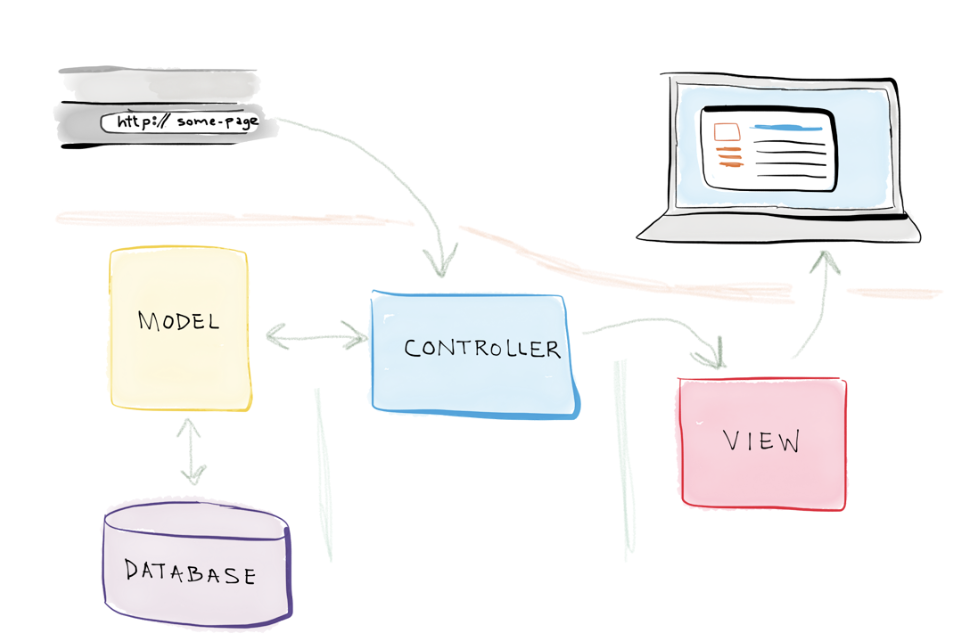
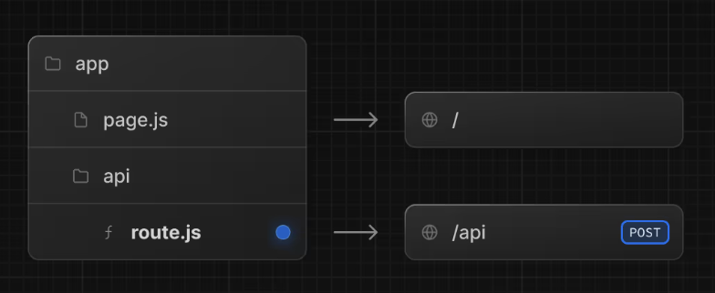

# NextJS

Se não sabes React, nem devias estar aqui...

Ver [Slides de React](https://niaefeup.github.io/slides/react-workshop)

Este é um workshop de Next.js **versão 13** para cima!

---

# O que é o Next.js?

Nextjs é uma **framework**.

É uma tecnologia que fornece uma estrutura para o desenvolvimento de websites com bastantes benificios como **SSR** - Server Side Rendering.

Mas não só, até é possível criar uma simples Rest API sem necessidade de envolver _frontend_.

Next.js é construido em cima de React e utiliza as suas funções para mexer com tudo o que é relacionado com a visualização de conteúdo.

---



---

## SSR - Server Side Rendering / Dynamic Rendering

O conteudo é renderizado no servidor no momento em que o utilizador faz o _request_, isto é, visita a página. O cliente recebe diretamente o html resultante.

### Vantagens

- É muito fácil fornecer **informação personalizada** com base no utilizador, como por exemplo dashboards e perfil.
- Acesso a informações do _request_ como _Cookies_ e _URL Search Params_ no momento.
- Websites mais rápidos pois as páginas podem ser guardadas em _**cache**_ e globalmente distribuidas.
- O **Server Load é reduzido** dado que o conteudo é guardado em cache e não necessita de ser gerado novamente caso as informações não sejam modificadas.
- **SEO** - Os crawlers indexam muito melhor os websites que carregam a informação no momento em que a página acontece. Isto leva a melhores rankings de pesquisa.

---

# Estrutura de Ficheiros

## Routing - App Router

Esta é uma das grandes mudanças na versão 13.

> Tenham sempre cuidado a ver a documentação e se estão a ver a versão correta


`.ts = .js + TypeScript `

`.tsx = .jsx + TypeScript`

---


- page.tsx e _nesting_ de folders
- layout.tsx


> Um dos benefícios de usar layout é que ao mudar de página, os componentes do layout não voltam a ser renderizados.

- loading.jsx
- not-found.jsx
- error.jsx

---

### Dynamic Routing


```tsx
export default function Page({ params }: { params: { slug: string } }) {
  return <div>My Post: {params.slug}</div>;
}
```

---

### APIs



```tsx
//`request` e `context` são opcionais
export async function GET(request: Request) {}
export async function HEAD(request: Request, context: { params: Params }) {}
export async function POST(request: Request) {
  return NextResponse.json({ error: "ISE" }, { status: 500 });
}
export async function PUT(request: Request) {}
export async function DELETE(request: Request) {}
export async function PATCH(request: Request) {}
export async function OPTIONS(request: Request) {}
```

> Não pode existir `layout.tsx` nem `page.tsx` ao mesmo nível do route.ts. Tipicamente cria-se uma pasta `api` para servir a API.

---

### Other Project Organization Features

- Pastas privadas, a começar com `_`. Estas pastas não serão consideradas no _routing_ da app.
- Route groups, nome da pasta entre `()`. Desta forma é possível organizar pastas sem interferir no _routing_ da app.

---

## Metadata

```tsx
// Static
export const metadata: Metadata = {
  title: "Título super interessante",
  description: "Os oradores são mesmo nice",
};
```

```tsx
// Dynamic
export async function generateMetadata({
  params,
}: {
  params: { id: string };
}): Promise<Metadata> {
  const id = params.id;
  const product = await fetch(`https://.../${id}`).then((res) => res.json());
  return {
    title: product.title,
    openGraph: {
      images: ["/some-specific-page-image.jpg"],
    },
  };
}
```

---

## Link

```tsx
import Link from "next/link";
```

```tsx
<Link href="/dashboard">Dashboard</Link>
```

> Nunca usem tags `<a>` em Next.js!

---

## Image

```tsx
import Image from "next/image";

<Image
  src="https://s3.amazonaws.com/my-bucket/profile.png"
  alt="Picture of the author"
/>;
```

Uma das razões dos _websites_ de tornarem lentos ao carregar, é exatamente o carregamento das imagens.

Vantagens:

- Prevenir _layout shift_ durante o carregamento de imagens.
- Redimensionamento automático para evitar enviar imagens grandes para dispositivos pequenos.
- _Lazy loading_ por definição. As imagens vão sendo carregadas à medida que vão a aparecer na janela de visualização.
- Formatos modernos, como [WebP](https://developer.mozilla.org/pt-BR/docs/Web/Media/Formats/Image_types#webp) e [AVIF](https://developer.mozilla.org/pt-BR/docs/Web/Media/Formats/Image_types#avif_image), quando o _browser_ é compatível.

---

# "use server" vs "use client"

Por definição, todas as páginas são "use server", exceto escrito o contrário.

O **"use client"** significa que página será renderizada do lado do cliente. Isto significa que um bundle de JavaScript será enviado para o cliente e serão possíveis usar os _hooks_ do React, tal como _useState_ e _useEffect._

Importar referir que o "use client" não precisa de ser especificado para uma página inteira. Podemos ter uma página 80% gerada no servidor onde apenas um componente será renderizado no cliente.

A partir do momento que usamos **"use client"** num componente, não podemos voltar a usar **"use server"** nos seus filhos. Faz sentido, certo?

---

# "use server" vs "use client"


---

## Server Actions

- Funções assíncronas
- Rodam no servidor
- Podem ser chamadas no lado do cliente.

```tsx
"use server";

export async function updateItem(itemId, formData) {
  // database stuff here
}
```

```tsx
"use client";

import { updateItem } from "./actions";

export default function ClientComponent({ itemId }) {
  return <form action={updateItem}>{/* ... */}</form>;
}
```

Como enviar o `itemId` para o `updateItem`?

---

## Server Actions - [Pending states](https://nextjs.org/docs/app/building-your-application/data-fetching/server-actions-and-mutations#pending-states)

---

# Filosofia da framework!

"We recommend first attempting to **fetch data on the server-side**."

- "However, there are still cases where client-side data fetching makes sense. In these scenarios, you can manually call `fetch` in a `useEffect` (not recommended), or lean on popular React libraries in the community such as [SWR](https://swr.vercel.app/) or [React Query](https://tanstack.com/query/latest) ."

"To reduce the Client JavaScript bundle size, we recommend moving **Client Components down your component tree**."

"Optimizations, whenever is possible"

---

## Coisas interessantes para explorar em casa

- Middleware
- ORM (Prisma or Drizzle)
- Parallel Routes & Tab Groups
- Interception Routes
- Internationalization
- React [useOptimistic](https://react.dev/reference/react/useOptimistic)
- NextAuth

---

# Bora ao trabalho!

> Mini site para inserir links de recursos interessantes da L.EIC.

Requisitos:

- [Node.js](https://nodejs.org/en) acima da versão 18
  Primeiros passos:

- `git clone https://github.com/thePeras/react-next-workshop`
- `cp .env.example .env`
  - Mudar o `<username>`
  - Mudar a `<password>`
- `npm install`
- `npx prisma generate`
- `npm run dev`

---

# Tarefa #1

## Primeiro Componente em React

`components/feed-resource-card.tsx`

Implementa o componente `ResourceCard` .

Tens um html para te ajudar!

---

# Tarefa #2

## Listar os recursos no feed

`app/@feed/page.tsx`

- Se não existirem recursos, mostrar uma mensagem a dizer "No resources found", exemplo:

```
<div className="flex items-center justify-center py-16 text-muted-foreground">
  <span>No resources found.</span>
</div>
```

- Se existirem recursos, mostrar uma lista de ResourceCard.
  > Não te esqueças do `key`

---

# Tarefa #3

## Adptar a página de um recurso

`app/resources/[id]/page.tsx`

Consoante o recurso selecionado através do url, adapta a página para mostrar informações relevantes desse recurso.

- Deves começar por pegar no `id` do recurso do url
- Usar o `id` para ir buscar o recurso à base de dados.
- Se o recurso não existir, podes mostrar uma página de erro 404.
- Se o recurso não tiver `thumbnail`, usa a imagem que existe em `/public/images/placeholder.jpg`.

Bónus:

- Cria uma função para copiar o url da página ao clicar no botão share.

---

# Tarefa #4

## Escreve o Metadata da página do recurso

`app/resources/[id]/page.tsx`

Inspeciona o _website_ e verifica dentro do `<head>` se o título e a descrição estão a ser preenchidos.

> Dica: Consulta os slides à procura do generateMetadata.

---

# Tarefa #5

## Criar uma página 404 para um recurso não encontrado

Qual é o ficheiro que deves criar e onde deves colocar?

---

# Tarefa #6

## Implementa o componente de reações

`app/resources/[id]/counter.tsx`

- O contador deve ser incrementado sempre que o botão for clicado
- Mostra o número de reações
- (Bonus) Guarda o número de reações no localStorage e acessa o valor guardado ao carregar a página

---

# Tarefa #7

## Completa a Server Action para adicionar um recurso novo

`lib/actions/resources.ts`

A função recebe um campo "url" a partir de um FormData.

- Deves ver se o recurso já existe e se sim, retornar um erro
- Obter informação do recurso submetido a partir do URL.

  > Dica: Ver as funções importadas

- Criar o recurso na base de dados.

  > Dica: Ver class `Database`

- Revalidar o cache da página inicial

---

# É tudo por hoje!

## Obrigado

---
