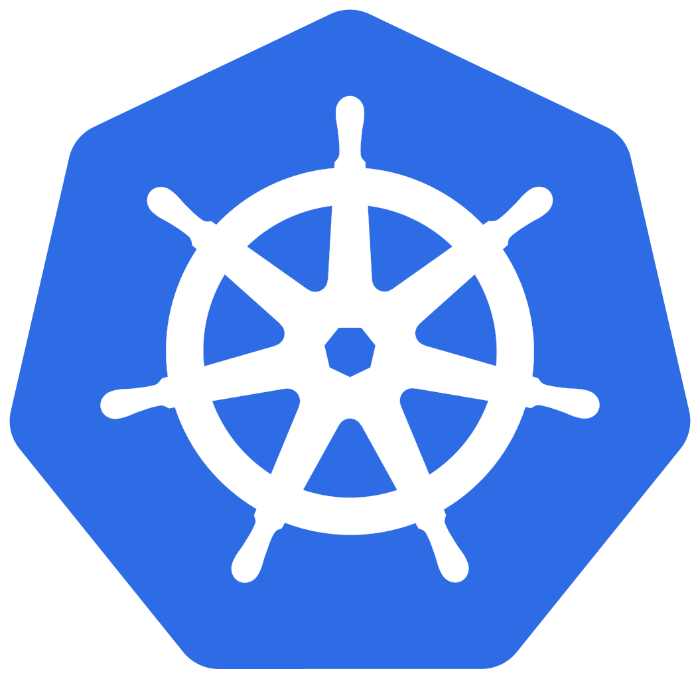
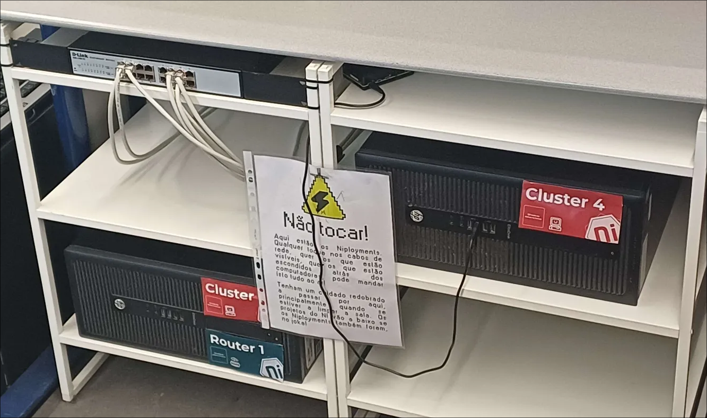
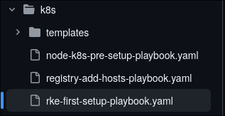
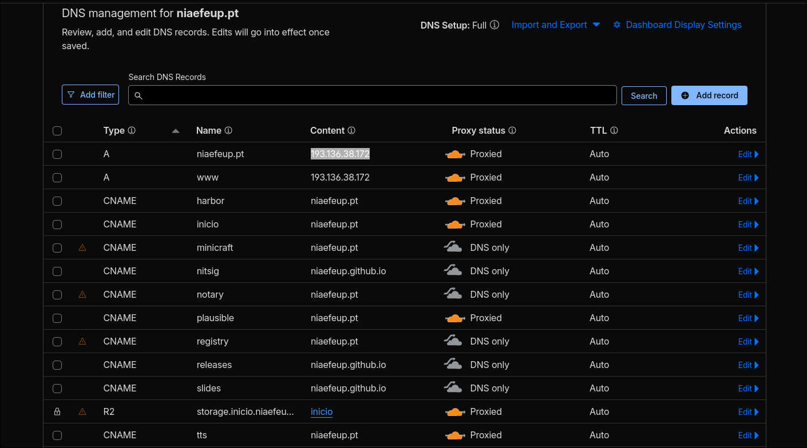

name: title
layout: true
class: center, middle, inverse

---

name: normal
layout: true
class: left, middle

---

class: center, middle, inverse, small-images

# Niployments Introduction 

  
  
❤️

  

---

class: center, middle, inverse

# Important links

#### This presentation is available online from the link below:

  <a href="https://slides.niaefeup.pt/slides/niployments-introo" style="color: white; font-weight:bold; font-size: 1.5rem; text-align:center;">https://slides.niaefeup.pt/niployments-intro</a>

#### Github repository

  <a href="https://github.com/NIAEFEUP/niployments" style="color: white; font-weight:bold; font-size: 1.5rem; text-align:center;">https://github.com/NIAEFEUP/niployments</a>

---

# Why have a local server cluster?

---

# Why kubernetes?

- Automatic replication

- Easy to have multiple computers running the same thing

---

# How to deploy in kubernetes?

---

# How to put images in niployments?

- Harbor (https://harbor.niaefeup.pt)

- Github Actions to build images 

---

# How to ensure same config in all PCs?

- Ansible

- `nix` / NixOS (?!?!?!?!?!?!?!?!?!?!?!??!?!?!?!?!?!)

---

# How to redirect `tts.niaefeup.pt` to the container?

---

# Reverse proxies

---

# How to access `niployments` servers?

- SSH (Secure Shell)

- Needs to be inside VPN (Tailscale)

---

# What is DNS?

- Domain Name System

- Humans understand names better than IP Addresses (e.g. 140.82.121.3)

- `tts.niaefeup.pt` is translated to 193.136.38.172

---

# How we manage records

---

# How storage works

---

# Longhorn

- https://longhorn.io/

- Distributed file block storage

- Each deployed app can have a `PersistentVolumeClaim`

- Allows shared storage between all servers

---

# How to load balance and ensure connectivity between pods?

---

# Cilium

- Load balance

- Enables communication between different pods

- Servers as a load balancer for pod services

- It includes `Hubble` to have a certain degree of network observability

---

