class: center, middle, inverse, small-images

# **Prolog Workshop**

### *From Facts to Fun: putting the Pro in Prolog*


<div class="footer">December 2024</div>

---

class: inverse, center, middle, small-images

### You can follow the presentation here

https://slides.niaefeup.pt/prolog-workshop

<br></br>

Examples, exercises, and solutions can be found in the <a href="/code">/code</a> folder

---

class: inverse, center

# Your Host


### **Fábio Sá**

#### M.EIC Finalist. Master Thesis focused on Testing using Prolog.

####  PFL Teaching Assistant @ FEUP

#### Associate QA Automation Engineer @ Sky

---

class: center, inverse, middle, medium-images

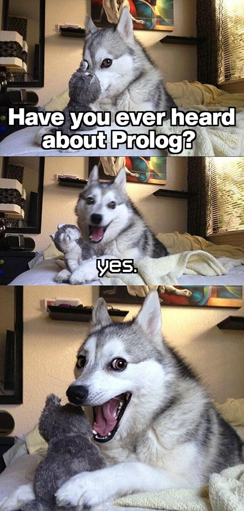

---

class: inverse, center, middle

## Prolog: always matching pieces of the same shape...

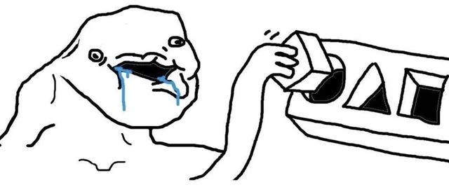

### ... using unification!

<div class="footer">
    <a href="#5" class="selected">Introduction</a> | 
    <a href="#27">Backtracking</a> |
    <a href="#39">General Tips</a> |
    <a href="#63">Lists & Recursion</a> | 
    <a href="#81">Project</a>
</div>

---

class: inverse,

# Unification

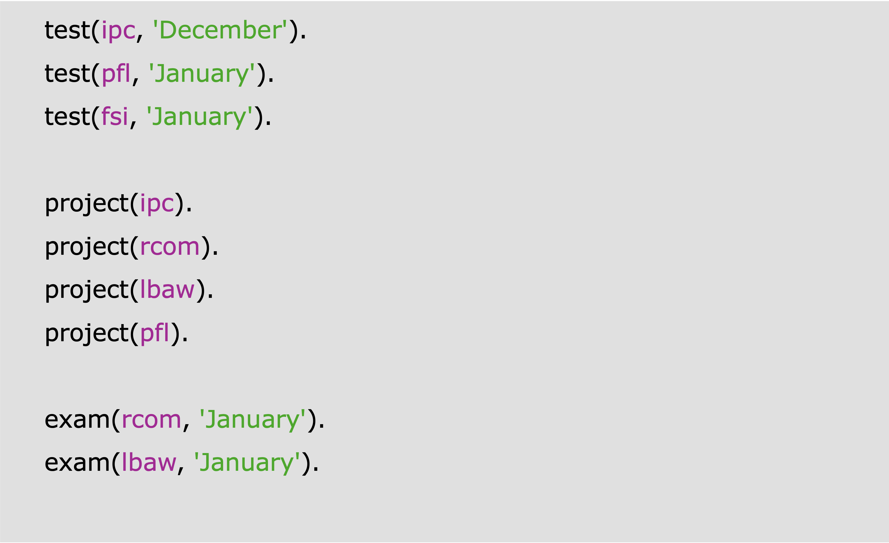

<div class="footer">
    <a href="#5" class="selected">Introduction</a> | 
    <a href="#27">Backtracking</a> |
    <a href="#39">General Tips</a> |
    <a href="#63">Lists & Recursion</a> | 
    <a href="#81">Project</a>
</div>

---

class: inverse,

# Unification

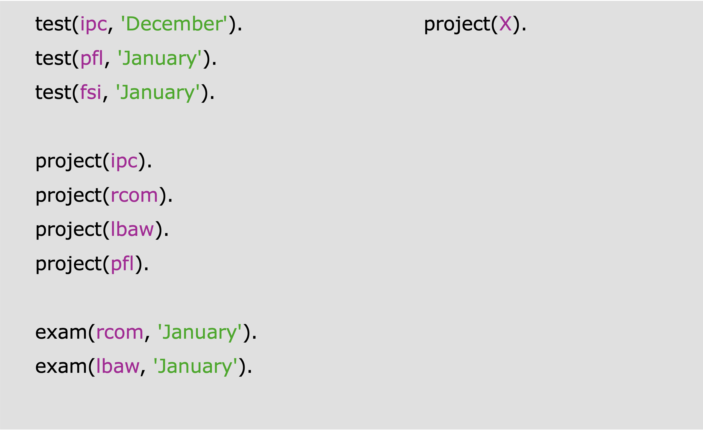

<div class="footer">
    <a href="#5" class="selected">Introduction</a> | 
    <a href="#27">Backtracking</a> |
    <a href="#39">General Tips</a> |
    <a href="#63">Lists & Recursion</a> | 
    <a href="#81">Project</a>
</div>

---

class: inverse

# Unification

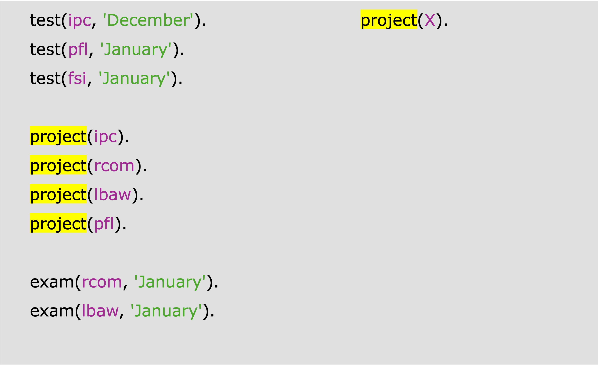

<div class="footer">
    <a href="#5" class="selected">Introduction</a> | 
    <a href="#27">Backtracking</a> |
    <a href="#39">General Tips</a> |
    <a href="#63">Lists & Recursion</a> | 
    <a href="#81">Project</a>
</div>

---

class: inverse,

# Unification

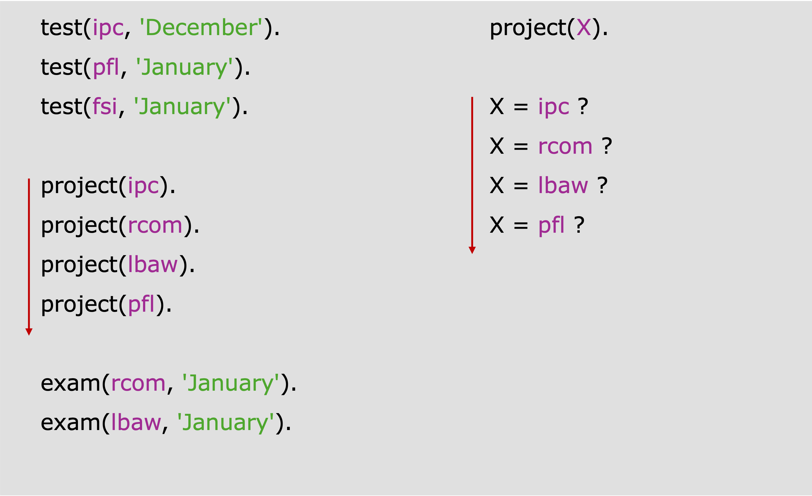

<div class="footer">
    <a href="#5" class="selected">Introduction</a> | 
    <a href="#27">Backtracking</a> |
    <a href="#39">General Tips</a> |
    <a href="#63">Lists & Recursion</a> | 
    <a href="#81">Project</a>
</div>

---

class: inverse,

# Unification

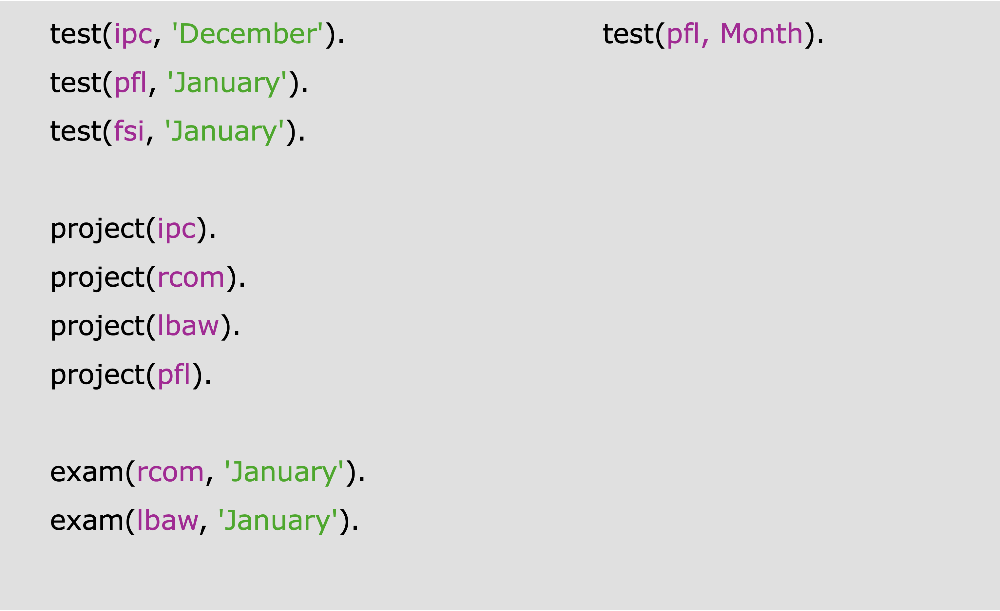

<div class="footer">
    <a href="#5" class="selected">Introduction</a> | 
    <a href="#27">Backtracking</a> |
    <a href="#39">General Tips</a> |
    <a href="#63">Lists & Recursion</a> | 
    <a href="#81">Project</a>
</div>

---

class: inverse,

# Unification

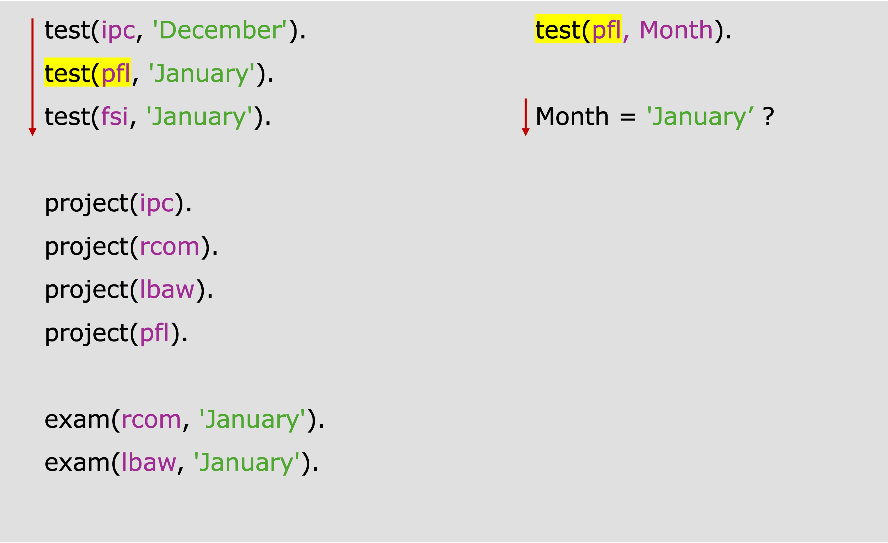

<div class="footer">
    <a href="#5" class="selected">Introduction</a> | 
    <a href="#27">Backtracking</a> |
    <a href="#39">General Tips</a> |
    <a href="#63">Lists & Recursion</a> | 
    <a href="#81">Project</a>
</div>

---

class: inverse,

# Unification


<div class="footer">
    <a href="#5" class="selected">Introduction</a> | 
    <a href="#27">Backtracking</a> |
    <a href="#39">General Tips</a> |
    <a href="#63">Lists & Recursion</a> | 
    <a href="#81">Project</a>
</div>

---

class: inverse

# Unification

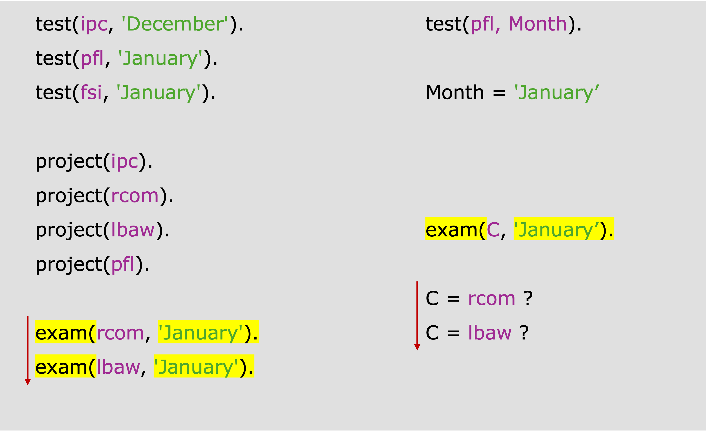

<div class="footer">
    <a href="#5" class="selected">Introduction</a> | 
    <a href="#27">Backtracking</a> |
    <a href="#39">General Tips</a> |
    <a href="#63">Lists & Recursion</a> | 
    <a href="#81">Project</a>
</div>

---

class: inverse

# The basics

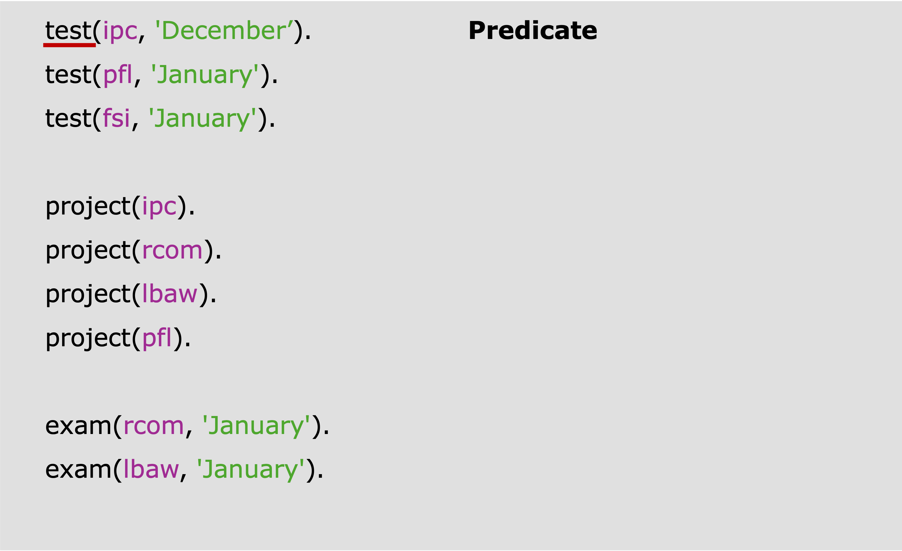

<div class="footer">
    <a href="#5" class="selected">Introduction</a> | 
    <a href="#27">Backtracking</a> |
    <a href="#39">General Tips</a> |
    <a href="#63">Lists & Recursion</a> | 
    <a href="#81">Project</a>
</div>

---

class: inverse

# The basics

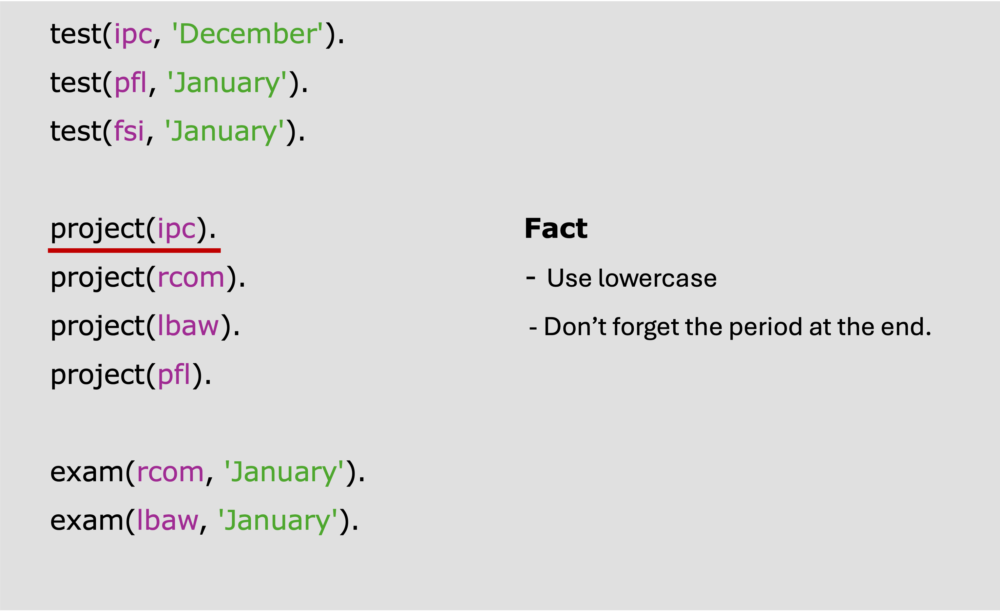

<div class="footer">
    <a href="#5" class="selected">Introduction</a> | 
    <a href="#27">Backtracking</a> |
    <a href="#39">General Tips</a> |
    <a href="#63">Lists & Recursion</a> | 
    <a href="#81">Project</a>
</div>

---

class: inverse

# The basics

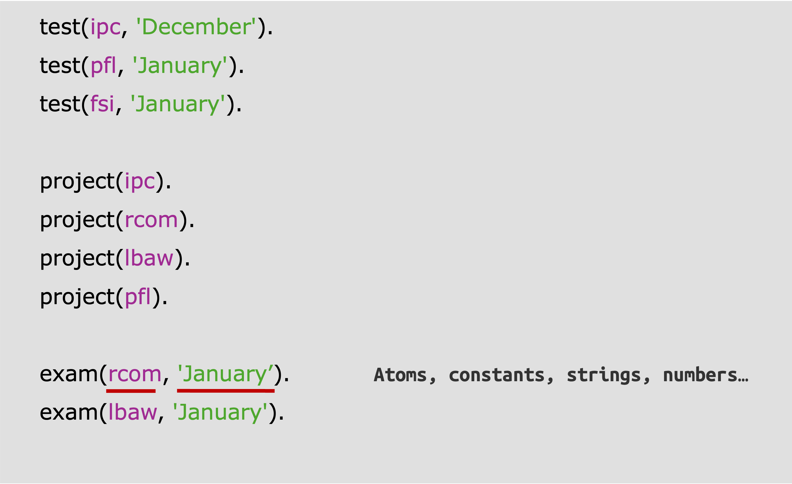

<div class="footer">
    <a href="#5" class="selected">Introduction</a> | 
    <a href="#27">Backtracking</a> |
    <a href="#39">General Tips</a> |
    <a href="#63">Lists & Recursion</a> | 
    <a href="#81">Project</a>
</div>

---

class: inverse

# The basics

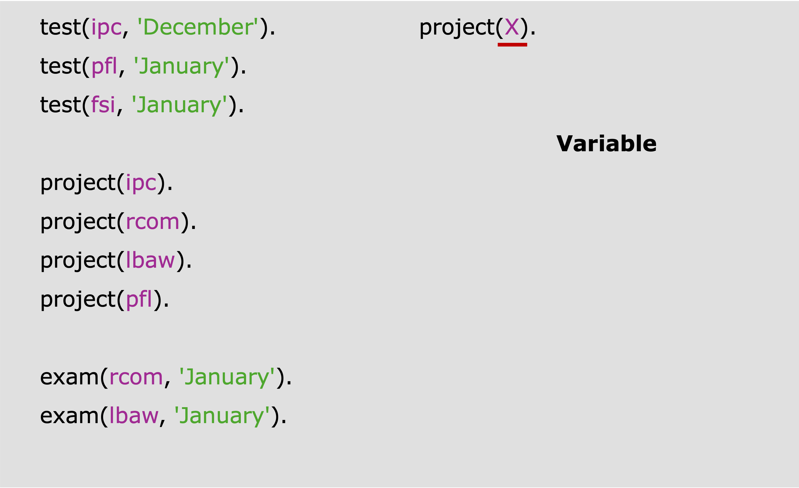

<div class="footer">
    <a href="#5" class="selected">Introduction</a> | 
    <a href="#27">Backtracking</a> |
    <a href="#39">General Tips</a> |
    <a href="#63">Lists & Recursion</a> | 
    <a href="#81">Project</a>
</div>

---

class: inverse

# The basics

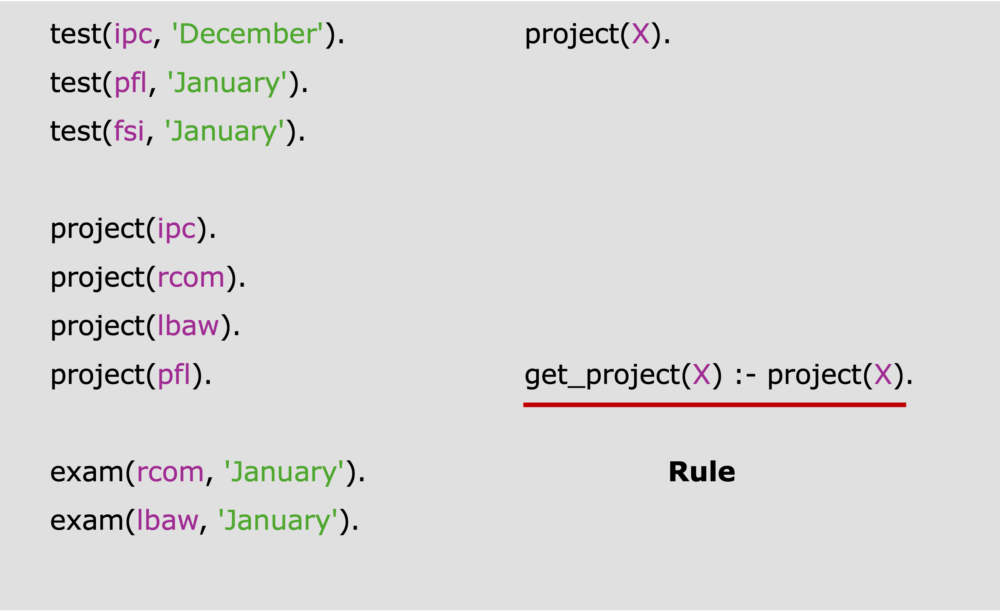

<div class="footer">
    <a href="#5" class="selected">Introduction</a> | 
    <a href="#27">Backtracking</a> |
    <a href="#39">General Tips</a> |
    <a href="#63">Lists & Recursion</a> | 
    <a href="#81">Project</a>
</div>

---

class: inverse

# The basics

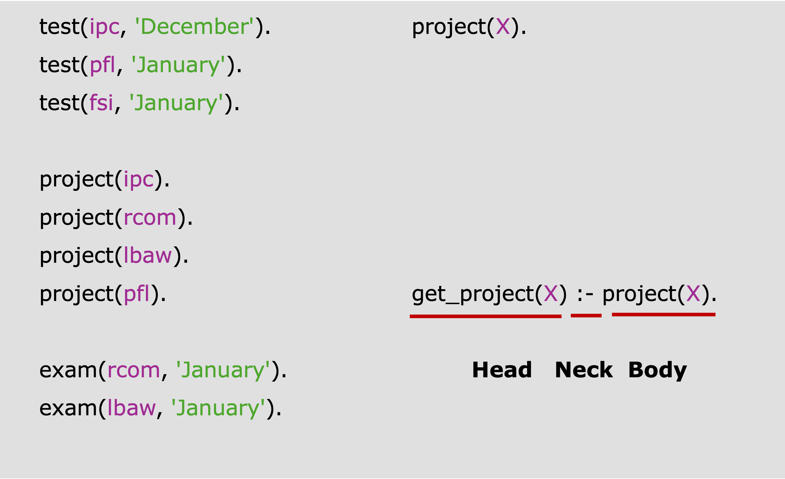

<div class="footer">
    <a href="#5" class="selected">Introduction</a> | 
    <a href="#27">Backtracking</a> |
    <a href="#39">General Tips</a> |
    <a href="#63">Lists & Recursion</a> | 
    <a href="#81">Project</a>
</div>

---

class: inverse

# The basics

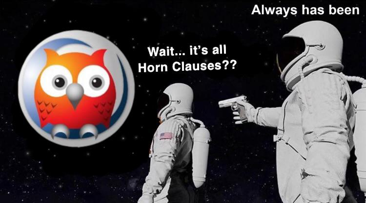

<div class="footer">
    <a href="#5" class="selected">Introduction</a> | 
    <a href="#27">Backtracking</a> |
    <a href="#39">General Tips</a> |
    <a href="#63">Lists & Recursion</a> | 
    <a href="#81">Project</a>
</div>

---

class: inverse

# The basics

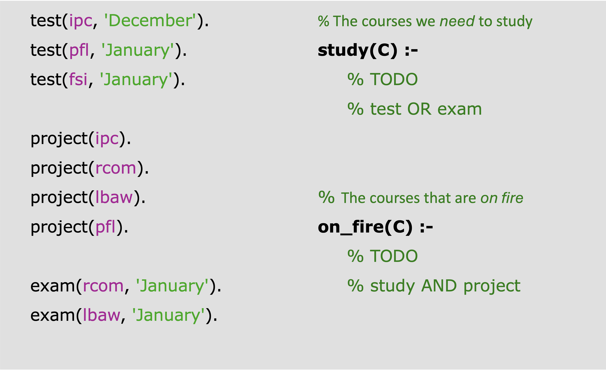

<div class="footer">
    <a href="#5" class="selected">Introduction</a> | 
    <a href="#27">Backtracking</a> |
    <a href="#39">General Tips</a> |
    <a href="#63">Lists & Recursion</a> | 
    <a href="#81">Project</a>
</div>

---

class: inverse

# The basics

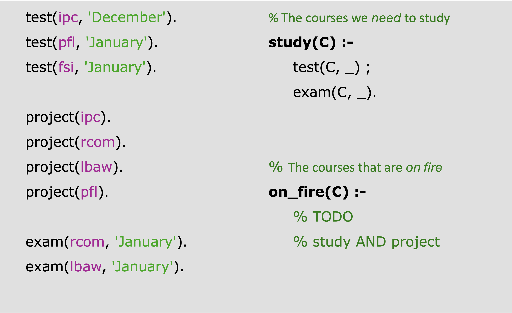

<div class="footer">
    <a href="#5" class="selected">Introduction</a> | 
    <a href="#27">Backtracking</a> |
    <a href="#39">General Tips</a> |
    <a href="#63">Lists & Recursion</a> | 
    <a href="#81">Project</a>
</div>

---

class: inverse

# The basics

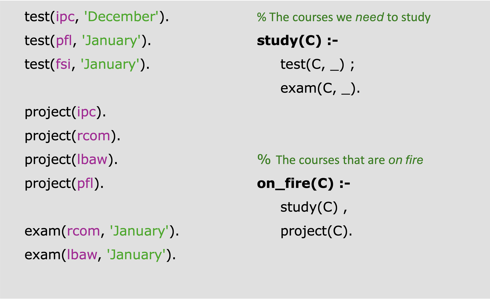

<div class="footer">
    <a href="#5" class="selected">Introduction</a> | 
    <a href="#27">Backtracking</a> |
    <a href="#39">General Tips</a> |
    <a href="#63">Lists & Recursion</a> | 
    <a href="#81">Project</a>
</div>

---

class: inverse, middle, center

# OR

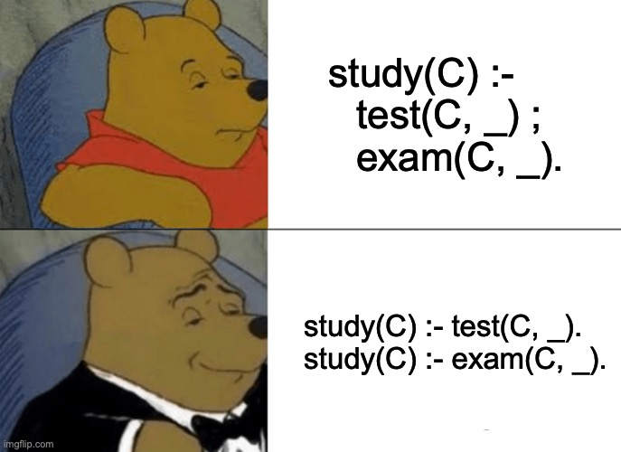

<div class="footer">
    <a href="#5" class="selected">Introduction</a> | 
    <a href="#27">Backtracking</a> |
    <a href="#39">General Tips</a> |
    <a href="#63">Lists & Recursion</a> | 
    <a href="#81">Project</a>
</div>

---

class: inverse

# The basics


<div class="footer">
    <a href="#5" class="selected">Introduction</a> | 
    <a href="#27">Backtracking</a> |
    <a href="#39">General Tips</a> |
    <a href="#63">Lists & Recursion</a> | 
    <a href="#81">Project</a>
</div>

---

class: inverse, 

# The basics

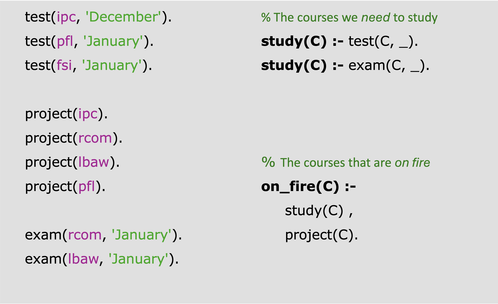

<div class="footer">
    <a href="#5" class="selected">Introduction</a> | 
    <a href="#27">Backtracking</a> |
    <a href="#39">General Tips</a> |
    <a href="#63">Lists & Recursion</a> | 
    <a href="#81">Project</a>
</div>

---

class: inverse, middle, center

# Backtracking

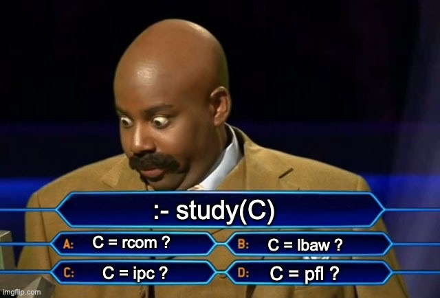

<div class="footer">
    <a href="#5">Introduction</a> | 
    <a href="#27" class="selected">Backtracking</a> |
    <a href="#39">General Tips</a> |
    <a href="#63">Lists & Recursion</a> | 
    <a href="#81">Project</a>
</div>

---

class: inverse

# Backtracking

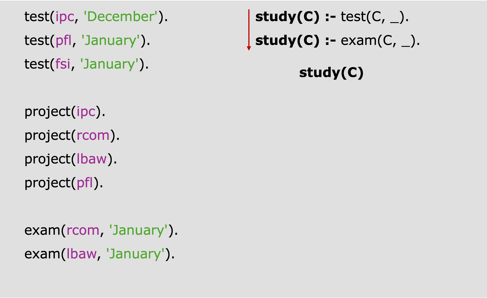

<div class="footer">
    <a href="#5">Introduction</a> | 
    <a href="#27" class="selected">Backtracking</a> |
    <a href="#39">General Tips</a> |
    <a href="#63">Lists & Recursion</a> | 
    <a href="#81">Project</a>
</div>

---

class: inverse

# Backtracking

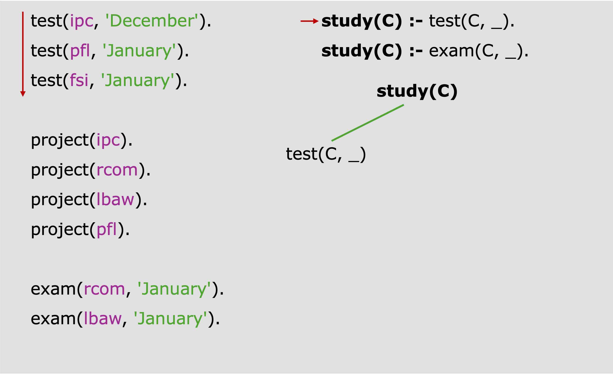

<div class="footer">
    <a href="#5">Introduction</a> | 
    <a href="#27" class="selected">Backtracking</a> |
    <a href="#39">General Tips</a> |
    <a href="#63">Lists & Recursion</a> | 
    <a href="#81">Project</a>
</div>

---

class: inverse

# Backtracking

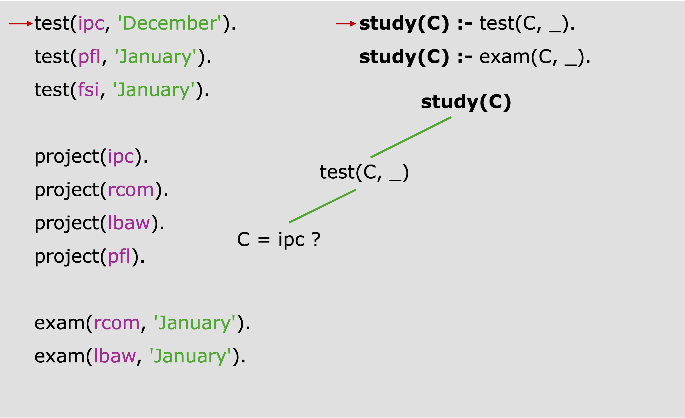

<div class="footer">
    <a href="#5">Introduction</a> | 
    <a href="#27" class="selected">Backtracking</a> |
    <a href="#39">General Tips</a> |
    <a href="#63">Lists & Recursion</a> | 
    <a href="#81">Project</a>
</div>

---

class: inverse

# Backtracking

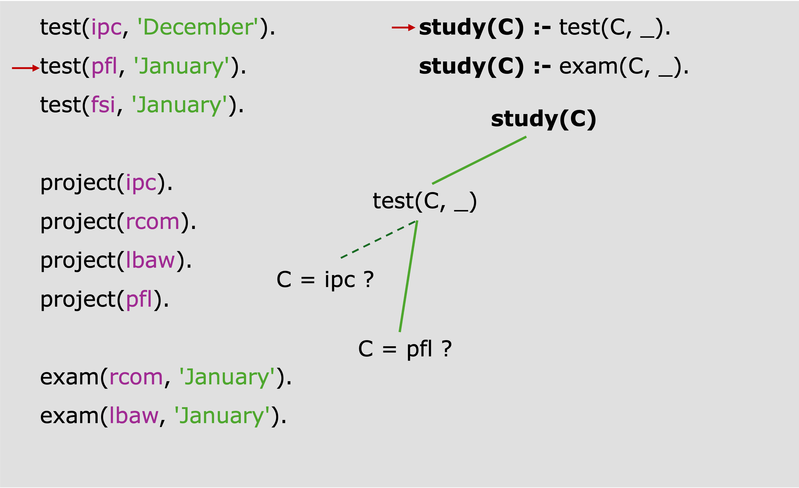

<div class="footer">
    <a href="#5">Introduction</a> | 
    <a href="#27" class="selected">Backtracking</a> |
    <a href="#39">General Tips</a> |
    <a href="#63">Lists & Recursion</a> | 
    <a href="#81">Project</a>
</div>

---

class: inverse

# Backtracking

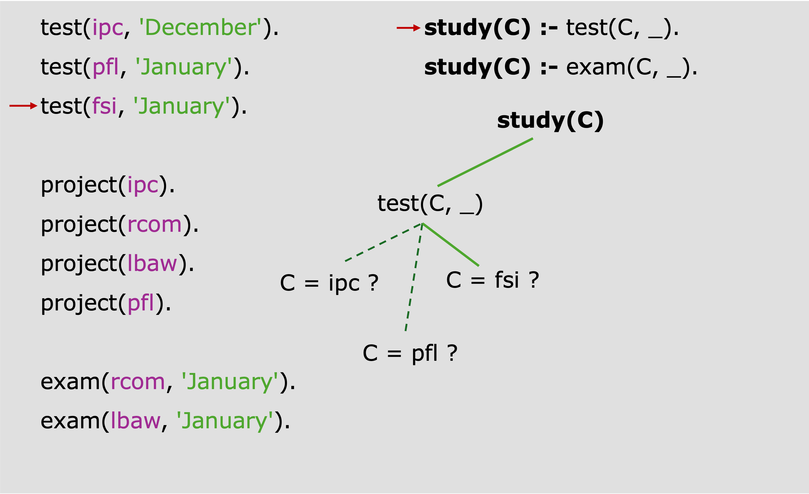

<div class="footer">
    <a href="#5">Introduction</a> | 
    <a href="#27" class="selected">Backtracking</a> |
    <a href="#39">General Tips</a> |
    <a href="#63">Lists & Recursion</a> | 
    <a href="#81">Project</a>
</div>

---

class: inverse

# Backtracking

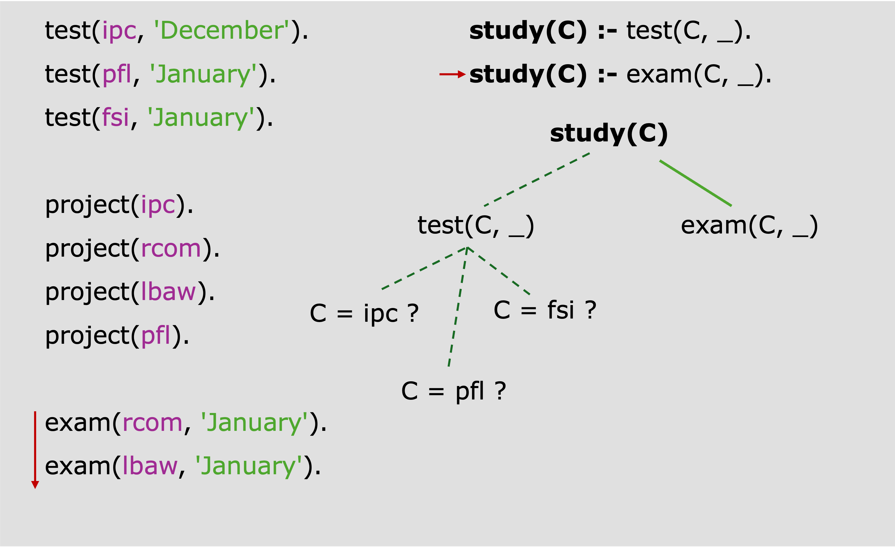

<div class="footer">
    <a href="#5">Introduction</a> | 
    <a href="#27" class="selected">Backtracking</a> |
    <a href="#39">General Tips</a> |
    <a href="#63">Lists & Recursion</a> | 
    <a href="#81">Project</a>
</div>

---

class: inverse

# Backtracking

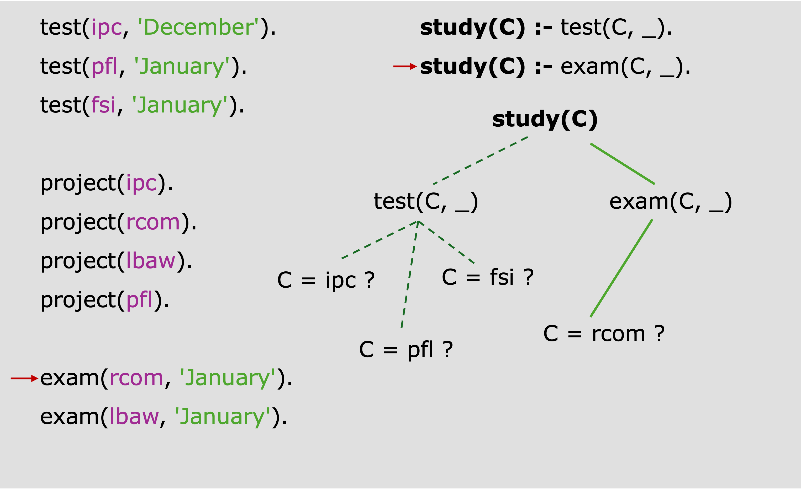

<div class="footer">
    <a href="#5">Introduction</a> | 
    <a href="#27" class="selected">Backtracking</a> |
    <a href="#39">General Tips</a> |
    <a href="#63">Lists & Recursion</a> | 
    <a href="#81">Project</a>
</div>

---

class: inverse

# Backtracking

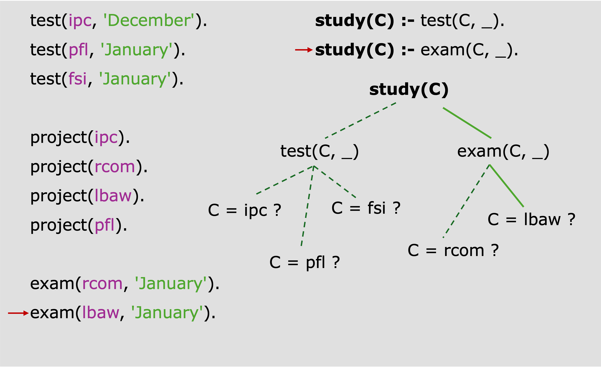

<div class="footer">
    <a href="#5">Introduction</a> | 
    <a href="#27" class="selected">Backtracking</a> |
    <a href="#39">General Tips</a> |
    <a href="#63">Lists & Recursion</a> | 
    <a href="#81">Project</a>
</div>

---

class: inverse

# Backtracking

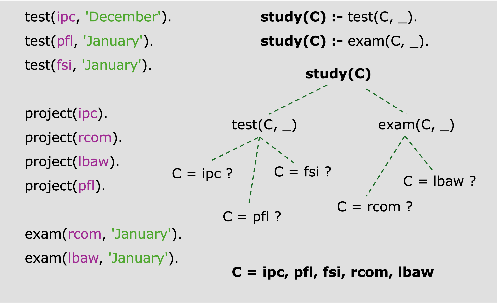

<div class="footer">
    <a href="#5">Introduction</a> | 
    <a href="#27" class="selected">Backtracking</a> |
    <a href="#39">General Tips</a> |
    <a href="#63">Lists & Recursion</a> | 
    <a href="#81">Project</a>
</div>

---

class: inverse

# Backtracking

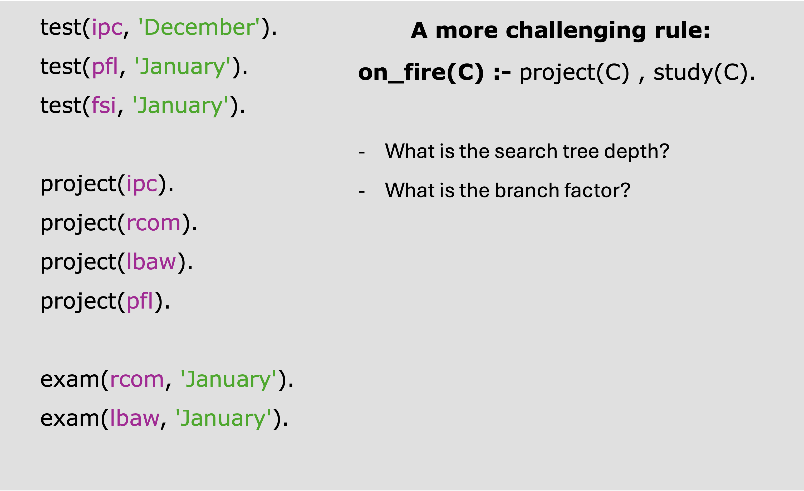

<div class="footer">
    <a href="#5">Introduction</a> | 
    <a href="#27" class="selected">Backtracking</a> |
    <a href="#39">General Tips</a> |
    <a href="#63">Lists & Recursion</a> | 
    <a href="#81">Project</a>
</div>

---

class: inverse

# Backtracking

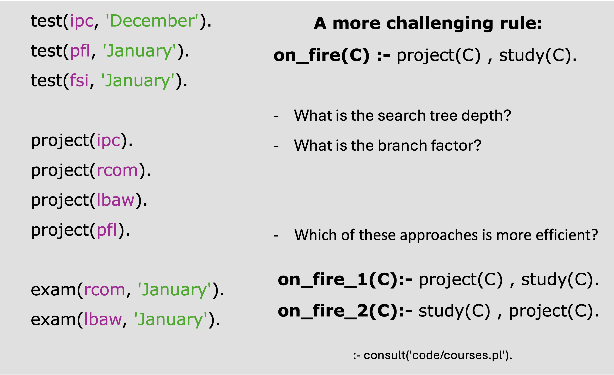

<div class="footer">
    <a href="#5">Introduction</a> | 
    <a href="#27" class="selected">Backtracking</a> |
    <a href="#39">General Tips</a> |
    <a href="#63">Lists & Recursion</a> | 
    <a href="#81">Project</a>
</div>

---

class: inverse, large-images

# General Tips

<div class="footer">
    <a href="#5">Introduction</a> | 
    <a href="#27">Backtracking</a> |
    <a href="#39" class="selected">General Tips</a> |
    <a href="#63">Lists & Recursion</a> | 
    <a href="#81">Project</a>
</div>

--

<table>
  <tr>
    <td width=60%>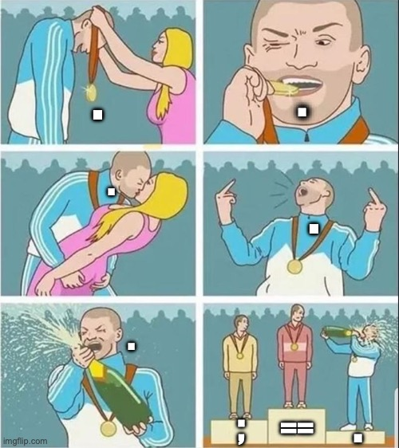</td>
    <td>
        <strong><h3>Top bug villains in your test and project</h3></strong>
    </td>
  </tr>
</table>

---

class: inverse

# General Tips

### DO NOT use:

<div class="footer">
    <a href="#5">Introduction</a> | 
    <a href="#27">Backtracking</a> |
    <a href="#39" class="selected">General Tips</a> |
    <a href="#63">Lists & Recursion</a> | 
    <a href="#81">Project</a>
</div>

--

- ;

--

- ==

--

- ->

---

class: inverse

# General Tips

### Always document your code!

<div class="footer">
    <a href="#5">Introduction</a> | 
    <a href="#27">Backtracking</a> |
    <a href="#39" class="selected">General Tips</a> |
    <a href="#63">Lists & Recursion</a> | 
    <a href="#81">Project</a>
</div>

--

#### Is Manuel the father of Joaquim, or is Joaquim the father of Manuel?

.dense[
```prolog
father(manel, joaquim).
father(aberto, joao).
father(pedro, manel).
```
]

---

class: inverse

# General Tips

### Always document your code!

#### Is Manuel the father of Joaquim, or is Joaquim the father of Manuel?

.dense[
```prolog
% father/2
% father(a, b), the father of a is b
father(manel, joaquim).
father(aberto, joao).
father(pedro, manel).
```
]

#### Better 😇

<div class="footer">
    <a href="#5">Introduction</a> | 
    <a href="#27">Backtracking</a> |
    <a href="#39" class="selected">General Tips</a> |
    <a href="#63">Lists & Recursion</a> | 
    <a href="#81">Project</a>
</div>

---

class: inverse

# General Tips

### Always document your code!

#### Is Manuel the father of Joaquim, or is Joaquim the father of Manuel?

.dense[
```prolog
% father/2
% father(a, b), the father of a is b
father(manel, joaquim).
father(aberto, joao).
father(pedro, manel).
```
]

##### If there are mysterious rules in the project, mysterious points will be subtracted 😔

.dense[
```prolog
unknown(X, Y):-
    father(Y, _Z),
    father(_Z, X).
```
]

<div class="footer">
    <a href="#5">Introduction</a> | 
    <a href="#27">Backtracking</a> |
    <a href="#39" class="selected">General Tips</a> |
    <a href="#63">Lists & Recursion</a> | 
    <a href="#81">Project</a>
</div>

---

class: inverse

# General Tips

### Always document your code!

#### Is Manuel the father of Joaquim, or is Joaquim the father of Manuel?

.dense[
```prolog
% father/2
% father(a, b), the father of a is b
father(manel, joaquim).
father(aberto, joao).
father(pedro, manel).
```
]

##### If there are mysterious rules in the project, mysterious points will be subtracted 😔

.dense[
```prolog
% is_grandchild(?X, ?Y)
% This rule checks if X is a grandchild of Y
is_grandchild(X, Y):-
    father(Y, _Z),
    father(_Z, X).
```
]

##### Use +X for input variable, -X for output and ?X for input/output. See in <a class="line" href="/code/family.pl">/code/family.pl</a>

<div class="footer">
    <a href="#5">Introduction</a> | 
    <a href="#27">Backtracking</a> |
    <a href="#39" class="selected">General Tips</a> |
    <a href="#63">Lists & Recursion</a> | 
    <a href="#81">Project</a>
</div>

---

class: inverse

# General Tips

### Prolog, the rebel of programming

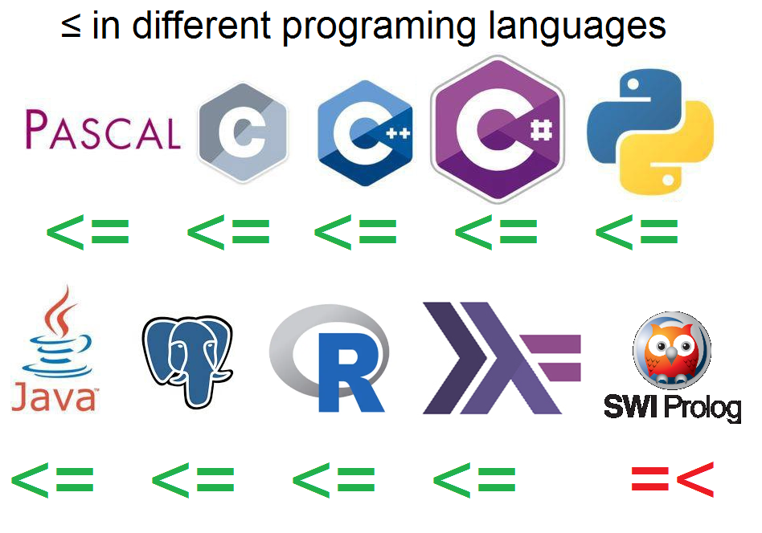

<div class="footer">
    <a href="#5">Introduction</a> | 
    <a href="#27">Backtracking</a> |
    <a href="#39" class="selected">General Tips</a> |
    <a href="#63">Lists & Recursion</a> | 
    <a href="#81">Project</a>
</div>

---

class: inverse

# General Tips

<div class="footer">
    <a href="#5">Introduction</a> | 
    <a href="#27">Backtracking</a> |
    <a href="#39" class="selected">General Tips</a> |
    <a href="#63">Lists & Recursion</a> | 
    <a href="#81">Project</a>
</div>

### Be careful about arithmetic operations

.dense[
```prolog
?- A = 1+2.
A = 1+2 ? 👀
```
]

--

Always use *is*

.dense[
```prolog
?- A is 1+2.
A = 3 ? ✌️
```
]

--

To reinforce, NEVER use *==* in these operations.

.dense[
```prolog
?- 3+1 == 1+3.
no 💀

?- A is 1+3, A == 4.
A = 4 ? ;
no 💀
```
]

---

class: inverse

# General Tips

### Debugging

<div class="footer">
    <a href="#5">Introduction</a> | 
    <a href="#27">Backtracking</a> |
    <a href="#39" class="selected">General Tips</a> |
    <a href="#63">Lists & Recursion</a> | 
    <a href="#81">Project</a>
</div>

--

<table>
  <tr>
    <td width=60%>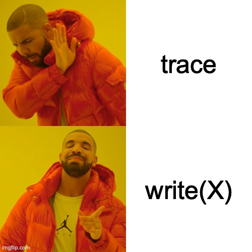</td>
    <td>
        <h4>Let's go against the professors: write() is way better! <br></br> <strong>Simple, fast, and easy to use.</strong></h4>
    </td>
  </tr>
</table>

---

class: inverse

# General Tips

### Debugging

<div class="footer">
    <a href="#5">Introduction</a> | 
    <a href="#27">Backtracking</a> |
    <a href="#39" class="selected">General Tips</a> |
    <a href="#63">Lists & Recursion</a> | 
    <a href="#81">Project</a>
</div>

```prolog
max(X, Y, Max) :-
    % Debugging output
    write('Comparing: '), write(X), write(' and '), write(Y), nl,
    X >= Y,
    Max = X,
    write('Max is: '), write(Max), nl.

max(X, Y, Max) :-
    % Debugging output
    write('Comparing: '), write(X), write(' and '), write(Y), nl,
    X < Y,
    Max = Y,
    write('Max is: '), write(Max), nl.
```

--

⚠️ But please remove all the writes() from your exercise before submitting the test. I/O tends to crash the automatic grader, and if the grader crashes, it can’t evaluate the question. And if it can’t properly grade the question, well… you know. 

---

class: inverse

# General Tips

In the test, you won’t have an IDE or VSCode tools to help you view the Prolog code...

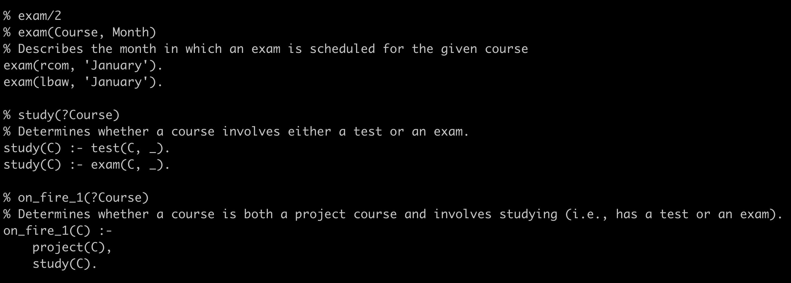

<div class="footer">
    <a href="#5">Introduction</a> | 
    <a href="#27">Backtracking</a> |
    <a href="#39" class="selected">General Tips</a> |
    <a href="#63">Lists & Recursion</a> | 
    <a href="#81">Project</a>
</div>

--

... but interesting IDE features are coming in a master thesis this year - talk to Martim Videira :)

---

class: inverse

# General Tips

In the test, you won’t have an IDE or VSCode tools to help you view the Prolog code...


Solution? Have a sharp eye and always **test your code**!

```prolog
?- consult('path/to/your/file.pl').
?- test_exercise(Arg1).
```

<div class="footer">
    <a href="#5">Introduction</a> | 
    <a href="#27">Backtracking</a> |
    <a href="#39" class="selected">General Tips</a> |
    <a href="#63">Lists & Recursion</a> | 
    <a href="#81">Project</a>
</div>

---

class: inverse

# General Tips

SICStus Prolog in the terminal has a *skill issue*: it doesn’t allow access to the last used command. This leads to a lot of time wasted retyping instructions manually:

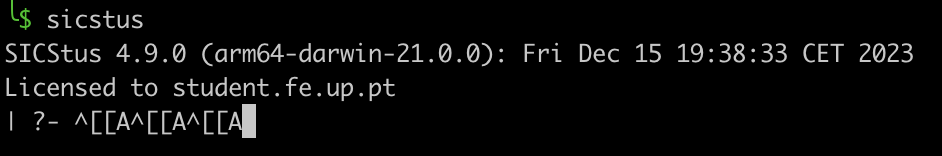

<div class="footer">
    <a href="#5">Introduction</a> | 
    <a href="#27">Backtracking</a> |
    <a href="#39" class="selected">General Tips</a> |
    <a href="#63">Lists & Recursion</a> | 
    <a href="#81">Project</a>
</div>

--

Solution? Install **rlwrap** and add this before the sicstus command:

```bash
$ apt-get install rlwrap
$ alias sicstus="rlwrap /path/to/sicstus/binary"
```

---

class: inverse

# Lists & Recursion

Lists mechanism

```prolog
[1, 2, 3] = [1 | [2, 3]] = [Head | Tail] % Head = 1 & Tail = [2, 3]
```

<div class="footer">
    <a href="#5">Introduction</a> | 
    <a href="#27">Backtracking</a> |
    <a href="#39">General Tips</a> |
    <a href="#63" class="selected">Lists & Recursion</a> | 
    <a href="#81">Project</a>
</div>

--

Remember this predicates!

--

```prolog
length(?List, ?Size). % get the length of the list
```

--

```prolog
member(?Elem, ?List). % check if the list contains the given element
```

--

```prolog
append(?L1, ?L2, ?L3). % append the list L1 and L2 and returns the result in L3
```

--

```prolog
sort(+List, -SortedList). % use keysort(+PairList, -SortedList) for pairs X-Y
```

--

```prolog
findall(Goal, predicate(Goal), List). % list all goals that satisfy the predicate
```

--

```prolog
setof(Goal, predicate(Goal), List). % = findall but without duplicates & sorted
```

---

class: inverse

# Lists & Recursion

Some recursive examples:

```prolog
% create_list(+Element, +Size, -List)
% returns a List with length Size and filled with Elements
create_list(Element, Size, List):- % TODO
```

<div class="footer">
    <a href="#5">Introduction</a> | 
    <a href="#27">Backtracking</a> |
    <a href="#39">General Tips</a> |
    <a href="#63" class="selected">Lists & Recursion</a> | 
    <a href="#81">Project</a>
</div>

--

```prolog
create_list(_, 0, []).                       % first: always the base case
```

--

```prolog
create_list(Element, Size, List) :-
    Size > 0,                             % the guard
    Size1 is Size - 1,
    create_list(Element, Size1, Sublist),    % recursive call
    append([Element], Sublist, List).
```

--

Or even better:

```prolog
create_list(_, 0, []).
create_list(Element, Size, [Element|Sublist]) :-
    Size > 0,
    Size1 is Size - 1,
    create_list(Element, Size1, Sublist).
```

---

class: inverse

# Lists & Recursion

Some recursive examples:

```prolog
% nthX(+List, +X, -Value)
% returns the Value in index X of the List
nthX(List, X, Value):- % TODO
```

<div class="footer">
    <a href="#5">Introduction</a> | 
    <a href="#27">Backtracking</a> |
    <a href="#39">General Tips</a> |
    <a href="#63" class="selected">Lists & Recursion</a> | 
    <a href="#81">Project</a>
</div>

--

The base case:

```prolog
nthX([Head|_], 0, Head).
```

--

And then:

```prolog
nthX([_|Tail], Index, Value):-
    Index > 0,
    NextIndex is Index - 1,
    nthX(Tail, NextIndex, Value).
```

Very useful for the project! It will come up again later.

---

class: inverse

# Lists & Recursion

Some recursive examples:

```prolog
% replace(+Index, +Value, +List, -NewList)
% returns a NewList where the element at the specified Index is replaced with Value.
replace(Index, Value, List, NewList):- % TODO
```

<div class="footer">
    <a href="#5">Introduction</a> | 
    <a href="#27">Backtracking</a> |
    <a href="#39">General Tips</a> |
    <a href="#63" class="selected">Lists & Recursion</a> | 
    <a href="#81">Project</a>
</div>

--

The base case:

```prolog
replace(0, Value, [_|Tail], [Value|Tail]).
```

--

And then 🤯

```prolog
replace(Index, Value, [Head|Tail], [Head|NewTail]):-
    Index > 0,
    NewIndex is Index - 1,
    replace(NewIndex, Value, Tail, NewTail).
```

Very useful for the project! It will come up again later.

---

class: inverse

# Project

According to the feedback from the workshop registration, the project received some interesting attention...

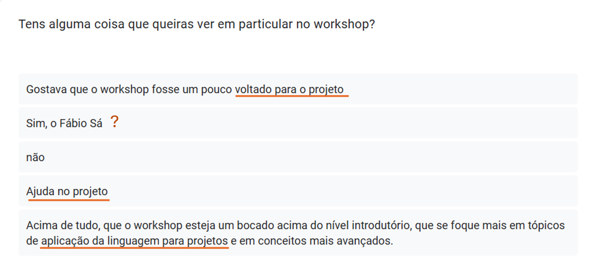

... let's dive into the project!

<div class="footer">
    <a href="#5">Introduction</a> | 
    <a href="#27">Backtracking</a> |
    <a href="#39">General Tips</a> |
    <a href="#63">Lists & Recursion</a> | 
    <a href="#81" class="selected">Project</a>
</div>

---

class: inverse

# Project

A generic game needs to manage a state. This state, or *GameState*, can generally consist of:

<div class="footer">
    <a href="#5">Introduction</a> | 
    <a href="#27">Backtracking</a> |
    <a href="#39">General Tips</a> |
    <a href="#63">Lists & Recursion</a> | 
    <a href="#81" class="selected">Project</a>
</div>

--

- The Board

--

- The Player

--

- Other settings that may change over time

--

At this stage, we can define the GameState as a list:

```prolog
GameState % [CurrentBoard, CurrentPlayer]
```

---

class: inverse

# Project

The Board always depends on the chosen game. There are two options:

<div class="footer">
    <a href="#5">Introduction</a> | 
    <a href="#27">Backtracking</a> |
    <a href="#39">General Tips</a> |
    <a href="#63">Lists & Recursion</a> | 
    <a href="#81" class="selected">Project</a>
</div>

--

- **Static Board**: This can be defined as a fact and retrieved based on a specific size.

--

```prolog
board(2, [[empty, empty], [empty, empty]]).
board(3, [[empty, empty, empty], [empty, empty, empty], [empty, empty, empty]]).

get_board(N, Board):-
    board(N, Board).
```

--

- **Dynamic Board**: This is constructed depending on the user input.

--

Do you remember **create_list(Element, Size, List)**? It is used here:

```prolog
default(empty).

create_board(Element, Size, Board):-
    create_list(Element, Size, List),
    create_list(List, Size, Board).

get_board(N, Board):-
    default(Element),
    create_board(Element, N, Board).
```

---

class: inverse

# Project

A simple (and recursive) way to show the board:

```prolog
char(o, 'O').
char(x, 'X').
char(empty, 'E').

display_item(Item):- 
    char(Item, C), 
    write(C).

display_row([]).
display_row([Item|RemainingItems]):-
    display_item(Item),
    display_row(RemainingItems).

display_board([]).
display_board([Row|RemainingRows]):-
    display_row(Row), nl,
    display_board(RemainingRows).
```

<div class="footer">
    <a href="#5">Introduction</a> | 
    <a href="#27">Backtracking</a> |
    <a href="#39">General Tips</a> |
    <a href="#63">Lists & Recursion</a> | 
    <a href="#81" class="selected">Project</a>
</div>

---

class: inverse

# Project

Handling user inputs...

```prolog
between(Min, Max, Min):- Min =< Max.
between(Min, Max, Value):-
    Min < Max,
    NextMin is Min + 1,
    between(NextMin, Max, Value).

read_number(X):-
    read_number_aux(X, 0).
read_number_aux(X, Acc) :- 
    get_code(C),
    between(48, 57, C), !,
    Acc1 is 10 * Acc + (C - 48),
    read_number_aux(X, Acc1).
read_number_aux(X, X).
```

... I know, Prolog can be strange "sometimes"

<div class="footer">
    <a href="#5">Introduction</a> | 
    <a href="#27">Backtracking</a> |
    <a href="#39">General Tips</a> |
    <a href="#63">Lists & Recursion</a> | 
    <a href="#81" class="selected">Project</a>
</div>

---

class: inverse

# Project

Now we can create generic functions that only return if the user's input is as desired:

```prolog
% get_number(+Min, +Max, +Context, -Value)
% <Context> between <Min> and <Max>: <USER INPUT>
get_number(Min, Max, Context, Value):-
    format('~a between ~d and ~d: ', [Context, Min, Max]),
    repeat,                           % !!!!! init infinite loop
    read_number(Value),
    between(Min, Max, Value), 
    !.                                % !!!!! end infinit loop
```

<div class="footer">
    <a href="#5">Introduction</a> | 
    <a href="#27">Backtracking</a> |
    <a href="#39">General Tips</a> |
    <a href="#63">Lists & Recursion</a> | 
    <a href="#81" class="selected">Project</a>
</div>

--

Look at the possible utilities:

```prolog
get_number(1, 10, 'Choose a board size', Size).

get_number(1, 2, 'Choose the first player', Player).

get_number(1, N, 'Choose the move, coordinate X', X).
get_number(1, N, 'Choose the move, coordinate Y', Y).
```

---

class: inverse

# Project

Nice! Now we are ready to create an entire GameState based on the user's choices:

```prolog
get_game_state(GameState):-
    % TODO
```

<div class="footer">
    <a href="#5">Introduction</a> | 
    <a href="#27">Backtracking</a> |
    <a href="#39">General Tips</a> |
    <a href="#63">Lists & Recursion</a> | 
    <a href="#81" class="selected">Project</a>
</div>

---

class: inverse

# Project

Nice! Now we are ready to create an entire GameState based on the user's choices:

```prolog
get_game_state([Board, Player]):-
    % TODO
```

<div class="footer">
    <a href="#5">Introduction</a> | 
    <a href="#27">Backtracking</a> |
    <a href="#39">General Tips</a> |
    <a href="#63">Lists & Recursion</a> | 
    <a href="#81" class="selected">Project</a>
</div>

---

class: inverse

# Project

Nice! Now we are ready to create an entire GameState based on the user's choices:

```prolog
get_game_state([Board, Player]):-
    choose_board(Board),
    choose_player(Player).
```

<div class="footer">
    <a href="#5">Introduction</a> | 
    <a href="#27">Backtracking</a> |
    <a href="#39">General Tips</a> |
    <a href="#63">Lists & Recursion</a> | 
    <a href="#81" class="selected">Project</a>
</div>

---

class: inverse

# Project

Nice! Now we are ready to create an entire GameState based on the user's choices:

```prolog
choose_board(Board):-
    get_number(1, 4, 'Board size', N),
    get_board(N, Board).

get_game_state([Board, Player]):-
    choose_board(Board),
    choose_player(Player).
```

<div class="footer">
    <a href="#5">Introduction</a> | 
    <a href="#27">Backtracking</a> |
    <a href="#39">General Tips</a> |
    <a href="#63">Lists & Recursion</a> | 
    <a href="#81" class="selected">Project</a>
</div>

---

class: inverse

# Project

Nice! Now we are ready to create an entire GameState based on the user's choices:

```prolog
player(1, player1).
player(2, player2).

choose_player(Player):-
    get_number(1, 2, 'Choose the first player', N),
    player(N, Player).

choose_board(Board):-
    get_number(1, 4, 'Board size', N),
    get_board(N, Board).

get_game_state([Board, Player]):-
    choose_board(Board),
    choose_player(Player).
```

<div class="footer">
    <a href="#5">Introduction</a> | 
    <a href="#27">Backtracking</a> |
    <a href="#39">General Tips</a> |
    <a href="#63">Lists & Recursion</a> | 
    <a href="#81" class="selected">Project</a>
</div>

---

class: inverse

# Project

Now that we have the GameState, we can start playing. Every game needs a main loop. The main function could have this format:

```prolog
play:-
    get_game_state(GameState),    % Initialize the game state
    game_loop(GameState).         % Start the main game loop
```

<div class="footer">
    <a href="#5">Introduction</a> | 
    <a href="#27">Backtracking</a> |
    <a href="#39">General Tips</a> |
    <a href="#63">Lists & Recursion</a> | 
    <a href="#81" class="selected">Project</a>
</div>

---

class: inverse

# Project

The game loop!

<div class="footer">
    <a href="#5">Introduction</a> | 
    <a href="#27">Backtracking</a> |
    <a href="#39">General Tips</a> |
    <a href="#63">Lists & Recursion</a> | 
    <a href="#81" class="selected">Project</a>
</div>

--

- What will be the base case?

--

    - The base case is the condition that determines when the game should end. A winner will be determined (?) and must be shown.

--

- What needs to be done in the main loop?

--

    - **Display Current Game State**: Show the board and the current player.
    - **Player Makes a Move**: The current player selects a coordinate (X, Y) to place their piece.
    - **Apply the Move**: The selected move is applied by placing the player's piece on the board.
    - **Switch Player**: Change the turn to the other player.
    - **Recursive Call**: The game loop continues with the updated board and new player.

---

class: inverse

# Project

<table>
  <tr>
    <td width=60%>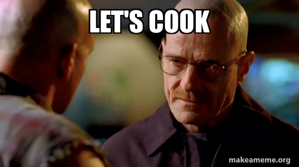</td>
    <td>
        <h4><a class="line" href="code/game_base.pl">/code/game_base.pl</a></h4>
    </td>
  </tr>
</table>

<div class="footer">
    <a href="#5">Introduction</a> | 
    <a href="#27">Backtracking</a> |
    <a href="#39">General Tips</a> |
    <a href="#63">Lists & Recursion</a> | 
    <a href="#81" class="selected">Project</a>
</div>

---

class: inverse

# Project

The main loop

```prolog
game_loop(GameState):-

    % Verify if the game is over

    % If so, show the winner

game_loop(GameState):-

    % Display the current game state

    % The current player must select a coordinate

    % Apply the move

    % Switch to the next player's turn

    % Recursive call to continue the game
```

<div class="footer">
    <a href="#5">Introduction</a> | 
    <a href="#27">Backtracking</a> |
    <a href="#39">General Tips</a> |
    <a href="#63">Lists & Recursion</a> | 
    <a href="#81" class="selected">Project</a>
</div>

---

class: inverse

# Project

The main loop

```prolog
game_loop(GameState):-

    % Verify if the game is over

    % If so, show the winner

game_loop([CurrentBoard, CurrentPlayer]):-

    display_board(CurrentBoard), display_player(CurrentPlayer),

    % The current player must select a coordinate

    % Apply the move

    % Switch to the next player's turn

    % Recursive call to continue the game
```

<div class="footer">
    <a href="#5">Introduction</a> | 
    <a href="#27">Backtracking</a> |
    <a href="#39">General Tips</a> |
    <a href="#63">Lists & Recursion</a> | 
    <a href="#81" class="selected">Project</a>
</div>

---

class: inverse

# Project

The main loop

```prolog
game_loop(GameState):-

    % Verify if the game is over

    % If so, show the winner

game_loop([CurrentBoard, CurrentPlayer]):-

    display_board(CurrentBoard), display_player(CurrentPlayer),

    choose_move(CurrentBoard, X-Y),

    % Apply the move

    % Switch to the next player's turn

    % Recursive call to continue the game
```

<div class="footer">
    <a href="#5">Introduction</a> | 
    <a href="#27">Backtracking</a> |
    <a href="#39">General Tips</a> |
    <a href="#63">Lists & Recursion</a> | 
    <a href="#81" class="selected">Project</a>
</div>

---

class: inverse

# Project

The main loop

```prolog
game_loop(GameState):-

    % Verify if the game is over

    % If so, show the winner

game_loop([CurrentBoard, CurrentPlayer]):-

    display_board(CurrentBoard), display_player(CurrentPlayer),

    choose_move(CurrentBoard, X-Y),

    piece(CurrentPlayer, Piece), put_piece(CurrentBoard, X-Y, Piece, NewBoard),

    % Switch to the next player's turn

    % Recursive call to continue the game
```

<div class="footer">
    <a href="#5">Introduction</a> | 
    <a href="#27">Backtracking</a> |
    <a href="#39">General Tips</a> |
    <a href="#63">Lists & Recursion</a> | 
    <a href="#81" class="selected">Project</a>
</div>

---

class: inverse

# Project

The main loop

```prolog
game_loop(GameState):-

    % Verify if the game is over

    % If so, show the winner

game_loop([CurrentBoard, CurrentPlayer]):-

    display_board(CurrentBoard), display_player(CurrentPlayer),

    choose_move(CurrentBoard, X-Y),

    piece(CurrentPlayer, Piece), put_piece(CurrentBoard, X-Y, Piece, NewBoard),

    switch_player(CurrentPlayer, NewPlayer),

    % Recursive call to continue the game
```

<div class="footer">
    <a href="#5">Introduction</a> | 
    <a href="#27">Backtracking</a> |
    <a href="#39">General Tips</a> |
    <a href="#63">Lists & Recursion</a> | 
    <a href="#81" class="selected">Project</a>
</div>

---

class: inverse

# Project

The main loop

```prolog
game_loop(GameState):-

    % Verify if the game is over

    % If so, show the winner

game_loop([CurrentBoard, CurrentPlayer]):-

    display_board(CurrentBoard), display_player(CurrentPlayer),

    choose_move(CurrentBoard, X-Y),

    piece(CurrentPlayer, Piece), put_piece(CurrentBoard, X-Y, Piece, NewBoard),

    switch_player(CurrentPlayer, NewPlayer),

    game_loop([NewBoard, NewPlayer]).
```

<div class="footer">
    <a href="#5">Introduction</a> | 
    <a href="#27">Backtracking</a> |
    <a href="#39">General Tips</a> |
    <a href="#63">Lists & Recursion</a> | 
    <a href="#81" class="selected">Project</a>
</div>

---

class: inverse

# Project

Let's choose the move:

```prolog
get_piece(Board, X, Y, Piece):-
    nthX(Board, Y, Line),
    nthX(Line, X, Piece).

valid_move(Board, X-Y):- 
    get_piece(Board, X, Y, empty).

choose_move(Board, X-Y):-
    length(Board, N),
    Max is N - 1,
    repeat,
    get_number(0, Max, 'Coordinate X', X),
    get_number(0, Max, 'Coordinate Y', Y),
    valid_move(Board, X-Y), 
    !.
```

<div class="footer">
    <a href="#5">Introduction</a> | 
    <a href="#27">Backtracking</a> |
    <a href="#39">General Tips</a> |
    <a href="#63">Lists & Recursion</a> | 
    <a href="#81" class="selected">Project</a>
</div>

---

class: inverse

# Project

Now we need to place the piece...

```prolog
piece(player1, o).
piece(player2, x).

put_piece(Board, X-Y, Piece, NewBoard):-
    nthX(Board, Y, Line),
    replace(X, Piece, Line, NewLine),
    replace(Y, NewLine, Board, NewBoard).
```

<div class="footer">
    <a href="#5">Introduction</a> | 
    <a href="#27">Backtracking</a> |
    <a href="#39">General Tips</a> |
    <a href="#63">Lists & Recursion</a> | 
    <a href="#81" class="selected">Project</a>
</div>

--

and switch the player...

```prolog
switch_player(player1, player2).
switch_player(player2, player1).
```

---

class: inverse

# Project

The main loop

```prolog
game_loop(GameState):-

    % Verify if the game is over

    % If so, show the winner

game_loop([CurrentBoard, CurrentPlayer]):-

    display_board(CurrentBoard), display_player(CurrentPlayer),

    choose_move(CurrentBoard, X-Y),

    piece(CurrentPlayer, Piece), put_piece(CurrentBoard, X-Y, Piece, NewBoard),

    switch_player(CurrentPlayer, NewPlayer),

    game_loop([NewBoard, NewPlayer]).
```

<div class="footer">
    <a href="#5">Introduction</a> | 
    <a href="#27">Backtracking</a> |
    <a href="#39">General Tips</a> |
    <a href="#63">Lists & Recursion</a> | 
    <a href="#81" class="selected">Project</a>
</div>

---

class: inverse

# Project

The main loop

```prolog
game_loop([CurrentBoard, CurrentPlayer]):-

    game_over(CurrentBoard),

    % If so, show the winner

game_loop([CurrentBoard, CurrentPlayer]):-

    display_board(CurrentBoard), display_player(CurrentPlayer),

    choose_move(CurrentBoard, X-Y),

    piece(CurrentPlayer, Piece), put_piece(CurrentBoard, X-Y, Piece, NewBoard),

    switch_player(CurrentPlayer, NewPlayer),

    game_loop([NewBoard, NewPlayer]).
```

<div class="footer">
    <a href="#5">Introduction</a> | 
    <a href="#27">Backtracking</a> |
    <a href="#39">General Tips</a> |
    <a href="#63">Lists & Recursion</a> | 
    <a href="#81" class="selected">Project</a>
</div>

---

class: inverse

# Project

The main loop

```prolog
game_loop([CurrentBoard, CurrentPlayer]):-

    game_over(CurrentBoard),

    show_winner(CurrentPlayer), !. % Important!

game_loop([CurrentBoard, CurrentPlayer]):-

    display_board(CurrentBoard), display_player(CurrentPlayer),

    choose_move(CurrentBoard, X-Y),

    piece(CurrentPlayer, Piece), put_piece(CurrentBoard, X-Y, Piece, NewBoard),

    switch_player(CurrentPlayer, NewPlayer),

    game_loop([NewBoard, NewPlayer]).
```

<div class="footer">
    <a href="#5">Introduction</a> | 
    <a href="#27">Backtracking</a> |
    <a href="#39">General Tips</a> |
    <a href="#63">Lists & Recursion</a> | 
    <a href="#81" class="selected">Project</a>
</div>

---

class: inverse

# Project

Here we can assume that the game ends when there are no more possible moves. Let's reuse the **valid_move(Board, X-Y)** predicate in an intelligent way:

```prolog
generate_moves(Board, Moves):-
    length(Board, N),
    Max is N - 1,
    findall(X-Y, (
        between(0, Max, X), 
        between(0, Max, Y), 
        valid_move(Board, X-Y)
    ), Moves).
```

<div class="footer">
    <a href="#5">Introduction</a> | 
    <a href="#27">Backtracking</a> |
    <a href="#39">General Tips</a> |
    <a href="#63">Lists & Recursion</a> | 
    <a href="#81" class="selected">Project</a>
</div>

--

And then:

```prolog
game_over(Board):-
    generate_moves(Board, Moves),
    length(Moves, 0).
```

---

class: inverse

# Project

Oh noooo, how are we going to handle the bot's choices now?

- For the **Simple Bot**, just apply one of the available moves randomly:

<div class="footer">
    <a href="#5">Introduction</a> | 
    <a href="#27">Backtracking</a> |
    <a href="#39">General Tips</a> |
    <a href="#63">Lists & Recursion</a> | 
    <a href="#81" class="selected">Project</a>
</div>

--

```prolog
game_loop([CurrentBoard, CurrentPlayer]):-

    % ...

    piece(CurrentPlayer, Piece),
    generate_moves(CurrentBoard, Moves),
    random_member(X-Y, Moves),

    put_piece(CurrentBoard, X-Y, Piece, NewBoard),

    % ...
```

---

class: inverse

# Project

Oh noooo, how are we going to handle the bot's choices now?

- For the **Expert Bot**: generate all possible boards after each move, evaluate them using a scoring function, and select the most optimal one:

<div class="footer">
    <a href="#5">Introduction</a> | 
    <a href="#27">Backtracking</a> |
    <a href="#39">General Tips</a> |
    <a href="#63">Lists & Recursion</a> | 
    <a href="#81" class="selected">Project</a>
</div>

--

```prolog
game_loop([CurrentBoard, CurrentPlayer]):-
    % ...
    piece(CurrentPlayer, Piece),
    generate_moves(CurrentBoard, Moves),

    findall(
        Points-BoardAttemp, (
            member(X-Y, Moves), 
            put_piece(CurrentBoard, X-Y, NextBoardAttemp), 
            eval(NextBoardAttemp, CurrentPlayer, Points)
        )
        Attemps
    ),

    keysort(Attemps, SortedAttemps),
    length(Attemps, Size), Index is Size - 1,
    nthX(SortedAttemps, Index, _-NewBoard),
    % ...
```

---

class: inverse

# Project

For more advanced projects, we can use the **Minimax algorithm**, which allows us to anticipate the opponent's moves and attempt to minimize their future points. In essence, the decision-making now considers:

- The points the bot will gain.
- The points the opponent might gain if the bot selects a particular option.

Essentially, it tries to maximize the result of:

- eval(CurrentBoard) - eval(NextBoard).

Check out a possible implementation in the <a class="line" href="https://github.com/Fabio-A-Sa/Y3S1-ProgFuncionalLogica/tree/main/Project2">Barca Project [PFL, 2022]</a>.

<div class="footer">
    <a href="#5">Introduction</a> | 
    <a href="#27">Backtracking</a> |
    <a href="#39">General Tips</a> |
    <a href="#63">Lists & Recursion</a> | 
    <a href="#81" class="selected">Project</a>
</div>

---

class: inverse, middle, center

# Thank you!

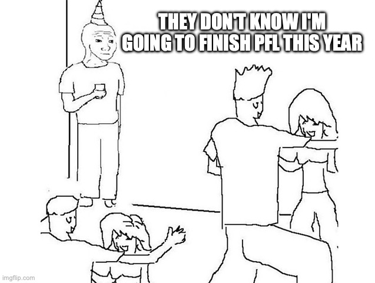

#### Any questions?

---

class: inverse, middle, center

# Feedback

<table>
  <tr>
    <td width=70%></td>
    <td>
        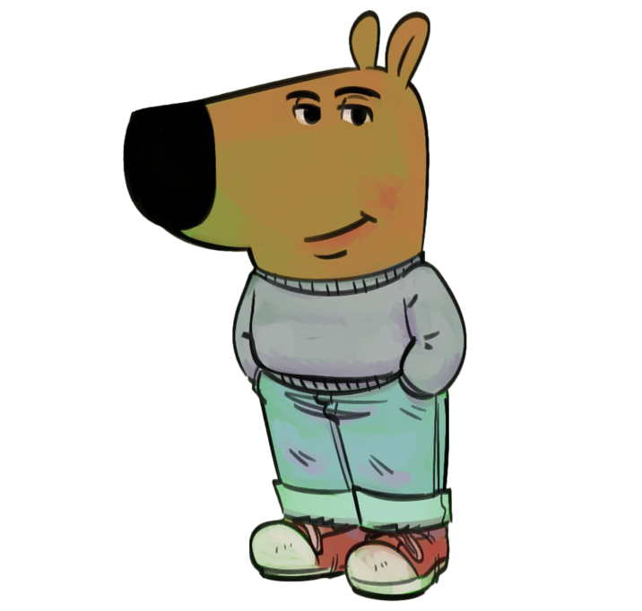
    </td>
  </tr>
</table>

---

class: center, middle, inverse, small-images

# **Prolog Workshop**

### *From Facts to Fun: putting the Pro in Prolog*


<div class="footer">December 2024</div>