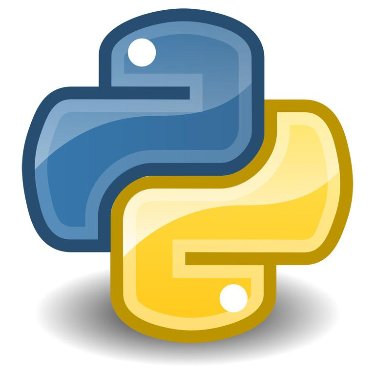

class: center, middle, inverse, small-images

# Introdução à Programação em Python


---
class: inverse

# Agenda

1. Introdução à programação
2. Programação em Python
3. Hello World
4. Variáveis
5. Operações Aritméticas
6. Estruturas de Condição
7. Estruturas de Repetição
8. Operações com Listas
9. Operações com Strings
10. Funções
11. Interação com o Utilizador
12. Tuplos
13. Dicionários
14. Bibliotecas e Reutilização de Código

---
class: image-spaced

# Introdução à Programação


---
class: small-images, image-spaced

# Programação em Python


---
# Programação em Python
## Filosofia de Python
- Beautiful is better than ugly
- Explicit is better than implicit
- Simple is better than complex
- Complex is better than complicated
- Readability counts
- ...

---
class: center, middle

https://www.onlinegdb.com/online_python_compiler

---

# Hello World
O programa "Hello World" é o típico primeiro programa que todos fazem numa nova linguagem de programação. Em Python, este programa destaca-se pela sua simplicidade:
```python
# Programa Hello World
print("Hello World! :D")
```

---
class: center, middle, inverse
# Variáveis

---
class: image-spaced

# Variáveis
## O que é uma variável?
Uma variável funciona como uma "caixa" onde podemos armazenar dados.


---

# Variáveis
## Tipos de variáveis nativos
Em python, há 6 principais tipos de variáveis (tipos de dados) nativos da linguagem (isto é, sem ser necessário "instalar" extensões adicionais):
- Números
- Booleanos (Verdadeiro ou Falso)
- Strings (cadeias de caratéres)
- Listas 
- Tuplos*
- Dicionários*

Estes dois últimos tipos de dados são mais complexos e serão abordados no final do workshop.

---
# Variáveis
## Números
Números podem ser de naturezas distintas:
- Números Inteiros (e.g. 42)
- Números Reais (e.g. 2.81)
- Números Reais representados em notação ciêntífica (e.g. 5.972e24, ou seja, 5.972 elevado a 24)
- ...

## Booleanos
Valores booleanos seguem a Álgebra de Boole e podem tomar apenas dois valores:
- True (Verdadeiro)
- False (Falso)

---
# Variáveis
## Strings
Strings representam cadeias de caráteres genéricas (letras, palavras ou frases). São sempre delimitadas por aspas. Exemplos:
- "X"
- "Galileu"
- "The perks of being a Wallflower"

## Listas
Listas representam contentores de dados e podem (e devem) ser utilizados para armazer conjuntos de dados de tamanho constante ou variável. Exemplos:
- [1, 4, 9, 16, 25, 36, 49, 64, 81, 100]
- ["Moonlight Sonata", "Gymnopédie no. 1", "Piano Concerto no. 21", "Air on the G-String"]

---

# Variáveis
```python
# Números
num = 125
pi = 3.141592
velocidade_luz = 3.0e8

# Booleanos
um_booleano = True
outro_booleano = False

# Strings
frase = "Ground control to Major Tom"
outra_frase = "Parsley, Sage, Rosemary and Thyme"

# Listas
numeros_primos = [2, 3, 5, 7]
animaisDeEstimacao = ["Cão", "Gato", "Pássaro", "Urso Pardo"]

print(num)
print(pi)
print(velocidade_luz)
print(um_booleano)
print(outro_booleano)
print(frase)
print(outra_frase)
print(numeros_primos)
print(animaisDeEstimacao)
```

---
class: center, middle, inverse
# Operações Aritméticas

---
# Operações Aritméticas
Em python, há 7 operações aritméticas básicas para realizar cálculos numéricos:
- Soma, +
- Subtração, -
- Multiplicação, *
- Divisão, /
- Expoente, **
- Divisão Inteira, //
- Resto da Divisão Inteira, %

---
# Operações Aritméticas
```python
num1 = 13
num2 = 2

print("num1 + num2 = ")   # Soma
print(num1 + num2)

print("num1 - num2 = ")   # Subtração
print(num1 - num2)

print("num1 * num2 = ")   # Multiplicação
print(num1 * num2)

print("num1 / num2 = ")   # Divisão
print(num1 / num2)

print("num1 ** num2 = ")  # Expoente
print(num1 ** num2)

print("num1 // num2 = ")  # Divisão Inteira
print(num1 // num2)

print("num1 % num2 = ")   # Resto da Divisão Inteira
print(num1 % num2)
```

---
# Operações Aritméticas
Os operadores aritméticos podem ser utilizados com outros tipos de variáveis (que não números). 

Podem ser utilizados com strings:
```python
agradecimento = "Thank you very much, "
nome = "Chbosky"

frase = agradecimento + nome
print(frase)
```

Ou com listas:
```python
lista1 = [1,2,3,4,5]
lista2 = [6,7,8,9,10]

listaGrande = lista1 + lista2
print(listaGrande)
```

---
class: center, middle, inverse
# Estruturas de Condição

---
# Estruturas de Condição
## Operadores Lógicos
- &gt; (maior)
- < (menor)
- == (igual)
- != (diferente)
- &gt;= (maior ou igual)
- <= (menor ou igual)
- and (operador booleano "E")
- or (operador booleano "Ou")
- not (operador booleano "Não")

---
# Estruturas de Condição
Estruturas de condição permitem-nos executar certas secções de código apenas se certas condições se verificarem.

Estas estruturas seguem o seguinte modelo:
```python
if (<condição>):
    <instrução1>
    <instrução2>
    <instrução3>
    ...
else:
    <instrução4>
    <instrução5>
    <instrução6>
    ...
```

---
# Estruturas de Condição
## Exemplo 1: Verificação de Idade
```python
idade = 16

if (idade < 18):
    print("Menor de Idade!")
else:
    print("Maior de Idade")
```

---
# Estruturas de Condição
## Exemplo 2: Polícia em Ação
```python
esta_embriegado = False
tem_carta = False


if (esta_embriegado or not tem_carta):
    print("Criminoso!")
else:
    print("Está tudo bem c:")
```

---
# Estruturas de Condição
## Exemplo 3: Polícia em Ação - Multas!
```python
esta_embriegado = False
tem_carta = False
multa = None    # Não tem qualquer valor atribuido, apesar de existir!

if (esta_embriegado and not tem_carta):
    multa = 300
elif (esta_embriegado and tem_carta):
    multa = 200
elif (not esta_embriegado and not tem_carta):
    multa = 100
else:
    multa = 0

print("Multa:")
print(multa)
```

---
class: center, middle, inverse
# Estruturas de Repetição

---
# Estruturas de Repetição
Estruturas de repetição permitem-nos executar certas secções de código multiplas vezes (sem ter que reescrever o código multiplas vezes).

---
# Estruturas de Repetição
## O Ciclo While
O Ciclo While permite executar um conjunto de instruções enquanto uma condição específica se verificar.

Esta estrutura segue o seguinte modelo:
```python
while (<condição>):
    <instrução1>
    <instrução2>
    <instrução3>
```

**Exemplo:**
```python
numero = 0

while (numero < 10):
    numero = numero + 1
    print(numero)
```

---
# Estruturas de Repetição
## O Ciclo For
O Ciclo For permite executar um conjunto de instruções um número específico de vezes.

Esta estrutura segue o seguinte modelo:
```python
for <variável> in range(<numero>):
    <instrução1>
    <instrução2>
    <instrução3>
```

---
# Estruturas de Repetição
**Exemplo 1:**
```python
# Imprimir no ecrã todos os números entre 0 e 9
for numero in range(10):
    print(numero)
```

**Exemplo 2:**
```python
# Imprimir no ecrã todos os números entre 5 e 10
for numero in range(5, 11):
    print(numero)
```

**Exemplo 3:**
```python
# Imprimir no ecrã todas as frutas
rock_stars = ["Freddy", "Roger", "Richard", "Brian", "David"]
for person in rock_stars:
    print(person)
```

---
# Estruturas de Repetição
A instrução **continue** serve para saltar para a próxima iteração do ciclo:
```python
# Imprimir no ecrã apenas os números pares
for numero in range(10):
    if (numero % 2 != 0):
        continue
    print(numero)
```

A instrução **break** serve para sair do ciclo a meio da sua execução:
```python
# Imprimir todos os números até encontrar um múltiplo de 7
for numero in range(1,50):
    if (numero % 7 == 0):
        break
    print(numero)
```

---
class: center, middle, inverse
# Operações com Listas

---
# Operações com Listas
Aceder ao elemento de uma lista:
```python
carbonara = ["bacon", "azeite", "massa", "ovos", "pimenta preta", "queijo"]
print(carbonara[0]) # Obter primeiro elemento da lista
print(carbonara[2]) # Obter terceiro elemento da lista
```

Remover elemento de uma lista:
```python
carbonara = ["bacon", "azeite", "massa", "ovos", "pimenta preta", "queijo"]
del carbonara[0]    # Sem bacon :(
print(carbonara)
```

Adicionar um elemento a uma lista:
```python
carbonara = ["bacon", "azeite", "massa", "ovos", "pimenta preta", "queijo"]
carbonara.append("cebola")
carbonara.insert(2, "mais azeite")
print(carbonara)
```

---
# Operações com Listas

Obter uma sublista:
```python
carbonara = ["bacon", "azeite", "massa", "ovos", "pimenta preta", "queijo"]
print(carbonara[1:4])   # Obter sublista com elementos 1, 2 e 3 da lista original
print(carbonara[2:])    # Obter todos os elementos do segundo para a frente
```

Inverter uma lista:
```python
fibonacci = [0, 1, 1, 2, 3, 5, 8]
fibonacci.reverse()
print(fibonacci)
```

Ordenar uma lista:
```python
lotaria = [41, 3, 1, 33, 42]
lotaria.sort()
print(lotaria)
```

---
# Operações com Listas

Tamanho de uma lista:
```python
carbonara = ["bacon", "azeite", "massa", "ovos", "pimenta preta", "queijo"]
numero_ingredientes = len(carbonara)
print(numero_ingredientes)
```

Obter o mínimo e o máximo de uma lista:
```python
lotaria = [41, 3, 1, 33, 42]
minimo = min(lotaria)
maximo = max(lotaria)
print(minimo)
print(maximo)
```

---
# Operações com Listas
**Exemplo:** Soma de todos os elementos de uma lista
```python
lista_numeros = [1, 2, 3, 4]
soma = 0

for numero in lista_numeros:
    soma = soma + numero
    
print(soma)
```

---
class: center, middle, inverse
# Operações com Strings

---
# Operações com Strings

Aceder ao elemento de uma string:
```python
nome = "Pedro"
print(nome[3])  # Obter terceira letra da String
print(nome[-1]) # Obter última letra da String
```

Tamanho de uma string:
```python
autor = "Chbosky"
tamanho = len(autor)
print(tamanho)
```

Formatar uma string:
```python
frase = "hEllO wOrLD"
print(frase.upper())  # TUDO EM MAIÚSCULAS!
print(frase.lower())  # tudo em minúsculas.
```

---
# Operações com Strings

Obter parte de uma string:
```python
frase = "Onde está o Wallie?"
nome = frase[12:18]
verbo = frase[5:9]

print(nome)
print(verbo)
```

Encontrar uma string dentro de outra string
```python
frase = "Onde está o Wallie?"
indice_nome = frase.find("Wallie")      # Índice 12
indice_vegetal = frase.find("batata")   # Não existe!!

print(indice_nome)
print(indice_vegetal)
```

---
# Operações com Strings

Substituir parte de uma string:
```python
frase_presente = "Onde está o Wallie?"
frase_passado = frase_presente.replace("está", "esteve") # Presente -> Passado
print(frase_passado)
```

Contar o número de ocorrências de uma string dentro de outra string:
```python
frase = "A ana comeu o pudim da mariana"
numero_ocorrencias = frase.count("ana")
numero_ocorrencias2 = frase.count("ana", 10)    # Ocorrências a partir do índice 10

print(numero_ocorrencias)
print(numero_ocorrencias2)
```

---
class: center, middle, inverse
# Funções

---
# Funções
Funções são a forma de reutilizarmos código! 

Elas funcionam tal e qual como uma função matemática.

Um exemplo - Função matemática f(x,y) = 4x + 2y²
```python
# Definição da função
def funcao(x, y):
    return 4*x + 2*y*y

# Utilização da função
valor1 = funcao(2, 1)
valor2 = funcao(5, 0)
print(valor1)
print(valor2)
```


---
# Funções
Funções são também a forma de reutilizarmos código! 

A seguinte secção de código calcula a soma de 4 listas diferentes:
```python
lista1 = [1, 2, 3, 4]
lista2 = [2, 2, 2, 2, 2, 2]
lista3 = [0, 0, 1, 0, 1]

soma = 0
for numero in lista1:
    soma = soma + numero
print(soma)

soma = 0
for numero in lista2:
    soma = soma + numero
print(soma)

soma = 0
for numero in lista3:
    soma = soma + numero
print(soma)
```

**Problema**: Código repetido três vezes - uma vez para cada lista 

---
# Funções
**Solução**: Definir uma função para somar uma lista!
```python
def soma_lista(lista):  # A função recebe um ARGUMENTO: a lista a somar
    soma = 0
    for numero in lista:
        soma = soma + numero
    return soma         # O valor que a função que retorna

lista1 = [1, 2, 3, 4]
lista2 = [2, 2, 2, 2, 2, 2]
lista3 = [0, 0, 1, 0, 1]

soma1 = soma_lista(lista1)
soma2 = soma_lista(lista2)
soma3 = soma_lista(lista3)

print(soma1)
print(soma2)
print(soma3)
```

---
class: center, middle, inverse
# Interação com o Utilizador

---
# Interação com o Utilizador

**Exemplo 1:** Perguntas simples ao utilizador

```python
nome = input("Insira o seu nome: ")
idade = input("Insira a sua idade: ")

print("Nome: " + nome)
print("Idade: " + idade)
```

---
# Interação com o Utilizador

**Exemplo 2:** Tirar a carta!

```python
idade = input("Insira a sua idade: ")
idade = int(idade)  # Converter para inteiro!!!

if (idade < 16):
    print("Não pode tirar a carta :(")
if (idade >= 16):
    print("Pode tirar a carta de motociclos")
if (idade >= 18):
    print("Pode tirar a carta de ligeiros")
if (idade >= 21):
    print("Pode tirar a carta de pesados")
```

---
# Interação com o Utilizador

**Exemplo 3:** Construir uma lista de 3 números pares:

```python
lista = []

while (len(lista) < 3):
    resposta = input("Insira um número: ")
    numero = int(resposta)
    
    if (numero % 2 == 0):
        lista.append(numero)
    else:
        print("Número introduzido não é par! Tente novamente.")
        
print("Lista introduzida: ")
print(lista)
```

---
class: center, middle, inverse
# Tuplos

---
# Tuplos
Tuplos são muito semelhantes a listas, embora sejam uma estrutura de dados **imutável**, isto é, assim que são criados **não podem ser alterados**.

```python
linguagens = ("c++", "python", "java", "php", "golang") # Parentesis curvos!
numero_linguagens = len(linguagens)

print("Este é um workshop de " + linguagens[1])
print(numero_linguagens)

print("Um sub-tupulo:")
print(linguagens[1:3])
```

Como os tuplos são **imutáveis**, as seguintes instruções iriam originar um erro!
```python
linguagens = ("c++", "python", "java", "php", "golang")
del linguagens[1]               # Impossível remover!
linguagens[3] = "javascript"    # Impossível alterar!
```


---
class: center, middle, inverse
# Dicionários

---
# Dicionários
Dicionários são idênticos a listas, mas em vez de serem indexados por números naturais consecutivos, podem ser indexados por qualquer tipo de variável!

Funcionam, de certa forma, como uma tabela:

```python
matriculas = {"Paulo": "44-XX-77", "Mariana": "14-MH-19"}
print(matriculas["Paulo"])
print(matriculas["Mariana"])
print(matriculas["Ze"])     # Origina um erro porque esta 
                            # entrada não existe no dicionário!
```

Cada entrada de um dicionário designa-se por um par "**Chave: Valor**". No exemplo acima, as **chaves** seriam os nomes e os **valores** seriam os números de telefone / telemóvel.

---
# Dicionários
Muitas funções anteriormente estudadas aplicam-se também a dicionários!

```python
paginas_amarelas = {"Paulo": 224127304, "Ana": 913845822, "Pedro": 933744912}

# Obter número de entradas nas páginas amarelas
print(len(paginas_amarelas))

# Remover um contacto
del paginas_amarelas["Pedro"]

# Alterar um contacto
paginas_amarelas["Ana"] = 123456789

print(paginas_amarelas)
```

---
# Dicionários
Outras funções são exclusivas aos dicionários:

```python
paginas_amarelas = {"Paulo": 224127304, "Ana": 913845822, "Pedro": 933744912}

# Criar uma "lista" com todos os nomes (chaves)
nomes = paginas_amarelas.keys()

# Criar uma "lista" com todos os números (valores)
numeros = paginas_amarelas.values()

# Verificar se elemento se encontra no dicionário
if ("Paulo" in paginas_amarelas):
    print("Contacto do Paulo encontrado!")
    print(paginas_amarelas["Paulo"])
else:
    print("Não foi encontrado o número do Paulo")
```

---
class: center, middle, inverse
# Bibliotecas e Reutilização de Código

---
# Bibliotecas e Reutilização de Código
Há muitos developers de python espalhados por todo o mundo, todos a desenvolver milhares de funções diariamente.

A melhor forma de desenvolver código rapidamente e colaborativamente com outras pessoas é **reutilizando** código desenvolvido por outros.

Esse código encontra-se dentro de **Bibliotecas**, que são um ficheiro (ou conjuntos de ficheiros) com diversas funções (e outras coisas!).

Python é famoso pelo seu "*lado científico*" fácil de programar.

Para importar uma biblioteca, utiliza-se a instrução **import**:

```python
import <nome_da_biblioteca>
```

---
# Bibliotecas e Reutilização de Código
**Exemplo 1:** Programa para fazer um gráfico que traça a variação da posição em função do tempo:

```python
import matplotlib.pyplot as plt

time = [0, 1, 2, 3]
position = [0, 100, 200, 300]
plt.plot(time, position)
plt.xlabel('Time (hr)')
plt.ylabel('Position (km)')
```

---
class: medium-images
# Bibliotecas e Reutilização de Código
**Exemplo 1:** Resultado


---
# Bibliotecas e Reutilização de Código
**Exemplo 2:** Programa para fazer um gráfico da utilização das linguages de programação:
```python
import matplotlib.pyplot as plt; plt.rcdefaults()
import numpy as np
import matplotlib.pyplot as plt
 
objects = ('Python', 'C++', 'Java', 'Perl', 'Scala', 'Lisp')
y_pos = np.arange(len(objects))
performance = [10,8,6,4,2,1]
 
plt.bar(y_pos, performance, align='center', alpha=0.5)
plt.xticks(y_pos, objects)
plt.ylabel('Usage')
plt.title('Programming language usage')
 
plt.show()
```

---
class: medium-images
# Bibliotecas e Reutilização de Código
**Exemplo 2:** Resultado


---
class: center, middle, inverse
# Bónus: Exercícios

---
# Bónus: Exercícios
## Exercício 1
Desenvolve um programa que, dado um número inserido pelo utilizador, o caraterize como ímpar ou par.

---
# Bónus: Exercícios
## Exercício 1 - Solução
```python
resposta = input("Insira um número: ")
numero = int(resposta)

if (numero % 2 == 0):   
    print("O número é par.")
else:                   
    print("O número é ímpar.")
```

---
# Bónus: Exercícios
## Exercício 2
Desenvolve um programa que pede ao utilizador que insira 5 números e que calcule a sua média.

---
# Bónus: Exercícios
## Exercício 2 - Solução
```python
# Função para obter números introduzidos pelo utilizador
def obterNumeros():
    numeros = []
    for i in range(5):
        resposta = input("Insira um número: ")
        numeros.append(int(resposta))
    return numeros

# Função para obter a média de uma lista de números
def obterMedia(numeros):
    soma = 0
    for numero in numeros:
        soma = soma + numero
    return (soma/len(numeros))
    

numeros = obterNumeros()
media = obterMedia(numeros)
print(media)
```

---
class: center, middle, inverse
# Fim!