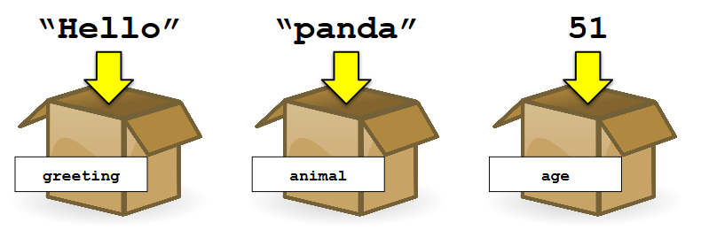
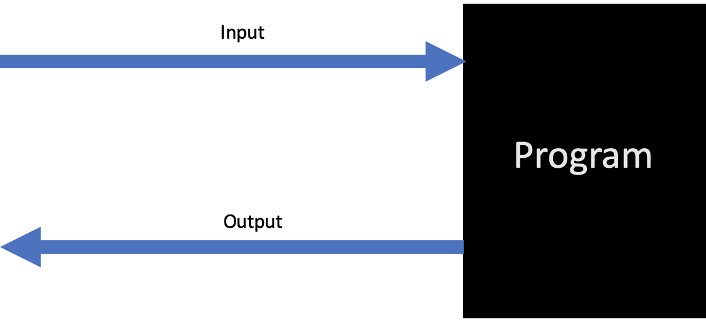
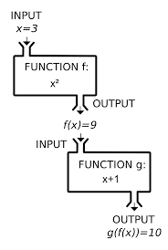
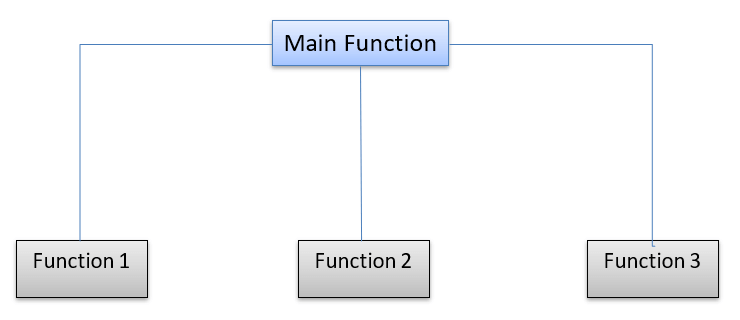
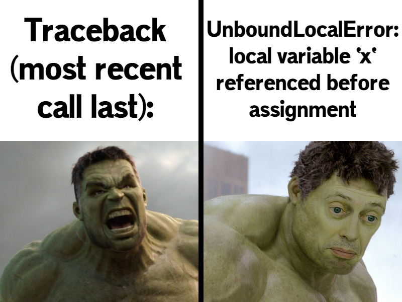

class: center, middle, inverse, small-images

# Introdução a Programação em Python


---
class: inverse

# Temas

1. Programação - O que é?
2. Programar em Python
3. Hello World - O Primeiro Programa
4. Variáveis
5. Operações Aritméticas
6. Estruturas Condicionais (if)
7. Estruturas de Repetição (for, while)
8. Operações com Listas
9. Operações com Strings
10. Interação com o Utilizador
11. Funções
12. Tuplos
13. Dicionários
14. Debugging
15. Bibliotecas (Reutilização de Código)

---
class: image-spaced

# Programação - O que é?
**Linguagens de Alto Nível** - Linguagens de Programação, como Java, C++ ou Python, que precisam de ser traduzidas para algo que o computador consiga executar.


---

**Linguagens Compiladas** - Linguagem que, após compilada, gera machine code (código-máquina) - C++, C, C#...

**Linguagens Interpretadas** - Linguagens em que o código, ao invés de ser compilado, é lido e executado por um programa - Python, JavaScript, BASIC...
<br/><br/><br/>


---
class: small-images, image-spaced

# Programar em Python
- **Replit**: https://replit.com/
- GDB: https://www.onlinegdb.com/
- Python 3.10 (Shell): https://www.python.org/downloads/release/python-3100/
- **VS Code**: https://code.visualstudio.com/
- **Pycharm**: https://www.jetbrains.com/pycharm/
- **Spyder/Anaconda**: https://www.anaconda.com/

---
class: center, middle


---
# Programar em Python
## The Zen of Python
- Beautiful is better than ugly
- Explicit is better than implicit
- Simple is better than complex
- Complex is better than complicated
- Readability counts
- ...(it goes on but you get the point)

---
class: center, middle


---

# Hello World!
O programa "Hello World" é o típico primeiro programa que todos os iniciantes fazem numa qualquer nova linguagem de programação; em Python, este programa destaca-se pela sua simplicidade (o mesmo programa em C++ abaixo, **apenas** para efeitos de comparação):

```python
# O teu primeiro programa em Python! :)

print("Hello World!")
```
```cpp
// Não tentem isto em casa
#include <iostream>

using namespace std;

int main()
{
    cout<<"Hello World";

    return 0;
}
```

---
class: center, middle, inverse
# Variáveis


---
class: image-spaced

# Variáveis
## O que é uma variável?

Uma variável funciona como se fosse um "contentor", onde podemos armazenar dados.


---

# Variáveis
## Tipos de variáveis nativos

Em Python, há essencialmente 6 tipos principais de variáveis (tipos de dados) nativos da linguagem (isto é, sem ser necessário utilizar extensões adicionais):
- Números (ints e floats)
- Booleanos (Verdadeiro ou Falso)
- Strings (cadeias de caracteres)
- Listas 
- Tuplos <--
- Dicionários <--

(Estes dois últimos tipos de dados são mais complexos e serão abordados no final do workshop.)

**NOTA**: Ao contrário de outras linguagens (como C++), é perfeitamente possível alterar uma variável int (número) para uma variável do tipo string em Python, pois não é necessário atribuir nenhum tipo específico às variáveis.

---
# Variáveis
## Números
Números podem ser de naturezas distintas:
- Números Inteiros - ints (e.g. 42)
- Números Reais - floats (e.g. 2.81)
- Números Reais representados em notação científica (e.g. 5.972e24, ou seja, 5.972 elevado a 24)
- ...

```python

x = 3
y = 2.5
pi = 3.141592
mach_10 = 3.43e3

print (x + y)

# Output: 5.5
```
---
# Variáveis
## Booleanos

Valores booleanos seguem a Álgebra de Boole, podendo tomar apenas dois valores:
- True (Verdadeiro)
- False (Falso)

```python
best_halo_is_reach = True
python_sucks = False
print (best_halo_is_reach)

# Output: True
```

---
# Variáveis
## Strings

Strings representam cadeias de caracteres genéricas (letras, palavras, frases); as strings são **sempre** delimitadas por aspas.
- "X"
- "2016"
- "If only I could be so grossly incandescent!"

```python
senate = "Did you ever hear the tragedy of Darth Plagueis The Wise?"
also_senate = "I thought not. It’s not a story the Jedi would tell you."

print (senate + " " + also_senate)

# Output: Did you ever hear the tragedy of Darth Plagueis The Wise? I thought not. It’s not a story the Jedi would tell you.
```

---
# Variáveis
## Listas

As listas representam "contentores" com capacidade de armazenar vários dados; são utilizadas para armazenar conjuntos de dados de qualquer tipo (mesmo de tipos diferentes) numa única "coleção" de tamanho variável (no sentido em que podemos alterar o seu tamanho, se assim o desejarmos!).

```python
lista_1 = [1, 3.0, 45, -2, 89, 1456732]

lista_2 = ["a", "67", 23, "Elden Ring"]

print(lista_1)

print(lista_2)
```

---
# Variáveis
**NOTA**: As listas são coleções mutáveis, pelo que podem ser gerados **aliases**: uma lista tem dois nomes/duas variáveis diferentes, logo alterações numa refletem-se na outra e vice-versa (podemos o usar o **.copy() Method** para evitar isto).

**Exemplo:**

```python
a = [1,2,3]

b = [1,2,3]

print(b is a)  # FALSO, pois não são a mesma coisa (lista)

c = a

d = a.copy()

print(c is a)  # VERDADEIRO
print(d is a)  # FALSO

a[1] = 4
print(c)       # c = a = [1,4,3]
print(d)       # d = [1,2,3]
```

---
# Operações Aritméticas
Em Python, existem 7 tipos de operações aritméticas básicas, que nos permitem realizar cálculos numéricos:

- Soma, **+**
- Subtração, **-**
- Multiplicação, __*__
- Divisão, **/**
- Expoente, __**__
- Divisão Inteira (Integer Division/Floor Division), **//**
- Resto da Divisão Inteira (Modulus), **%**

**NOTA**: Ao contrário de linguagens como C++, Python possui um símbolo específico que diferencia a divisão "normal" de divisão inteira!

---
# Operações Aritméticas
```python
x = 8
y = 3

print("x + y = ", x+y)   # Soma

print("x - y = ", x-y)  # Subtração

print("x * y = ", x*y)   # Multiplicação

print("x / y = ", x/y)   # Divisão

print("x ** y = ", x**y)  # Expoente

print("x // y = ", x//y)  # Divisão Inteira (Integer/Floor Division)

print("x % y = ", x%y)   # Resto da Divisão Inteira (Modulus)
```

---
# Operações Aritméticas

Apesar de ser principalmente utilizados para operações numéricas, alguns destes operadores podem também ser utilizados com outros tipos de variáveis (strings) ou até com coleções (listas) - ainda que a sua funcionalidade seja ligeiramente diferente!

**Strings**:

```python
senate = "Did you ever hear the tragedy of Darth Plagueis The Wise?"
also_senate = "I thought not. It’s not a story the Jedi would tell you."

tragedy = senate + also_senate

print (tragedy)
```

**Listas**:
```python
score_1P = [45, 58, 23, 97, 10]
score_2P = [55, 60, 58, 82, 14]

all_scores = score_1P + score_2P

print(all_scores)
```

---
class: center, middle, inverse
# Estruturas Condicionais (**if**)

---
# Estruturas Condicionais
## Operadores Lógicos

- **>** ("maior que")
- **<** ("menor que")
- **==** ("igual a")
- **!=** ("diferente de")
- **&gt;=** ("maior ou igual que")
- **<=** ("menor ou igual que")
- **and** (logic AND - "e", operador booleano)
- **or** (logic OR - "ou", operador booleano)
- **not** (logic NOT - "não", operador booleano)

Estes operadores permitem-nos obter valores lógicos por si só (True ou False).

```python
attempt = 8765
key = 8764
value = (attempt == key)

print(value)    # prints 'False'
```

---
# Estruturas Condicionais

No entanto, a principal utilidade dos operadores lógicos está em permitir a criação de estruturas condicionais, que permitem executar certas secções de código **apenas se certas condições se verificarem**, através do uso de **if statements**.

Estas estruturas seguem o seguinte modelo (pseudo-código):
```python
if (<condição>):
    <instrução1>
    <instrução2>
    <instrução3>
    ...
elif (<condição>):
    <instrução4>
    <instrução5>
    <instrução6>
else:
    <instrução7>
    <instrução8>
    <instrução9>
    ...
```
---
# Estruturas Condicionais
- **if**: Se a condição for verdadeira, executa o código ("body" do if).
- **elif**: Significa "else if"; se a condição do *if* for falsa, testar a condição de *elif* e executar o código se esta for verdadeira.
- **else**: Se nenhuma das condições anteriores se verifica (é verdadeira), executar este código.

**IMPORTANTE**: Ao contrário de outras linguagens, a indentação (indentation) é muito importante em Python; falhas de indentação levam a erros no programa/código nesta linguagem.

---
# Estruturas Condicionais
## Exemplo 1.1: Verificação de Idade
```python
idade = 16

if (idade < 18):
    print("Menor de Idade")
else:
    print("Maior de Idade")
```

## Exemplo 1.2: Verificação de Idade (ERRO - verificar indentação!)
```python
idade = 16

if (idade < 18):
print("Menor de Idade")
else:
print("Maior de Idade")
```

---
# Estruturas Condicionais
## Exemplo 2: Batalha Simples
```python
player_level = 48
boss_level = 50
great_weapon = True


if (player_level > boss_level and great_weapon):
    print("Vitória!")
elif (player_level > boss_level and (not great_weapon)):
    print("Sobreviveste...por um triz")
else:
    print("Derrota")
```

---
# Estruturas Condicionais
## Exemplo 3: Depois da Queima.py
```python
drunk = False
license = False
ticket = None    # Se quisermos criar uma variável sem nenhum valor atribuído, 
# podemos atribuir-lhe o valor None

if (drunk and not license):
    ticket = 300
elif (drunk and license):
    ticket = 200
elif (not drunk and not license):
    ticket = 100
else:
    ticket = 0

print("Multa:", ticket)
```

---
class: center, middle, inverse
# Estruturas de Repetição (for, while)

---
# Estruturas de Repetição

Estruturas de repetição permitem-nos executar certas secções de código múltiplas vezes (sem ter que reescrever o código várias vezes), através da criação de loops com um alcance definido (**for loops**) ou indefinido (**while loops**)

---
# Estruturas de Repetição
## O ciclo While (while loop)
Os ciclos While permitem executar um conjunto de instruções um número indefinido de vezes - enquanto uma condição específica se verificar, o código presente no body do loop vai correr.

Os while loops são representados da seguinte forma (pseudo-código):
```python
while (<condição>):
    <instrução1>
    <instrução2>
    <instrução3>
```

**Exemplo: Contador**
```python
num = 0

while (num < 10):
    num = num + 1
    print(num)
final = num
print(final)
```
No entanto, não é estritamente necessário ter uma condição explícita para criar um while loop; podemos criar loops somente com condições booleanas (no entanto, é preciso utilizar statements específicos para terminar o loop; caso contrário, ele continuará a correr infinitamente, causando erros/crashes).

```python
num = 0
while true:
    num += 1
    ...
```

---
# Estruturas de Repetição
## O ciclo For (for loops)

Ao invés dos ciclos While, os ciclos For permitem executar um conjunto de instruções um número específico de vezes.

Os for loops são representados da seguinte forma (pseudo-código):
```python
for <variável> in <sequência>: # a sequência tanto pode ser uma range de números como uma coleção (uma lista, por exemplo)
    <instrução1>
    <instrução2>
    <instrução3>
```

---
# Estruturas de Repetição
**Exemplo 1:**
```python
# Imprimir no ecrã todos os números entre 0 e 9
for num in range(10):
    print(num)
```

**Exemplo 2:**
```python
# Imprimir no ecrã todos os números entre 2 e 10, de 2 em 2
for num in range(5, 11, 2):
    print(num)
```

**Exemplo 3:**
```python
# Imprimir no ecrã todos os nomes
slashers = ["Freddy", "Jason", "Michael", "Billy"]
for killer in slashers:
    print(killer)
```

**NOTA**: Existe outra forma de aceder aos elementos de uma lista através de um for loop, através do index operator (que vamos ver mais tarde).

---
# Estruturas de Repetição

- **continue**: Permite fazer o loop saltar para a próxima iteração do ciclo, ignorando todo o código presente a seguir ao statement na iteração atual

```python
for num in range(10):      # números ímpares
    if (num % 2 == 0):  
        continue           # se o número for par, saltamos para a próxima iteração e "ignoramos" o print()
    print(num)
```

- **break**: Permite sair do ciclo a meio da sua execução; especialmente útil para sair de loops que, caso contrário, seriam infinitos.

```python
# Imprimir todos os números até encontrar um múltiplo de 7
for numero in range(1,50):
    if (numero % 7 == 0):
        break
    print(numero)
```
---
# Estruturas de Repetição
- **break**: Continuação...

```python
num = 12          
while True:             # Imprimir os restos da divisão de todos os números entre 12 e 19 por 10
    remain = 0
    if num == 20:
        break
    remain = num % 10 
    num += 1
    print(remain)
```

---
class: center, middle, inverse
# Operações com Listas

---
# Operações com Listas
- **Index Operator []**: Permite o acesso a qualquer elemento de uma lista.

**NOTA 1**: A primeira posição de qualquer lista é 0, ou seja, lista[0] representa o primeiro elemento de uma lista; por essa razão, o index máximo de uma lista será sempre o número de elementos menos 1.

**NOTA 2**: Python permite o acesso a elementos de uma lista através de indexes negativos - lista[-1] representa o último elemento de uma lista, lista[-2] o penúltimo...

```python
worlds = ["Coruscant", "Corellia", "Nar Shadaa", "Tatooine", "Raxus Prime", "Dathomir"]

worlds[5] = "Naboo"

print(worlds[0])  # Obter primeiro elemento da lista
print(worlds[2])  # Obter terceiro elemento da lista
print(worlds[-1]) # Obter último elemento da lista
```
---
# Operações com Listas
- **.remove() Method**: Remove a primeira ocorrência do elemento passado como argumento numa lista.
- **del Keyword**: Permite eliminar um elemento de uma lista com base no seu index.
- **.pop() Method**: Permite eliminar um elemento de uma lista com base no seu index, retornando o valor.

```python
worlds = ["Coruscant", "Corellia", "Nar Shadaa", "Tatooine", "Raxus Prime", "Dathomir"]
del worlds[2]
worlds.remove("Corellia")
capital = worlds.pop(0)

print(capital)
print(worlds)
```
---
# Operações com Listas
- **.append() Method**: Permite adicionar um elemento ao final de uma lista
- **.insert() Method**: Permite inserir um elemento num index específico de uma lista

```python
consoles = ["VCS", "Genesis", "GameCube"]
consoles.append("PS4")
consoles.insert(3, "360")
print(consoles)
```

---
# Operações com Listas

- **Slice Operator [m:n]**: Permite acesso a um segmento específico da lista, que começa em lista[m] e acaba em lista[n-1].

```python
consoles = ["VCS", "Genesis", "GameCube", "360", "PS4"]
print(consoles[1:4])   # Obtém sublista com elementos de index 1, 2 e 3 da lista
print(consoles[2:])    # Obtém todos os elementos com index igual ou superior a 2 
print(consoles[:1])    # Obtém todos elementos com index inferior a 1
```

- **.reverse() Method**: Permite reverter a ordem de uma lista.

```python
fibonacci = [0, 1, 1, 2, 3, 5, 8]
fibonacci.reverse()
print(fibonacci)
```

- **.sort() Method**: Permite ordenar uma lista; tem a mesma funcionalidade prática que a função sorted(), exceto o facto de apenas funcionar com listas.

```python
euler_nums = [1, 0, −1, 0, 5, 0, −61, 0, 1385, 0]
euler_nums.sort()
print(euler_nums)
```

---
# Operações com Listas

Uma das ferramentas mais úteis à nossa disposição para realizar operações com listas é a **função len()**, que nos permite obter o tamanho de uma lista.

```python
consoles = ["VCS", "Genesis", "GameCube", "360", "PS4"]
console_number = len(consoles)
print(console_number)
```

- **min() Function**: Retorna o menor elemento de uma lista.
- **max() Function**: Retorna o maior elemento de uma lista.

```python
euler_nums = [1, 0, −1, 0, 5, 0, −61, 0, 1385, 0]
minimo = min(euler_nums)
maximo = max(euler_nums)
print(minimo)
print(maximo)
```
---
# Operações com Listas
**NOTA**: As funções min() e max() também funcionam com listas de strings (dão return do menor e maior nome, respetivamente, ordenado alfabeticamente)

```python
names = ["John", "Marcus", "Alex"]
minimo = min(names)
maximo = max(names)
print(minimo)
print(maximo)
```

---
# Operações com Listas
**Exemplo:** Soma do dobro de todos os elementos de uma lista

```python
num_list = [65, 4, -70, 2.5]
soma = 0

for num in num_list:
    soma += 2*num
    
print(soma)
```

**NOTA**: O operador += simplifica a operação - é o mesmo que ter `soma = soma + (2*num)`

---
class: center, middle, inverse
# Operações com Strings

---
# Operações com Strings

Tal como nas listas, o **index operator []** permite-nos aceder a uma posição específica da string, mas com **uma diferença muito importante**: ao invés das listas não é possível alterar os elementos da string.

```python
at = "FEUP"
print(nome[2])  # Obtém a letra na posição 2 (terceira letra) da string
print(nome[-1]) # Obtém a última letra da string

at[3] = "C"     # ERRO!
```

De modo semelhante às listas, a **função len()** retorna o tamanho de uma string.

```python
author = "Turing"
size = len(author)
print(size)
```

---
# Operações com Strings
Da mesma forma, o **slice operator [m:n]** permite-nos aceder a substrings da string principal

```python
senate = "Are you threatening me, Master Jedi?"
part_1 = senate[10:18]
part_2 = senate[5:7]
reverse = senate[::-1]

print(part_1)
print(part_2)
print(reverse)
```

- **upper() Method**: Retorna uma string com todos os caracteres maiúsculos.
- **lower() Method**: Retorna uma string com todos os caracteres minúsculos.

```python
amon_gus = "Los Pollos Hermanos"
print(amon_gus.upper())  # MAIÚSCULAS
print(amon_gus.lower())  # minúsculas
```

---
# Operações com Strings
- **.find() Method**: Permite encontrar uma string dentro de uma outra string original, retornando o index do valor especificado (retorna **-1** se não encontrar nada).

**NOTA**: .find() tem praticamente a mesma função que .index(), com a exceção de este último levantar uma exceção quando não encontra a substring.

```python
sentence = "I am the one who knocks"
substring_1 = sentence.find("one")          # Posição 9
substring_2 = sentence.find("Heisenberg")   # Not here unfortunately ;(

print(substring_1)
print(substring_2)
```

---
# Operações com Strings

- **.replace() Method**: Substitui todas as ocorrências (por default, mas pode ser alterado passando um terceiro argumento) de um caracter, palavra ou frase por outro caracter, palavra ou frase na string.

```python
sentence = "I am the one who knocks"
chicken = sentence.replace("knocks", "eats")
print(chicken)
```

- **.count() Method**: Retorna o número de ocorrências de um determinado valor dentro da string.

```python
sentence = "It's over Anakin, I have the high ground!"
count_1 = sentence.count("h")
count_2 = sentence.count("n", 12)    # ocorrências a partir do index 12

print(count_1)
print(count_2)
```

---
class: center, middle, inverse
# Interação com o Utilizador

---
# Interação com o Utilizador

Em Python, a **função input()** permite-nos obter input (informação/dados) diretamente do utilizador e guardá-lo numa variável!



---
# Interação com o Utilizador
**Exemplo 1:** Pergunta Simples

```python
name = input("Insira o seu nome: ")
age = input("Insira a sua idade: ")

print("Nome: " + name)
print("Idade: " + age)
```

---
# Interação com o Utilizador

Podemos utilizar o **int() Method** para converter imediatamente o input de idade do utilizador num número inteiro, o que facilita eventuais operações com o número.

**Exemplo 2:** Tirar a carta!

```python
age = input("Insira a sua idade: ")
age = int(idade)  

height = int(input("Insira a sua altura em cm:"))    # em termos práticos, este modo de obter input em inteiros é igual ao modo de cima, com a exceção de necessitar                                                          de menos linhas de código para o conseguir 


if (age >= 18):
    print("Bebe o que quiseres!")
if (age < 18):
    print("Fica-te pelo Champomy ;)")    

if (height >= 250):
    print("Damn, he ballin' for sure")
if (age < 250):
    print("Fraco, muito fraco gente")
```

---
# Interação com o Utilizador

**Exemplo 3:** Construir uma lista de 3 números ímpares, maiores que 10:

```python
lista = []

while (len(lista) < 3):
    num = int(input("Insira um número: "))
    
    if (num % 2 != 0 and num > 10):
        lista.append(num)
    else:
        print("Número inválido! Tente novamente.")
        
print("Lista introduzida: ")
print(lista)
```

Os exemplos dados em cima são apenas implementações mais simples do uso de input do utilizador; se quiserem ver uma utilização mais complexa para input(), podem transferir o ficheiro **text_based_game.py** ou copiar o código do ficheiro para o vosso IDE e experimentar o jogo (utiliza também funções, que vamos ver de seguida)!

---
class: center, middle, inverse
# Funções

---
# Funções

Funções em programação não são mais do que formas de simplificar, segmentar e otimizar o nosso código/programa: permitem-nos não só tornar o nosso código mais claro/legível, mas também reutilizar código (removendo a necessidade de reescrever algo várias vezes) e até decompor problemas complexos em partes mais simples!

Apesar de parecerem assustadoras no início, funcionam exatamente (bem, **quase exatamente**) como se de uma função matemática se tratasse!



---
# Funções
**Exemplo:** Função Matemática f(x,y) = 4x + 2y²

```python
# Como definir uma função?

def func(x, y):                 # header of the function (name of the function and parameters)
    return 4*x + 2*(y*y)        # body of the function (statements)

# Como utilizar uma função?

valor1 = func(2, 1)
valor2 = func(5, -2)
print(valor1)
print(valor2)
```


---
# Funções

Tal como referido em cima, as funções permitem-nos reutilizar código, de modo a facilitar o trabalho do programador e otimizar o programa!

O seguinte programa calcula a soma das somas internas de 3 listas:

```python
list1 = [1, 2, 3, 4]
list2 = [-2, 4, -5, 6, -7, 1]
list3 = [0, 0, 1, 0, 1]

soma_1 = 0
for num in list1:
    soma_1 += num
print(soma_1)

soma_2 = 0
for num in list2:
    soma_2 += num
print(soma_2)

soma_3 = 0
for num in list3:
    soma_3 += num
print(soma_3)

print(soma_1 + soma_2 + soma_3)
```

---
# Funções
O código acima é desnecessariamente extenso, pouco otimizado e, francamente, não é muito legível. Haverá uma solução para isto?

- **return Statement**: Permite a uma função retornar um valor.

**Solução**: Definir uma função para fazer o trabalho por nós!

```python
def soma_list_sum(lst):  # A função recebe 1 ARGUMENTO: a lista a somar
    soma = 0
    for num in lst:
        soma += num
    return soma         # O valor que a função que retorna

list1 = [1, 2, 3, 4]
list2 = [-2, 4, -5, 6, -7, 1]
list3 = [0, 0, 1, 0, 1]

soma_1 = soma_list_sum(list1)
soma_2 = soma_list_sum(list2)
soma_3 = soma_list_sum(list3)

print(soma_1)
print(soma_2)
print(soma_3)
print(soma_1 + soma_2 + soma_3)

```
---
# Funções

**NOTA**: Claro que era possível usar a **função built-in sum()** para obter diretamente a soma interna de cada lista (se fizeram isso, não é necessariamente mau - **às vezes, quanto mais preguiçoso o programador, melhor programador é**, pois arranja soluções menos trabalhosas para os problemas!). De qualquer das formas, esta não seria a única forma de fazer uma função com este propósito; poderiam, por exemplo, ter criado uma função que aceitasse logo as 3 listas como argumentos!

É também possível chamar uma função dentro de outra função, o que nos oferece inúmeras possibilidades diferentes para obter um mesmo resultado!


---
# Funções

**Exemplo**: Pegando no código original da função f(x,y) = 4x + 2y²

```python
def square(x):
    return x*x

def func(x, y):                 
    return 4*x + 2*(square(y))
    
valor1 = func(2, 1)
valor2 = func(5, -2)
print(valor1)
print(valor2)
```

---
class: center, middle, inverse
# Tuplos

---
# Tuplos

Tuplos são coleções muito semelhantes a listas, embora com uma diferençã: são estruturas de dados **imutáveis**, isto é, assim que são criados **não podem ser alterados** de qualquer forma; são definidos através de parêntesis curvos e partilham muitos methods com listas.

```python

tup = ("C++", "Python", "Java", "PHP", "Dart") 
numero_linguagens = len(tup)

print("Este é um workshop de " + tup[1])
print(numero_linguagens)

print("Outras linguagens:", tup[2:5])
```

Como os tuplos são **imutáveis**, as seguintes instruções originam erros!

```python
tup = ("C++", "Python", "Java", "PHP", "Dart") 
del tup[1]               # Impossível remover elementos do tuplo
tup[2] = "JavaScript"    # Impossível alterar elementos do tuplo
```

---
# Tuplos
Apesar destas limitações, existem maneiras de as contornar e "alterar", de certa forma, um tuplo!

**Exemplo**:

```python
tup = ("C++", "Python", "Java", "PHP", "Dart") 
lst = list(tup)                                  # cria uma variável lst com o equivalente em lista do tuplo

lst[1] = "Cython"                                # alteramos o conteúdo da posição 1 da lista

tup = tuple(lst)                                 # transformar a lista em tuplo e atribuir-lhe a variável tup

print(tup)                                       # et voilà, tuplo alterado...mais ou menos, pois na verdade estamos a dar assign a tup de um tuplo novo,                                                                diferente do original
```

---
class: center, middle, inverse
# Dicionários

---
# Dicionários

Dicionários são idênticos a listas, mas em vez de serem indexados somente por números, podem ser indexados por qualquer tipo de variável (strings, números...)!

Funcionam, de certa forma, como uma tabela!

Cada entrada de um dicionário designa-se por um par **Chave: Valor** (**Key: Value**). No exemplo abaixo, as **chaves** seriam os nomes e os **valores** seriam os números.

```python
reviews = {"Elden Ring": 10, "DOOM": 9, "Hunt Down The Freeman": 0}

print(reviews["Elden Ring"])
print(reviews["Hunt Down The Freeman"])
print(reviews["Left 4 Dead 3"])     # Origina um erro porque esta entrada não existe (infelizmente... :( )
```

**NOTA**: As chaves permitem aceder aos valores, mas o contrário não se verifica, tal que `reviews[10]` por exemplo daria um erro - não existe nenhuma key com valor 10.

---
# Dicionários

Tal como nos tuplos, muitas funções vistas anteriormente funcionam também com os dicionários!

```python
reviews = {"Elden Ring": 10, "DOOM": 9, "Hunt Down The Freeman": 0}

print(len(reviews))                             # Obter número de entradas no dicionário

del reviews["Hunt Down The Freeman"]            # I wish... :(

reviews["Elden Ring"] = 9000                    # Alterar um valor

print(reviews)
```

---
# Dicionários

No entanto, os dicionários possuem alguns métodos exclusivos.

- **.keys() Method**: Retorna um objeto com as chaves de um dicionário
- **.values() Method**: Retorna um objeto com os valores de um dicionário
- **.items() Method**: Retorna um objeto com os pares **chave: valor** em tuplos

**NOTA**: No caso destes três métodos, para podermos visualizar o conteúdo numa lista, por exemplo, devemos usar a função list() na variável (pois na verdade os métodos só retornam uma "view" do conteúdo)

- **in/not in**: Permitem testar se uma chave faz parte de um dicionário (não funciona com valores).
- **.get() Method**: Retorna o valor de uma chave específica (ou o valor a ser returnado caso a chave não seja encontrado, que por default é None); evitando assim **runtime errors**.

**NOTA**: Tal como as listas, os dicionários são objetos mutáveis sujeitos a **"aliasing"** - 2 variáveis referem-se ao mesmo objeto; por isso, podemos usar o **.copy() Method** para criar uma cópia do dicionário original que não seja alterada por modificações neste último.

---
# Dicionários
## Exemplo
```python
reviews = {"Elden Ring": 10, "DOOM": 9, "Hunt Down The Freeman": 0}

games = reviews.keys()        # Objeto com todos as chaves

vals = reviews.values()       # Objeto com todos os valores

pairs = reviews.items()       # Objeto com todos os pares chave: valor

print(list(pairs))            # Dá print a uma lista com os pares chave: valor

if ("Left 4 Dead 3" in reviews):        # Verificar se um elemento se encontra no dicionário
    print("OBRIGADO VALVE!")
    print(reviews["Left 4 Dead 3"])
else:
    print("A tristeza mantém-se.")
    print(reviews.get("Left 4 Dead 3"))
    
og_reviews = reviews.copy()             # Cria e preserva uma cópia do dicionário original; a cópia não se altera

reviews["DOOM"] = 8

print(reviews)
print(og_reviews)
```

---
class: center, middle, inverse
# Debugging

---
# Debugging

Uma das coisas mais importantes a aprender para se tornarem bons programadores é **debugging** - o processo de encontrar e remover erros do vosso código. Existem várias ferramentas que vos facilitam este trabalho, desde debuggers incluídos em IDEs como Pycharm ou VS Code, até ao próprio terminal que, muitas vezes, vos dá a linha em que o vosso código está a errar (**Traceback**).

No entanto, o vosso código pode conter erros mais subtis como, por exemplo, uma operação que não está a calcular um resultado da maneira que vocês desejam. É aqui que entra em cena uma das ferramentas mais poderosas (e simples) para debugging ao vosso dispor: **print()**.

---
# Debugging


---
# Debugging
**Exemplo 1:**

```python
mylist = [1, 2, 3]
print(mylist[10])      # a lista só possui 3 elementos, logo não é possível aceder à posição 10 - ERRO
```

**Exemplo 2:**

```python
b = 'a'+3
print(b)              # não podemos somar uma string com um int! - ERRO
```

**Exemplo 3:** Agora testem vocês, utilizando print(), o porquê de este código não produzir output.

```python
num = 45674 
reverse = 0
while num >= 0:
  rem = num % 10 
  reverse = (reverse * 10) + rem 
  num //= 10
print(reverse)
```

---
# Debugging
## Explicação
Fazendo **print(num)**, rapidamente percebemos que estamos a receber um número infinito de zeros; isto porque `num` nunca vai ser menor que 0, logo a condição será sempre True. Por isso, fazendo a seguinte alteração, o código fica funcional!

```python
num = 45674 
reverse = 0
while num > 0:     # HERE!!
  rem = num % 10 
  reverse = (reverse * 10) + rem 
  num //= 10
print(reverse)
```
 
---
class: center, middle, inverse
# Bibliotecas (Reutilização de Código)

---
# Bibliotecas (Reutilização de Código)

Existem muitos developers de Python espalhados pelo mundo inteiro, todos a desenvolver milhares de funções diariamente!!

Assim sendo, a melhor forma de desenvolver código rápida e colaborativamente com outras pessoas é **reutilizando** o código desenvolvido por outros.

Esse código encontra-se dentro de **Bibliotecas** (**Libraries***), que são um ficheiro (ou conjuntos de ficheiros) com diversas funções, métodos, classes...

Para importar uma biblioteca, utiliza-se a instrução **import** (pseudo-código):

```python
import <nome_da_biblioteca>
```

---
# Bibliotecas (Reutilização de Código)
**Exemplo 1:** Python é muito utilizado em **Data Science**; o primeiro exemplo é um programa para fazer um gráfico que traça a variação da posição em função do tempo.

```python
import matplotlib.pyplot as plt    

time = [0, 1, 2, 3]
position = [0, 100, 200, 300]
plt.plot(time, position)
plt.xlabel('Time (hr)')
plt.ylabel('Position (km)')
```

---
class: medium-images
# Bibliotecas (Reutilização de Código)
**Exemplo 1:** Resultado


---
# Bibliotecas (Reutilização de Código)
**Exemplo 2:** Programa para fazer um gráfico da utilização das linguagens de programação.

```python
import matplotlib.pyplot as plt; plt.rcdefaults()
import numpy as np
import matplotlib.pyplot as plt
 
objects = ('Python', 'C++', 'Java', 'Perl', 'Scala', 'Lisp')
y_pos = np.arange(len(objects))
performance = [10,8,6,4,2,1]
 
plt.bar(y_pos, performance, align='center', alpha=0.5)
plt.xticks(y_pos, objects)
plt.ylabel('Usage')
plt.title('Programming language usage')
 
plt.show()
```

---
class: medium-images
# Bibliotecas (Reutilização de Código)
**Exemplo 2:** Resultado


---
# Bibliotecas (Reutilização de Código)
**Exemplo 3:** Programa que calcula o determinante de uma matriz

```python
from scipy import linalg
import numpy as np
two_d_array = np.array([ [4,5], [3,2] ])     # definir a matriz quadrada
res = linalg.det(two_d_array)                      # passar valores à função det()

print(res)
```

Resultado = **-7.0**

---

# Bibliotecas (Reutilização de Código)
**Exemplo 4:** Programa que gera uma imagem:

```python
from turtle import *
color('red', 'yellow')
begin_fill()
while True:
    forward(200)
    left(170)
    if abs(pos()) < 1:
        break
end_fill()
done()
```
---
# Bibliotecas (Reutilização de Código)
**Exemplo 4:** Resultado


---
# Bibliotecas (Reutilização de Código)

Adicionalmente, podem transferir o ficheiro **simple_game.py** (ou copiar o seu código para o vosso IDE) para verem um jogo muito básico criado com Pygame - uma biblioteca específica para a criação de jogos!

---
class: center, middle, inverse
# Bónus: Exercícios

---
# Bónus: Exercícios
## Exercício 1
Desenvolve um programa que, dado um número inserido pelo utilizador, o retorne True se for primo ou False se não o for

---
# Bónus: Exercícios
## Exercício 1 - Solução
```python
num = int(input())

is_prime = num > 1

for x in range(2,num):
  if num % x == 0:
    is_prime = False
    break
print(is_prime)
```

---
# Bónus: Exercícios
## Exercício 2
Desenvolve um programa que conte o número de strings na lista `words = ['ab', 'xyghz', 'a', '1221']` com comprimento (length) maior ou igual a 2!

---
# Bónus: Exercícios
## Exercício 2 - Solução
```python
words = ['ab', 'xyghz', 'a', '1221']
counter = 0

for word in words:
    if len(word) >= 2:
        counter += 1

print(counter)
```

---
# Bónus: Exercícios
## Exercício 3
Desenvolve uma função que recebe 3 valores (números inteiros) e retorna o maior valor possível de se formar com esses 3 números (HINT: usa uma lista para guardar os números!!)

---
# Bónus: Exercícios
## Exercício 3 - Solução
```python
def adigits(a,b,c):
  list = [a,b,c]
  
  result = 0
  
  result += max(list)*100      
  list.remove(max(list))
  
  result += max(list)*10
  list.remove(max(list))
  
  result+= max(list)
  
  return result
```

---
# Avalia o nosso Workshop!


---
class: center, middle, inverse
# Fim!
