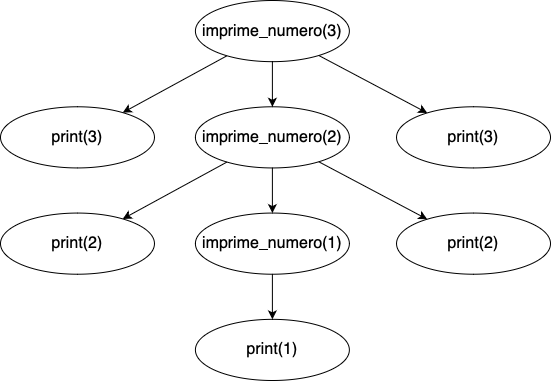

class: center, middle, inverse

# Funções e Recursão


---
class: inverse

# Temas

1. Referências para programar em python
2. Relembrar funções
3. O que é recursão?
4. Visualizar recursão
5. Exemplo prático: fatorial de um número
6. Exercício: doce menos doce
7. Exercício: potências de 3
8. Revisão: tópicos avançados
9. Dicas finais

---

class: small-images, image-spaced

# Referências para programar em python
- **Online Python** https://www.online-python.com/#google_vignette
- **VS Code**: https://code.visualstudio.com/
- **Pycharm**: https://www.jetbrains.com/pycharm/
- **Spyder/Anaconda**: https://www.anaconda.com/

---

class: center, middle, inverse
# Relembrar funções

---

# Relembrar funções
Para relembrar os conceitos fundamentais de funções vamos rever o clássico programa "Olá Jon!"

```python
# Em python cada função começa com a palavra 'def' seguida do nome da função
# Cada função pode ter vários argumentos e retornar algo (uma string, uma lista...)
def cumprimenta(nome):
    if nome == "Jon":
        return "Olá Jon!"
    else:
        return "Não és o Jon..."

print(cumprimenta("Jon"))   # Olá Jon!
print(cumprimenta("João"))  # Não és o Jon...
```

---

# Relembrar funções
É também importante relembrar de como o contexto global do programa e o contexto local de uma função interagem.

```python
n = 10
def imprime_na_funcao(numero):
    n = 0
    numero += 1
    print(n)            # 0
    print(numero)       # 11

imprime_na_funcao(n)
print(n)                # 10
print(numero)           # NameError: name 'numero' is not defined
```

Com este programa retirámos três conclusões importantes:
- Código no contexto global não pode aceder ao contexto local de uma função;
- Mudanças nos argumentos de uma função não se refletem na variável original, só se alteram dentro do contexto da função;
- Variáveis com o mesmo nome dentro do contexto local de uma função são **diferentes** das que estão noutros contextos.
---

class: center, middle, inverse
# O que é recursão?

---
# O que é recursão

É um método de resolver um problema em que a solução final depende de soluções de instâncias mais pequenas do mesmo problema. Desta forma, divide-se um problema em sub-problemas mais pequenos que se podem resolver mais facilmente.

Uma função recursiva é uma função que se chama a si mesma para obter uma solução.

É uma definição um pouco estranha... Passemos para um exemplo para explicar os aspetos mais importantes!

---

# O que é recursão

Imaginem que estão numa fila mesmo muito grande. O vosso objetivo é descobrir quantas pessoas estão à vossa frente na fila, sem se poderem mover da fila, sendo que só podem falar com a pessoa que está exatamente à vossa frente a exatamente atrás de vocês. Como podem resolver este problema?


---

# O que é recursão

**Observação importante** - O número de pessoas à tua frente é igual ao número de pessoas à frente da pessoa que está à tua frente mais 1!

1. Perguntar à pessoa que está à tua frente quantas pessoas estão à frente dela;

2. Esperar pela sua resposta e adicionar 1;

3. (Opcional) Se a pessoa de trás perguntar, dizer-lhe quantas pessoas tens à tua frente.

---

# O que é recursão

Com isto podemos definir dois conceitos fundamentais quando se fala de recursão:

- **Caso recursivo**: o conjunto de instruções que serão repetidas em cada chamada da função com valores que se aproximam cada vez mais do caso base. No nosso caso falar com a pessoa à nossa frente, **esperar** pela sua resposta, e somar 1;

- **Caso base**: o ponto em que parámos de aplicar o caso recursivo. No nosso caso a pessoa à frente de todo na fila;

Com estes conceitos estamos prontos para começar a explorar alguns exemplos práticos!

---

class: center, middle, inverse
# Visualizar recursão

---

# Visualizar recursão

Para ganhar uma maior intuição de como a recursão funciona vamos analisar o output do seguinte programa:

```python
def imprime_numero(num):
    # Caso base
    if num == 1:
        print(1, sep=" ")
    # Caso recursivo
    else:
        print(num, sep=" ")
        imprime_numero(num - 1)
        print(num, sep=" ")
    
imprime_numero(3)   # 3 2 1 2 3
```

Vamos usar uma árvore de chamadas recursivas para visualizar melhor o que está a acontecer.

---

# Visualizar recursão

Começamos a ler a árvore desde o seu topo seguindo sempre o caminho da esquerda, visitando depois o caminho da direita quando se retorna a um certo nó. Desenhar a árvore de camadas recursivas pode ajudar imenso a visualizar a execução de uma função recursiva!



---

class: center, middle, inverse
# Exemplo prático: fatorial de um número

---

# Exemplo prático: fatorial de um número

O fatorial de um número **n** não negativo é dado pelo produto de todos os números positivos menores ou iguais a **n**:

n! = 1 \* 2 \* ... \* (n - 1) \* n

No entanto, se n = 0, n! = 1.

Como podemos calcular o valor de um número **n** utilizando recursão?

---

# Exemplo prático: fatorial de um número

Vamos definir o nosso caso base e caso recursivo:

- **Caso base**: O fatorial do número 0 é igual a 1;

- **Caso recursivo** O fatorial de um número **n** é igual ao produto entre **n** e o fatorial de **n - 1**.

Mais formalmente:

- n! = 1,                     se n = 0

- n! = n * fatorial(n-1)      se n > 0

Podemos então passar esta formalização facilmente para código!

---

# Exemplo prático: fatorial de um número

Aqui está a solução:

```python
def fatorial(num):
    # Caso base
    if num == 0:
        return 1
    # Caso recursivo
    else:
        return num * fatorial(num - 1)

print(fatorial(0))     # 1
print(fatorial(3))     # 6
print(fatorial(5))     # 120
```

---

class: center, middle, inverse
# Exercício: doce menos doce

---

# Exercício: doce menos doce

Com o objetivo de permanecer saudável (mas com aquela fome de doces...), determina o doce que é menos doce!

Dada uma lista com pelo menos um elemento com a quantidade de açúcar de cada doce, em gramas, determina o número de gramas do doce menos doce (o que tem menos número de gramas de açúcar na sua constituição). O exercício deverá ser resolvido usando recursão.

Exemplo: dada a lista [120, 80, 200] o resultado deverá ser 80.

**Pequena revisão de operações com listas**:

```python
# Inicializar uma lista
uma_lista = [1, 2, 3]

# Aceder a um elemento de uma lista
print(uma_lista[0])             # 1

# Tamanho de uma lista
print(len(uma_lista))           # 3

# Usar a operação 'slice' para extrair parte de uma lista
lista_pequena = uma_lista[1:]   # [2, 3]
```

---

# Exercício: doce menos doce

**Solução**:

- **Case base**: O elemento de uma lista com um só elemento é o valor mais baixo da lista

- **Caso recursivo**: O elemento mínimo da lista é o mínimo entre o elemento no índice 0 da lista e o mínimo no resto da lista


```python
def doce_menos_doce(lista):
    if len(lista) == 1:
        return lista[0]
    else:
        return min(lista[0], doce_menos_doce(lista[1:]))

print(doce_menos_doce([120, 80, 200]))     # 80
```

---

class: center, middle, inverse
# Exercício: potências de 3

---

# Exercício: potências de 3

Dado um número inteiro positivo, determina se esse número é ou não uma potência de 3. Um número é uma potência de 3 se existir um inteiro **x** tal que n == 3<sup>x</sup>. O teu programa deverá retornar True se o número for uma potência de 3. Se não retorna False.

Exemplo: dado o número 9 o teu programa deverá retornar True. No caso de ser dado o número 8 o teu programa deverá retornar False

---

# Exercício: potências de 3

**Solução**:

- **Case base**: O número 1 é uma potência de 3: 3<sup>0</sup> = 1

- **Caso recursivo**: O elemento mínimo da lista é o mínimo entre o elemento no índice 0 da lista e o mínimo no resto da lista

```python
def potencia_de_3(num):
    if num <= 1:
        return num == 1
    else:
        return num % 3 == 0 and potencia_de_3(num / 3)

print(potencia_de_3(1))     # True
print(potencia_de_3(9))     # True
print(potencia_de_3(8))     # False
```

---

class: center, middle, inverse
# Revisão: tópicos avançados

---

# Revisão: tópicos avançados

A sequência de números de Fibonacci é uma sequência em que os primeiros números são 0 e 1, e os restantes são iguais à soma dos dois números que lhe antecedem:

0, 1, 1, 2, 3, 5, 8, 13, 21, 34...

Como podemos calcular o número de índice **n** da sequência de Fibonacci?

- fibo = 0,                         se **n** = 0
- fibo = 1,                         se **n** = 1
- fibo = fibo(n - 1) + fibo(n - 2), se **n** > 1

Vamos analisar a árvore de chamadas recursivas...

---

# Revisão: tópicos avançados

Como se pode reparar, que para descobrir o valor do elemento de índice **n** precisamos de um valor na magnitude 2<sup>n</sup> de chamadas recursivas. Além disso, estamos a recalcular desnecessariamente muitos dos valores, o que faz com que o programa seja menos eficiente!


---

# Revisão: tópicos avançados

Para mitigar este efeito podemos recorrer a memoization! Isto é, fazer o programa lembrar-se de valores já calculados para que não os tenha de calcular de novo. Este efeito pode ser ao guardar os valores já calculados, por exemplo, num dicionário:

```python
dict = {}

def fibonacci(num):
    # Use already calculated value!
    if num in dict:
        return dict[num]
    if (num <= 1):
        return num
    else:
        dict[num] = fibonacci(num - 1) + fibonacci(num - 2)
        return dict[num]

print(fibonacci(0))     # 0
print(fibonacci(1))     # 1
print(fibonacci(3))     # 2
print(fibonacci(5))     # 5
```

---

# Revisão: tópicos avançados

Se a última ação de uma função, antes de retornar, for fazer a chamada recursiva, dizemos que estamos a efetuar recursão em cauda. Em certas linguagens funcionais, como Prolog, isto faz com que os programas sejam mais eficiente. No entanto, em Python essa otimização não existe. A recursão em cauda é normalmente efetuada com a ajuda de acumuladores que vão guardando o resultado a cada chamada recursiva

```python
# Exemplo de soma de todos os número de 1 a N usando recursão em cauda
def soma_em_cauda(num, acumulador):
    if num == 0:
        return acumulador
    else:
        return soma_em_cauda(num - 1, acumulador + num)

print(soma_em_cauda(0, 0))     # 0
print(soma_em_cauda(3, 0))     # 6
print(soma_em_cauda(5, 0))     # 15
```
---

# Revisão: tópicos avançados

Por fim, recursão mútua é uma forma de recursão na qual duas ou mais funções se chamam uma à outra para obter um certo resultado. Ou seja dependem uma da outra. Um exemplo simples, mas um pouco ridículo é verificar se um número é par ou ímpar

```python
def e_par(num):
    if num == 0:
        return True
    else:
        return e_impar(num - 1)

def e_impar(num):
    if num == 0:
        return False
    else:
        return e_par(num - 1)

print(e_par(4))     # True
print(e_par(3))     # False
print(e_impar(4))   # False
print(e_impar(3))   # True
```
---

class: center, middle, inverse
# Dicas finais

---

# Dicas finais

Quando estiverem a resolver os exercícios no teste tentem sempre primeiro pensar nos seguintes aspetos:

- Qual é o caso base para o problema? Ou seja quando devo parar de chamar a função recursivamente e retornar uma resposta?

- Qual é o caso recursivo? Que instruções devo repetir em cada chamada da função?

- Estou a aproximar-me do caso base a cada chamada recursiva que faço? Recursão infinita é, normalmente, a maior fonte de erros!

- Se estiveres com dificuldades a imaginar o que acontece numa possível execução de um problema, desenha uma árvore de chamadas recursivas! Permite organizar o raciocínio de forma clara e rápida.
---

class: center, middle, inverse
# Espero que tenham aproveitado

# Boa sorte!
