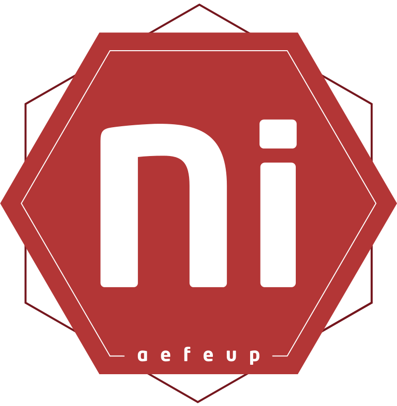
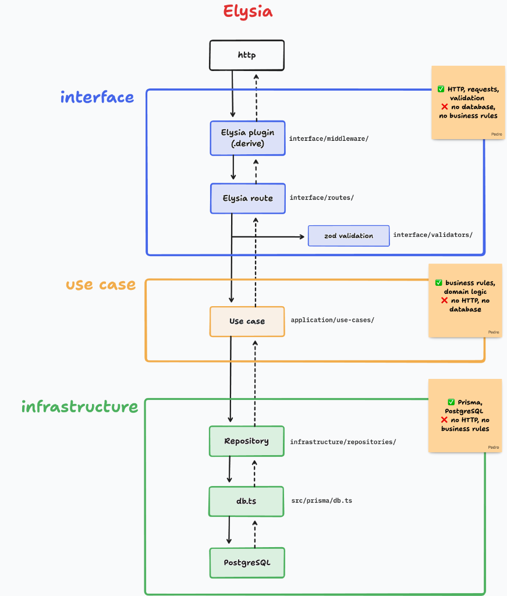
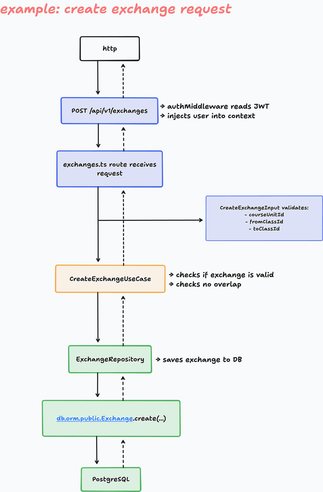

name: title
layout: true
class: center, middle, inverse

---

name: normal
layout: true
class: left, top

---

template: title
class: small-images

# TTS Backend Redo
## Proposal

<div style="display: flex; justify-content: center; margin-top: 2em;">
  
</div>

NIAEFEUP — September 2026

---

# Why Are We Doing This?

Current backend problems:

- **4 fragmented exchange systems** (direct, marketplace, urgent, enrollment)
- Business logic mixed with HTTP handlers
- No audit trail or event log
- No automated tests
- SIGARRA calls scattered everywhere
- Hard to onboard new members

> Fixing a bug in one exchange type does not fix the other three.

---

# Goals

What success looks like by end of January:

- One unified exchange model
- Clear separation of concerns
- First-year students can contribute in week 1
- Critical paths are tested
- Clean deployment with Docker Compose + nginx

---

# Tech Stack

.horizontal[

- **Runtime:** Bun
- **Framework:** Elysia
- **ORM:** Prisma 8 (contract-first)
- **Database:** PostgreSQL


- **Validation:** Zod
- **Email:** Resend
- **Auth:** SIGARRA OIDC (reused)
- **Testing:** Bun test
- **Deployment:** Docker Compose + nginx

]

---

# Why Elysia + Bun?

- Built for each other — native Bun integration
- Frontend team already knows TypeScript
- Built-in validation and plugins
- Fast hot reload and testing
- Type-safe end-to-end with Eden Treaty

> We keep deployment the same. Only the app inside the container changes.

---

# Architecture

.horizontal[

<div style="flex: 1.15;">

<p><strong>Clean Architecture with Elysia:</strong></p>

<ul style="list-style-type: disc;">
  <li style="margin-bottom: 0.7em;">
    <strong>interface/</strong>
    <br><span style="font-size: 0.9em;">Routes, middleware (<code>.derive</code>), Zod validation</span>
    <br><em style="font-size: 0.85em; color: #55697a;">HTTP only &bull; no DB, no business rules</em>
  </li>
  <li style="margin-bottom: 0.7em;">
    <strong>application/ (use cases)</strong>
    <br><span style="font-size: 0.9em;">Business rules &amp; orchestration</span>
    <br><em style="font-size: 0.85em; color: #55697a;">Pure domain logic &bull; no HTTP, no DB</em>
  </li>
  <li style="margin-bottom: 0.7em;">
    <strong>infrastructure/</strong>
    <br><span style="font-size: 0.9em;">Repositories, Prisma 8 (<code>src/prisma/db.ts</code>), PostgreSQL</span>
    <br><em style="font-size: 0.85em; color: #55697a;">Persistence only &bull; no HTTP, no business rules</em>
  </li>
</ul>

</div>

<div style="flex: 0.85; text-align: center;">
  
</div>

]

---

# Folder Structure

```text
src/
├── domain/                  # entities, value-objects, ports
├── application/             # use-cases, services
│   └── use-cases/           # business rules & orchestration
├── infrastructure/          # repositories, Prisma 8, external APIs
│   ├── repositories/        # exchange.repository.ts
│   └── prisma/db.ts         # Prisma client instance
├── interface/               # HTTP entrypoints
│   ├── routes/              # exchanges.ts
│   ├── middleware/          # auth & context injection (.derive)
│   └── validators/          # Zod validation schemas
├── core/                    # errors, utils
└── main.ts
```

Each layer has one job. Boundaries are enforced by ESLint.

---

# Example: Create Exchange Request

.horizontal[

<div style="flex: 1.25;">

<p><strong>Step-by-step request flow:</strong></p>

<ol>
  <li><strong>HTTP:</strong> Client sends <code>POST /api/v1/exchanges</code></li>
  <li><strong>Middleware:</strong> Auth reads JWT, injects user into context</li>
  <li><strong>Route &amp; Validator:</strong> <code>exchanges.ts</code> receives request; Zod validates payload</li>
  <li><strong>Use Case:</strong> <code>CreateExchangeUseCase</code> checks validity &amp; overlap</li>
  <li><strong>Repository:</strong> <code>ExchangeRepository</code> saves exchange</li>
  <li><strong>Database:</strong> ORM persists record to PostgreSQL</li>
</ol>

</div>

<div style="flex: 0.75; text-align: center;">
  
</div>

]

---

# Database Design

One unified schema for all exchange types:

```text
exchange_request            (kind, status)
exchange_participant        (one row per student)
exchange_item               (one row per student per UC)
exchange_confirmation_token (UUID email links)
exchange_event              (audit log)
exchange_period             (when exchanges are open)
```

- **Before:** 4 fragmented table pairs (direct, marketplace, urgent, enrollment)
- **After:** 3 normalized core tables + audit trail & tokens

> Replaces separate exchange workflows with a single unified data model.

---

template: title

# Questions?

## TTS Backend Redo Proposal
