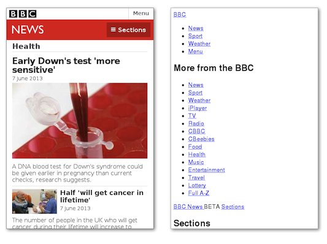
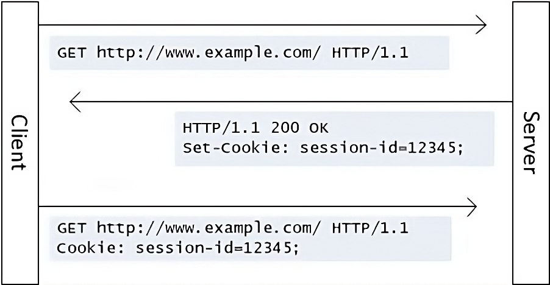

name: title
layout: true
class: center, middle

---

name: normal
layout: true
class: left, middle

---

template: title

# Web Workshop

---

name: index

# Index

- [HTML](#html)
- [CSS](#css)
- [JS](#js)
- [HTTP](#http)
- [Hands-on!](#hands-on)

---

template: title
name: html

# HTML

---

# What is it?
<!--O que é e para que é que serve (referir semantica)-->

- **H**yper **T**ext **M**arkup **L**anguage
- **Hyper Text**: More than plain text, usually has links to other documents
- **Markup**: A way to represent hypertext
- **Not** for design
- Used to define **structure** and **semantics**

---

# HTML Structure

- **HTML** has a **tree** structure, where each element is a **node** and within itself can cointain either other nodes or text.
- Each node is defined using **tags** and each tag can have it's own set of **attributes**.
- Browser's have their own **default styles** for each tag, but they can be overriden using **CSS**.

---

# Tags
<!-- tags -->

**Tags** start with **<** and end with **>** and always have a name.
  
```html

```

Most tags have a pair, a **closing tag**, which start with **</**.
    
```html
<p> ... </p>
```

To close a tag automatically, end it with **/>**.

```html
<p/>
```

---

# Tag content

Everything between and **opening** and **closing** tag is that tag's content.

```html
<p>Hello world!</p>
```

It can be text, or other tags

```html
<article>
    <p>Hello world!</p>
</article>
```

Some tags never have content and **can't be closed**

```html
<hr>
```

---

# Attributes

Tags can have attributes - sometimes they are necessary for a tag to work, sometimes they are optional.
Without the **src** attribute an **tag** tag won't work. 

```html

```

A **checkbox** will work without the **checked** attribute, but it won't be checked by default.

```html
<input type="checkbox" checked="checked">
```

Boolean attributes can be set True by assigning it it's own name or by just writting the attribute:
 
```html
<input type="checkbox" checked="checked">   <!-- this is the same -->
<input type="checkbox" checked>             <!-- as this -->
```

---

# IDs and Classes

The **id** and class **attributes** are the most used attributes in HTML. They can be used to identify tags in order to manipulate them with **CSS** or **Javascript**.

- There can only be one tag with a certain **id** in a page.
```html
<p id="my-paragraph">Hello world!</p>
<p id="my-paragraph">This is wrong!</p>
```

- There can be multiple tags with the same **class** in a page.
```html
<p class="text">Hello world!</p>
<p class="text">Hello world!</p>
```


---

# Basic Document Structure

All HTML documents **must** have these elements:
- A document type declaration _DOCTYPE_;
- A `<html>` root with two children: `<head>`, with **metadata** about the document, and `<body>`, with the actual **structure** and **content**;
- A non-empty `<title>` element inside the `<head>`.

```html
<!DOCTYPE html>
<html>
  <head>
    <title>Example</title>
  </head>
  <body>
  </body>
</html>
```

---


# P and Br

The `<p>` tag can be used to write a paragraph. It's a block element, which means it will take up the whole width of the page.

.horizontal[
  ```html
  <p>
  This is a poem
  A poem this is
  Why am I not breaking lines?
  Can you tell me please?
  </p>
  ```
  ```html
  <p>
  This is a poem<br>
  A poem this is<br>
  Why am I not breaking lines?<br>
  Can you tell me please?
  </p>
  ```
]

↓↓↓↓↓↓↓↓↓↓↓↓↓↓↓↓↓↓↓↓&nbsp;&nbsp;&nbsp;&nbsp;&nbsp;&nbsp;&nbsp;&nbsp;&nbsp;&nbsp;&nbsp;&nbsp;↓↓↓↓↓↓↓↓↓↓↓↓↓↓↓↓↓↓↓↓

.horizontal[
  <p>
  This is a poem
  A poem this is
  Why am I not breaking lines?
  Can you tell me please?
  </p>
  <p>
  This is a poem<br>
  A poem this is<br>
  Why am I not breaking lines?<br>
  Can you tell me please?
  </p>
]

---

# Headings

Heading are used to structure a page. They go from `<h1>` to `<h6>`, where `<h1>` is the most important and `<h6>` is the least important.

.horizontal[
<div style="font-size: xx-small;">
  <h1>Heading 1</h1>
  <h2>Heading 2</h2>
  <h3>Heading 3</h3>
</div> 
```html
<h1>Heading 1</h1>
<h2>Heading 2</h2>
<h3>Heading 3</h3>
```
]

---

# Anchors

The `<a>` tag is used to create links. It has an **href** attribute that defines the link's destination.

```html
<a href="link.html">This is a link</a>
<a href="relative/link.html">This is a link</a>
<a href="../relative-link.html">This is a link</a>
<a href="https://www.youtube.com/watch?v=dQw4w9WgXcQ">This is a link</a>
```

This <a href="http://127.0.0.1:5500/web-workshop/index.html#14">link</a> takes you to the next slide.

---

# Images

The `` tag is used to display images. It has a **src** attribute that defines the image's source.

```html

```

It also has a **alt** attribute that defines the image's alternative text, which is used when the image can't be displayed.

```html

```

The image's size can be defined using the **width** and **height** attributes.

```html

```

---

# Lists

There are two types of lists in HTML, ordered and unordered.

.horizontal[  

  
```html
Unordered list
  <ul>
    <li>Item 1</li>
    <li>Item 2</li>
  </ul>

Ordered list
  <ol>
    <li>Item 1</li>
    <li>Item 2</li>
  </ol>
```
  <div>
    <ul>
      <li>Item 1</li>
      <li>Item 2</li>
    </ul>
    <br>
    <ol>
      <li>Item 1</li>
      <li>Item 2</li>
    </ol>
  </div>
]

---

# Span and Div

The `<span>` and `<div>` tags are used to group elements together. They are both block elements, but the `<span>` tag is inline.

Span elements are useful to apply styles to a specific part of a text as they are inline elements.

```html
<p>My name is <span style="color: red;">John</span></p>
```

Div elements are useful to group elements together and apply styles to them.

```html
<div style="background-color: red;">
  <p>Paragraph 1</p>
  <p>Paragraph 2</p>
</div>
```

---

# Forms, inputs and labels

Forms are used for basic interaction with the server or through javascript

.horizontal[
<form>
  <label>
    Text input
    <input value="Hello world!">
  </label><br>

  <label>
    Number input
    <input type="number" value="123">
  </label><br>

  <label>
    <input type="checkbox">
    Checkbox
  </label><br>
  
  <label>
    <input type="radio">
    Radio
  </label><br>

  <button>
    Button
  </button>
</form>

```html
<form>
  <label>
    Text input
    <input value="Hello world!">
  </label><br>
  <label>
    Number input
    <input type="number" value="123">
  </label><br>
  <label>
    <input type="checkbox">
    Checkbox
  </label><br>
  <label>
    <input type="radio">
    Radio
  </label><br>
  <button>
    Button
  </button>
</form>
```
]

--- 

# A World of tags

TODO(thePeras): See all the possible tags at ()

---

name: css

# CSS

---

## What are they?

  - **C**ascading **S**tyle **S**heets
  - A style sheet language used for describing the **look and formatting** of a document written in a markup language (like HTML).
  - Based on two concepts: **selectors** and **properties**.

---




---

# Selectors

---

# Start Styling

CSS can be written in a `<style>` tag in the `<head>` of the HTML document.

```html
<head>
  <style>

  </style>
</head>
<body>

</body>
```

The most common way is to write in a separate file, and then link it in the `<head>` of the HTML document.
```html
<head>
  <link rel="stylesheet" href="style.css">
</head>
<body>
  
</body>
```

---

# Selectors

Allow us to select the HTML elements to which we want to apply some styles.
```css
p {            /* selector */
  color: red;  /* property: value */
}
```
---

# Nesting Selectors

Nested style rules inherit their parent rule's selector context, eliminating the need for repetition.
```css
.foo {
  color: blue;
  .bar {
    color: red;
  }
}
```

```css
.foo { color: blue; }
.foo .bar { color: red; }
```

---

# Selectors Types

- The **Universal** (*) selector.
- **Type** selectors.
- **Attribute** ([ ]) selectors.
- **Class** (.) & **Id** (#) selectors.
- Pseudo-classes (:) and Pseudo-elements (::).

Selectors can also be **grouped** (,) and **combined** (space, >, +, ~).

---

#  Type Selectors
Select elements by their element type:
```css
a
```


---

#  Id Selector
Selects element by their id (#):
```css
#posts
```


---

#  Class Selector
Selects element by their class (.):
```css
.intro
```


---

#  Universal Selector

Selects all elements (*):
```css
*
```


---

# Attribute Selectors

Select elements based on their attribute existence and values:

- **[attribute]** – exists.
- **[attribute=value]** – equals.
```css
input[type=text] /* selects all input elements with type="text" */
```

<br>
<br>
Other selectors match by containing, starting, or ending with specific values.

---

# Combining Selectors

All these type of selectors can be combined to form complex selectors:
```css
p.intro  /* a paragraph with class "intro" */
```

---
# Combinators

Used to select elements based on their **relationship with other elements**.

- **Descendant** (space).
- Child (>).
- Next-sibling (+).
- Subsequent-siblings (~).
  
In combinators, **the last selector** is the one that identifies the element we are selecting.

---
# Descendant Combinator

Selects all descendants (space):
```css
aside a
```


---

# Grouping Selectors
Selector groups (,) are just a logical **OR** of CSS rules:
```css
header > *, main article, #articles p
``` 


---

## Properties

---
# Properties

Define what aspect of the selected element will be changed or styled.

```css
p {            /* selector */
  color: red;  /* property: value */
}
```
---
# Color

- We can set the **text** and **background** color of any element.
- Colors can be referred to by a pre-defined [name](https://www.w3.org/wiki/CSS/Properties/color/keywords), or hex value.

```css
p {
  color: white; /* text color */
  background-color: #FF0000;
}
```
<p style="color: white; background-color: #FF0000;">The quick brown fox jumps over the lazy dog</p>

---
# Alignment
Text can be aligned **left**, **right**, **center** or **justified** using the text-align property.

```css
p {
  text-align: center;
}
```
<section style="display: flex; flex-wrap: wrap; gap: 0.3em;">
<p style="width: 8em; border:1px solid gray; padding: 0.5em; text-align: left;"><strong>left</strong><br>The quick brown fox jumps over the lazy dog</p>
<p style="width: 8em; border:1px solid gray; padding: 0.5em; text-align: right;"><strong>right</strong><br>The quick brown fox jumps over the lazy dog</p>
<p style="width: 8em; border:1px solid gray; padding: 0.5em; text-align: center;"><strong>center</strong><br>The quick brown fox jumps over the lazy dog</p>
<p style="width: 8em; border:1px solid gray; padding: 0.5em; text-align: justify;"><strong>justified</strong><br>The quick brown fox jumps over the lazy dog</p>
<section>

</section></section>

---
# More Properties

TODO(thePeras): see more properties at []

---
# Units
We can use several length units to change the dimension of elements in CSS. These units come in different flavors:

- Absolute units _(mm, cm, **px**, etc...)_
- Font-relative units
- Viewport-percentage units
- Percentages

---
# Font-relative units

Units rem and em are used to create **scalable layouts**.

- **rem** - Represents the size of the **root element font**. If used to change the font-size in the root element.

- **em** - When used to change the font-size, it represents the size of the parent element font. When used to set the size of an element, it represents the **size of the current element font**.

---
# Example (rem and em)


- Setting the font-size of the root element (`<html>`) to 2rem. <br>
    <small>For other elements, 1rem becomes 32px (if the user didn't change the default of 16px). </small>
- Setting the font-size of other element to 2rem. <br>
    <small>The font-size of that element becomes 64px, twice the size of the root's font-size.  </small>
- Setting the font-size of the <body> element to 2em. <br>
    <small>The font-size of that element becomes 64px, twice its parent's font-size. </small>

```css
html { font-size: 2rem; } /* 32px */
p    { font-size: 2rem; } /* 64px regardless of its location     */
body { font-size: 2em;  } /* 64px (the parent is the html element) */
```
---

# Viewport-percentage units

Define lengths relative to the **viewport size (the visible part of the document)**:

- **vw** - 1% of the viewport width.
- **vh** - 1% of the viewport heigth.

So, if the viewport is 600x400 pixels, vw = 6px, vh = 4px.

---

# Percentage unit

Many CSS properties (width, margin, padding, font-size, ...) can take percentage values to define a **size relative to its parent object**.

```css
width: 50%;     /* width is 50% of the parent's width         */
font-size: 80%; /* font-size is 80% of the parent's font-size */
                /* the same as 0.8em                          */
```
---

# Box model

- All page elements are **rectangular**.
- They can have a **border**.
- Some **space** between themselves and that **border** (**padding**)
- And some **space** between themselves and the **next element** (**margin**).

<p style="text-align: center; margin-top: 2em;">
</img>
</p>

---

# Width and height

We can use the _width_ and _height_ properties to change the size of the **content area**:

- Values can be a **length**, a **percentage** or **auto** (the browser will automatically calculate a width/height).
- The default value is **auto**.

```css
section {
  width: auto; /* default */
  height: 50px;
}
```
---
# Box-sizing

We can change the behavior of the _width_ and _height_ properties, by changing the **box-sizing** property:

- **border-box** - the width and height properties **include the padding and border** (much easier to work with).
- **content-box** - the width and height properties refer to the **content area only** (the default).

```css
section {
  box-sizing: border-box;
  height: 50px;
}
```
<p style="text-align: center;">
</img>
</p>

---

# Margin and Padding

---

<!-- 
81-82
112-114 (com nota pra inline e none)
131-142
118-123 (mencionar float)
128-129
173
179
>

<!-- Cor, texto, posições -->
<!--displays-->
<!-- inline e blocks -->
<!-- Layout, deconstruir o layout de uma página -->
<!--prioridades por alto-->


<!-- transitions -->


<!-- padding e margens - box model -->
<!-- width e height, auto -->
<!-- media queries-->

<!-- 
opacity
fonts, font weight, style, size
text aligment

 -->
 
---

name: js

# JavaScript (JS)

---

## What is JavaScript?

<ul>
<li>JavaScript is a dynamic, imperative and functional language.</li>
<li>Along with HTML and CSS, JavaScript is one of the three main technologies of the World Wide Web.</li>
<li>It has many uses, but it's most commonly used as a client-side scripting language (in browsers).</li>
<li>While HTML and CSS are used for the structure and look of the website, Javascript is used for its functionalities and interactions</li>
</ul>

---

## JS vs Python
Both function increment the counter 123 times
.horizontal[
```js 
// Javascript

const a = 123;
let counter = 0;

for (let i = 0; i < a; i++) {
  counter++;
  console.log(`Counter: ${counter}`);
}

```

```python
# Python

a = 123
counter = 0

for i in range(a):
  counter += 1
  print(f"Counter: {counter}")

```
]

---

## Variables in JS

In Javascript there are 3 ways of initializing a variable, you can use ~~var~~, let and const.

<ul>
<li> <b>const</b>: we use const when we want to initialize a variable that will never change its value </li>
<li><b>let</b>: we use const when we want to initialize a variable that will never change its value</li>
<li><b>var</b>: You should never use var</li>
</ul>

---
## Primitive Data Types:

- **Number**: Represents both integer and floating-point numbers. For example: 3.14, 42
- **String**: Represents text and is enclosed in single, double quotes, or backticks (these are special). For example: 'Hello, World!', "JavaScript", \`Magic string\`
- **Boolean**: Represents a binary value, which can be either true or false
- **Undefined**: Represents a variable that has been declared but has not been assigned a value. It's the default value for uninitialized variables
- **Null**: Represents an intentional absence of any object value or no value at all. It is an assigned value

---

## Type Conversion

Most of the time, operators and functions automatically convert a value to the right type (type conversion). 

```js
console.log('Hello' + 'World') // Hello world
console.log(11.5 + 31) // 42.5
console.log('11.5' + 31) //'11.531'

```

You can still use the **String**, **Number** and **Boolean** functions to manually convert a value:

```js
const a = 0
const b = Boolean(a) // false
const c = String(a)  // '0'
const d = String(b)  // 'false'
```

To convert from a string to a number, we can use the **parseInt** and **parseFloat** functions. Don't forget to specify the base:

```js
console.log(parseFloat('123.4')) // 123.4
console.log(parseInt('123', 10)) // 123
console.log(parseInt('123', 8))  // 83
console.log(parseInt('0123'))    // 123 or 83 in some browsers
```


---

## Comparisons in Js
When comparing values belonging to different types, they are converted to numbers:

```js
1 == '1'    // 1 == 1 -> true
0 == false  // 0 == 0 -> true
'0' == true // 0 == 1 -> false
'' == false // 0 == 0 -> true
Boolean('0') == false // 1 == 0 -> false
Boolean('0') == true  // 1 == 1 -> true
```

## Strict Equality
In strict equality neither of the values is converted, if the values are from different type they are unequal

```js
0 === 0     // true
0 === '0'   // false
0 === false // false
```
---

## Functions

A function is defined using the **function** keyword.

```js
function add(num1, num2) {
  console.log(num1 + num2)
}
add(1, 2) // 3
```

- **Primitive** parameters are passed to functions by **value**
- **Non-primitive** parameters are passed to functions by **reference**

Functions can also **return** values.

```js
function add(num1, num2) {
  return num1 + num2
}
let value_returned = add(1, 2);
console.log(value_returned) // 3
```

A function with an empty return or no return at all, returns **undefined**.

---

## Function Expressions

Another way to declare a function is the following:

```js
const foo = function() {
  console.log('bar')
}
foo() // bar
```

## Arrow functions

A more compact way of declaring functions:

```js
const foo = function(var1, var2) {
  return var1 + var2
}
```

Is the same as:

```js
const foo = (var1, var2) => var1 + var2
```

---

## Async functions

In JS code is executed sequencialy:

```js
first(); // first function to execute
second(); // this function will run, once the above function has finished
third(); // this function will run, once the above function is finished
```

If a function takes one minute to execute our website will freze until the function has finished its execution

```js
const takes_one_minute = () => sleep(60);
const takes_two_minutes = () => sleep(120);

takes_one_minute();// takes one minute to finish its execution
takes_two_minutes();// takes two minutes to finish its execution
rest_of_the_code(); // this will only run after 3 minutes
```

To prevent this we use Async function.

---

Async function will run in parallel with the rest of your code.

```js
const takes_one_minute = async () => sleep(60);
const takes_two_minutes = async () => sleep(120);

takes_one_minute();// takes one minute to finish its execution
takes_two_minutes();// takes two minutes to finish its execution
rest_of_the_code(); // this will be running at the same time of the other two
```

If you want to do anything after the function is finished you can use **then** or **wait**:

 ```js
 const foo = async () => 10;
 const boo = async () => 20;

 foo().then(console.log) // 10
 const value = await boo();
 console.log(value); // 20
 ```

**then** will call a block of code to be executed once the function is finished while **wait** will wait until the function is finished to execute the rest code
Every function that has a await in it will also be an async function.

---

## Promises

---

## Error handling

---


<!-- Para que serve JS -->
<!-- Comparar js com python? -->
<!-- iniciar variaveis let, var , const, static-->
<!-- error handling-->
<!-- type conversion e comparision (dizer que é todo fudido)-->
<!-- functions, arrow functions-->
<!--Async e promises-->


<!-- DOM, eventos, objetos, select elements -->

---

name: http

# HTTP
HTTP a protocol, commonly built on top of TCP, used to communicate between two machines, mainly used in web applications. It's a **stateless** protocol so no information is stored between requests.


---

# HTTP Message Structure - Request


---

# HTTP Message Structure - Response


---

# HTTP Methods

HTTP has many methods, so we'll only show the most common:

* `GET` Usually used to .highlight[read] or fetch resources. Should not have secondary effects on the server.
* `POST` Usually used to interact with a resource, often causing a change in state or .highlight[side-effects].
* `PUT` Usually used to .highlight[create/replace] entities. Should be idempotent - No matter how many times you call it, the result is the same.
* `PATCH` Usually used to apply partial .highlight[updates] to a resource.
* `DELETE` Usually used to .highlight[delete] a resource.


---

# HTTP Response codes

Each HTTP Response has an associated Status code.

* .dense[`1XX`] Information
* .dense[`2XX`] Success
* .dense[`3XX`] Redirects
* .dense[`4XX`] Client error
* .dense[`5XX`] Server error

Check out https://http.cat !
---

# Parameters / Query Strings

Let's assume that you have a search page in your website, how would you save what the user has searched directly in the URL?

In the URL you can use the `?` after the path to declare the seach parameters. 

A parameter is in the `key=value` form, and you can seperate them with the `&` character.

`https://cutedogs.com/search?q=shiba%20inu&limit=10`

---

# Cookies

Because **HTTP** is stateless, some clever enginners thought of a way to store state between requests. 

This is useful because we might need a way to recognize the user when he's logged in, ~~or a way to track them~~.



---

# Cookies

There are two main types of cookies:

- Session cookies (are deleted when the user closes the session eg.: closes the browser);
- Permanent cookies - they set the `Max-Age` in seconds or a `Expires` date and are preserved between sessions;

However they can have some extra attributes:

- `Secure`: the cookie is only sent if using **HTTPS**
- `HttpOnly`: prevents javascript from accessing and modifying the cookie
- `SameSite`: the cookie is not sent on a cross-site request

---

# AJAX

AJAX (**A**synchronous **J**avascript **A**nd **X**ML) is a methodology that consists of making requests to the server **without** reloading the page. 

While **AJAX** was initialy done with **XML**, nowadays there are multiple formats used (mainly **JSON** or even **HTML**).

This is **super useful** especially with modern website, that often provide with seamless experiences that don't reload at all.


---

# AJAX

You can make a request with javascript using two different ways, `XMLHttpRequest` or using `fetch`. `XMLHttpRequest` is pretty much legacy now, and `fetch` is almost universally used.

Example:
```js
    //we assume that the following endpoint returns output as JSON
    //by default fetch makes an HTTP GET request
    let request = await fetch('https://www.cutedogs.com/api/listBreeds'); 
    // we can also check the status code of the request
    if(request.status != 200){ 
        console.log("Something went wrong");
        return;
    }

    let cuteDogsList = await request.json();
    console.log(cureDogsList); 
    //outputs: ['shiba inu', 'akita', 'portuguese water dog']
```

---

# AJAX 

We can also send our own data and specify a different **HTTP** method:

```js
    let request = await fetch('https://www.cutedogs.com/api/insertDog',
    {
        method: 'POST' //we can define another method other than GET
        headers: { // we can also specify our request headers
            //when sending json is usually good practice set 
            // the Content-type to JSON
            "Content-Type": "application/json" 
        },
        // JSON.stringify turns a JavaScript object into a JSON string
        body: JSON.stringify({'name': 'Tobi', 'age': 10, 'breed': 'shiba inu'})    
    });
    if(request.status != 200){
        console.log("Something went wrong when inserting a dog...");
        return;    
    }
    
```

---

# The light at the end of the tunnel

As you can see, this a pretty tedious process to make what it seems a "simple" website, so other developers created some **frameworks** and **libraries** that
help with our productivity and help us do Web Development faster:

- React (you can also use Next.js to help with backend development at the same time)
- Svelte (you can also use SvelteKit to help with backend development at the same time)
- Vue.js
- AngularJS
- jQuery (not much used nowadays, but a honorable mention)
- ... and **many** **many** **many** other JavaScript frameworks and libraries

---

# The light at end of the tunnel

Nonetheless, the basics (HTML, JS, CSS) are important when learning these frameworks because they give a general idea of how the web works! 

---

name: hands-on

# Hands-on!

---

# Thanks!